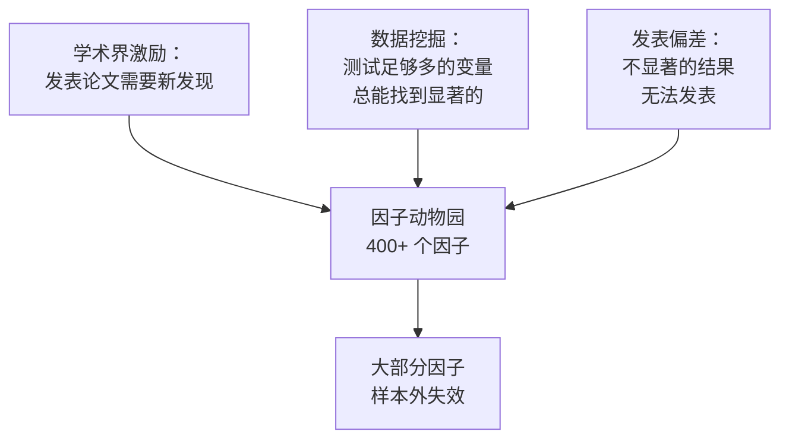
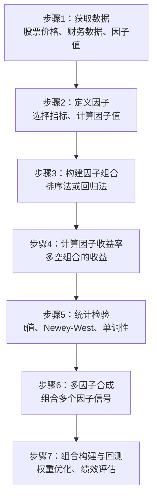
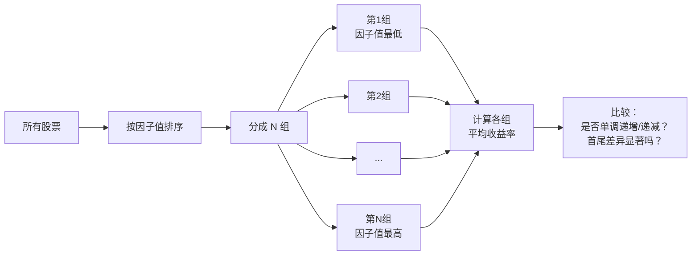

# Day 22：因子投资全景与排序法入门

> **总时长：** 2 小时
>
> **节奏：** 每 50 分钟休息 10 分钟
>
> **今日目标：** 理解因子投资的完整流程，掌握最基础的因子检验方法——投资组合排序法
>
> **本文是完整讲义，包含所有知识点，不需要翻阅其他资料**

---

## 时间表

```
00:00 - 00:50  第一节：因子投资的完整流程
00:50 - 01:00  休息
01:00 - 01:50  第二节：投资组合排序法——用 10 只股票走完整流程
01:50 - 02:00  休息 + 自测
```

---

## 第一节：因子投资的完整流程（50 分钟）

### 一、"因子"到底是什么

#### 1.1 一句话定义

**因子 = 能够系统性地解释股票收益率差异的某个特征。**

"系统性"是关键词。个股涨跌有大量随机因素（突发新闻、管理层变动、黑天鹅事件），这些不算因子。因子必须是：**长期来看，对大量股票普遍适用的规律。**

#### 1.2 从直觉到精确

你在 Day 10 已经了解了因子投资的起源。现在我们把直觉升级成精确的定义。

| 层次 | 说法 | 例子 |
|------|------|------|
| 直觉 | "便宜的股票涨得多" | 低 PE 的股票平均涨幅更大 |
| 稍精确 | "PE 低的股票组比 PE 高的股票组平均收益率更高" | 低 PE 组年化 15%，高 PE 组年化 8% |
| 精确 | "以 PE 的倒数（EP）作为因子值，做多高 EP、做空低 EP 的多空组合，长期年化收益约 5%，t 值 > 3.0" | Fama-French HML 因子 |

精确定义需要回答四个问题：
1. 因子值怎么算？（用什么指标）
2. 怎么分组？（排序法/回归法）
3. 收益率多少？（因子溢价）
4. 统计显著吗？（t 值）

#### 1.3 经典因子速览

在 Day 8-10 学过的定价模型里，已经出现了这些因子。Day 25-29 会逐个深入讲解，今天先建立全景。

| 因子 | 简称 | 核心逻辑 | 做多 | 做空 |
|------|------|---------|------|------|
| 市场 | MKT | 股票整体风险溢价 | 全部股票 | 无风险利率 |
| 规模 | SMB | 小公司风险高，补偿多 | 小盘股 | 大盘股 |
| 价值 | HML | 被低估的公司终将回归 | 高 BM（低价） | 低 BM（高价） |
| 动量 | UMD | 涨的继续涨，跌的继续跌 | 过去赢家 | 过去输家 |
| 盈利 | RMW | 赚钱多的公司更值钱 | 高盈利 | 低盈利 |
| 投资 | CMA | 保守投资的公司回报更好 | 低投资 | 高投资 |

> **"做多"和"做空"是什么意思？**
> - 做多 = 买入持有，赌它涨
> - 做空 = 借来卖出，赌它跌
> - 因子收益 = 做多组的收益 - 做空组的收益

### 二、好因子的五个标准

不是随便找一个特征就能叫"因子"。学术界和业界对因子有严格的筛选标准。

#### 2.1 五个标准

| 标准 | 含义 | 反面例子 |
|------|------|---------|
| 显著 | 因子溢价统计显著（t > 3.0） | "因子"只是噪声，t = 1.5 |
| 持续 | 在不同时间段都有效，不是某几年的偶然 | 只在 2015-2017 有效，其他年份无效 |
| 稳健 | 换指标定义、换分组方式，结论不变 | 用 PE 有效但用 PB 无效 |
| 可投资 | 考虑交易成本后仍然有利可图 | 月换手率 100%，交易成本吃掉全部收益 |
| 可解释 | 有经济学逻辑，不是纯数据挖掘 | "股票代码尾号是 8 的涨得好" |

#### 2.2 为什么 t > 3.0 而不是 t > 2.0

传统统计学用 t > 2.0（对应 p < 0.05）作为显著性标准。但因子投资领域需要更高的门槛。

原因是**多重检验问题**（Day 16 已详细讲过）：

> 如果你测试了 100 个"因子"，即使全部无效，大约也有 5 个会在 p < 0.05 水平上"显著"。学术界已经发表了数百个"因子"，大部分可能是数据挖掘的产物。

Harvey, Liu & Zhu (2016) 建议：**考虑到已经被测试过的因子数量，新因子的 t 值至少要达到 3.0 才可信。**

> **需要记住的：** 因子的 t 值门槛是 3.0，不是 2.0。

#### 2.3 因子动物园

截至 2020 年，学术文献中被报道的"因子"超过 400 个。这被戏称为"因子动物园"（Factor Zoo）。

为什么会这样？



> **这是因子投资最重要的警告：** 不要相信任何没有经济学逻辑的"因子"。本计划只讲被反复验证、有明确经济学解释的经典因子。

### 三、因子投资的完整流程

#### 3.1 七步流程



| 步骤 | 做什么 | 本计划对应 |
|------|--------|-----------|
| 1. 获取数据 | 拿到股票价格和相关指标 | Day 25 开始实操 |
| 2. 定义因子 | 选择一个特征（如 PE），算出每只股票的因子值 | Day 25-29 |
| 3. 构建因子组合 | 按因子值把股票分组 | **Day 22-23（今天开始）** |
| 4. 计算因子收益率 | 多头组收益 - 空头组收益 | **Day 22-23** |
| 5. 统计检验 | 因子收益率是否显著不为零 | Day 23-24 |
| 6. 多因子合成 | 把多个有效因子组合起来 | Day 31 |
| 7. 组合构建与回测 | 确定每只股票的权重，评估整体表现 | Day 32-35 |

> **今天学步骤 3 和 4。** 步骤 3 的最基础方法就是"投资组合排序法"。

#### 3.2 两条路线：排序法 vs 回归法

因子投资有两种主要的研究方法：

| 维度 | 排序法 | 回归法 |
|------|--------|--------|
| 核心思路 | 按因子值分组，比较各组收益 | 用回归模型估计因子对收益的影响 |
| 直觉难度 | 低（排序 → 分组 → 比较） | 高（需要理解回归） |
| 数学要求 | 均值、t 检验 | OLS、Fama-MacBeth |
| 优点 | 直觉清晰，能看到"单调性" | 能同时控制多个因子 |
| 缺点 | 难以同时控制多个变量 | 容易受异常值影响 |
| 在论文中 | 几乎所有因子论文都用 | 作为排序法的补充 |

> **本计划的路线：** 先学排序法（Day 22-23），再学回归法（Day 24）。排序法是基础，更直觉，也是论文中最常见的方法。

### 第一节完成检查

- [ ] 我能用一句话解释"因子"是什么
- [ ] 我能说出好因子的 5 个标准
- [ ] 我知道因子的 t 值门槛为什么是 3.0 而不是 2.0
- [ ] 我能说出因子投资的 7 个步骤
- [ ] 我能区分排序法和回归法的适用场景

**休息 10 分钟。**

---

## 第二节：投资组合排序法（50 分钟）

### 四、排序法的直觉

#### 4.1 生活类比

你是一位学校老师，想验证"每天睡眠时间是否影响考试成绩"。怎么做？

最直觉的方法：
1. 统计每个学生的平均睡眠时间
2. 按睡眠时间分成两组：睡得多的 vs 睡得少的
3. 比较两组的平均考试成绩
4. 如果差异足够大（不太可能是偶然），就说"睡眠影响成绩"

**投资组合排序法就是同样的逻辑。**

把"学生"换成"股票"，把"睡眠时间"换成"因子值（如 PE）"，把"考试成绩"换成"未来收益率"。

#### 4.2 排序法的核心逻辑

**如果一个因子真的能预测收益率，那么按这个因子排序后分组，各组的收益率应该呈现规律性差异。**



### 五、排序法的完整步骤

#### 5.1 步骤总览

```
步骤 1：在第 t 月末，获取所有股票的因子值
步骤 2：按因子值从小到大排序
步骤 3：等分成 N 组（通常 N=5 或 N=10）
步骤 4：持有每组一个月（第 t+1 月），记录各组的等权平均收益率
步骤 5：到第 t+1 月末，重新执行步骤 1-4（重新排序、重新分组）
步骤 6：重复 T 个月后，得到每组 T 个月的收益率序列
步骤 7：计算每组的平均月收益率
步骤 8：计算多空组合收益 = 第 1 组 - 第 N 组（或反过来，取决于因子方向）
步骤 9：对多空组合收益做 t 检验（用 Newey-West 标准误）
步骤 10：检查单调性——各组收益是否从第 1 组到第 N 组单调变化
```

#### 5.2 关键决策点

| 决策 | 常见选择 | 说明 |
|------|---------|------|
| 分几组？ | 5 组（五分位）或 10 组（十分位） | 股票数多（>500）用 10 组，少则用 5 组 |
| 组内怎么算收益？ | 等权平均 | 也可用市值加权，但等权更常见（小盘股权重更高，信号更强） |
| 持有多久？ | 1 个月 | 月频是最常见频率，也有周频、季频 |
| 多空方向？ | 看因子的经济学逻辑 | 价值因子：做多低 PE（便宜），做空高 PE（贵） |

> **"等权"是什么意思？** 就是每只股票占相同比例。如果一组有 5 只股票，每只占 20%。组合收益 = 5 只股票收益率的简单平均。

### 六、手算例子——用 10 只股票走完整流程

这是今天最重要的部分。我们用一个简化的例子，完整走一遍排序法。

#### 6.1 数据

假设有 10 只 A 股，我们想检验"PE 因子"是否有效（低 PE 的股票是否收益更高）。

**2024 年 6 月末的数据：**

| 股票 | PE（6月末） | 7月收益率 |
|------|-----------|----------|
| A | 8 | +5.2% |
| B | 10 | +3.1% |
| C | 12 | +2.8% |
| D | 14 | +4.0% |
| E | 16 | +1.5% |
| F | 20 | +0.3% |
| G | 23 | -0.8% |
| H | 28 | +1.2% |
| I | 35 | -1.5% |
| J | 50 | -2.3% |

> **关键细节：** 排序用的是 6 月末的 PE（已知信息），预测的是 7 月的收益率（未来信息）。排序时**绝对不能**用 7 月的数据——这就是"前视偏差"，Day 32 会专门讲。

#### 6.2 步骤 1-3：排序并分组

按 PE 从小到大排序（已经排好了），分成 5 组（每组 2 只）：

| 组 | 股票 | PE 范围 | 特征 |
|----|------|--------|------|
| 第 1 组（最低 PE） | A, B | 8-10 | 最"便宜" |
| 第 2 组 | C, D | 12-14 | |
| 第 3 组 | E, F | 16-20 | |
| 第 4 组 | G, H | 23-28 | |
| 第 5 组（最高 PE） | I, J | 35-50 | 最"贵" |

#### 6.3 步骤 4：计算各组 7 月的等权平均收益率

```
第 1 组：(5.2% + 3.1%) / 2 = 4.15%
第 2 组：(2.8% + 4.0%) / 2 = 3.40%
第 3 组：(1.5% + 0.3%) / 2 = 0.90%
第 4 组：(-0.8% + 1.2%) / 2 = 0.20%
第 5 组：(-1.5% + (-2.3%)) / 2 = -1.90%
```

#### 6.4 步骤 7-8：多空组合收益

因为我们预期低 PE（便宜）的股票收益更高，所以：

```
因子收益 = 第 1 组（做多） - 第 5 组（做空）
         = 4.15% - (-1.90%)
         = 6.05%
```

#### 6.5 汇总表

| 组 | 平均 PE | 7月平均收益 |
|----|--------|-----------|
| 第 1 组（做多） | 9 | **+4.15%** |
| 第 2 组 | 13 | +3.40% |
| 第 3 组 | 18 | +0.90% |
| 第 4 组 | 25.5 | +0.20% |
| 第 5 组（做空） | 42.5 | **-1.90%** |
| 多空收益（1-5） | — | **+6.05%** |

#### 6.6 从这个例子中能看出什么

**单调性：** 从第 1 组到第 5 组，收益率 4.15% → 3.40% → 0.90% → 0.20% → -1.90%，**单调递减**。这是好现象——不只是首尾两组有差异，中间各组也依次变化。

**但这还不够。** 仅凭一个月的数据无法下结论。可能是偶然。

实际操作中，需要：
- **重复多个月**：每月重新排序、分组、计算收益，得到多空组合 T 个月的收益率序列
- **做 t 检验**：多空收益的均值是否显著不为零

#### 6.7 如果有 60 个月的数据

假设我们重复了 60 个月，得到多空组合的 60 个月收益率（简化）：

```
多空组合月收益率：
+6.05%, +2.3%, -1.5%, +4.2%, +3.8%, +1.1%, ...（共 60 个月）

均值 = 2.8%/月
标准差 = 3.5%/月
```

t 值的计算（Day 16 已讲过）：

```
t = 均值 / (标准差 / sqrt(T))
  = 2.8% / (3.5% / sqrt(60))
  = 2.8% / 0.452%
  = 6.19
```

> t = 6.19 > 3.0，**统计显著**。可以说 PE 因子在这个时间段内是有效的。

> **注意：** 实际研究中应该用 Newey-West 标准误替代普通标准误（因为月度收益率可能有自相关），t 值会有所降低。Newey-West 的原理在 Day 18 讲过，Day 23 会在因子检验中具体应用。

### 七、几个容易搞混的问题

#### 7.1 "做多做空"在 A 股怎么实现

A 股不能直接做空个股（融券限制很大）。因此实际操作中：

| 方式 | 说明 |
|------|------|
| 学术研究中 | 假设可以做空，算的是"理论因子收益" |
| 实际 A 股投资 | 只做多头：买入低 PE 组，用沪深 300 作为基准 |
| 实际效果 | 多头组的超额收益（相对基准）≈ 因子溢价的一部分 |

> 做空限制是 A 股因子投资的一大现实约束。但学术研究中通常假设可以做空，因为这样能更纯粹地检验因子是否有效。

#### 7.2 为什么用 PE 的倒数（EP）而不是 PE 本身

你会发现论文中经常用 EP（Earnings/Price = PE 的倒数）或 BP（Book/Price = PB 的倒数）而不是 PE 或 PB。原因：

| | PE | EP（=1/PE） |
|---|---|---|
| 高值 | 贵（泡沫股） | 便宜（价值股） |
| 低值 | 便宜（价值股） | 贵（泡沫股） |
| 排序方向 | 做多低 PE、做空高 PE | 做多高 EP、做空低 EP |
| 问题 | 亏损公司 PE 为负，排序混乱 | EP 为负可以正常排序 |

> **实务建议：** 用 EP 或 BP 做排序，因为方向更自然（做多高值、做空低值），且能处理负值。

#### 7.3 为什么分 5 组或 10 组，而不是 2 组或 100 组

| 分组数 | 优点 | 缺点 |
|--------|------|------|
| 2 组 | 最大化首尾差异 | 看不到中间的变化趋势（无法检查单调性） |
| 5 组 | 平衡——既能看趋势，每组股票也够多 | — |
| 10 组 | 能看到更细的变化 | 每组股票数少，单组收益波动大 |
| 100 组 | — | 每组只有几只股票，噪声太大 |

> **常见做法：** 大样本（全 A 股 5000+）用 10 分位，小样本（行业内、加密市场 <100 只）用 5 分位甚至 3 分位。

### 八、排序法的常见陷阱

| 陷阱 | 什么意思 | 后果 | 怎么避免 |
|------|---------|------|---------|
| 前视偏差 | 排序时用了未来才能知道的数据 | 回测收益虚高 | 严格用 t 月末的数据预测 t+1 月 |
| 幸存者偏差 | 只用当前存活的股票，忽略了已退市的 | 收益偏高（退市的往往是亏损股） | 使用包含退市股票的完整数据库 |
| 忽略单调性 | 只看首尾两组，不检查中间组 | 可能只是噪声恰好在首尾产生差异 | 画出各组收益的柱状图，检查单调性 |
| 不做 Newey-West | 用普通标准误算 t 值 | t 值偏高，虚假显著 | 使用 Newey-West 标准误（滞后阶数通常取 6） |
| 用同一段数据选因子又检验 | 在同一数据上调参数和做检验 | 过拟合 | 样本内选因子，样本外检验 |

> **前视偏差是最致命的。** 举个例子：如果你用 7 月 31 日才公布的半年报数据，在 6 月末做排序——这就是前视偏差。因为 6 月末你不可能知道 7 月底才公布的数据。
>
> 实际中，财务数据通常有 1-4 个月的发布滞后。安全做法是用至少 4 个月前的财务数据。

### 第二节完成检查

- [ ] 我能说出排序法的完整 10 个步骤
- [ ] 我能用 10 只股票的例子手算各组收益和多空收益
- [ ] 我知道为什么用 EP 而不是 PE
- [ ] 我知道分 5 组和 10 组的区别
- [ ] 我能说出排序法的 5 个常见陷阱
- [ ] 我知道什么是前视偏差，以及如何避免

---

## 收尾：自测（10 分钟）

**自测 1：** 用一句话定义"因子"。

→ 你的答案：_______________

→ 正确：因子是能系统性地解释股票收益率差异的某个特征。

---

**自测 2：** 好因子的 5 个标准是什么？

→ 你的答案：_______________

→ 正确：显著（t > 3.0）、持续（不同时段有效）、稳健（换指标仍有效）、可投资（交易成本后仍有利）、可解释（有经济学逻辑）。

---

**自测 3：** 为什么因子的 t 值门槛是 3.0 而不是传统的 2.0？

→ 你的答案：_______________

→ 正确：因为多重检验问题——学术界已经测试了数百个因子，传统 t > 2.0 的标准会产生大量假发现。Harvey et al. (2016) 建议用 t > 3.0。

---

**自测 4：** 投资组合排序法中，排序用的数据和预测的收益率在时间上有什么关系？

→ 你的答案：_______________

→ 正确：排序用的是 t 月末已知的因子值，预测的是 t+1 月的收益率。绝不能用 t+1 月的信息做排序（否则是前视偏差）。

---

**自测 5：** 以下是 5 组的平均月收益率。这个因子有效吗？

| 第 1 组 | 第 2 组 | 第 3 组 | 第 4 组 | 第 5 组 |
|--------|--------|--------|--------|--------|
| 2.1% | 0.5% | 1.8% | 0.3% | -0.5% |

→ 你的答案：_______________

→ 正确：**可能无效。** 虽然第 1 组（2.1%）高于第 5 组（-0.5%），多空收益 = 2.6%，但**不单调**——第 3 组（1.8%）高于第 2 组（0.5%），中间出现了"跳跃"。这降低了结论的可信度。

---

**自测 6：** 你用 A 股全市场 5000 只股票做因子研究，应该分几组？

→ 你的答案：_______________

→ 正确：**10 组**（十分位）。股票数量多，10 组每组仍有约 500 只，足够稳定。

---

**自测 7：** 为什么论文中常用 EP（=1/PE）而不是 PE 做排序？

→ 你的答案：_______________

→ 正确：两个原因：(1) EP 的排序方向更自然（做多高值、做空低值）；(2) PE 在亏损时为负数，排序混乱，EP 为负可以正常排序。

---

**自测 8：** 你在 2024 年 6 月末做排序时，用了某公司 2024 年半年报的净利润数据（该半年报于 2024 年 8 月 25 日发布）。这有什么问题？

→ 你的答案：_______________

→ 正确：**前视偏差。** 6 月末时半年报尚未发布，你不可能知道这个数据。应该用更早的已公布数据（如 2023 年年报）。

---

**自测 9：** 排序法和回归法的最大区别是什么？

→ 你的答案：_______________

→ 正确：排序法通过分组直接比较收益，直觉清晰，能看到单调性；回归法用数学模型估计因子的边际影响，能同时控制多个变量。

---

**自测 10：** 你测试了 50 个因子指标，发现其中 3 个的 t > 2.0。你能宣布发现了 3 个有效因子吗？

→ 你的答案：_______________

→ 正确：**不能。** 测试 50 个因子时，即使全部无效，预期也有约 2.5 个在 t > 2.0 水平上"显著"（50 × 5% = 2.5）。3 个显著可能完全是偶然。需要 t > 3.0，或做多重检验校正（如 Bonferroni 或 FDR）。

---

### 评分标准

| 得分 | 状态 |
|------|------|
| 9-10 题 | 对因子投资方法论理解到位，明天继续 |
| 7-8 题 | 不错，回看错误的部分 |
| 5-6 题 | 需要重点复习第二节（排序法的步骤和陷阱） |
| < 5 题 | 建议重新阅读本讲义 |

---

## 今天不需要记住的内容

| 内容 | 为什么不需要 |
|------|------------|
| 6 个经典因子的具体构造方法 | Day 25-29 会逐个详细讲，今天只需知道名字和大致逻辑 |
| Fama-MacBeth 回归的具体步骤 | Day 24 专门讲 |
| GRS 检验 | Day 30 讲多因子模型时会用到 |
| 因子正交化 | Day 31 讲 |
| A 股的具体因子表现 | Day 25-29 每个因子会给 A 股实证数据 |
| 排序法的数学证明 | 不需要证明，能做就行 |

---

## 明天预告

明天学排序法的进阶版本——**双变量排序**（同时控制两个变量），以及因子收益率的统计检验细节（Newey-West 调整、单调性检验）。

核心问题是："规模因子到底是独立的，还是被价值因子解释了？" 双变量排序就是回答这类问题的工具。
