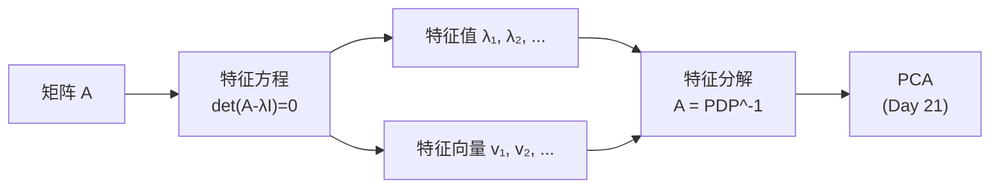
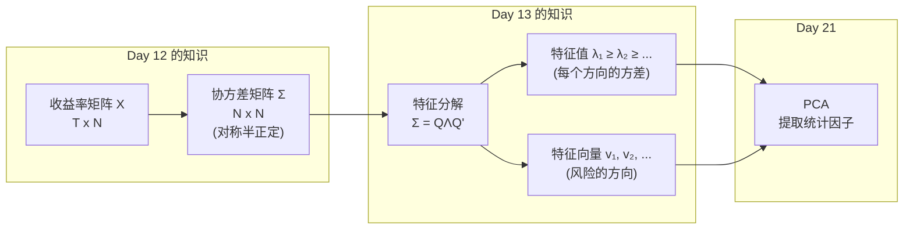

# Day 13：特征值与正定矩阵

> **总时长：** 2 小时
>
> **节奏：** 每 50 分钟休息 10 分钟
>
> **今日目标：** 理解特征值分解，知道协方差矩阵为什么是半正定的，为 PCA（Day 21）打下数学基础
>
> **本文是完整讲义，包含所有知识点，不需要翻阅其他资料**

---

## 时间表

```
00:00 - 00:50  第一节：特征值与特征向量——矩阵的"身份证"
00:50 - 01:00  休息
01:00 - 01:50  第二节：正定矩阵与协方差矩阵——为什么组合方差永远非负
01:50 - 02:00  休息 + 自测
```

---

## 第一节：特征值与特征向量（50 分钟）

### 一、特征值与特征向量是什么

#### 1.1 直觉：变换后方向不变的特殊方向

Day 12 讲过：矩阵 $\times$ 向量 = 新向量。矩阵对向量做的事情，可以理解为一种"变换"——拉伸、旋转、翻转。

大多数向量经过变换后，方向和长度都会改变。但有些特殊的向量，变换后**方向不变**，只是长度被拉伸或压缩了。

这些特殊的向量就是**特征向量**（eigenvector），拉伸的倍数就是**特征值**（eigenvalue）。

```
普通向量：                       特征向量：

  变换前     变换后                变换前       变换后
    ↗         →                    →           ──→
  方向变了，长度也变了            方向没变，只是变长了
```

三句话概括：

- **特征向量 = 矩阵变换后方向不变的向量**
- **特征值 = 那个方向上拉伸了多少倍**
- 一个 $n \times n$ 矩阵最多有 $n$ 个特征值

#### 1.2 为什么要学这个

| 数学概念 | 因子投资中的应用 |
|---------|----------------|
| 特征值 | 协方差矩阵的特征值 = 每个风险方向上的方差大小 |
| 特征向量 | 协方差矩阵的特征向量 = 风险最大/最小的方向 |
| 特征分解 | PCA（主成分分析）的数学基础 |
| 最大的特征值 | 对应第一主成分，通常是"市场因子" |

**一句话：** 特征值分解让你把一个复杂的协方差矩阵"拆开"，看清风险从哪里来、有多大。这就是 PCA（Day 21 详讲）。

#### 1.3 形式化定义

$$Av = \lambda v$$

- $A$：$n \times n$ 的方阵
- $v$：特征向量（**非零**向量）
- $\lambda$（读作 lambda）：特征值（一个数字）

翻译成人话：**矩阵 $A$ 乘以向量 $v$，效果等同于把 $v$ 拉伸 $\lambda$ 倍。**

| $\lambda$ 的值 | 含义 |
|----------------|------|
| $\lambda > 1$ | 拉伸（变长） |
| $0 < \lambda < 1$ | 压缩（变短） |
| $\lambda = 0$ | 压扁到零（那个方向的信息消失了） |
| $\lambda < 0$ | 拉伸并反转方向 |

#### 1.4 如何计算特征值：特征方程

从 $Av = \lambda v$ 出发，做简单变换：

$$Av - \lambda v = 0$$

$$(A - \lambda I)v = 0$$

这是一个方程组。我们要找**非零的** $v$。Day 12 讲过：如果一个矩阵的行列式 $= 0$，它就会"压扁"空间，存在非零向量被映射到零向量。所以 $(A - \lambda I)v = 0$ 有非零解的条件是：

$$\det(A - \lambda I) = 0$$

这叫**特征方程**（characteristic equation）。

对于 $2 \times 2$ 矩阵，展开后是一个关于 $\lambda$ 的二次方程，用求根公式就能解。

> **需要记住的：** 特征方程 $\det(A - \lambda I) = 0$。解这个方程就得到所有特征值。

#### 1.5 手算例子

**求矩阵 A 的特征值和特征向量：**

```
A = [5  1]
    [2  4]
```

**第一步：写出特征方程**

```
A - λI = [5-λ   1 ]
         [ 2   4-λ]

det(A - λI) = (5-λ)(4-λ) - 1×2
            = 20 - 5λ - 4λ + λ² - 2
            = λ² - 9λ + 18
            = 0
```

**第二步：解二次方程**

```
λ² - 9λ + 18 = 0
(λ - 6)(λ - 3) = 0

λ₁ = 6,  λ₂ = 3
```

**第三步：求特征向量**

对 $\lambda_1 = 6$，解 $(A - 6I)v = 0$：

```
A - 6I = [5-6   1 ] = [-1  1]
         [ 2   4-6]   [ 2 -2]

第一行：-v₁ + v₂ = 0  →  v₂ = v₁

取 v₁ = 1：特征向量 v₁ = [1, 1]
```

对 $\lambda_2 = 3$，解 $(A - 3I)v = 0$：

```
A - 3I = [5-3   1] = [2  1]
         [ 2   4-3]   [2  1]

第一行：2v₁ + v₂ = 0  →  v₂ = -2v₁

取 v₁ = 1：特征向量 v₂ = [1, -2]
```

**第四步：验证**

```
Av₁ = [5  1] × [1] = [5+1] = [6] = 6 × [1] ✓
      [2  4]   [1]   [2+4]   [6]       [1]

Av₂ = [5  1] × [ 1] = [5-2] = [ 3] = 3 × [ 1] ✓
      [2  4]   [-2]   [2-8]   [-6]       [-2]
```

> 验证很重要：$Av$ 必须等于 $\lambda v$。如果不等，说明计算有误。

#### 1.6 特征值的两个重要性质

$n \times n$ 矩阵的 $n$ 个特征值满足：

**性质 1：** 所有特征值之和 = 矩阵对角线之和（迹，trace）

$$\lambda_1 + \lambda_2 + \cdots + \lambda_n = \text{tr}(A) = a_{11} + a_{22} + \cdots + a_{nn}$$

**性质 2：** 所有特征值之积 = 行列式

$$\lambda_1 \times \lambda_2 \times \cdots \times \lambda_n = \det(A)$$

**用上面的例子验证：**

```
trace(A) = 5 + 4 = 9 = 6 + 3 ✓
det(A)   = 5×4 - 1×2 = 18 = 6 × 3 ✓
```

> **因子投资联系：** $\det = 0$ 意味着某个特征值 $= 0$（性质 2）。这说明协方差矩阵有一个"零方差方向"——某个方向上的风险为零，意味着因子之间存在完全线性关系（多重共线性）。

> **需要记住的：** 迹 = 特征值之和，行列式 = 特征值之积。$\det = 0 \Leftrightarrow$ 某个特征值为 0。

#### 1.7 特征分解

如果一个 $n \times n$ 矩阵有 $n$ 个独立的特征向量，它可以分解为：

$$A = PDP^{-1}$$

其中：

- $P$ = 把所有特征向量排成列的矩阵
- $D$ = 特征值放在对角线上的对角矩阵
- $P^{-1}$ = $P$ 的逆矩阵

用上面的例子：

```
P = [1   1]    D = [6  0]    P⁻¹ = ...（不需要手算）
    [1  -2]        [0  3]
```

翻译成人话：**特征分解把一个复杂的矩阵拆成三步操作——"转到特征向量的坐标系 $\to$ 在每个方向上拉伸 $\to$ 转回来"。**



> **理解即可：** 不需要手算特征分解。知道"矩阵可以用特征值和特征向量来表达"就行。Python 中一行代码搞定：`numpy.linalg.eig(A)`。

### 第一节完成检查

- [ ] 我知道特征值 = 变换后不变方向上的拉伸倍数，特征向量 = 那个不变的方向
- [ ] 我能写出特征方程 $\det(A - \lambda I) = 0$
- [ ] 我能手算 $2 \times 2$ 矩阵的特征值（解二次方程）
- [ ] 我能手算 $2 \times 2$ 矩阵的特征向量
- [ ] 我知道 迹 = 特征值之和，行列式 = 特征值之积
- [ ] 我知道特征分解是 PCA 的数学基础

**休息 10 分钟。**

---

## 第二节：正定矩阵与协方差矩阵（50 分钟）

### 二、对称矩阵的特殊性质

#### 2.1 回顾：什么是对称矩阵

Day 12 讲过：**对称矩阵 = 转置等于自身**（$A = A'$），即第 $(i,j)$ 个元素等于第 $(j,i)$ 个元素。

协方差矩阵就是对称矩阵：$\text{Cov}(A,B) = \text{Cov}(B,A)$。

为什么要单独讲对称矩阵？因为它的特征值和特征向量有两个**非常好的性质**，让后面的数学变得简单很多。

#### 2.2 两个关键性质

| 性质 | 一般矩阵 | 对称矩阵 |
|------|---------|---------|
| 特征值 | 可能是复数（虚数） | **一定是实数** |
| 特征向量 | 不一定正交 | **一定两两正交（互相垂直）** |

**为什么"实数"重要？** 特征值在金融中代表"某个方向上的方差"。方差不可能是虚数，所以我们需要特征值是实数。对称矩阵保证了这一点。

**为什么"正交"重要？** PCA 要求找到的主成分方向互相垂直（不相关）。对称矩阵的特征向量天然正交，不需要额外处理。

> **需要记住的：** 对称矩阵的特征值一定是实数，特征向量一定两两正交。协方差矩阵是对称的，所以它有这两个好性质。

#### 2.3 手算例子：对比对称 vs 非对称

**对称矩阵：**

```
Σ = [5  2]
    [2  2]
```

特征方程：

```
det(Σ - λI) = (5-λ)(2-λ) - 4
            = 10 - 7λ + λ² - 4
            = λ² - 7λ + 6
            = (λ-6)(λ-1) = 0

λ₁ = 6,  λ₂ = 1
```

特征向量：

```
λ₁ = 6：(5-6)v₁ + 2v₂ = 0  →  v₂ = v₁/2  →  v₁ = [2, 1]
λ₂ = 1：(5-1)v₁ + 2v₂ = 0  →  v₂ = -2v₁   →  v₂ = [1, -2]
```

**验证正交性：**

```
v₁ · v₂ = 2×1 + 1×(-2) = 2 - 2 = 0 ✓  正交！
```

**对比第一节的非对称矩阵 A：**

```
A 的特征向量 [1, 1] 和 [1, -2]：

[1, 1] · [1, -2] = 1 - 2 = -1 ≠ 0  不正交
```

> 区别一目了然：对称矩阵的特征向量正交，非对称矩阵的不正交。

#### 2.4 对称矩阵的特征分解（谱分解）

对称矩阵的特征分解有一个更漂亮的写法：

$$A = Q\Lambda Q'$$

其中：

- $Q$ = 特征向量排成列，并且每列归一化（长度 = 1）
- $\Lambda$ = 特征值放在对角线上的对角矩阵
- $Q'$ = $Q$ 的转置

关键好处：**$Q$ 是正交矩阵，$Q' = Q^{-1}$。** 不需要算逆矩阵（Day 12 讲过逆矩阵的计算很麻烦），直接转置就行。

> **理解即可：** 知道"对称矩阵的特征分解特别简洁"就行，公式记个大概，不需要默写。

### 三、正定与半正定矩阵

#### 3.1 二次型——从投资组合方差说起

Day 12 讲过：投资组合收益 = $w'r$（向量的点积）。

那投资组合的**方差**怎么算？答案是：

$$\sigma_p^2 = w'\Sigma w$$

翻译成人话：**组合方差 = 权重向量 $\times$ 协方差矩阵 $\times$ 权重向量。**

$w'\Sigma w$ 这种"向量 $\times$ 矩阵 $\times$ 向量 = 一个数字"的形式，在数学上叫**二次型**（quadratic form）。

**手算例子：**

假设你持有两只股票，权重 $w = [0.6, 0.4]$，协方差矩阵：

```
Σ = [5  2]
    [2  2]
```

组合方差的计算分两步：

```
第一步：Σw = [5×0.6 + 2×0.4] = [3.0 + 0.8] = [3.8]
             [2×0.6 + 2×0.4]   [1.2 + 0.8]   [2.0]

第二步：w'(Σw) = 0.6×3.8 + 0.4×2.0 = 2.28 + 0.80 = 3.08
```

组合方差 $= 3.08$ (%$^2$)，组合波动率 $= \sqrt{3.08} \approx 1.75\%$。

> **需要记住的：** 组合方差 $= w'\Sigma w$。这是因子投资中最常见的矩阵运算之一。

#### 3.2 正定与半正定的定义

现在问一个关键问题：**方差可以是负数吗？**

当然不行。方差衡量的是"波动有多大"，一定 $\geq 0$。

这意味着：不管你怎么选权重 $w$，$w'\Sigma w$ 必须 $\geq 0$。这就是**半正定**的定义：

| 术语 | 定义 | 直觉 |
|------|------|------|
| **正定**（positive definite, PD） | 对所有非零 $x$，$x'Ax > 0$ | 碗形曲面——从哪个方向看都朝上，有唯一最低点 |
| **半正定**（positive semi-definite, PSD） | 对所有 $x$，$x'Ax \geq 0$ | 碗形但某些方向是平的（有一条"谷底线"） |
| **不定**（indefinite） | $x'Ax$ 可正可负 | 马鞍形——某些方向朝上，某些方向朝下 |

> **因子投资中：** 协方差矩阵是**半正定**矩阵。正定的情况更常见（除非有因子完全共线性）。

#### 3.3 判定条件：看特征值

**正定 $\Leftrightarrow$ 所有特征值 $> 0$**

**半正定 $\Leftrightarrow$ 所有特征值 $\geq 0$**

为什么？回忆特征分解 $\Sigma = Q\Lambda Q'$。可以证明：

$$w'\Sigma w = w'Q\Lambda Q'w$$

令 $z = Q'w$（坐标变换），则：

$$w'\Sigma w = z'\Lambda z = \lambda_1 z_1^2 + \lambda_2 z_2^2 + \cdots$$

如果所有 $\lambda_i \geq 0$，那么每一项都 $\geq 0$，总和自然 $\geq 0$。

如果某个 $\lambda_i < 0$，可以选 $z$ 让那一项主导，总和变负——方差变负，说不通。

> 翻译成人话：**特征值就是每个独立方向上的方差。方差不能为负，所以特征值必须非负。**

> **需要记住的：** 半正定 $\Leftrightarrow$ 特征值全 $\geq 0$。正定 $\Leftrightarrow$ 特征值全 $> 0$。

#### 3.4 手算判定

用前面算过的 $\Sigma = [[5, 2], [2, 2]]$：

```
特征值：λ₁ = 6 > 0, λ₂ = 1 > 0

两个特征值都大于零 → Σ 是正定矩阵 ✓
```

另一个矩阵 $B = [[4, 5], [5, 4]]$（对称的）：

```
det(B - λI) = (4-λ)² - 25
            = λ² - 8λ + 16 - 25
            = λ² - 8λ - 9
            = (λ-9)(λ+1) = 0

λ₁ = 9, λ₂ = -1

有一个特征值 < 0 → B 不是正定的，也不是半正定的
→ B 不可能是合法的协方差矩阵
```

> 金融含义：如果你算出的"协方差矩阵"有负特征值，说明数据或计算有问题——比如数据不足、存在极端异常值、或估计方法有偏。

### 四、协方差矩阵——把今天全部串起来

#### 4.1 为什么协方差矩阵一定是半正定的

这是今天最重要的结论之一。证明思路很直觉：

从 Day 12 的收益率矩阵出发。假设 $X$ 是去中心化后的收益率矩阵（每列减去均值），则：

$$\Sigma = \frac{1}{T-1} X'X$$

组合方差：

$$w'\Sigma w = \frac{1}{T-1} w'X'Xw = \frac{1}{T-1} (Xw)'(Xw) = \frac{1}{T-1} \|Xw\|^2$$

翻译成人话：**组合方差 = 某个向量长度的平方除以一个正数。** 向量长度的平方不可能为负，所以组合方差 $\geq 0$。

这就证明了协方差矩阵一定是半正定的。

> **需要记住的：** 协方差矩阵一定是半正定的（特征值 $\geq 0$），因为方差不可能为负。

#### 4.2 协方差矩阵的特征分解 = 风险分解

现在把今天学的所有东西串在一起：

| 数学 | 金融含义 |
|------|---------|
| 协方差矩阵 $\Sigma$ | 所有股票之间的风险关系 |
| 特征分解 $\Sigma = Q\Lambda Q'$ | 把总风险拆成几个独立方向 |
| 特征值 $\lambda_1 \geq \lambda_2 \geq \cdots$ | 每个方向上的方差大小（风险大小） |
| 特征向量 $v_1, v_2, \ldots$ | 每个风险方向的"成分"（哪些股票参与、权重多少） |
| 最大特征值 $\lambda_1$ | 最大的风险来源 |
| 对应的特征向量 $v_1$ | 最大风险方向的组成——通常是"市场因子" |

#### 4.3 手算：2 只股票的风险分解

继续用 $\Sigma = [[5, 2], [2, 2]]$（可以理解为股票 A 方差 5、股票 B 方差 2、协方差 2）。

前面已经算出：

```
λ₁ = 6,  v₁ = [2, 1]  （归一化后 [2/√5, 1/√5] ≈ [0.89, 0.45]）
λ₂ = 1,  v₂ = [1, -2] （归一化后 [1/√5, -2/√5] ≈ [0.45, -0.89]）
```

**金融解读：**

| 主成分 | 特征值 | 方差占比 | 特征向量 | 金融含义 |
|--------|--------|---------|---------|---------|
| PC1 | 6 | 6/7 = 86% | [0.89, 0.45] | 两只股票同涨同跌（市场风险） |
| PC2 | 1 | 1/7 = 14% | [0.45, -0.89] | 一涨一跌（相对价值风险） |

为什么 PC1 像市场因子？因为特征向量 [0.89, 0.45] 的两个分量**同号**，意味着这个方向上两只股票一起涨或一起跌。这正是"大盘涨/跌"的特征。

为什么 PC2 像相对价值？因为特征向量 [0.45, -0.89] 的两个分量**异号**，一只涨另一只跌。

**方差占比验证：**

```
总方差 = trace(Σ) = 5 + 2 = 7
       = λ₁ + λ₂  = 6 + 1 = 7 ✓

PC1 解释了 6/7 ≈ 86% 的总方差
PC2 解释了 1/7 ≈ 14% 的总方差
```

> 翻译成人话：这两只股票 86% 的风险来自"一起涨跌"（市场风险），只有 14% 的风险来自"一涨一跌"（个股差异）。

#### 4.4 从风险分解到 PCA

PCA（主成分分析）就是对协方差矩阵做特征分解：

```
PCA 的输入：协方差矩阵 Σ（N×N，N 是股票数）

PCA 的输出：
  - N 个主成分方向（特征向量）
  - N 个方差值（特征值），从大到小排列
```

实际中，几千只股票的协方差矩阵可能有几千个特征值，但前面几个特征值往往占了总方差的大部分：

| 主成分 | 典型金融含义 | 通常解释的方差比例 |
|--------|------------|------------------|
| PC1 | 市场因子（大盘涨跌） | 40-60% |
| PC2 | 行业轮动 / 大小盘分化 | 10-15% |
| PC3 | 风格因子（价值 vs 成长） | 5-10% |
| PC4+ | 更细的风格差异 | 逐渐递减 |

> Day 21 会详细讲 PCA 的完整流程。今天只需要理解：**PCA 的数学本质就是协方差矩阵的特征分解。**

#### 4.5 全景图



### 第二节完成检查

- [ ] 我知道对称矩阵的特征值是实数、特征向量两两正交
- [ ] 我能手算组合方差 $w'\Sigma w$
- [ ] 我能用特征值判断矩阵是否正定/半正定
- [ ] 我能解释"协方差矩阵为什么是半正定的"（方差不能为负）
- [ ] 我知道协方差矩阵的特征值 = 每个方向的方差，特征向量 = 方向
- [ ] 我知道 PCA = 协方差矩阵的特征分解
- [ ] 我能解释为什么第一主成分通常是"市场因子"

---

## 收尾：自测（10 分钟）

**自测 1：** 用一句话解释：特征值在直觉上代表什么？

→ 你的答案：_______________

→ 正确：矩阵变换后方向不变的特殊方向上的**拉伸倍数**。在协方差矩阵中，就是该方向上的方差大小。

---

**自测 2：** 对称矩阵的特征向量有什么特殊性质？为什么这对 PCA 重要？

→ 你的答案：_______________

→ 正确：特征向量**两两正交**（互相垂直）。PCA 要求主成分之间互不相关，正交恰好保证了这一点。

---

**自测 3：** "半正定"对投资组合方差意味着什么？

→ 你的答案：_______________

→ 正确：组合方差 $= w'\Sigma w \geq 0$，即**任何权重组合的方差都不会是负数**。

---

**自测 4：** 如果协方差矩阵的第一个特征值占总特征值的 80%，金融上说明什么？

→ 你的答案：_______________

→ 正确：80% 的风险集中在一个方向（通常是市场因子），说明**股票之间联动性很强**，大盘涨跌主导了绝大部分波动。

---

**自测 5：** 特征分解和 PCA 是什么关系？一句话概括。

→ 你的答案：_______________

→ 正确：**PCA 就是对协方差矩阵做特征分解**——特征向量 = 主成分方向，特征值 = 该方向上的方差。

---

**自测 6：** 计算矩阵 $A = [[2, 1], [1, 2]]$ 的特征值。

→ 你的计算：_______________

→ 正确：$\det(A - \lambda I) = (2-\lambda)^2 - 1 = \lambda^2 - 4\lambda + 3 = (\lambda-3)(\lambda-1) = 0$。$\lambda_1 = 3$，$\lambda_2 = 1$。

---

**自测 7：** 求上题矩阵的特征向量。

→ 你的计算：_______________

→ 正确：$\lambda = 3$：$(2-3)v_1 + v_2 = 0$，$v_2 = v_1$，特征向量 **[1, 1]**。$\lambda = 1$：$(2-1)v_1 + v_2 = 0$，$v_2 = -v_1$，特征向量 **[1, -1]**。验证正交：$1 \times 1 + 1 \times (-1) = 0$ ✓。

---

**自测 8：** 验证自测 6 中 trace = 特征值之和，det = 特征值之积。

→ 你的计算：_______________

→ 正确：$\text{trace} = 2 + 2 = 4 = 3 + 1$ ✓。$\det = 2 \times 2 - 1 \times 1 = 3 = 3 \times 1$ ✓。

---

**自测 9：** 矩阵 $B = [[4, 5], [5, 4]]$ 是否正定？（提示：先算特征值）

→ 你的计算：_______________

→ 正确：$\det(B - \lambda I) = (4-\lambda)^2 - 25 = \lambda^2 - 8\lambda - 9 = (\lambda-9)(\lambda+1) = 0$。$\lambda_1 = 9$，$\lambda_2 = -1$。有负特征值，**不正定**。这个矩阵不可能是合法的协方差矩阵。

---

**自测 10：** 组合权重 $w = [0.7, 0.3]$，协方差矩阵 $\Sigma = [[2, 1], [1, 2]]$（自测 6 的矩阵），求组合方差 $w'\Sigma w$。

→ 你的计算：_______________

→ 正确：$\Sigma w = [2 \times 0.7 + 1 \times 0.3,\ 1 \times 0.7 + 2 \times 0.3] = [1.7,\ 1.3]$。$w'\Sigma w = 0.7 \times 1.7 + 0.3 \times 1.3 = 1.19 + 0.39 = \mathbf{1.58}$。

---

### 评分标准

| 得分 | 状态 |
|------|------|
| 9-10 题 | 特征值和正定矩阵掌握扎实，线性代数模块完成 |
| 7-8 题 | 不错，回看错误的部分 |
| 5-6 题 | 需要重点复习第二节（正定矩阵和协方差矩阵部分） |
| < 5 题 | 建议重新阅读本讲义，特别是手算例子 |

---

## 今天不需要记住的内容

| 内容 | 为什么不需要 |
|------|------------|
| $3 \times 3$ 以上矩阵的特征值计算 | 实际中用 `numpy.linalg.eig()` |
| 特征分解的完整手算（$P$、$D$、$P^{-1}$） | 理解思路即可，计算交给 Python |
| 对称矩阵特征值为实数的证明 | 知道结论就行 |
| 半正定的严格数学证明 | 记住"方差不能为负"这个直觉理由就够了 |
| 正交矩阵的性质 | 知道 $Q' = Q^{-1}$（转置 = 逆）这一条就行 |
| 谱分解的高级应用（矩阵函数、矩阵幂） | 因子投资不需要 |

---

## 明天预告

明天进入模块二：概率与统计（Day 14）。

我们将复习随机变量、期望（均值）、方差、标准差、正态分布。这些概念在 Day 05（风险与收益）已经从金融角度接触过，明天会补上数学视角：为什么用对数收益率、正态分布的 68-95-99.7 法则、以及金融数据的"肥尾"现象。

线性代数（Day 12-13）给了你操作数据的工具，概率与统计（Day 14-16）给你理解数据的框架——有了这两个模块，才能进入核心的回归分析（Day 17-18）。
