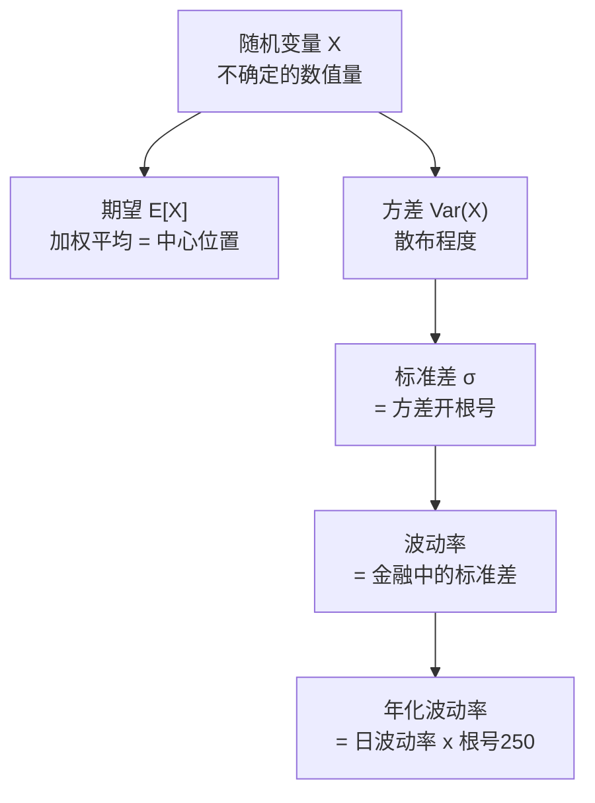
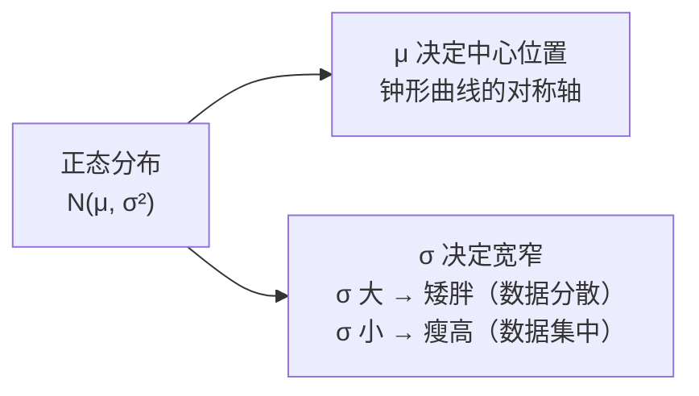

# Day 14：随机变量、期望、方差与分布

> **总时长：** 2 小时
>
> **节奏：** 每 50 分钟休息 10 分钟
>
> **今日目标：** 理解收益率背后的概率语言，能手算期望和方差，知道正态分布的 68-95-99.7 法则和金融数据的肥尾特征
>
> **本文是完整讲义，包含所有知识点，不需要翻阅其他资料**

---

## 时间表

```
00:00 - 00:50  第一节：随机变量与基本统计量——期望、方差、标准差
00:50 - 01:00  休息
01:00 - 01:50  第二节：概率分布——从正态到肥尾
01:50 - 02:00  休息 + 自测
```

---

## 第一节：随机变量与基本统计量（50 分钟）

### 一、随机变量

#### 1.1 直觉引入：明天茅台涨多少？

你无法确切知道明天茅台的收益率是多少——可能涨 2%，可能跌 1%，可能不动。**结果是不确定的，但它一定是一个数字。** 这种"结果不确定的数值量"就是随机变量。

**随机变量 = 结果不确定的数值量。** 记号通常用大写字母 $X$。

> 严格的数学定义需要用到测度论，但因子投资完全不需要。你只需要知道：**随机变量就是"还没揭晓的数字"。**

#### 1.2 离散 vs 连续

随机变量分两种：

| 类型 | 含义 | 取值 | 例子 |
|------|------|------|------|
| 离散随机变量 | 只能取有限个或可数个值 | 1, 2, 3, ... | 骰子点数（1-6）、抛硬币次数 |
| 连续随机变量 | 可以取某个范围内的任意值 | 任意实数 | 股票日收益率、身高、温度 |

**股票日收益率是连续随机变量**——它可以是 +1.23%，也可以是 -0.57%，理论上可以取任何值。

> 离散和连续的区别影响公式写法（求和 vs 积分），但核心思想完全一样。今天的公式以离散为主，连续版本提一句即可。

#### 1.3 和因子投资的联系

| 金融概念 | 对应的随机变量 |
|---------|--------------|
| 某只股票明天的收益率 | 连续随机变量 |
| 某个因子下个月的收益率 | 连续随机变量 |
| 投资组合的年化收益率 | 连续随机变量 |
| 某只股票是否属于"小盘股" | 离散随机变量（是/否） |

> 因子投资中几乎所有核心变量——收益率、因子值、波动率——都是随机变量。今天学的期望和方差，就是描述这些随机变量的基本工具。

---

### 二、期望（均值）

#### 2.1 定义和公式

**期望 = 加权平均，权重是概率。** 记号 $E[X]$，读作"X 的期望"。

**离散随机变量的期望：**

$$E[X] = \sum_{i} x_i \cdot P(x_i)$$

翻译成人话：把每个可能的取值乘以它出现的概率，然后全部加起来。

**连续随机变量的期望：**

$$E[X] = \int_{-\infty}^{+\infty} x \cdot f(x) \, dx$$

> 知道存在就行。连续版本把"求和"换成了"积分"，把"概率"换成了"概率密度函数 $f(x)$"，思想完全一样。实际计算中你不需要手算积分——Python 的 `numpy.mean()` 帮你搞定。

#### 2.2 手算例子

**例子 1：骰子的期望**

```
一个公平骰子，每个面出现的概率都是 1/6。

E[X] = 1×(1/6) + 2×(1/6) + 3×(1/6) + 4×(1/6) + 5×(1/6) + 6×(1/6)
     = (1 + 2 + 3 + 4 + 5 + 6) / 6
     = 21 / 6
     = 3.5
```

> 3.5 不是骰子能掷出的值——期望不一定是某个可能的取值，它是"长期平均"。掷一万次骰子，平均点数会非常接近 3.5。

**例子 2：5 天收益率的期望**

复用 Day 5 的数据：某股票连续 5 天的日收益率为 +2%, -1%, +3%, -2%, +1%。

每天出现的概率相等（1/5），所以期望就是算术平均值：

```
E[X] = (2% + (-1%) + 3% + (-2%) + 1%) / 5
     = 3% / 5
     = 0.6%
```

> **当每个观测值概率相等时，期望 = 算术平均值。** 这是最常见的情况。

#### 2.3 期望的线性性质

期望有两条非常好用的性质：

**性质一：常数倍和平移**

$$E[aX + b] = a \cdot E[X] + b$$

翻译成人话：期望"穿过"加法和乘法。把所有值乘以 $a$ 再加 $b$，期望也乘以 $a$ 再加 $b$。

**性质二：加法**

$$E[X + Y] = E[X] + E[Y]$$

翻译成人话：两个随机变量之和的期望 = 各自期望之和。**不需要 $X$ 和 $Y$ 独立**——这个性质无条件成立。

**在因子投资中的应用：** 投资组合的预期收益 = 各资产预期收益的加权和。

如果组合持有 $n$ 只股票，权重为 $w_1, w_2, \dots, w_n$，各股票预期收益为 $E[R_1], E[R_2], \dots, E[R_n]$，那么：

$$E[R_p] = w_1 \cdot E[R_1] + w_2 \cdot E[R_2] + \cdots + w_n \cdot E[R_n]$$

> 这就是 Day 12 的点积：$E[R_p] = w' \cdot E[R]$。期望的线性性质是它成立的数学保证。

> **需要记住的：** $E[aX+b] = aE[X]+b$，$E[X+Y] = E[X]+E[Y]$。组合预期收益 = 各资产预期收益的加权和。

#### 2.4 样本均值 vs 总体均值

| 概念 | 记号 | 含义 | 例子 |
|------|------|------|------|
| 总体均值 | $\mu$ | 真实的期望值（通常不知道） | 茅台"真实的"平均日收益率 |
| 样本均值 | $\bar{x}$ | 用手头数据算出的平均值 | 用过去 60 天数据算出的平均日收益率 |

$$\bar{x} = \frac{1}{n} \sum_{i=1}^{n} x_i$$

> **总体均值 $\mu$ 是我们想知道但不知道的真相，样本均值 $\bar{x}$ 是我们用数据做的估计。** 数据越多，$\bar{x}$ 越接近 $\mu$。这个直觉 Day 15 学大数定律时会正式化。

---

### 三、方差与标准差

#### 3.1 直觉：数据的"散布程度"

两组数据可能有相同的均值，但"散布程度"完全不同：

```
数据 A：[9%, 10%, 11%, 10%, 10%]  均值 = 10%，几乎不动
数据 B：[-5%, 25%, 10%, 0%, 20%]  均值 = 10%，剧烈波动
```

期望（均值）只描述"中心在哪"，无法区分 A 和 B。我们需要一个量来描述"数据围绕中心散布的程度"——这就是方差。

#### 3.2 方差公式

**方差 = 每个值偏离均值的平方的平均。** 记号 $\text{Var}(X)$ 或 $\sigma^2$。

**公式一（定义式）：**

$$\text{Var}(X) = E[(X - \mu)^2]$$

翻译成人话：看每个值离均值多远，取平方（消除正负号），再取平均。

**公式二（计算式）：**

$$\text{Var}(X) = E[X^2] - (E[X])^2$$

翻译成人话：先算"平方的平均"，再减去"平均的平方"。

> 两个公式是等价的（展开公式一就能得到公式二）。**公式二计算更方便**——不需要先算偏差，直接用原始数据就行。

> **需要记住的：** 两个方差公式都要记住。公式一帮助理解含义，公式二方便手算。

#### 3.3 手算例子

复用 Day 5 的数据：5 天日收益率 +2%, -1%, +3%, -2%, +1%（均值 = 0.6%，前面已算过）。

**用公式二 $E[X^2] - (E[X])^2$ 计算：**

```
第 1 步：算 E[X²]（每个值的平方，取平均）
  X² = 2² + (-1)² + 3² + (-2)² + 1²
     = 4 + 1 + 9 + 4 + 1 = 19
  E[X²] = 19 / 5 = 3.8

第 2 步：算 (E[X])²（均值的平方）
  (E[X])² = 0.6² = 0.36

第 3 步：方差 = E[X²] - (E[X])²
  Var = 3.8 - 0.36 = 3.44
```

**和 Day 5 的逐步法对比验证：**

Day 5 用的是公式一的思路（先算偏差，再平方，再平均）：

```
偏差：   1.4,  -1.6,  2.4,  -2.6,  0.4
偏差²：  1.96,  2.56,  5.76,  6.76,  0.16
平均 = (1.96 + 2.56 + 5.76 + 6.76 + 0.16) / 5 = 17.2 / 5 = 3.44 ✓
```

两种方法结果一致：$\text{Var} = 3.44$（单位：$\%^2$）。

> 公式二的优势：不需要先算偏差（省了一步），直接用原始数据的平方即可。数据量大时效率差异更明显。

#### 3.4 标准差 = 方差开根号 = 波动率

**标准差（Standard Deviation）：**

$$\sigma = \sqrt{\text{Var}(X)}$$

继续上面的例子：

```
σ = √3.44 ≈ 1.85%
```

> **这个 1.85% 就是 Day 5 计算出的日波动率。** Day 5 用四步法算出来的标准差，和今天用方差公式算出来的完全一样——因为它们本来就是同一个东西。

**为什么要开根号？** 方差的单位是"原始单位的平方"（比如 $\%^2$），不好解读。开根号后，标准差的单位和原始数据一样（都是 %），可以直接比较。

**在金融中：标准差 = 波动率（Volatility）。** 当你听到"这只股票的波动率是 25%"，就是说它的收益率标准差是 25%。

> **需要记住的：** 标准差 = $\sqrt{\text{Var}}$ = 波动率。Day 5 学了直觉，今天补了数学。

#### 3.5 总体方差 vs 样本方差

| 概念 | 公式 | 除以什么 | 什么时候用 |
|------|------|---------|----------|
| 总体方差 | $\sigma^2 = \frac{1}{N}\sum(x_i - \mu)^2$ | $N$ | 你有全部数据（理论推导时） |
| 样本方差 | $s^2 = \frac{1}{n-1}\sum(x_i - \bar{x})^2$ | $n - 1$ | 你只有一部分数据（实际计算时） |

**为什么样本方差除以 $n-1$ 而不是 $n$？**

直觉解释（不做证明）：你用 $n$ 个数据先估计了均值 $\bar{x}$，"花掉"了一个自由度。剩下只有 $n-1$ 个数据是真正独立的信息。如果你除以 $n$，会系统性地低估真实方差；除以 $n-1$ 修正了这个偏差。

> **理解即可。** 实际编程中，`pandas` 的 `.var()` 和 `.std()` 默认就用 $n-1$（样本方差），不需要你操心。

#### 3.6 方差的性质

**性质一：缩放和平移**

$$\text{Var}(aX + b) = a^2 \cdot \text{Var}(X)$$

翻译成人话：
- 加一个常数 $b$（平移）不影响方差——所有值一起移动，散布程度不变
- 乘以 $a$（缩放），方差变成 $a^2$ 倍——偏差被放大 $a$ 倍，平方后就是 $a^2$ 倍

**在因子投资中的应用：杠杆放大收益也放大波动。**

如果某股票的日收益率是 $X$，2 倍杠杆的收益率就是 $2X$：

```
Var(2X) = 2² × Var(X) = 4 × Var(X)
σ(2X) = 2 × σ(X)
```

> 杠杆把预期收益翻倍，也把波动率翻倍。这就是 Day 5 讲到的"高收益 = 高风险"的数学解释。

**性质二：独立变量之和**

当 $X$ 和 $Y$ **相互独立**时：

$$\text{Var}(X + Y) = \text{Var}(X) + \text{Var}(Y)$$

翻译成人话：如果两个随机变量互不影响，它们之和的方差 = 各自方差之和。

> 注意：这个性质需要独立性。如果 $X$ 和 $Y$ 不独立（比如两只股票的收益率相关），方差之和还要加上协方差项——Day 15 会详细讲。

> **需要记住的：** $\text{Var}(aX+b) = a^2 \text{Var}(X)$。独立变量方差可加。

#### 3.7 回顾 Day 5：年化波动率的数学本质

Day 5 给出了年化波动率公式：

$$\sigma_{annual} = \sigma_{daily} \times \sqrt{250}$$

当时只说了"方差乘 250，标准差乘 $\sqrt{250}$"。现在用今天学的方差性质来理解为什么。

**推导（用今天学的工具）：**

```
前提：对数收益率的可加性（Day 5，1.3 节）
  年收益率 = 250 天日收益率之和
  r_annual = r_1 + r_2 + ... + r_250

第 1 步：假设每天的收益率独立（简化假设）
  → 可以用"独立变量方差可加"（3.6 节性质二）

第 2 步：每天方差相同，都是 σ²_daily
  Var(r_annual) = Var(r_1) + Var(r_2) + ... + Var(r_250)
               = 250 × σ²_daily

第 3 步：标准差 = 方差开根号
  σ_annual = √(250 × σ²_daily) = σ_daily × √250
```

> **Day 5 学了直觉（乘 $\sqrt{250}$），今天补了数学（为什么是 $\sqrt{250}$）。** 关键在于两个性质的组合：对数收益率可加性 + 独立变量方差可加性。

#### 第一节概念全景图



---

### 第一节完成检查

- [ ] 我知道随机变量就是"结果不确定的数值量"，收益率是连续随机变量
- [ ] 我能用 $E[X] = \sum x_i P(x_i)$ 手算骰子和收益率的期望
- [ ] 我记住了期望的线性性质：$E[aX+b] = aE[X]+b$，$E[X+Y] = E[X]+E[Y]$
- [ ] 我能用 $E[X^2] - (E[X])^2$ 手算方差
- [ ] 我知道标准差 = $\sqrt{\text{Var}}$ = 波动率
- [ ] 我能用方差性质解释"年化波动率 = 日波动率 $\times \sqrt{250}$"

**休息 10 分钟。**

---

## 第二节：概率分布（50 分钟）

### 四、正态分布

#### 4.1 直觉：钟形曲线

**正态分布 = 中间高、两边低的钟形曲线。** 大量自然现象和统计数据近似服从正态分布——身高、测量误差、考试成绩。



为什么因子投资要学正态分布？因为：
- 股票收益率**近似**服从正态分布（不完美，后面会讲偏差）
- VaR、夏普比率等核心指标都建立在正态假设之上
- 很多统计检验（Day 16）以正态分布为基础

#### 4.2 两个参数完全决定形状

**正态分布由均值 $\mu$ 和标准差 $\sigma$（或方差 $\sigma^2$）完全确定。**

记号：$X \sim N(\mu, \sigma^2)$，读作"$X$ 服从均值为 $\mu$、方差为 $\sigma^2$ 的正态分布"。

| 参数 | 作用 | 改变它会怎样 |
|------|------|------------|
| $\mu$ | 决定中心位置 | 整条曲线左右平移，形状不变 |
| $\sigma$ | 决定散布程度 | $\sigma$ 越大曲线越矮越宽，$\sigma$ 越小曲线越高越窄 |

**概率密度函数（PDF）：**

$$f(x) = \frac{1}{\sigma\sqrt{2\pi}} \, e^{-\frac{(x - \mu)^2}{2\sigma^2}}$$

> **知道存在就行。** 你不需要记住或使用这个公式。只需要知道：给定 $\mu$ 和 $\sigma$，正态分布的形状就完全确定了。

#### 4.3 68-95-99.7 法则

这是正态分布最重要的实用法则：

| 范围 | 概率 | 含义 |
|------|------|------|
| $\mu \pm 1\sigma$ | 约 68% | 大约 2/3 的数据落在均值上下 1 个标准差内 |
| $\mu \pm 2\sigma$ | 约 95% | 几乎所有数据落在均值上下 2 个标准差内 |
| $\mu \pm 3\sigma$ | 约 99.7% | 超过 3 个标准差的事件极其罕见（千分之三） |

**手算例子：沪深 300 的收益率范围**

假设沪深 300 年化收益率近似正态，均值 $\mu = 10\%$，波动率 $\sigma = 25\%$。

```
68% 概率：收益率落在 10% ± 25% = [-15%, 35%]
95% 概率：收益率落在 10% ± 50% = [-40%, 60%]
99.7% 概率：收益率落在 10% ± 75% = [-65%, 85%]
```

> **解读：** 如果正态分布假设成立，沪深 300 约 68% 的年份收益率在 -15% 到 +35% 之间。超过 3 个标准差的事件（年收益率低于 -65% 或高于 85%）理论上千年难遇——但实际上，金融市场的极端事件比这个预测频繁得多（第六节会讲肥尾现象）。

> **需要记住的：** 68-95-99.7 法则。这是用波动率估算收益率范围的基本工具。

#### 4.4 标准正态分布与 z 分数

**标准正态分布：$\mu = 0$，$\sigma = 1$ 的正态分布，记作 $N(0, 1)$。**

任何正态分布都可以通过 **z 变换**转化为标准正态分布：

$$z = \frac{X - \mu}{\sigma}$$

翻译成人话：$z$ 分数告诉你"这个值距离均值有几个标准差"。

**手算例子：**

沪深 300 年化收益率 $\mu = 10\%$，$\sigma = 25\%$。如果某年收益率为 $-15\%$，$z$ 分数是多少？

```
z = (-15% - 10%) / 25% = -25% / 25% = -1
```

> $z = -1$ 的含义：这个收益率比均值低 1 个标准差。根据 68-95-99.7 法则，约 16% 的年份收益率会更差（因为 32% 落在 $\pm 1\sigma$ 外，一半在下方）。

**和 Day 5 的 VaR 公式的联系：**

Day 5 给出了 VaR 的参数法公式：

```
VaR = 投资金额 × z × 波动率
```

其中 $z = 1.65$（95% 置信）和 $z = 2.33$（99% 置信）。

**这些 $z$ 值就来自标准正态分布的分位数：**

| 置信水平 | $z$ 值 | 含义 |
|---------|--------|------|
| 95% | 1.65 | 标准正态分布中，只有 5% 的概率低于 $-1.65$ |
| 99% | 2.33 | 标准正态分布中，只有 1% 的概率低于 $-2.33$ |

> Day 5 学了 VaR 怎么用（代入公式算），今天理解了 $z$ 值从哪来（标准正态分布的尾部概率）。

> **需要记住的：** $z = (X - \mu) / \sigma$。$z$ 分数 = 距离均值几个标准差。VaR 中的 1.65 和 2.33 来自标准正态分布。

---

### 五、对数正态分布

#### 5.1 核心洞见：价格不能为负

正态分布的取值范围是 $(-\infty, +\infty)$——但**股票价格不可能为负**。如果直接用正态分布建模价格，会出现"价格为 -50 元"的荒谬预测。

**解决方案：对数正态分布。**

> 如果对数收益率 $r = \ln(P_t / P_{t-1})$ 服从正态分布，那么价格 $P_t$ 就服从**对数正态分布**。

对数正态分布的取值范围是 $(0, +\infty)$——永远大于零，完美符合价格的特性。


> **核心结论：** 量化金融的标准做法是——对价格取对数得到对数收益率，对对数收益率做统计分析（因为它近似正态）。

#### 5.2 对数收益率 vs 简单收益率的数学关系

**对数收益率：**

$$r_{log} = \ln\left(\frac{P_t}{P_{t-1}}\right)$$

**简单收益率：**

$$R_{simple} = \frac{P_t}{P_{t-1}} - 1$$

两者的关系：$r_{log} = \ln(1 + R_{simple})$。

**当收益率小时（比如日收益率），两者近似相等。** 这是因为当 $R$ 很小时，$\ln(1 + R) \approx R$（泰勒展开的第一项）。

```
例子：日收益率 +1%
  简单收益率 R = 1% = 0.01
  对数收益率 r = ln(1.01) = 0.00995 ≈ 0.01

例子：年收益率 +50%
  简单收益率 R = 50% = 0.50
  对数收益率 r = ln(1.50) = 0.405 = 40.5%
  差异明显！
```

> **理解即可：** 日频数据中两者几乎一样，但月频或更低频率时差异变大。

#### 5.3 为什么量化用对数收益率

Day 5 从实用角度解释了对数收益率的优势。今天补上数学原理：

| 维度 | Day 5 视角（实用性） | Day 14 视角（数学原理） |
|------|---------------------|----------------------|
| 可加性 | 日收益率直接相加得年收益率，编程方便 | 独立正态之和仍为正态——多期收益率之和仍服从正态分布 |
| 分布形态 | 比简单收益率更对称、更接近正态 | 价格 > 0 → 不能用正态建模价格 → 取对数后近似正态 |
| 什么时候用 | 量化建模用对数，展示业绩用简单 | 需要统计推断（假设检验、置信区间）时必须用对数 |

**可加性的数学本质：**

如果每天的对数收益率 $r_t$ 独立且服从正态分布 $N(\mu, \sigma^2)$，那么 $n$ 天的总收益率：

$$r_{total} = r_1 + r_2 + \cdots + r_n \sim N(n\mu, n\sigma^2)$$

> 正态分布的独立之和仍为正态——这让很多统计分析变得极其方便。简单收益率没有这个性质。

> **需要记住的核心结论：** 量化用对数收益率，因为它可加、近似正态、数学性质好。

---

### 六、肥尾现象

#### 6.1 直觉：极端事件比你想的更频繁

正态分布告诉我们，超过 3 个标准差的事件概率只有 0.3%——大约每年不到 1 个交易日。但实际金融市场中，暴涨暴跌的频率远高于此。

**这就是肥尾（Fat Tails）：金融数据的尾部比正态分布更"胖"，极端事件发生的概率比正态分布预测的更高。**

#### 6.2 真实数据例子：沪深 300

以沪深 300 为例（约 250 个交易日/年）：

| 范围 | 正态分布预测频率 | 正态预测天数/年 | A 股实际大约频率 | 实际天数/年 |
|------|:-------------:|:-------------:|:-------------:|:---------:|
| 超过 $1\sigma$ | 31.7% | 约 80 天 | 约 32-34% | 约 80-85 天 |
| 超过 $2\sigma$ | 4.6% | 约 11 天 | 约 6-8% | 约 15-20 天 |
| 超过 $3\sigma$ | 0.27% | 约 0.7 天 | 约 1-2% | 约 3-5 天 |
| 超过 $4\sigma$ | 0.006% | 约 63 年一次 | 约 0.1-0.2% | 约 2-4 年一次 |

> 在 $1\sigma$ 附近差异不大，但到了 $3\sigma$ 以上，差距就很明显了。正态分布说"$3\sigma$ 事件 63 年出一次"，但 A 股实际上每年都有好几天的涨跌幅超过 $3\sigma$。

#### 6.3 峰度（Kurtosis）

峰度是衡量分布"尾部厚度"的指标。

| 分布 | 峰度 | 超额峰度 | 含义 |
|------|:----:|:-------:|------|
| 正态分布 | 3 | 0 | 基准——"正常"的尾部 |
| 金融收益率（典型值） | 4-10 | 1-7 | 肥尾——极端事件更频繁 |

**超额峰度 = 峰度 - 3。** 超额峰度 > 0 意味着尾部比正态分布更厚（肥尾），分布呈现"尖峰肥尾"特征。

> **理解即可。** 峰度的精确公式（$K = E[(X-\mu)^4] / \sigma^4$）不需要记住。实际中用 `pandas` 的 `.kurtosis()` 就能算。

#### 6.4 因子投资启示

**肥尾的核心影响：正态假设低估尾部风险。**


回顾 Day 5 讲的 VaR 局限："不告诉你尾部风险"、"假设正态分布"——现在你知道了数学原因：**金融数据有肥尾，正态分布在尾部不够准。**

**实际应对方法（了解即可）：**

| 方法 | 思路 |
|------|------|
| 历史模拟法 VaR | 不假设分布，直接用历史数据 |
| 压力测试 | 假设极端情景（如 2008 年级别的暴跌） |
| 条件 VaR（CVaR） | 不只看"最多亏多少"，还看"极端情况下平均亏多少" |

> **需要记住的核心结论：** 金融数据有肥尾，正态分布低估极端风险。这是 VaR 的根本局限。做风控不能只依赖正态假设。

---

### 第二节完成检查

- [ ] 我知道正态分布由 $\mu$ 和 $\sigma$ 两个参数完全确定
- [ ] 我记住了 68-95-99.7 法则，能用它估算收益率范围
- [ ] 我能计算 $z$ 分数 $z = (X - \mu) / \sigma$，知道 VaR 中的 1.65 和 2.33 从哪来
- [ ] 我知道"对数收益率近似正态 → 价格服从对数正态"这条逻辑链
- [ ] 我能说出量化用对数收益率的数学原因（可加性 + 正态之和仍正态）
- [ ] 我知道金融数据有肥尾，正态分布会低估极端风险

---

## 收尾：自测（10 分钟）

**自测 1：** 随机变量的离散和连续有什么区别？股票日收益率属于哪种？

```
→ 你的答案：_______________
→ 正确：离散随机变量只能取有限个或可数个值（如骰子 1-6），
  连续随机变量可以取某个范围内的任意值。
  股票日收益率是连续随机变量。
```

---

**自测 2：** 用自己的话解释"期望"的含义。

```
→ 你的答案：_______________
→ 正确：期望 = 加权平均，权重是概率。
  它代表随机变量"长期平均"会取到的值。
```

---

**自测 3：** 正态分布的 68-95-99.7 法则是什么？

```
→ 你的答案：_______________
→ 正确：68% 的数据落在 μ ± 1σ 内，
  95% 落在 μ ± 2σ 内，
  99.7% 落在 μ ± 3σ 内。
```

---

**自测 4：** 为什么量化投资用对数收益率而非简单收益率？（至少说出两个原因）

```
→ 你的答案：_______________
→ 正确：（1）可加性——多期对数收益率直接相加 = 总收益率；
  （2）对数收益率更接近正态分布，独立正态之和仍为正态，统计分析更可靠。
```

---

**自测 5：** 金融数据的"肥尾"意味着什么？对风险管理有什么影响？

```
→ 你的答案：_______________
→ 正确：肥尾 = 极端事件（暴涨暴跌）发生的概率比正态分布预测的更高。
  影响：基于正态假设的 VaR 会低估尾部风险，不能只依赖正态假设做风控。
```

---

**自测 6：** 给定 5 天收益率：+3%, -1%, +2%, -4%, +5%，计算期望。

```
→ 你的计算：_______________
→ 正确：E[X] = (3 + (-1) + 2 + (-4) + 5) / 5 = 5 / 5 = 1%
```

---

**自测 7：** 用同一组数据（+3%, -1%, +2%, -4%, +5%），用 $E[X^2] - (E[X])^2$ 公式算方差和标准差。

```
→ 你的计算：_______________
→ 正确：
  E[X²] = (9 + 1 + 4 + 16 + 25) / 5 = 55 / 5 = 11
  (E[X])² = 1² = 1
  Var = 11 - 1 = 10
  σ = √10 ≈ 3.16%
```

---

**自测 8：** 某股票年化收益 12%、波动 30%，68% 概率的收益率范围是？

```
→ 你的计算：_______________
→ 正确：μ ± 1σ = 12% ± 30% = [-18%, 42%]
```

---

**自测 9：** 上题中，收益率 -25% 的 $z$ 分数是多少？

```
→ 你的计算：_______________
→ 正确：z = (-25% - 12%) / 30% = -37 / 30 ≈ -1.23
  含义：这个收益率比均值低约 1.23 个标准差。
```

---

**自测 10：** 日波动率 1.5%，年化波动率是多少？（用 $\times \sqrt{250}$ 验证）

```
→ 你的计算：_______________
→ 正确：σ_annual = 1.5% × √250 = 1.5% × 15.81 ≈ 23.7%
```

---

### 评分标准

| 得分 | 状态 |
|------|------|
| 9-10 题 | 概率统计基础扎实，明天继续 |
| 7-8 题 | 不错，回看错误的部分 |
| 5-6 题 | 需要重点复习方差计算和正态分布部分 |
| < 5 题 | 建议重新阅读本讲义，配合 StatQuest 的 Statistics Fundamentals 系列观看 |

---

## 今天不需要记住的内容

| 内容 | 为什么不需要 |
|------|------------|
| 概率密度函数（PDF）的公式 | 知道 $\mu$ 和 $\sigma$ 决定形状即可，计算用查表或编程 |
| 连续随机变量期望的积分定义 | 知道"加权平均"的直觉就够了 |
| 峰度的精确公式 | 知道"超额峰度 > 0 = 肥尾"即可，计算用 `pandas` |
| 对数正态分布的 PDF | 知道"价格服从对数正态"的结论即可 |
| 样本方差用 $n-1$ 的严格证明 | 知道"自由度少一个"的直觉就够了 |

---

## 明天预告

**Day 15：** 协方差、相关性、大数定律、中心极限定理。

今天学了单个随机变量的性质（期望、方差）。明天学**两个随机变量之间的关系**——协方差和相关系数。

协方差回答的问题是："两只股票是同涨同跌，还是一涨一跌？" 这是投资组合理论的数学核心——Day 6 学过"分散投资降低风险"，Day 15 会给出数学解释。
