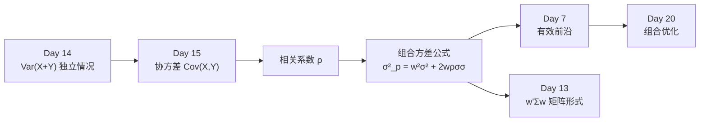

# Day 15：协方差、相关性、大数定律与中心极限定理

> **总时长：** 2 小时
>
> **节奏：** 每 50 分钟休息 10 分钟
>
> **今日目标：** 理解协方差和相关系数（两个随机变量之间的关系），推导出投资组合方差公式，掌握大数定律和中心极限定理的核心结论——为 Day 16 假设检验打好基础
>
> **本文是完整讲义，包含所有知识点，不需要翻阅其他资料**

---

## 时间表

```
00:00 - 00:50  第一节：协方差与相关系数
00:50 - 01:00  休息
01:00 - 01:50  第二节：大数定律与中心极限定理
01:50 - 02:00  休息 + 自测
```

---

## 第一节：协方差与相关系数（50 分钟）

### 一、协方差

#### 1.1 从 Day 14 接续：独立时方差可加，非独立呢？

Day 14 §3.6 给出了一条重要性质：当 $X$ 和 $Y$ **相互独立**时，

$$\text{Var}(X + Y) = \text{Var}(X) + \text{Var}(Y)$$

我们用它推导了年化波动率公式 $\sigma_{annual} = \sigma_{daily} \times \sqrt{250}$（假设每天收益率独立）。

但如果 $X$ 和 $Y$ **不独立**呢？比如两只股票的收益率——它们往往同涨同跌，显然不独立。这时方差之和还对吗？

**不对。** 非独立情况下，还需要加上一个"交叉项"——这就是**协方差**。

#### 1.2 定义与公式

**协方差 = 两个变量"一起偏离均值"的平均程度。** 记号 $\text{Cov}(X, Y)$。

**公式一（定义式）：**

$$\text{Cov}(X, Y) = E[(X - \mu_X)(Y - \mu_Y)]$$

翻译成人话：看 $X$ 偏离它的均值多少、$Y$ 偏离它的均值多少，把两个偏差相乘，再取平均。

**公式二（计算式）：**

$$\text{Cov}(X, Y) = E[XY] - E[X] \cdot E[Y]$$

翻译成人话：先算"乘积的平均"，再减去"各自平均的乘积"。和 Day 14 方差的计算式 $E[X^2] - (E[X])^2$ 长得很像——事实上方差就是"自己和自己的协方差"。

> 两个公式等价（展开公式一就得到公式二）。**公式二更方便手算**，不需要先算偏差。

**协方差的符号告诉你什么：**

| $\text{Cov}(X,Y)$ 的值 | 含义 |
|:---:|------|
| 正数 | $X$ 大时 $Y$ 也倾向于大（同涨同跌） |
| 负数 | $X$ 大时 $Y$ 倾向于小（一涨一跌） |
| 零 | $X$ 和 $Y$ 的偏差乘积平均为零（线性关系为零） |

> **需要记住的：** 两个协方差公式。公式一帮助理解含义，公式二方便手算。

#### 1.3 几何直觉：散点图的倾斜方向

把每一对 $(X, Y)$ 画在散点图上，协方差的符号对应散点云的倾斜方向：

```
正协方差（同涨同跌）：      负协方差（一涨一跌）：      零协方差（无线性关系）：

  Y                           Y                           Y
  ^     *  *                  ^  *                        ^     *
  |   *  *                    |   *  *                    |  *     *
  |  * *                      |     * *                   | *  *  *  *
  | * *                       |      *  *                 |  *     *
  |*                          |        *  *               |     *
  +---------> X               +-----------> X             +---------> X
  散点云从左下到右上          散点云从左上到右下          散点云没有明显倾斜
```

> **理解即可。** 协方差衡量的是散点云的"倾斜方向"和"紧密程度"。但它的数值大小依赖于 $X$、$Y$ 的单位和幅度，不方便比较——这个问题 §2 的相关系数会解决。

#### 1.4 手算例子：4 个月收益率

两只股票 4 个月的收益率数据：

| 月份 | Stock A | Stock B | A × B |
|:----:|:-------:|:-------:|:-----:|
| 1 | +3% | +2% | 6 |
| 2 | -1% | +1% | -1 |
| 3 | +2% | -1% | -2 |
| 4 | -2% | -3% | 6 |

**方法一：用计算式 $E[XY] - E[X]E[Y]$**

```
第 1 步：算各自的均值
  E[A] = (3 + (-1) + 2 + (-2)) / 4 = 2/4 = 0.5%
  E[B] = (2 + 1 + (-1) + (-3)) / 4 = -1/4 = -0.25%

第 2 步：算乘积的均值
  E[AB] = (6 + (-1) + (-2) + 6) / 4 = 9/4 = 2.25

第 3 步：协方差
  Cov = E[AB] - E[A] × E[B]
      = 2.25 - 0.5 × (-0.25)
      = 2.25 + 0.125
      = 2.375
```

**方法二：用定义式 $E[(A - \mu_A)(B - \mu_B)]$ 交叉验证**

```
偏差 A：  2.5,  -1.5,   1.5,  -2.5
偏差 B：  2.25,  1.25, -0.75, -2.75

乘积：    2.5  × 2.25  =  5.625
         (-1.5) × 1.25  = -1.875
          1.5  × (-0.75) = -1.125
         (-2.5) × (-2.75) =  6.875

平均 = (5.625 - 1.875 - 1.125 + 6.875) / 4 = 9.5 / 4 = 2.375 ✓
```

两种方法结果一致：$\text{Cov}(A, B) = 2.375$。正数，说明两只股票倾向于同涨同跌。

> **注意：** 这里用的是总体协方差（除以 $n$）。样本协方差除以 $n-1$，结果会略大。和 Day 14 的方差一样，实际中 `pandas` 默认用 $n-1$。

#### 1.5 协方差的三条性质

**性质一：对称性**

$$\text{Cov}(X, Y) = \text{Cov}(Y, X)$$

$X$ 对 $Y$ 的协方差 = $Y$ 对 $X$ 的协方差。这就是 Day 13 讲的**协方差矩阵一定是对称矩阵**的原因。

**性质二：自协方差 = 方差**

$$\text{Cov}(X, X) = \text{Var}(X)$$

代入公式验证：$E[X \cdot X] - E[X] \cdot E[X] = E[X^2] - (E[X])^2$，正好是方差的计算式。

> 这意味着协方差矩阵的对角线上放的就是各资产的方差——Day 13 §4.3 手算的那个矩阵 $\Sigma = [[5, 2], [2, 2]]$，对角线 5 和 2 就是两只股票的方差。

**性质三：线性性**

$$\text{Cov}(aX + b, Y) = a \cdot \text{Cov}(X, Y)$$

翻译成人话：$X$ 乘以常数 $a$，协方差也乘以 $a$；加常数 $b$ 不影响协方差（平移不改变"一起偏离"的程度）。

> **需要记住的：** 对称性（协方差矩阵对称）、自协方差 = 方差。线性性理解即可。

#### 1.6 补上缺失的公式：Var(X+Y) 的完整版

现在可以写出完整的方差加法公式了：

$$\text{Var}(X + Y) = \text{Var}(X) + \text{Var}(Y) + 2\text{Cov}(X, Y)$$

对比 Day 14 的"独立版本"：独立时 $\text{Cov}(X, Y) = 0$，公式退化为 $\text{Var}(X) + \text{Var}(Y)$。

**这就是 Day 6 分散投资的数学本质：**

- 如果两只股票正协方差（同涨同跌），$2\text{Cov} > 0$ → 组合方差**增大** → 分散效果差
- 如果两只股票负协方差（一涨一跌），$2\text{Cov} < 0$ → 组合方差**减小** → 分散效果好
- Day 6 的雨伞和冰淇淋就是负协方差的极端案例——$\text{Cov}$ 足够负，以至于组合方差降为零

> **需要记住的：** $\text{Var}(X+Y) = \text{Var}(X) + \text{Var}(Y) + 2\text{Cov}(X,Y)$。这是投资组合方差公式的起点。

---

### 二、相关系数

#### 2.1 协方差的问题：没有标准刻度

$\text{Cov}(A, B) = 2.375$ ——这个数大不大？关系强不强？

很难回答。协方差的数值大小取决于 $X$ 和 $Y$ 的单位和幅度。如果把收益率从"百分比"改成"小数"（除以 100），协方差变成原来的 $1/10000$。**同样的关系强度，换个单位数值就变了。**

我们需要一个**不受单位影响**的标准化版本。

#### 2.2 定义：相关系数 ρ

**相关系数 = 协方差除以两个变量各自的标准差。**

$$\rho(X, Y) = \frac{\text{Cov}(X, Y)}{\sigma_X \cdot \sigma_Y}$$

其中 $\rho$（希腊字母 rho）就是相关系数，范围 $[-1, +1]$。

等价地，可以反过来用 $\rho$ 表示协方差：

$$\text{Cov}(X, Y) = \rho \cdot \sigma_X \cdot \sigma_Y$$

| $\rho$ 的值 | 含义 |
|:---:|------|
| +1 | 完全正相关（完全同涨同跌），散点完美排在一条正斜率直线上 |
| 0 | 不存在线性关系 |
| -1 | 完全负相关（完全反向），散点完美排在一条负斜率直线上 |

> **需要记住的：** $\rho = \text{Cov}(X,Y) / (\sigma_X \cdot \sigma_Y)$，范围 $[-1, +1]$。Day 7 介绍了相关系数的直觉，今天补上了数学定义。

#### 2.3 手算：沿用 §1.4 的数据算 ρ

先算两只股票的方差和标准差：

```
Stock A：
  E[A²] = (9 + 1 + 4 + 4) / 4 = 18/4 = 4.5
  Var(A) = E[A²] - (E[A])² = 4.5 - 0.25 = 4.25
  σ_A = √4.25 ≈ 2.062%

Stock B：
  E[B²] = (4 + 1 + 1 + 9) / 4 = 15/4 = 3.75
  Var(B) = E[B²] - (E[B])² = 3.75 - 0.0625 = 3.6875
  σ_B = √3.6875 ≈ 1.920%

相关系数：
  ρ = Cov(A,B) / (σ_A × σ_B)
    = 2.375 / (2.062 × 1.920)
    = 2.375 / 3.959
    ≈ 0.60
```

$\rho \approx 0.60$：中等偏强的正相关。两只股票有明显的同涨同跌倾向，但不是完全同步。

#### 2.4 对比表：协方差 vs 相关系数

| 维度 | 协方差 $\text{Cov}(X,Y)$ | 相关系数 $\rho$ |
|------|:---:|:---:|
| 范围 | $(-\infty, +\infty)$ | $[-1, +1]$ |
| 单位 | 有单位（X 的单位 × Y 的单位） | 无量纲 |
| 可比性 | 不同资产对之间无法直接比较 | 可以直接比较 |
| 用途 | 计算组合方差 | 衡量关系强弱 |
| 关系 | $\text{Cov} = \rho \cdot \sigma_X \cdot \sigma_Y$ | $\rho = \text{Cov} / (\sigma_X \cdot \sigma_Y)$ |

> **一句话总结：** 协方差告诉你"方向"，相关系数告诉你"方向 + 强度"。

#### 2.5 两资产组合方差公式

把 §1.6 的 $\text{Var}(X+Y)$ 公式加上权重，并用 $\text{Cov} = \rho \sigma_X \sigma_Y$ 替换协方差，就得到 Day 7 §3.2 的组合方差公式：

$$\sigma_p^2 = w_1^2 \sigma_1^2 + w_2^2 \sigma_2^2 + 2 w_1 w_2 \rho \sigma_1 \sigma_2$$

Day 7 直接给了这个公式，今天从协方差推导出来了——**Day 7 的"给定结论"变成了 Day 15 的"推导结果"。**

**手算验证：复用 Day 7 的数据**

Day 7 §3.3 的设定：股票 A（$\sigma_A = 25\%$），股票 B（$\sigma_B = 15\%$），等权（$w_A = w_B = 0.5$）。

```
σ_p² = 0.5² × 0.25² + 0.5² × 0.15² + 2 × 0.5 × 0.5 × ρ × 0.25 × 0.15
     = 0.015625 + 0.005625 + 0.01875ρ
     = 0.02125 + 0.01875ρ
```

**三种极端情况对比：**

| $\rho$ | $\sigma_p^2$ | $\sigma_p$ | 含义 |
|:---:|:---:|:---:|------|
| +1 | 0.04000 | 20.0% | 波动率 = 加权平均，分散化完全无效 |
| 0 | 0.02125 | 14.6% | 显著低于加权平均，分散化有效 |
| -1 | 0.00250 | 5.0% | 接近消除风险，分散化效果最大 |

> 这和 Day 7 §3.3 的结果完全一致——今天用协方差和相关系数从数学上推导出了同样的结论。

**为什么 $\rho = +1$ 时分散化无效？** 因为 $\text{Cov} = \sigma_1 \sigma_2$（最大值），交叉项最大，组合方差不会被"抵消"。

**为什么 $\rho = -1$ 效果最好？** 因为 $\text{Cov} = -\sigma_1 \sigma_2$（最小值），交叉项最负，组合方差被大幅抵消。

> **需要记住的：** $\sigma_p^2 = w_1^2\sigma_1^2 + w_2^2\sigma_2^2 + 2w_1w_2\rho\sigma_1\sigma_2$。$\rho$ 越小，组合方差越小。

#### 2.6 N 资产推广：矩阵形式

两资产公式可以推广到 $N$ 个资产，写成矩阵形式：

$$\sigma_p^2 = w'\Sigma w$$

这就是 Day 13 §3.1 的二次型。其中：

- $w$ = 权重向量（$N \times 1$）
- $\Sigma$ = 协方差矩阵（$N \times N$），对角线是各资产方差，非对角线是两两协方差
- $w'$ = $w$ 的转置

Day 13 还讲过：协方差矩阵是对称半正定的（§4.1），特征分解可以做风险分解（§4.2）。现在你知道了为什么**对称**——因为 $\text{Cov}(A,B) = \text{Cov}(B,A)$（§1.5 性质一）。

> **理解即可。** 记住 $\sigma_p^2 = w'\Sigma w$ 这个形式，具体计算交给 Python。

#### 2.7 知识地图



---

### 第一节完成检查

- [ ] 我知道协方差衡量的是"两个变量一起偏离均值的程度"
- [ ] 我能用 $E[XY] - E[X]E[Y]$ 手算协方差
- [ ] 我知道 $\text{Var}(X+Y) = \text{Var}(X) + \text{Var}(Y) + 2\text{Cov}(X,Y)$
- [ ] 我知道相关系数 $\rho = \text{Cov}/(\sigma_X \sigma_Y)$，范围 $[-1, +1]$
- [ ] 我能写出两资产组合方差公式，知道 $\rho$ 越小组合风险越低
- [ ] 我知道 $\sigma_p^2 = w'\Sigma w$ 是 N 资产的矩阵推广
- [ ] 我理解了 Day 6 分散投资的数学本质（协方差为负 → 组合方差减小）

**休息 10 分钟。**

---

## 第二节：大数定律与中心极限定理（50 分钟）

### 三、联合分布与独立性（简要）

#### 3.1 联合分布

两个随机变量 $X$ 和 $Y$ 可以有一个**联合分布**——同时描述 $X$ 和 $Y$ 各取什么值、概率是多少。

> **知道存在就行。** 联合分布的正式定义（联合 PDF/PMF）不需要掌握。你只需要知道：当我们谈论 $\text{Cov}(X,Y)$ 或 $\rho$ 时，我们在描述两个变量的联合行为。

#### 3.2 独立性与协方差为零

一个重要的逻辑关系：

$$X \text{ 和 } Y \text{ 独立} \Rightarrow \text{Cov}(X, Y) = 0$$

但**反过来不成立**！$\text{Cov}(X,Y) = 0$ **不能**推出 $X$ 和 $Y$ 独立。

**经典反例：$X$ 和 $X^2$**

设 $X$ 等概率取 $\{-1, 0, +1\}$，令 $Y = X^2$。

```
E[X] = (-1 + 0 + 1) / 3 = 0
E[Y] = E[X²] = (1 + 0 + 1) / 3 = 2/3
E[XY] = E[X³] = ((-1)³ + 0³ + 1³) / 3 = 0

Cov(X, Y) = E[XY] - E[X]·E[Y] = 0 - 0 × (2/3) = 0
```

协方差为零！但 $Y = X^2$ 完全由 $X$ 决定——知道 $X$，就知道 $Y$，它们显然不独立。

> **需要记住的：** 独立 → 协方差为零 ✓；协方差为零 → 独立 ✗。协方差只捕捉**线性**关系，非线性关系（如 $X$ 和 $X^2$）可能被漏掉。

---

### 四、大数定律（LLN）

#### 4.1 直觉：掷硬币越多越接近 50%

掷一枚公平硬币：
- 掷 10 次，正面比例可能是 30% 或 70%——波动很大
- 掷 100 次，正面比例大约在 45%-55% 之间
- 掷 10000 次，正面比例几乎肯定在 49%-51% 之间

**数据越多，样本均值越接近真实均值。** 这个直觉的数学表述就是大数定律。

#### 4.2 形式化表述

设 $X_1, X_2, \ldots, X_n$ 是独立同分布的随机变量，均值为 $\mu$。样本均值：

$$\bar{X}_n = \frac{1}{n}(X_1 + X_2 + \cdots + X_n)$$

**大数定律（LLN）：** 当 $n \to \infty$ 时，

$$\bar{X}_n \to \mu$$

翻译成人话：**样本量越大，样本均值越接近总体均值。** 这就是 Day 14 §2.4 说的"数据越多，$\bar{x}$ 越接近 $\mu$"的正式化表述。

> **需要记住的：** 大数定律 = 样本量足够大时，样本均值收敛到真实均值。

#### 4.3 因子投资联系

大数定律对因子投资的核心含义：**回测时间越长，因子收益率的估计越可靠。**

| 回测时间 | 月数 $n$ | 估计可靠性 | 直觉 |
|---------|:---:|------|------|
| 1 年 | 12 | 很不可靠 | 掷 12 次硬币——什么结果都可能 |
| 3 年 | 36 | 初步参考 | 开始看出一些趋势 |
| 5 年 | 60 | 有一定可信度 | 可以初步判断因子是否有效 |
| 10 年 | 120 | 较可靠 | 至少经历过一次完整的市场周期 |
| 20 年 | 240 | 相当可靠 | 多个周期的检验 |

> 这也是为什么学术论文中的因子研究通常用 30-50 年的数据——大数定律保证了长期数据给出的估计更接近真相。

**简单数值例子：**

```
某因子的真实月均收益 μ = 0.5%

只用 12 个月数据：样本均值可能从 -1% 到 +2% 都有可能（波动巨大）
用 120 个月数据：样本均值大概在 0.2% 到 0.8% 之间（靠谱多了）
用 1200 个月数据：样本均值几乎就在 0.5% 附近（非常精确）
```

---

### 五、中心极限定理（CLT）

#### 5.1 直觉：不管原始数据长什么样，平均值都近似正态

大数定律告诉我们"平均值最终收敛到真实值"，但没说**收敛的速度**和**分布的形状**。中心极限定理补上了这一块：

**无论原始数据服从什么分布（均匀、偏态、任意形状），只要样本量足够大，样本均值的分布就近似正态分布。**

这是统计学中最重要的定理之一——它让我们可以对几乎任何数据做统计推断。

#### 5.2 形式化表述

设 $X_1, X_2, \ldots, X_n$ 独立同分布，均值 $\mu$，方差 $\sigma^2$。当 $n$ 足够大时：

$$\bar{X}_n \sim N\left(\mu, \frac{\sigma^2}{n}\right)$$

翻译成人话：样本均值近似服从正态分布，均值还是 $\mu$，但方差**缩小了 $n$ 倍**。

标准化形式（z 变换，回顾 Day 14 §4.4）：

$$\frac{\bar{X}_n - \mu}{\sigma / \sqrt{n}} \sim N(0, 1)$$

**三个关键含义：**

| # | CLT 告诉你的 | 因子投资翻译 |
|---|-------------|-------------|
| 1 | 均值还是 $\mu$ | 样本均值是无偏估计——不会系统性地偏高或偏低 |
| 2 | 方差是 $\sigma^2/n$ | 数据越多，估计越精确（方差和 $n$ 成反比） |
| 3 | 形状是正态 | 可以用正态分布做置信区间和假设检验 |

> **需要记住的：** CLT 核心结论：$\bar{X}_n \sim N(\mu, \sigma^2/n)$。三个含义都要记住。

#### 5.3 标准误：SE = σ/√n

样本均值的标准差有个专门的名字——**标准误（Standard Error, SE）**：

$$SE = \frac{\sigma}{\sqrt{n}}$$

标准误衡量的是"样本均值的不确定性"。$n$ 越大，SE 越小，估计越精确。

**手算对比：** 假设某因子月收益率的标准差 $\sigma = 3\%$。

```
n = 36 个月（3 年）：  SE = 3% / √36  = 3% / 6    = 0.50%
n = 144 个月（12 年）：SE = 3% / √144 = 3% / 12   = 0.25%
n = 240 个月（20 年）：SE = 3% / √240 = 3% / 15.5 ≈ 0.194%
```

从 3 年到 12 年（数据量 ×4），标准误减半。从 3 年到 20 年（数据量 ×6.7），标准误减少到不到原来的 40%。

> **关键洞见：精确度提高的速度是 $\sqrt{n}$，不是 $n$。** 要把标准误减半，需要 4 倍的数据量。要减到 1/3，需要 9 倍数据。这就是为什么在金融中精确估计如此困难——收益率噪声大（$\sigma$ 大），能用的数据量有限。

#### 5.4 分布形状的变化

随着样本量增加，$\bar{X}_n$ 的分布从"原始形状"逐渐变成钟形曲线：

```
n = 1（原始分布，             n = 5（开始变对称）：       n = 30（近似正态）：
  比如均匀分布）：
                                    *
  * * * * * *                     * * *                       *
  * * * * * *                   * * * * *                   * * *
  * * * * * *                 * * * * * * *               * * * * *
  * * * * * *               * * * * * * * * *           * * * * * * *
──────────────           ────────────────────         ──────────────────
       μ                          μ                          μ
```

> 实际经验：**$n \geq 30$ 时，CLT 的近似通常足够好**——这是统计学中著名的"30 法则"。在金融中，由于收益率分布的肥尾特征（Day 14 §6），可能需要更多数据。

#### 5.5 对比表：LLN vs CLT

| 维度 | 大数定律（LLN） | 中心极限定理（CLT） |
|------|:---:|:---:|
| 核心结论 | $\bar{X}_n \to \mu$ | $\bar{X}_n \sim N(\mu, \sigma^2/n)$ |
| 说了什么 | 收敛到什么值 | 收敛的速度和分布形状 |
| 关注什么 | 均值本身 | 均值的不确定性 |
| 公式 | 无（定性结论） | $SE = \sigma/\sqrt{n}$ |
| 因子投资用途 | 长期数据更可靠 | 构造 t 统计量做假设检验 |

> **LLN 说"样本均值最终到达目标"，CLT 说"到达目标的路上，偏差的分布是正态的"。**

#### 5.6 因子投资映射

CLT 是从"统计量"走向"假设检验"的桥梁。核心逻辑链：

**CLT 告诉你 $\bar{X}$ 近似正态 → 你可以构造 t 统计量 → Day 16 用 t 统计量判断因子是否"显著"**

**t 统计量预览：**

$$t = \frac{\bar{X} - \mu_0}{SE} = \frac{\bar{X} - \mu_0}{\sigma / \sqrt{n}}$$

如果假设因子没有超额收益（$\mu_0 = 0$），那么 $t = \bar{X} / SE$。$|t| > 2$ 大致意味着"在 5% 显著性水平下拒绝零假设"——即有统计证据表明因子确实有效。

> Day 16 会详细讲假设检验。今天只需要理解：CLT 是构造 t 统计量的数学基础。

**$\sqrt{n}$ 法则——为什么短回测不可靠：**

$t = \bar{X} \cdot \sqrt{n} / \sigma$。即使真实的因子收益 $\bar{X}$ 不变，$t$ 统计量和 $\sqrt{n}$ 成正比。数据太少 → $t$ 太小 → 无法达到显著性阈值 → 你会错误地认为因子无效。


#### 5.7 完整数值案例：回测长度与统计显著性

假设某因子的**真实**月均超额收益 $\mu = 0.5\%$，月收益率标准差 $\sigma = 3\%$。

**60 个月回测（5 年）：**

```
SE = 3% / √60 = 3% / 7.75 ≈ 0.387%
t  = 0.5% / 0.387% ≈ 1.29
```

$t = 1.29 < 2$ → **不显著。** 即使因子确实有效，5 年数据也不够你发现它。

**240 个月回测（20 年）：**

```
SE = 3% / √240 = 3% / 15.49 ≈ 0.194%
t  = 0.5% / 0.194% ≈ 2.58
```

$t = 2.58 > 2$ → **显著。** 20 年数据给了你足够的统计检验力。

**对比总结：**

| 回测时间 | $n$ | SE | $t$ | 结论 |
|---------|:---:|:---:|:---:|------|
| 5 年 | 60 | 0.387% | 1.29 | 不显著——数据不够 |
| 10 年 | 120 | 0.274% | 1.83 | 接近显著——还差一点 |
| 20 年 | 240 | 0.194% | 2.58 | 显著——有统计证据 |

> **核心教训：** 同一个因子，5 年回测你说"不显著"，20 年回测你说"显著"——因子本身没变，变的是你的**检验力**（$\sqrt{n}$ 变大了）。这就是为什么因子研究需要长期数据，2-3 年的回测几乎没有统计意义。

---

### 第二节完成检查

- [ ] 我知道独立 → Cov=0，但 Cov=0 不一定独立（$X$ 和 $X^2$ 的反例）
- [ ] 我知道大数定律 = 数据越多，样本均值越接近真实均值
- [ ] 我能说出 CLT 的核心结论：$\bar{X}_n \sim N(\mu, \sigma^2/n)$
- [ ] 我能用 $SE = \sigma/\sqrt{n}$ 手算标准误
- [ ] 我理解 $\sqrt{n}$ 法则——精确度和 $\sqrt{n}$ 成正比，不是和 $n$ 成正比
- [ ] 我知道 CLT 是构造 t 统计量的数学基础
- [ ] 我能用数值例子解释为什么短回测不可靠

---

## 收尾：自测（10 分钟）

**自测 1：** 协方差为正意味着什么？为负呢？为零呢？

```
→ 你的答案：_______________
→ 正确：正——两个变量倾向于同涨同跌；
  负——一个涨时另一个倾向于跌；
  零——没有线性联动关系（但可能有非线性关系）。
```

---

**自测 2：** 协方差和相关系数有什么区别？为什么需要相关系数？

```
→ 你的答案：_______________
→ 正确：协方差有单位，不同资产对之间无法直接比较大小。
  相关系数 = 协方差 ÷ 两个标准差的乘积，无量纲，范围 [-1,+1]，
  可以直接比较关系的强弱。
```

---

**自测 3：** Cov(X,Y) = 0 是否意味着 X 和 Y 独立？

```
→ 你的答案：_______________
→ 正确：不一定。Cov = 0 只说明没有"线性"关系，
  可能存在非线性关系（如 X 和 X² 的例子）。
  独立 → Cov=0 成立，但反过来不成立。
```

---

**自测 4：** 用一句话概括 CLT 的核心结论。它对因子投资有什么意义？

```
→ 你的答案：_______________
→ 正确：无论原始分布如何，样本均值在样本量足够大时近似服从正态分布。
  意义：我们可以用正态分布构造 t 统计量，检验因子收益是否显著。
```

---

**自测 5：** 为什么 2 年回测不可靠？用 CLT 解释。

```
→ 你的答案：_______________
→ 正确：2 年 = 24 个月，标准误 SE = σ/√24 很大，
  t 统计量 = 均值/SE 很小，即使因子有效也难以达到显著性阈值。
  根据 √n 法则，需要更多数据来提高检验力。
```

---

**自测 6：** 给定 4 个数据点，X: [2, 4, 1, 3]，Y: [5, 3, 4, 2]，用 $E[XY] - E[X]E[Y]$ 算协方差。

```
→ 你的计算：_______________
→ 正确：
  E[X] = (2+4+1+3)/4 = 10/4 = 2.5
  E[Y] = (5+3+4+2)/4 = 14/4 = 3.5
  XY: 10, 12, 4, 6
  E[XY] = (10+12+4+6)/4 = 32/4 = 8
  Cov = 8 - 2.5 × 3.5 = 8 - 8.75 = -0.75
```

---

**自测 7：** 接自测 6，计算 X 和 Y 的相关系数 $\rho$。

```
→ 你的计算：_______________
→ 正确：
  E[X²] = (4+16+1+9)/4 = 30/4 = 7.5
  Var(X) = 7.5 - 6.25 = 1.25,  σ_X = √1.25 ≈ 1.118
  E[Y²] = (25+9+16+4)/4 = 54/4 = 13.5
  Var(Y) = 13.5 - 12.25 = 1.25,  σ_Y = √1.25 ≈ 1.118
  ρ = -0.75 / (1.118 × 1.118) = -0.75 / 1.25 = -0.60
```

---

**自测 8：** 两资产组合：$\sigma_A = 20\%$，$\sigma_B = 10\%$，$\rho = -0.5$，等权（各 50%）。求组合方差和波动率。

```
→ 你的计算：_______________
→ 正确：
  σ_p² = 0.5² × 0.20² + 0.5² × 0.10² + 2 × 0.5 × 0.5 × (-0.5) × 0.20 × 0.10
       = 0.25 × 0.04 + 0.25 × 0.01 + (-0.005)
       = 0.01 + 0.0025 - 0.005
       = 0.0075
  σ_p = √0.0075 ≈ 8.66%
  （比 A 和 B 的加权平均波动率 15% 低很多——分散化的力量）
```

---

**自测 9：** 标准误：$\sigma = 4\%$，$n = 36$ 和 $n = 144$ 时分别是多少？

```
→ 你的计算：_______________
→ 正确：
  n = 36：SE = 4% / √36 = 4% / 6 ≈ 0.667%
  n = 144：SE = 4% / √144 = 4% / 12 ≈ 0.333%
  数据量扩大 4 倍，标准误减半（√n 法则）。
```

---

**自测 10：** 某因子月均超额收益 0.8%，月标准差 4%，有 100 个月数据。t 统计量是多少？显著吗？

```
→ 你的计算：_______________
→ 正确：
  SE = 4% / √100 = 4% / 10 = 0.4%
  t = 0.8% / 0.4% = 2.0
  |t| = 2.0，刚好在传统的 5% 显著性阈值（≈ 1.96）边缘，
  勉强显著——需要更多数据来增强信心。
```

---

### 评分标准

| 得分 | 状态 |
|------|------|
| 9-10 题 | 协方差和 CLT 掌握扎实，明天可以直接学假设检验 |
| 7-8 题 | 不错，回看错误的部分 |
| 5-6 题 | 需要重点复习组合方差公式和标准误计算 |
| < 5 题 | 建议重新阅读本讲义，特别是手算例子 |

---

## 今天不需要记住的内容

| 内容 | 为什么不需要 |
|------|------------|
| 联合分布的正式定义（联合 PDF/PMF） | 知道"同时描述两个变量的分布"就够了 |
| CLT/LLN 的数学证明 | 记住结论即可，证明用到的特征函数/矩母函数因子投资不需要 |
| 样本协方差除以 $n-1$ 的细节 | 和方差一样，`pandas` 默认处理，知道"自由度少一个"即可 |
| 弱大数定律 vs 强大数定律的区别 | 都是"样本均值收敛到真实均值"，区别是收敛的数学方式不同 |
| Berry-Esseen 收敛速率 | CLT 的近似误差量级，因子投资不需要 |

---

## 明天预告

**Day 16：** 假设检验与多重检验。

今天 CLT 告诉我们样本均值近似正态，明天用它回答因子投资最核心的问题——**"这个因子的 alpha 显著吗？"**

你将学到：

- **假设检验的完整框架**：零假设、备择假设、p 值、显著性水平
- **t 检验**：用今天学的 t 统计量判断因子是否真的有效
- **多重检验陷阱**：如果你测试 100 个因子，即使全部无效，也有约 5 个在 $p < 0.05$ 水平上"显著"——这是因子研究中最大的统计陷阱之一

> 今天的 CLT 和 t 统计量是明天假设检验的数学基础。没有今天的铺垫，假设检验只是一个"黑盒公式"；有了今天的理解，你会知道假设检验的每一步在做什么。
