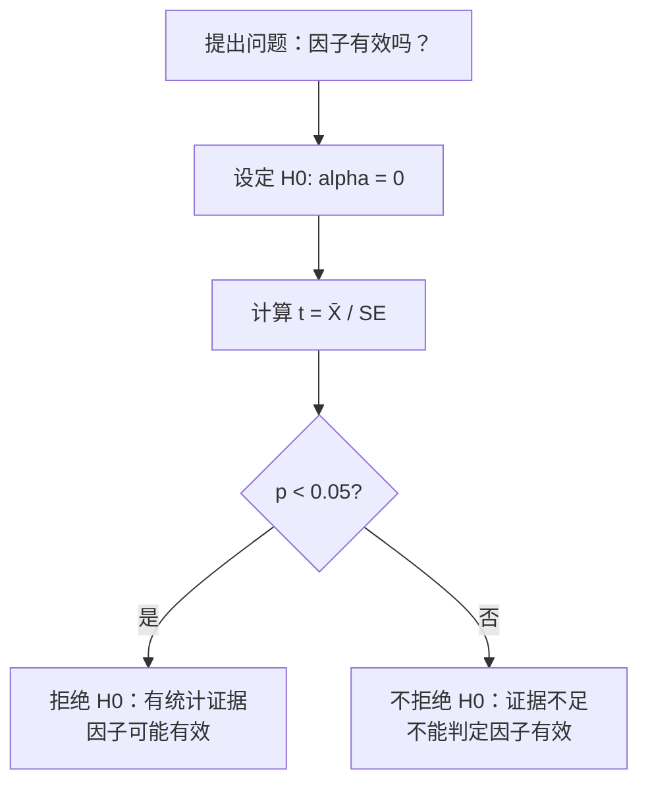
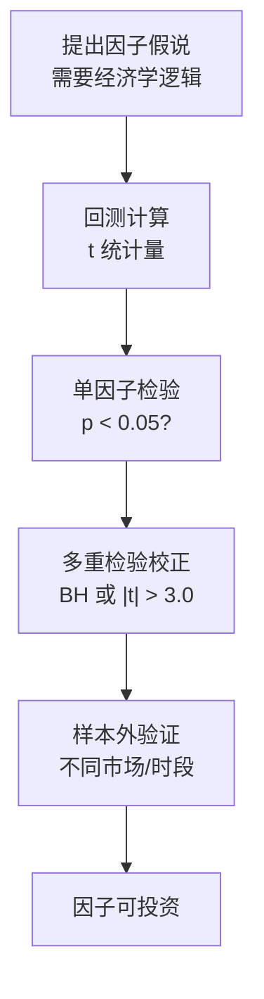

# Day 16：假设检验与多重检验

> **总时长：** 2 小时
>
> **节奏：** 每 50 分钟休息 10 分钟
>
> **今日目标：** 掌握假设检验的完整框架——从构造 t 统计量到判断 p 值，再到多重检验的陷阱与校正方法；能回答"这个因子的 alpha 显著吗"
>
> **本文是完整讲义，包含所有知识点，不需要翻阅其他资料**

---

## 时间表

```
00:00 - 00:50  第一节：假设检验基础——零假设、p 值、t 检验
00:50 - 01:00  休息
01:00 - 01:50  第二节：多重检验——假发现、Bonferroni、FDR
01:50 - 02:00  休息 + 自测
```

---

## 第一节：假设检验基础（50 分钟）

### 一、从 Day 15 接续：CLT 给了我们什么

Day 15 的中心极限定理告诉我们：

$$\bar{X}_n \sim N\left(\mu, \frac{\sigma^2}{n}\right)$$

样本均值近似服从正态分布。由此我们构造了 t 统计量（Day 15 §5.6）：

$$t = \frac{\bar{X} - \mu_0}{SE} = \frac{\bar{X} - \mu_0}{\sigma / \sqrt{n}}$$

Day 15 还用数值例子演示了：同一个因子，5 年回测 $t = 1.29$（"不显著"），20 年回测 $t = 2.58$（"显著"）。但 Day 15 没有回答：

- "显著"到底是什么意思？
- $|t| > 2$ 这个阈值从哪来？
- 如果我测了 200 个因子，有 10 个"显著"，能信吗？

**今天把这些问题全部解决。**

---

### 二、假设检验的框架

#### 2.1 零假设与备择假设

**零假设 $H_0$ = "什么都没发生"，备择假设 $H_1$ = "确实有事"。**

**为什么要学：** 因子研究的核心问题是——"这个因子的超额收益是真实的还是运气？"假设检验就是回答这个问题的统计工具。

**在因子投资中：**

- $H_0: \alpha = 0$ —— 因子没有超额收益（超额收益是零，看到的只是噪声）
- $H_1: \alpha \neq 0$ —— 因子确实有超额收益

**直觉：法庭类比。**

法庭上的"无罪推定"：被告默认无罪（$H_0$），除非检方提供了"超越合理怀疑"的证据，才判有罪（拒绝 $H_0$）。假设检验也一样：因子默认"无效"（$H_0$），除非数据提供了足够强的证据，才判定因子"有效"。

注意措辞——我们说"拒绝 $H_0$"或"不拒绝 $H_0$"，而**不说"接受 $H_0$"**。就像法庭判"无罪"不等于"清白"，只是"证据不足"。

> **需要记住的：** $H_0$ 是默认立场（因子无效），$H_1$ 是你想证明的（因子有效）。假设检验的目标是用数据判断能否拒绝 $H_0$。

#### 2.2 t 统计量（正式版）

Day 15 预览了 t 统计量的公式，现在正式定义：

**t 统计量：**

$$t = \frac{\bar{X} - \mu_0}{SE} = \frac{\bar{X} - \mu_0}{s / \sqrt{n}}$$

符号解释：

- $\bar{X}$ = 样本均值（比如因子月均超额收益率）
- $\mu_0$ = 零假设下的值（通常为 0，即假设因子没有超额收益）
- $s$ = 样本标准差
- $n$ = 样本量（比如回测月数）
- $SE = s / \sqrt{n}$ = 标准误（Day 15 §5.3）

**翻译成人话：t 值 = 信号 / 噪声。**

- 信号 = $\bar{X} - \mu_0$（均值偏离零的程度）
- 噪声 = $SE$（均值估计的不确定性）

**信噪比直觉：** 和收音机一样——信号强（均值大）或噪声小（SE 小）都让 t 变大。t 值越大，说明"信号"相对于"噪声"越强，因子有效的证据越充分。

> **需要记住的：** $t = \bar{X} / SE$（当 $\mu_0 = 0$ 时），t 值的本质是信噪比。

#### 2.3 p 值

**p 值 = 假设 $H_0$ 为真时，观测到当前结果（或更极端结果）的概率。**

这是统计学中最容易被误解的概念，必须搞清楚。

**最重要的纠错：**

> p = 0.03 **不是** "因子有效的概率是 97%"！

p = 0.03 的正确含义是：**如果因子真的无效（$H_0$ 为真），看到这么大（或更大）的 t 值的概率只有 3%。**

**硬币直觉：** 你扔一枚硬币连续出了 10 次正面。p 值问的是"如果硬币是公平的，连续出 10 次正面的概率有多大？"答案是 $(1/2)^{10} \approx 0.001$——如果硬币真的公平，这件事几乎不可能发生，所以你有理由怀疑硬币不公平。

**p 值的可视化（正态分布曲线）：**

```
              p 值 = 两个阴影区域的面积之和

                        ┌─*─┐
                       ╱     ╲
                     ╱         ╲
                   ╱             ╲
                 ╱                 ╲
               ╱                     ╲
         ░░░╱                         ╲░░░
     ──┼─────────┼───────────────┼─────────┼──
      -t         0               +t
      ↑                          ↑
   左尾面积                    右尾面积

  p 值 = 左尾面积 + 右尾面积（双侧检验）
```

翻译成人话：如果 $H_0$ 为真（因子无效），t 统计量应该落在 0 附近。p 值告诉你，实际观测到的 t 值有多"极端"——p 值越小，说明在 $H_0$ 下出现这种结果的概率越低，拒绝 $H_0$ 的证据越强。

**常用 |t| 值与 p 值对照表：**

| $|t|$ | p 值（双侧） | 含义 |
|:---:|:---:|------|
| 1.65 | 0.10 | 10% 水平上显著 |
| 1.96 | 0.05 | 5% 水平上显著（最常用阈值） |
| 2.58 | 0.01 | 1% 水平上显著 |
| 3.00 | 0.003 | Harvey et al. 建议的因子研究阈值 |

> **需要记住的：** p 值的正确含义（在 $H_0$ 下观测到当前或更极端结果的概率），以及 $|t| = 1.96$ 对应 $p = 0.05$ 这个关键对照。

#### 2.4 显著性水平 α 与决策规则

有了 p 值，还需要一个**判断标准**——多小的 p 值才算"足够小"？

**显著性水平 $\alpha$ = 你愿意接受的"冤枉好人"概率。** 最常见的选择是 $\alpha = 0.05$（5%）。

**决策规则：**

- $p < \alpha$ → **拒绝 $H_0$**（有统计证据表明因子可能有效）
- $p \geq \alpha$ → **不拒绝 $H_0$**（证据不足，无法判定因子有效）

等价地：$|t| > 1.96$ → 拒绝 $H_0$（当 $\alpha = 0.05$ 时）。

**不同 $\alpha$ 水平的严格程度：**

| $\alpha$ | 对应 $|t|$ 阈值 | 严格程度 | 含义 |
|:---:|:---:|:---:|------|
| 0.10 | 1.65 | 宽松 | 愿意承受 10% 的冤枉好人概率 |
| 0.05 | 1.96 | 中等（最常用） | 愿意承受 5% 的冤枉好人概率 |
| 0.01 | 2.58 | 严格 | 只愿意承受 1% 的冤枉好人概率 |

> **需要记住的：** $\alpha = 0.05$ 是最常用的显著性水平。$p < 0.05$（或 $|t| > 1.96$）是判定"显著"的标准门槛。

#### 2.5 第一类错误与第二类错误

做判断就可能犯错。假设检验有两种错误：

| | 真实情况：$H_0$ 为真（因子无效） | 真实情况：$H_1$ 为真（因子有效） |
|---|---|---|
| **决策：拒绝 $H_0$（判定因子有效）** | **第一类错误**（冤枉好人） | 正确 |
| **决策：不拒绝 $H_0$（判定因子无效）** | 正确 | **第二类错误**（放过坏人） |

**因子投资翻译：**

- **第一类错误** = 因子其实没用，但你的回测碰巧出了一个大 t 值，你判定它"显著"→ 真金白银投了一个无效因子 → **亏钱**
- **第二类错误** = 因子其实有用，但你的数据太少或噪声太大，t 值不够大，你说"不显著"→ 错过了一个好因子 → **少赚钱**

**哪个更危险？** 在因子投资中，第一类错误通常更危险。错过一个好因子（第二类错误）只是少赚钱，但投资一个无效因子（第一类错误）会真正亏损。这也是为什么因子研究倾向于使用严格的标准。

**控制逻辑：**

- $\alpha$ 直接控制第一类错误率：$\alpha = 0.05$ 意味着"如果因子真的无效，我误判为有效的概率不超过 5%"
- 增加样本量 $n$ 可以降低第二类错误率（提高检验力）——Day 15 §5.7 已经用数值演示过了

> **需要记住的：** 第一类错误 = 因子无效却判为有效（受 $\alpha$ 控制）；第二类错误 = 因子有效却判为无效（受 $n$ 影响）。对比表要记住。检验力的数学定义理解即可。

#### 2.6 完整手算案例：判断一个因子是否有效

**场景：** 某价值因子 120 个月回测（10 年），月均超额收益 0.6%，月标准差 3.5%。

```
第 1 步：设定假设
  H₀: μ = 0（因子没有超额收益）
  H₁: μ ≠ 0（因子有超额收益）
  显著性水平 α = 0.05

第 2 步：计算标准误 SE
  SE = s / √n = 3.5% / √120 = 3.5% / 10.954 ≈ 0.3195%

第 3 步：计算 t 统计量
  t = X̄ / SE = 0.6% / 0.3195% ≈ 1.88

第 4 步：比较阈值
  |t| = 1.88 < 1.96（α = 0.05 的阈值）

第 5 步：判断 p 值范围
  |t| = 1.88 在 1.65（p=0.10）和 1.96（p=0.05）之间
  → p 值大约在 0.05 到 0.10 之间
  → 在 10% 水平上显著，但在 5% 水平上不显著

第 6 步：结论
  在 α = 0.05 下，不拒绝 H₀。
  即使月均超额收益有 0.6%，10 年数据也不足以在 5% 水平上
  判定该因子有效——证据还不够强。
```

**这个结论是不是意味着因子一定没用？** 不是。只是说"证据不够"。可能因子确实有效但信号太弱（只有 0.6%/月），需要更长的数据。如果有 20 年（240 个月）数据：

```
SE = 3.5% / √240 = 3.5% / 15.49 ≈ 0.226%
t  = 0.6% / 0.226% ≈ 2.66

|t| = 2.66 > 1.96 → 显著！
```

同一个因子，同样的月收益，10 年不显著，20 年显著——因子本身没变，变的是**检验力**（这正是 Day 15 §5.7 的核心教训）。

#### 2.7 假设检验流程图



---

### 第一节完成检查

- [ ] 知道零假设（$H_0$：因子无效）和备择假设（$H_1$：因子有效）分别是什么
- [ ] 能用 $t = \bar{X}/(s/\sqrt{n})$ 手算 t 统计量
- [ ] 能正确解释 p 值的含义（不是"因子有效的概率"）
- [ ] 知道 $\alpha = 0.05$ 意味着什么，以及对应的 $|t|$ 阈值 1.96
- [ ] 能区分第一类错误和第二类错误，知道在因子投资中哪个更危险
- [ ] 能完成一个完整的假设检验流程（从设假设到给结论）

**休息 10 分钟。**

---

## 第二节：多重检验（50 分钟）

### 三、多重检验问题

#### 3.1 直觉：100 枚硬币的实验

想象这个场景：

你有 100 枚**完全公平**的硬币。你让每枚硬币掷 100 次，然后对每枚硬币做一次假设检验：

- $H_0$：这枚硬币是公平的
- $\alpha = 0.05$

结果：100 枚硬币中，大约有 $100 \times 5\% = 5$ 枚会被"判定为不公平"——它们是完全公平的硬币，只是碰巧掷出了偏离 50% 较多的结果。

**5 枚被冤枉的硬币。** 每一枚都是"假发现"——你以为发现了不公平的硬币，其实只是运气。

**这就是多重检验问题的本质：检验做得越多，假发现越多。**

#### 3.2 因子投资中的多重检验

把"硬币"换成"因子"，问题就变成了因子研究中最大的统计陷阱。

**核心场景：** 你测试了 200 个因子（动量、价值、质量、各种变体……），$\alpha = 0.05$。即使**所有 200 个因子都无效**（真实 $\alpha = 0$），也期望有 $200 \times 5\% = 10$ 个"显著"。

**更触目惊心的数字——至少出现 1 个假发现的概率：**

```
每个检验不犯错的概率 = 1 - 0.05 = 0.95
200 个检验全部不犯错的概率 = 0.95^200

0.95^200 的计算：
  0.95^10  = 0.5987
  0.95^20  = 0.5987² ≈ 0.3585
  0.95^40  = 0.3585² ≈ 0.1285
  0.95^80  = 0.1285² ≈ 0.01651
  0.95^160 = 0.01651² ≈ 0.000273
  0.95^200 = 0.95^160 × 0.95^40 ≈ 0.000273 × 0.1285 ≈ 0.0000351

至少 1 个假发现的概率 = 1 - 0.0000351 ≈ 99.996%
```

**99.996% 的概率至少有 1 个假发现。** 换句话说，如果你测了 200 个因子然后挑出"显著"的那些，几乎可以确定里面有假发现。

**Harvey, Liu & Zhu (2016)** 的研究指出：学术界已发表 300+ 个因子，其中许多很可能就是多重检验产生的假发现。你在论文里读到的"显著因子"，未必真的有效。

> **需要记住的：** 测试 $m$ 个因子，期望有 $m \times \alpha$ 个假发现。测试越多，假发现越多——这是因子研究中最大的统计陷阱。

#### 3.3 多重检验的逻辑


#### 3.4 FWER 与 FDR：两种错误控制视角

既然多重检验会产生假发现，我们需要方法来控制它。有两种不同的思路：

| 维度 | FWER | FDR |
|---|---|---|
| 全称 | Family-Wise Error Rate | False Discovery Rate |
| 控制什么 | 至少出现 1 个假阳性的概率 | 假阳性占所有"显著"结果的比例 |
| 严格程度 | 非常严格 | 相对宽松 |
| 代表方法 | Bonferroni | Benjamini-Hochberg |
| 直觉 | "不允许有任何一个假发现" | "允许假发现占一小部分" |

> **理解即可。** 知道这两种思路的区别，接下来分别学习它们的具体方法。

---

### 四、Bonferroni 校正

#### 4.1 方法

**Bonferroni 校正 = 把显著性水平除以检验次数。**

如果你检验了 $m$ 个因子，每个检验使用的显著性水平从 $\alpha$ 变成：

$$\alpha_{\text{adjusted}} = \frac{\alpha}{m}$$

**手算：** $m = 200$，$\alpha = 0.05$。

```
校正后的显著性水平 = 0.05 / 200 = 0.00025
对应的 |t| 阈值：p = 0.00025（双侧）→ |t| ≈ 3.66

原来只需要 |t| > 1.96，现在需要 |t| > 3.66
```

**翻译成人话：** 考试从 60 分及格变成了 99.975 分及格——极其严格。

#### 4.2 问题：太保守

Bonferroni 的优点是简单粗暴、容易理解。但它的最大问题是**太保守**：

- 当 $m$ 很大时，$\alpha/m$ 极小，几乎什么都检测不出来
- Bonferroni 假设所有检验完全独立，但实际中因子之间有相关性（比如各种动量变体之间高度相关），独立假设过于悲观
- **在因子投资中：** 一个真正有效的因子也可能被 Bonferroni"误杀"——第二类错误率飙升

> **需要记住的：** Bonferroni 校正 = $\alpha/m$，简单但太保守。理解即可：为什么太保守（假设独立、检验多时阈值太高）。

---

### 五、FDR 与 Benjamini-Hochberg 方法

#### 5.1 FDR 的思想

**FDR（False Discovery Rate）= 在所有被你判定为"显著"的发现中，假阳性的比例。**

Bonferroni 要求"零失误"——一个假发现都不允许。这太严格了。FDR 换了一个更务实的问题：

**"我可以容忍假发现，但要控制假发现的比例。"**

例如 FDR = 5%：你挑出 20 个"显著因子"，其中大约有 1 个是假的——在实际研究中，这通常是可以接受的。

#### 5.2 Benjamini-Hochberg 步骤

Benjamini-Hochberg（BH）方法是控制 FDR 的标准方法。步骤如下：

1. 做 $m$ 个假设检验，得到 $m$ 个 p 值
2. 把 p 值从小到大排序：$p_{(1)} \leq p_{(2)} \leq \cdots \leq p_{(m)}$
3. 对每个排名 $k$，计算 BH 阈值：$\frac{k}{m} \times q$（其中 $q$ 是目标 FDR，通常 0.05）
4. 找到**最大的** $k$ 使得 $p_{(k)} \leq \frac{k}{m} \times q$
5. 排名 1 到 $k$ 的假设**全部拒绝**

**翻译成人话：** 把 p 值排个队，从最显著的开始逐一检查，直到某个 p 值超过了它对应的"自适应阈值"——那个位置之前的全部算显著。

关键区别：Bonferroni 用**固定阈值** $\alpha/m$，BH 用**自适应阈值** $k/m \times q$——排名越靠前（越显著），阈值越严格；排名越靠后，阈值越宽松。

#### 5.3 手算例子（核心）

**场景：** 测试 10 个因子，得到 10 个 p 值，目标 FDR $q = 0.05$。

**第 1 步：把 p 值从小到大排序，计算 BH 阈值**

| 排名 $k$ | 因子 | p 值 | BH 阈值 ($k/10 \times 0.05$) | p 值 $\leq$ 阈值？ |
|:---:|:---:|:---:|:---:|:---:|
| 1 | F3 | 0.001 | 0.005 | 是 |
| 2 | F7 | 0.008 | 0.010 | 是 |
| 3 | F1 | 0.015 | 0.015 | 是 |
| 4 | F5 | 0.030 | 0.020 | 否 |
| 5 | F9 | 0.048 | 0.025 | 否 |
| 6 | F2 | 0.065 | 0.030 | 否 |
| 7 | F4 | 0.120 | 0.035 | 否 |
| 8 | F6 | 0.250 | 0.040 | 否 |
| 9 | F8 | 0.410 | 0.045 | 否 |
| 10 | F10 | 0.720 | 0.050 | 否 |

**第 2 步：找到最大的 $k$ 使得 p 值 $\leq$ BH 阈值**

$k = 3$（F1 的 p = 0.015 恰好等于阈值 0.015）。

**第 3 步：结论**

拒绝排名 1 到 3 的假设：**F3、F7、F1 被判定为显著因子**。

其余 7 个因子（F5、F9、F2、F4、F6、F8、F10）不显著。

**对比 Bonferroni：** 如果用 Bonferroni，阈值 = $0.05 / 10 = 0.005$，只有 F3（p = 0.001）通过。F7（p = 0.008）和 F1（p = 0.015）都会被"误杀"——Bonferroni 更保守。

> **需要记住的：** BH 方法的 5 个步骤，以及能手算一个 BH 流程。

#### 5.4 对比表：Bonferroni vs BH

| 维度 | Bonferroni | Benjamini-Hochberg |
|---|---|---|
| 控制什么 | FWER（至少 1 个假阳性的概率） | FDR（假阳性的比例） |
| 阈值 | 固定 $\alpha/m$ | 自适应 $k/m \times q$ |
| 严格程度 | 很严格 | 相对宽松 |
| 适用场景 | 检验少、要求严格 | 检验多、可容忍小比例假阳性 |
| 在因子研究中 | 过于保守 | 更实用 |

---

### 六、因子投资中的多重检验实践

#### 6.1 Harvey, Liu & Zhu (2016) 的结论

这是因子投资领域最重要的方法论论文之一。核心观点：

- 学术界已发表 300+ 个因子，很多是多重检验的"灾区"——研究者测了大量因子变体，只发表显著的那些
- **新标准建议：$|t| > 3.0$ 才算因子显著**（而非传统的 1.96）
- **为什么是 3.0：** 考虑到历史上学术界累计检验过的因子数量（估计有数百个），需要更高的阈值来补偿多重检验偏差。$|t| > 3.0$ 大致对应在同时检验数百个因子后仍然显著

> **需要记住的：** Harvey et al. 建议 $|t| > 3.0$ 作为因子研究的新标准。原因是历史上积累的大量检验需要更高的门槛。

#### 6.2 数据挖掘 vs 经济学逻辑

多重检验校正是**统计**层面的防线。但更根本的防线是**经济学逻辑**。

一个靠谱的因子需要同时满足两个条件：

1. **统计显著**：$t$ 值足够大（通过多重检验校正）
2. **经济学合理**：有合理的风险补偿或行为偏差解释

为什么经济学逻辑重要？

- 一个因子即使 $t > 3$，如果找不到合理的经济学解释（为什么持有这类股票能赚钱），仍然可疑——可能只是更高级的数据挖掘
- 反过来，如果一个因子有清晰的经济学故事（比如价值因子——买便宜股票赚钱是因为承受了更高的基本面风险），即使 t 值没那么高，也值得认真对待

**Day 5-Day 11 学的因子投资知识在这里汇聚：** 因子不仅需要通过统计检验，还需要有经济学基础。

#### 6.3 因子检验的完整流程



---

### 第二节完成检查

- [ ] 能用"100 枚硬币"解释多重检验为什么产生假发现
- [ ] 知道 Bonferroni 校正的公式 $\alpha/m$，以及它为什么太保守
- [ ] 能说出 BH 方法的 5 个步骤
- [ ] 能手算一个 BH 流程（给定 p 值排序后逐步比较）
- [ ] 知道 Harvey et al. 建议 $|t| > 3.0$ 的原因
- [ ] 理解统计检验 + 经济学逻辑的双重防线

---

## 收尾：自测（10 分钟）

**自测 1：** p 值的正确含义是什么？"p = 0.03 意味着因子有效的概率是 97%"——这句话对吗？

```
→ 你的答案：_______________
→ 正确：不对。p = 0.03 的意思是"如果因子真的无效（H₀ 为真），
  观测到当前结果（或更极端结果）的概率是 3%"。
  它不是"因子有效的概率"。
```

---

**自测 2：** 第一类错误和第二类错误分别是什么？在因子投资中哪个后果更严重？

```
→ 你的答案：_______________
→ 正确：第一类错误 = 因子无效却判为有效（冤枉好人），
  第二类错误 = 因子有效却判为无效（放过坏人）。
  在因子投资中，第一类错误更严重——投资一个无效因子会亏钱，
  而错过一个好因子只是少赚钱。
```

---

**自测 3：** 用一句话解释为什么测试 100 个因子时，即使都无效，也会有几个"显著"。

```
→ 你的答案：_______________
→ 正确：每个检验有 5% 的概率犯第一类错误（α = 0.05），
  100 个检验期望有 100 × 5% = 5 个假阳性——
  这是概率保证的，不是运气。
```

---

**自测 4：** Bonferroni 校正的核心思想是什么？它的最大问题是什么？

```
→ 你的答案：_______________
→ 正确：核心思想 = 把显著性水平除以检验次数（α/m），
  让整体犯错概率仍然控制在 α 以内。
  最大问题 = 太保守，检验多时阈值极高，
  真正有效的因子也可能被"误杀"。
```

---

**自测 5：** Harvey, Liu & Zhu (2016) 建议用 $|t| > 3.0$ 代替 $|t| > 1.96$，为什么？

```
→ 你的答案：_______________
→ 正确：因为学术界历史上累计检验了数百个因子，
  传统的 1.96 阈值没有考虑多重检验问题。
  考虑到这么多次检验，需要 |t| > 3.0 来补偿
  多重检验带来的假发现风险。
```

---

**自测 6：** 某因子 60 个月回测，月均超额收益 0.8%，月标准差 4%。算 t 统计量，在 $\alpha = 0.05$ 下是否显著？

```
→ 你的计算：_______________
→ 正确：
  SE = 4% / √60 = 4% / 7.746 ≈ 0.5164%
  t = 0.8% / 0.5164% ≈ 1.55
  |t| = 1.55 < 1.96 → 不显著。
  5 年数据不够，即使真实收益有 0.8%/月也检测不出来。
```

---

**自测 7：** 同上因子改为 240 个月，重新算 t 值和结论。

```
→ 你的计算：_______________
→ 正确：
  SE = 4% / √240 = 4% / 15.49 ≈ 0.2582%
  t = 0.8% / 0.2582% ≈ 3.10
  |t| = 3.10 > 1.96 → 在传统标准下显著。
  甚至 > 3.0 → 连 Harvey et al. 的高标准也通过了。
```

---

**自测 8：** Bonferroni：同时检验 50 个因子，$\alpha = 0.05$，校正后的显著性水平是多少？对应的 $|t|$ 阈值大约是多少？

```
→ 你的计算：_______________
→ 正确：
  校正后 α = 0.05 / 50 = 0.001
  p = 0.001（双侧）对应 |t| ≈ 3.29
  （原来只需 1.96，现在需要 3.29——门槛大幅提高）
```

---

**自测 9：** BH 手算：5 个因子的 p 值分别为 0.002, 0.018, 0.041, 0.120, 0.350，目标 FDR = 0.05，哪些因子显著？

```
→ 你的计算：_______________
→ 正确：
  排序（已经从小到大）：
  k=1: p=0.002, 阈值=1/5×0.05=0.01, 0.002 ≤ 0.01 → 是 ✓
  k=2: p=0.018, 阈值=2/5×0.05=0.02, 0.018 ≤ 0.02 → 是 ✓
  k=3: p=0.041, 阈值=3/5×0.05=0.03, 0.041 > 0.03 → 否 ✗
  k=4: p=0.120, 阈值=4/5×0.05=0.04, 0.120 > 0.04 → 否 ✗
  k=5: p=0.350, 阈值=5/5×0.05=0.05, 0.350 > 0.05 → 否 ✗
  最大满足条件的 k = 2 → 拒绝前 2 个，p=0.002 和 p=0.018 的因子显著。
```

---

**自测 10：** 至少出现 1 个假发现的概率：测 20 个无效因子，每个 $\alpha = 0.05$，$1 - (0.95)^{20}$ 等于多少？

```
→ 你的计算：_______________
→ 正确：
  0.95^20 的计算：
  0.95^2  = 0.9025
  0.95^4  = 0.9025² ≈ 0.8145
  0.95^8  = 0.8145² ≈ 0.6634
  0.95^16 = 0.6634² ≈ 0.4401
  0.95^20 = 0.95^16 × 0.95^4 = 0.4401 × 0.8145 ≈ 0.3585

  1 - 0.3585 ≈ 0.64 = 64%

  只测 20 个因子，就有 64% 的概率至少出现 1 个假发现！
```

---

### 评分标准

| 得分 | 状态 |
|------|------|
| 9-10 题 | 假设检验和多重检验掌握扎实，明天可以直接学 OLS 回归 |
| 7-8 题 | 不错，回看错误的部分 |
| 5-6 题 | 需要重点复习 p 值含义和 BH 手算流程 |
| < 5 题 | 建议重新阅读本讲义，特别是手算例子 |

---

## 今天不需要记住的内容

| 内容 | 为什么不需要 |
|---|---|
| 单侧检验 vs 双侧检验的数学细节 | 因子检验几乎都用双侧，知道存在单侧就行 |
| t 分布和正态分布的区别（自由度） | 样本量 > 30 时差异很小，实际中 Python 会处理 |
| 检验力（Power）的精确计算 | 理解"样本越多检验力越大"就够了 |
| FDR 的数学证明（BH 方法为什么有效） | 记住步骤、会用就行 |
| Holm-Bonferroni 等其他多重检验方法 | BH 是实用首选，其他方法知道存在就行 |

---

## 明天预告

**Day 17：OLS 回归（简单 + 多元）**

今天你学会了判断"因子是否显著"，但还没学怎么**估计**因子的收益——那需要回归分析。

明天你将学到：

- **简单 OLS 回归**：$Y = a + bX + e$，用最小二乘法估计 $a$ 和 $b$
- **多元回归**：$Y = a + b_1X_1 + b_2X_2 + \cdots + e$——这就是 Fama-French 模型的数学形式
- **回归系数的假设检验**：今天学的 t 检验将直接用于判断每个因子的 $\beta$ 是否显著

> 今天学的假设检验是明天回归分析的核心工具——回归出来的每个系数都要做 t 检验，判断是否显著。没有今天的基础，明天的回归结果就只是数字，不知道能不能信。
