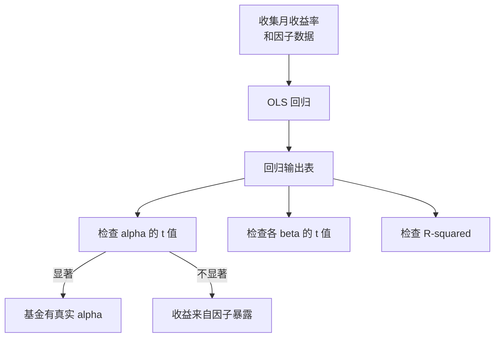

# Day 17：OLS 回归（简单 + 多元）

> **总时长：** 2 小时
>
> **节奏：** 每 50 分钟休息 10 分钟
>
> **今日目标：** 掌握 OLS 回归的直觉和公式——能手算简单回归的 $\hat{a}$、$\hat{b}$，能读懂 Fama-French 三因子回归输出表
>
> **本文是完整讲义，包含所有知识点，不需要翻阅其他资料**

---

## 时间表

```
00:00 - 00:50  第一节：简单线性回归——从散点图到 OLS 公式
00:50 - 01:00  休息
01:00 - 01:50  第二节：多元回归与 Fama-French 模型
01:50 - 02:00  休息 + 自测
```

---

## 第一节：简单线性回归（50 分钟）

### 一、从 Day 16 接续：假设检验给了我们什么，还缺什么

Day 16 解决了一个核心问题：**因子是否显著？** 你学会了用 t 检验判断 $p < 0.05$，用 BH 方法控制假发现率。

但 Day 16 没有回答另一个同样重要的问题：

- 因子和收益率的**关系是什么样的**？是正关系还是负关系？关系有多强？
- 具体来说：市场涨 1%，这只股票大概涨多少？

**回归分析就是量化这种关系的工具。**

你其实已经见过一个回归了——CAPM：

$$R_i - R_f = \alpha + \beta(R_m - R_f) + \varepsilon$$

这就是一个简单线性回归。$\beta$ 告诉你"市场涨 1% 时，股票大约涨 $\beta$%"；$\alpha$ 告诉你"控制市场因子后，股票有没有超额收益"。今天的目标就是学会怎么**估计** $\alpha$ 和 $\beta$，以及怎么**评价**估计得好不好。

---

### 二、简单线性回归

#### 2.1 直觉：散点图上画一条"最佳拟合线"

**简单线性回归 = 在散点图上画一条最能代表数据趋势的直线。**

**为什么要学：** 因子投资的第一步就是画出因子值和收益率的散点图，然后用一条线来概括它们的关系。CAPM 的 $\beta$ 就是这条线的斜率。

想象你有 5 个月的数据，横轴是市场超额收益，纵轴是某只股票的超额收益：

<svg width="480" height="280" viewBox="0 0 480 280" xmlns="http://www.w3.org/2000/svg">
  <!-- 背景 -->
  <rect width="480" height="280" fill="#fafafa" rx="8"/>
  <!-- 标题 -->
  <text x="240" y="24" text-anchor="middle" font-size="14" font-weight="bold" fill="#333">OLS 回归散点图</text>
  <!-- 坐标轴 -->
  <line x1="100" y1="220" x2="430" y2="220" stroke="#666" stroke-width="1.5"/>
  <line x1="100" y1="220" x2="100" y2="35" stroke="#666" stroke-width="1.5"/>
  <!-- 轴标签 -->
  <text x="260" y="265" text-anchor="middle" font-size="11" fill="#666">X（市场超额收益 %）</text>
  <text x="35" y="38" text-anchor="start" font-size="10" fill="#666">Y（股票</text>
  <text x="35" y="51" text-anchor="start" font-size="10" fill="#666">超额收益%）</text>
  <!-- X 轴刻度 -->
  <line x1="148" y1="220" x2="148" y2="224" stroke="#666"/>
  <text x="148" y="236" text-anchor="middle" font-size="10" fill="#666">-1</text>
  <line x1="196" y1="220" x2="196" y2="224" stroke="#666"/>
  <text x="196" y="236" text-anchor="middle" font-size="10" fill="#666">0</text>
  <line x1="244" y1="220" x2="244" y2="224" stroke="#666"/>
  <text x="244" y="236" text-anchor="middle" font-size="10" fill="#666">1</text>
  <line x1="292" y1="220" x2="292" y2="224" stroke="#666"/>
  <text x="292" y="236" text-anchor="middle" font-size="10" fill="#666">2</text>
  <line x1="340" y1="220" x2="340" y2="224" stroke="#666"/>
  <text x="340" y="236" text-anchor="middle" font-size="10" fill="#666">3</text>
  <line x1="388" y1="220" x2="388" y2="224" stroke="#666"/>
  <text x="388" y="236" text-anchor="middle" font-size="10" fill="#666">4</text>
  <!-- Y 轴刻度 -->
  <line x1="96" y1="195" x2="100" y2="195" stroke="#666"/>
  <text x="92" y="199" text-anchor="end" font-size="10" fill="#666">-1</text>
  <line x1="96" y1="170" x2="100" y2="170" stroke="#666"/>
  <text x="92" y="174" text-anchor="end" font-size="10" fill="#666">0</text>
  <line x1="96" y1="145" x2="100" y2="145" stroke="#666"/>
  <text x="92" y="149" text-anchor="end" font-size="10" fill="#666">1</text>
  <line x1="96" y1="120" x2="100" y2="120" stroke="#666"/>
  <text x="92" y="124" text-anchor="end" font-size="10" fill="#666">2</text>
  <line x1="96" y1="95" x2="100" y2="95" stroke="#666"/>
  <text x="92" y="99" text-anchor="end" font-size="10" fill="#666">3</text>
  <line x1="96" y1="70" x2="100" y2="70" stroke="#666"/>
  <text x="92" y="74" text-anchor="end" font-size="10" fill="#666">4</text>
  <line x1="96" y1="45" x2="100" y2="45" stroke="#666"/>
  <text x="92" y="49" text-anchor="end" font-size="10" fill="#666">5</text>
  <!-- 回归拟合线 Y ≈ 0.05 + 1.08X -->
  <line x1="122" y1="210" x2="405" y2="52" stroke="#4a90d9" stroke-width="2" stroke-dasharray="6,3"/>
  <!-- 散点数据 -->
  <circle cx="148" cy="195" r="5" fill="#e74c3c"/>
  <circle cx="244" cy="145" r="5" fill="#e74c3c"/>
  <circle cx="292" cy="95" r="5" fill="#e74c3c"/>
  <circle cx="340" cy="120" r="5" fill="#e74c3c"/>
  <circle cx="388" cy="45" r="5" fill="#e74c3c"/>
  <!-- 斜率标注 -->
  <text x="380" y="95" font-size="12" font-weight="bold" fill="#4a90d9">斜率 = β</text>
</svg>

**几何直觉：** OLS 要做的，就是找到一条直线 $Y = a + bX$，使得所有数据点到这条直线的**竖直距离的平方和**最小。不是垂直距离，是竖直距离——因为我们关心的是预测 Y 的误差。

#### 2.2 最小二乘法（OLS）

**OLS（Ordinary Least Squares，普通最小二乘法）= 最小化预测误差的平方和。**

**为什么要学：** OLS 是因子投资中最基本的估计方法。Fama-French 模型、CAPM、几乎所有因子回归都用 OLS。

**目标函数：**

$$\min_{a,b} \sum_{i=1}^{n}(Y_i - a - bX_i)^2$$

**翻译成人话：** 找到截距 $a$ 和斜率 $b$，使得所有数据点的实际值 $Y_i$ 和预测值 $(a + bX_i)$ 之间的误差平方加起来最小。

"最小二乘"中的"二乘"就是"平方"的意思——最小化平方和。

**为什么用平方而不是绝对值？** 两个原因：（1）平方可以求导，有漂亮的闭合解；（2）平方对大误差的惩罚更重，鼓励模型不要出现特别离谱的预测。

**闭合解（标量形式）：**

对目标函数分别对 $a$ 和 $b$ 求导、令导数为零，可以解出：

$$\hat{b} = \frac{\sum_{i=1}^{n}(X_i - \bar{X})(Y_i - \bar{Y})}{\sum_{i=1}^{n}(X_i - \bar{X})^2}$$

$$\hat{a} = \bar{Y} - \hat{b}\bar{X}$$

符号解释：

- $\hat{b}$ = 斜率的估计值（"帽子"表示估计值）
- $\hat{a}$ = 截距的估计值
- $\bar{X}$ = X 的样本均值，$\bar{Y}$ = Y 的样本均值
- $n$ = 数据点个数

**公式直觉：**

- $\hat{b}$ 的分子 = $\sum(X_i - \bar{X})(Y_i - \bar{Y})$，这就是 X 和 Y 的协方差方向（Day 15 的协方差概念）——X 偏大时 Y 也偏大，分子就是正的，斜率就是正的
- $\hat{b}$ 的分母 = $\sum(X_i - \bar{X})^2$，这是 X 的离散程度——X 越分散，估计越精确
- $\hat{a}$ = 回归线必须经过 $(\bar{X}, \bar{Y})$ 这个点，所以截距 = $\bar{Y} - \hat{b}\bar{X}$

用 Day 15 的术语来说：

$$\hat{b} = \frac{\text{Cov}(X, Y)}{\text{Var}(X)}$$

（这里的 Cov 和 Var 是样本版本，分母都是 $n-1$，但它们在分子分母中约掉了。）

> **需要记住的：** $\hat{b}$ 和 $\hat{a}$ 的公式。$\hat{b}$ = 协方差 / 方差，$\hat{a}$ = $\bar{Y} - \hat{b}\bar{X}$。

#### 2.3 矩阵形式

Day 12 §6.3 预告过 OLS 的矩阵公式，现在正式展开。

**矩阵形式的 OLS 解：**

$$\hat{\boldsymbol{b}} = (X'X)^{-1}X'Y$$

**翻译成人话：** 这个矩阵公式做的事和标量公式完全一样——找到使预测误差平方和最小的系数。只是写法更紧凑，而且能直接处理多个自变量。

**简单回归的矩阵形式展开：**

在简单回归中，X 矩阵的第一列全是 1（对应截距），第二列是自变量的值：

```
         [1  X₁]         [Y₁]
         [1  X₂]         [Y₂]
X 矩阵 = [1  X₃]   Y 向量 = [Y₃]   b 向量 = [a]
         [1  X₄]         [Y₄]            [b]
         [1  X₅]         [Y₅]

维度：X 是 5×2，Y 是 5×1，b 是 2×1
```

**维度检查：**

```
X':       2×5
X'X:      (2×5)(5×2) = 2×2
(X'X)^-1: 2×2
X'Y:      (2×5)(5×1) = 2×1
b:        (2×2)(2×1) = 2×1 ✓
```

最终得到一个 2×1 的向量 $[a, b]'$，正好是截距和斜率。

> **需要记住的：** 矩阵公式 $\hat{\boldsymbol{b}} = (X'X)^{-1}X'Y$。多元回归、Fama-French 三因子回归全部用这个公式，只是 X 矩阵变大了。这就是 Day 12 §6.3 的完整形式。

#### 2.4 残差

**残差 $\hat{e}_i$ = 实际值 - 预测值。**

$$\hat{e}_i = Y_i - \hat{Y}_i = Y_i - (\hat{a} + \hat{b}X_i)$$

**为什么要学：** 残差告诉你模型"没有解释的部分"。在因子投资中，残差 = 因子无法解释的收益部分，即个股特异风险（idiosyncratic risk）。

**两个关键性质：**

1. **残差之和 = 0：** $\sum_{i=1}^{n} \hat{e}_i = 0$
2. **残差与 X 不相关：** $\sum_{i=1}^{n} \hat{e}_i \cdot X_i = 0$

翻译成人话：OLS 保证模型"榨干"了 X 中的信息——剩下的残差和 X 没有任何系统性关联。

**因子投资含义：** 在 CAPM 中，$\varepsilon_i$ 就是残差，代表市场因子无法解释的收益。如果你构建一个足够分散的投资组合，个股的残差会相互抵消（Day 15 大数定律），只剩下因子暴露带来的收益。

> **理解即可。** 记住"残差 = 实际值 - 预测值"和"残差之和为零"。

#### 2.5 R²（拟合优度）

**$R^2$ = 模型解释了 Y 总变动的多大比例。**

$$R^2 = 1 - \frac{SS_{res}}{SS_{tot}}$$

其中：

- $SS_{res} = \sum_{i=1}^{n} \hat{e}_i^2 = \sum_{i=1}^{n}(Y_i - \hat{Y}_i)^2$ —— 残差平方和（模型没解释的部分）
- $SS_{tot} = \sum_{i=1}^{n}(Y_i - \bar{Y})^2$ —— 总平方和（Y 的总变动）

**翻译成人话：** 把 Y 的总变动想象成一块"蛋糕"，$R^2$ 告诉你模型"吃掉"了多大一块。$R^2 = 0.85$ 意味着模型解释了 85% 的变动，剩下 15% 是噪声。

**取值范围：** $0 \leq R^2 \leq 1$

| $R^2$ | 含义 |
|:---:|------|
| 0 | 模型什么都没解释，和直接用 $\bar{Y}$ 预测一样差 |
| 0.5 | 模型解释了一半的变动 |
| 1.0 | 完美拟合，所有点都在回归线上 |

**在因子投资中：**

| 模型 | 典型 $R^2$ | 含义 |
|------|:---:|------|
| CAPM（1 个因子） | 约 0.70 | 市场因子解释了约 70% 的收益率变动 |
| Fama-French 三因子 | 约 0.90 | 加入规模和价值因子后，解释力提升到 90% |

这说明加入更多有效因子确实能解释更多的收益率变动——这是 Fama-French 对 CAPM 的改进。

**简单回归中的额外联系：** 在只有一个自变量的简单回归中，$R^2 = r^2$，其中 $r$ 是 X 和 Y 的 Pearson 相关系数（Day 15）。相关性越强，$R^2$ 越高。

> **需要记住的：** $R^2 = 1 - SS_{res}/SS_{tot}$，范围 [0, 1]，越大说明模型解释力越强。

#### 2.6 手算例子：估计一只股票的 CAPM Beta

**场景：** 你有某只股票 5 个月的超额收益数据，和同期市场的超额收益数据。用 OLS 估计 CAPM 的 $\alpha$（截距）和 $\beta$（斜率）。

**数据：**

| 月份 | $X$（市场超额收益 %） | $Y$（股票超额收益 %） |
|:---:|:---:|:---:|
| 1 | 2 | 3 |
| 2 | -1 | -1 |
| 3 | 3 | 5 |
| 4 | 1 | 1 |
| 5 | 0 | 2 |

```
第 1 步：计算均值
  X̄ = (2 + (-1) + 3 + 1 + 0) / 5 = 5/5 = 1.0
  Ȳ = (3 + (-1) + 5 + 1 + 2) / 5 = 10/5 = 2.0

第 2 步：计算 b̂ 的分子（协方差方向）
  (X₁-X̄)(Y₁-Ȳ) = (2-1)(3-2) = (1)(1)   = 1
  (X₂-X̄)(Y₂-Ȳ) = (-1-1)(-1-2) = (-2)(-3) = 6
  (X₃-X̄)(Y₃-Ȳ) = (3-1)(5-2) = (2)(3)   = 6
  (X₄-X̄)(Y₄-Ȳ) = (1-1)(1-2) = (0)(-1)  = 0
  (X₅-X̄)(Y₅-Ȳ) = (0-1)(2-2) = (-1)(0)  = 0
  分子 = 1 + 6 + 6 + 0 + 0 = 13

第 3 步：计算 b̂ 的分母（X 的离散程度）
  (X₁-X̄)² = (1)²  = 1
  (X₂-X̄)² = (-2)² = 4
  (X₃-X̄)² = (2)²  = 4
  (X₄-X̄)² = (0)²  = 0
  (X₅-X̄)² = (-1)² = 1
  分母 = 1 + 4 + 4 + 0 + 1 = 10

第 4 步：计算 b̂（Beta）和 â（Alpha）
  b̂ = 13 / 10 = 1.3
  â = Ȳ - b̂ × X̄ = 2.0 - 1.3 × 1.0 = 0.7（%/月）

第 5 步：计算预测值和残差
  Ŷ₁ = 0.7 + 1.3×2  = 3.3   → e₁ = 3 - 3.3  = -0.3
  Ŷ₂ = 0.7 + 1.3×(-1) = -0.6  → e₂ = -1 - (-0.6) = -0.4
  Ŷ₃ = 0.7 + 1.3×3  = 4.6   → e₃ = 5 - 4.6  = 0.4
  Ŷ₄ = 0.7 + 1.3×1  = 2.0   → e₄ = 1 - 2.0  = -1.0
  Ŷ₅ = 0.7 + 1.3×0  = 0.7   → e₅ = 2 - 0.7  = 1.3

  验证残差之和：-0.3 + (-0.4) + 0.4 + (-1.0) + 1.3 = 0.0 ✓

第 6 步：计算 R²
  SS_res = (-0.3)² + (-0.4)² + (0.4)² + (-1.0)² + (1.3)²
         = 0.09 + 0.16 + 0.16 + 1.00 + 1.69 = 3.10

  SS_tot = (3-2)² + (-1-2)² + (5-2)² + (1-2)² + (2-2)²
         = 1 + 9 + 9 + 1 + 0 = 20

  R² = 1 - 3.10/20 = 1 - 0.155 = 0.845
```

**结论：**

- $\hat{\beta} = 1.3$ → 市场涨 1% 时，这只股票大约涨 1.3%。Beta > 1，属于高波动股票
- $\hat{\alpha} = 0.7\%$/月 → 控制市场因子后，每月有 0.7% 的超额收益（但 5 个月数据太少，还需要做 t 检验才能判断是否显著——这是第二节的内容）
- $R^2 = 0.845$ → 市场因子解释了这只股票 84.5% 的收益率变动

---

### 第一节完成检查

- [ ] 知道 OLS 的目标函数是最小化 $\sum(Y_i - a - bX_i)^2$
- [ ] 能手算 $\hat{b} = \frac{\sum(X_i - \bar{X})(Y_i - \bar{Y})}{\sum(X_i - \bar{X})^2}$ 和 $\hat{a} = \bar{Y} - \hat{b}\bar{X}$
- [ ] 知道矩阵公式 $\hat{\boldsymbol{b}} = (X'X)^{-1}X'Y$ 和标量公式做的是同一件事
- [ ] 能用自己的话解释 $R^2$ 的含义
- [ ] 知道残差 = 实际值 - 预测值，残差之和 = 0
- [ ] 能完成一个从数据到 $\hat{a}$、$\hat{b}$、$R^2$ 的完整手算

**休息 10 分钟。**

---

## 第二节：多元回归与 Fama-French 模型（50 分钟）

### 三、从简单回归到多元回归

#### 3.1 为什么需要多个自变量

**CAPM 只有一个因子（市场），解释力不够——$R^2$ 通常只有 0.70 左右。**

**为什么要学：** Fama 和 French（1993）发现，加入两个额外的因子（规模 SMB 和价值 HML）能把 $R^2$ 从 0.70 提高到 0.90。这就需要多元回归——同时处理多个自变量。

**多元回归模型：**

$$Y = a + b_1X_1 + b_2X_2 + \cdots + b_kX_k + \varepsilon$$

**Fama-French 三因子模型就是一个多元回归：**

$$R_i - R_f = \alpha + \beta_1 \cdot MKT + \beta_2 \cdot SMB + \beta_3 \cdot HML + \varepsilon$$

其中：

- $R_i - R_f$ = 股票（或基金）的超额收益（Y）
- $MKT = R_m - R_f$ = 市场超额收益（$X_1$）
- $SMB$ = 小盘股收益 - 大盘股收益（$X_2$）
- $HML$ = 价值股收益 - 成长股收益（$X_3$）
- $\alpha$ = 截距，控制三个因子后的超额收益
- $\beta_1, \beta_2, \beta_3$ = 对三个因子的暴露程度

#### 3.2 偏回归系数——"控制变量"的含义

**偏回归系数 $b_j$ = 在其他变量不变的情况下，$X_j$ 变动一个单位时 Y 的变动。**

这是多元回归和简单回归最关键的区别。简单回归的斜率不"控制"任何东西；多元回归的每个系数都是在"控制了其他所有变量之后"的效果。

**因子投资翻译：** $\alpha$ = 控制了所有已知因子之后的超额收益。这就是为什么**CAPM 的 alpha 和 FF3 的 alpha 不一样**——控制的因子不同。

看一个例子：某小盘价值型基金的回归结果。

| | CAPM | FF3 |
|---|---|---|
| $\alpha$（%/月） | 0.40 | 0.10 |
| $t_\alpha$ | 2.22 | 0.83 |
| $\alpha$ 显著？ | 是（$\lvert t \rvert > 1.96$） | 否（$\lvert t \rvert < 1.96$） |

**发生了什么？** CAPM 认为这只基金每月有 0.40% 的超额收益（显著）。但 FF3 加入 SMB 和 HML 后，发现这 0.40% 其实大部分来自于基金的小盘价值暴露——一旦控制了这些因子，"真正的"alpha 只剩 0.10%，不再显著。

翻译成人话：基金经理没有真正的选股能力（alpha 不显著）；他只是买了一堆小盘价值股，赚的是因子溢价，不是真正的 alpha。

> **需要记住的：** 偏回归系数 = "控制了其他变量后"的效果。CAPM alpha $\neq$ FF3 alpha，因为控制的因子不同。

#### 3.3 矩阵形式（正式版）

矩阵公式 $\hat{\boldsymbol{b}} = (X'X)^{-1}X'Y$ 在多元回归中同样适用，只是 X 矩阵变大了。

**Fama-French 三因子的矩阵展开：**

```
         [1  MKT₁  SMB₁  HML₁]         [R₁-Rf₁]
         [1  MKT₂  SMB₂  HML₂]         [R₂-Rf₂]
X 矩阵 = [1  MKT₃  SMB₃  HML₃]   Y 向量 = [R₃-Rf₃]
         [...  ...   ...   ... ]         [  ...  ]
         [1  MKTₙ  SMBₙ  HMLₙ]         [Rₙ-Rfₙ]

b 向量 = [α  ]
         [β₁ ]   ← 4 个待估计的系数
         [β₂ ]
         [β₃ ]
```

**维度检查（以 120 个月数据为例）：**

```
X:        120×4（120 个月 × 4 列：截距 + 3 个因子）
Y:        120×1
X':       4×120
X'X:      (4×120)(120×4) = 4×4
(X'X)^-1: 4×4
X'Y:      (4×120)(120×1) = 4×1
b:        (4×4)(4×1)     = 4×1 ✓
```

最终得到一个 4×1 的系数向量 $[\alpha, \beta_1, \beta_2, \beta_3]'$。

**连接 Day 12：** 这就是 Day 12 §6.3 OLS 求解的完整形式。Day 12 用 60 个月的 FF3 数据做了维度检查，这里用 120 个月，原理完全一样。

**什么时候 $(X'X)^{-1}$ 不存在？** Day 12 讲过，行列式为零时矩阵不可逆（Day 12 §3.3）。在回归中，这意味着**某个因子可以被其他因子线性表示**——比如你把 SMB 放了两遍。这叫完全多重共线性，Day 18 会详细讨论。

> **需要记住的：** 矩阵公式 $\hat{\boldsymbol{b}} = (X'X)^{-1}X'Y$ 适用于任意数量的自变量。X 矩阵的列数 = 截距 + 自变量个数，行数 = 样本量。

#### 3.4 调整 R²（Adjusted R²）

**问题：往回归中添加任何变量，$R^2$ 都会增加（或至少不减少），即使这个变量完全无用。**

这是 $R^2$ 的一个重大缺陷。如果你往 FF3 中随便加一个"今天是不是星期五"的虚拟变量，$R^2$ 也会微微上升。所以单看 $R^2$ 没法判断新加的变量是否真的有用。

**调整 R² 的公式：**

$$R^2_{adj} = 1 - \frac{(1-R^2)(n-1)}{n-k-1}$$

其中 $n$ = 样本量，$k$ = 自变量个数（不含截距）。

**翻译成人话：** Adjusted $R^2$ 对变量数量加了一个"惩罚"。如果新变量带来的 $R^2$ 提升不够大，惩罚会把 Adjusted $R^2$ 拉低。只有真正有用的变量，才能同时提高 $R^2$ 和 Adjusted $R^2$。

**实例对比（60 个月数据）：**

| 模型 | $k$ | $R^2$ | Adjusted $R^2$ | 说明 |
|------|:---:|:---:|:---:|------|
| CAPM | 1 | 0.700 | 0.695 | 基准 |
| FF3 | 3 | 0.780 | 0.768 | 两者都上升——SMB 和 HML 有用 |
| FF3 + 随机变量 | 4 | 0.782 | 0.766 | $R^2$ 微升，Adjusted $R^2$ 反而下降 |

```
验算 FF3 的 Adjusted R²：
  R²_adj = 1 - (1-0.78)(60-1)/(60-3-1)
         = 1 - 0.22 × 59/56
         = 1 - 0.22 × 1.054
         = 1 - 0.232
         = 0.768 ✓

验算 FF3+随机变量 的 Adjusted R²：
  R²_adj = 1 - (1-0.782)(60-1)/(60-4-1)
         = 1 - 0.218 × 59/55
         = 1 - 0.218 × 1.073
         = 1 - 0.234
         = 0.766 ✓

关键：R² 从 0.780 上升到 0.782，但 Adjusted R² 从 0.768 下降到 0.766。
随机变量被 Adjusted R² "识破"了。
```

> **理解即可。** 知道为什么用 Adjusted $R^2$ 而不是 $R^2$——防止无用变量"蹭"$R^2$。公式不需要记，知道思想就行。

#### 3.5 回归系数的 t 检验——Day 16 在回归中的应用

**这是 Day 16 假设检验在回归中的直接应用。** Day 16 你学会了用 t 统计量判断一个因子是否显著；现在把同样的方法用在回归系数上。

对每个回归系数 $b_j$，检验：

- $H_0: b_j = 0$（这个变量对 Y 没有影响）
- $H_1: b_j \neq 0$（这个变量对 Y 有影响）

**t 统计量：**

$$t = \frac{\hat{b}_j}{SE(\hat{b}_j)}$$

其中 $SE(\hat{b}_j)$ 是系数估计的标准误（由回归软件计算）。

**翻译成人话：和 Day 16 一模一样——t = 信号 / 噪声。** 系数的估计值是信号，标准误是噪声。$|t| > 1.96$ → 在 5% 水平上显著。

**因子投资翻译：**

- $t_\alpha > 1.96$ → 控制已知因子后，存在显著的超额收益
- $t_{\beta_{SMB}} > 1.96$ → 股票确实暴露于规模因子（不是偶然的）
- Harvey et al. (2016) 的更严格标准：$|t| > 3.0$（Day 16 §6.1）

**手算示例：**

```
给定 FF3 回归结果：
  β̂_SMB = 0.65，SE(β̂_SMB) = 0.10

t = 0.65 / 0.10 = 6.50
|t| = 6.50 > 1.96 → 显著 ✓

结论：这只股票对规模因子的暴露是显著的（t = 6.50，p < 0.001）。

再看 alpha：
  α̂ = 0.15%，SE(α̂) = 0.12%

t = 0.15 / 0.12 = 1.25
|t| = 1.25 < 1.96 → 不显著

结论：控制三个因子后，alpha 不显著（t = 1.25，p = 0.214）。
```

> **需要记住的：** 回归系数的 $t = \hat{b}_j / SE(\hat{b}_j)$，判断标准和 Day 16 完全一样——$|t| > 1.96$ 为显著。

#### 3.6 F 检验——模型整体是否有效

**F 检验回答的问题：所有斜率系数是不是同时为零？**

$$H_0: b_1 = b_2 = \cdots = b_k = 0 \quad \text{（所有因子都没用）}$$

**为什么需要 F 检验？** t 检验是逐个审查每个系数。但有可能每个系数单独看都不太显著（比如都在 $|t| = 1.8$ 左右），合在一起却有很强的解释力。F 检验就是这个"集体审查"。

**直觉：** 想象法庭审判——t 检验是逐一审问每个嫌疑人，F 检验是看这群人合在一起是否有犯罪行为。单个证据可能不够，但合在一起就构成了"超越合理怀疑"的证据。

**F 统计量的公式：**

$$F = \frac{R^2 / k}{(1 - R^2) / (n - k - 1)}$$

翻译成人话：F 值 = 模型解释的变动（每个变量平均）/ 模型没解释的变动（每个自由度平均）。F 值越大，说明模型整体越有效。

**实际操作：** Python 的回归输出会直接给出 F 值和对应的 p 值，不需要手算。如果 $p(F) < 0.05$，说明模型整体显著——至少有一个因子是有用的。

**t 检验 vs F 检验：**

| | t 检验 | F 检验 |
|---|---|---|
| 检验什么 | 单个系数 $b_j = 0$？ | 所有系数同时 $b_1 = b_2 = \cdots = 0$？ |
| 直觉 | 逐一审查 | 集体审查 |
| 数量 | 每个系数一个 t 值 | 整个模型一个 F 值 |

> **理解即可。** 知道 F 检验是"所有系数同时为零"的联合检验。实际中 Python 直接给出 F 值，不需要手算公式。

#### 3.7 完整案例：读懂 Fama-French 三因子回归输出

**场景：** 某大盘成长型基金，120 个月（10 年）数据，做 FF3 回归。

**回归输出表：**

```
═══════════════════════════════════════════════════════════════
                 Fama-French 三因子回归结果
───────────────────────────────────────────────────────────────
  变量      系数       标准误(SE)    t 值      p 值
───────────────────────────────────────────────────────────────
  alpha     0.15%/月    0.12%       1.25      0.214
  MKT       1.12        0.08       14.00     <0.001
  SMB      -0.35        0.10       -3.50     <0.001
  HML      -0.42        0.11       -3.82     <0.001
───────────────────────────────────────────────────────────────
  R² = 0.91    Adjusted R² = 0.908
  F = 380.5    p(F) < 0.001
  样本量 n = 120
═══════════════════════════════════════════════════════════════
```

**逐行解读：**

**alpha = 0.15%/月，t = 1.25，p = 0.214：**

$|t| = 1.25 < 1.96$ → alpha **不显著**。控制三个因子后，这只基金没有显著的超额收益。基金经理没有展现出真正的选股能力。

**MKT = 1.12，t = 14.00，p < 0.001：**

$\beta_1 = 1.12 > 1$ → 市场涨 1% 时，基金大约涨 1.12%。Beta 大于 1，比市场波动更大。$|t| = 14.00$，极其显著——这个暴露是确定的。

**SMB = -0.35，t = -3.50，p < 0.001：**

$\beta_2 = -0.35 < 0$ → 负的 SMB 暴露，说明基金**偏向大盘股**（与小盘溢价反向）。$|t| = 3.50$，显著。

**HML = -0.42，t = -3.82，p < 0.001：**

$\beta_3 = -0.42 < 0$ → 负的 HML 暴露，说明基金**偏向成长股**（与价值溢价反向）。$|t| = 3.82$，显著。

**R² = 0.91：** 三因子模型解释了基金 91% 的收益率变动。

**F = 380.5，p(F) < 0.001：** 模型整体极其显著——三个因子合在一起有很强的解释力。

**整体画像：** 这是一只大盘成长型基金（SMB < 0, HML < 0），没有真正的 alpha（$t_\alpha < 1.96$）。基金的收益几乎完全来自因子暴露，不是基金经理的选股能力。

**从数据到投资决策的流程：**



---

### 第二节完成检查

- [ ] 知道为什么需要多元回归（单因子不够，需要控制更多因子）
- [ ] 能解释偏回归系数的含义（"控制其他变量后"的效果）
- [ ] 知道为什么 CAPM alpha $\neq$ FF3 alpha
- [ ] 知道矩阵公式 $(X'X)^{-1}X'Y$ 在多元回归中同样适用，只是 X 矩阵变大了
- [ ] 知道为什么用 Adjusted $R^2$ 而不是 $R^2$
- [ ] 能用 $t = \hat{b}_j / SE(\hat{b}_j)$ 判断回归系数是否显著
- [ ] 能逐行读懂一个 FF3 回归输出表

---

## 收尾：自测（10 分钟）

**自测 1：** OLS 的目标函数是什么？"最小二乘"中的"二乘"指什么？

```
→ 你的答案：_______________
→ 正确：目标函数是 min Σ(Yi - a - bXi)²，
  即最小化预测误差的平方和。
  "二乘"就是"平方"——最小化平方和。
```

---

**自测 2：** $R^2 = 0.85$ 在因子模型中代表什么？

```
→ 你的答案：_______________
→ 正确：模型（因子）解释了收益率总变动的 85%。
  剩下 15% 是因子无法解释的部分（个股特异风险）。
```

---

**自测 3：** 偏回归系数和简单回归系数有什么区别？为什么 CAPM alpha $\neq$ FF3 alpha？

```
→ 你的答案：_______________
→ 正确：偏回归系数 = 控制了其他变量后的效果；
  简单回归系数不控制任何其他变量。
  CAPM alpha 只控制市场因子，FF3 alpha 还控制了 SMB 和 HML。
  如果一只股票的超额收益来自于小盘或价值暴露，
  CAPM 会把它算成 alpha，但 FF3 会把它归因到 SMB/HML，
  所以 FF3 的 alpha 通常更小。
```

---

**自测 4：** 为什么多元回归要用 Adjusted $R^2$ 而不是 $R^2$？

```
→ 你的答案：_______________
→ 正确：因为加入任何变量（哪怕完全无用）都会增加 R²。
  Adjusted R² 对变量数量加了惩罚——
  如果新变量带来的 R² 提升不够大，Adjusted R² 反而会下降。
  这样可以防止无用变量"蹭" R²。
```

---

**自测 5：** F 检验和 t 检验分别回答什么问题？

```
→ 你的答案：_______________
→ 正确：t 检验回答"单个系数是否为零"（逐一审查），
  F 检验回答"所有系数是否同时为零"（集体审查）。
  可能每个系数单独看不太显著，但合在一起有解释力——
  F 检验能捕捉到这种情况。
```

---

**自测 6：** 给 4 个数据点，手算 $\hat{b}$ 和 $\hat{a}$。

| $X$ | 1 | 3 | 5 | 7 |
|:---:|:---:|:---:|:---:|:---:|
| $Y$ | 2 | 5 | 6 | 11 |

```
→ 你的计算：_______________
→ 正确：
  X̄ = (1+3+5+7)/4 = 16/4 = 4
  Ȳ = (2+5+6+11)/4 = 24/4 = 6

  Σ(Xi-X̄)(Yi-Ȳ):
    (1-4)(2-6)  = (-3)(-4) = 12
    (3-4)(5-6)  = (-1)(-1) = 1
    (5-4)(6-6)  = (1)(0)   = 0
    (7-4)(11-6) = (3)(5)   = 15
    合计 = 12 + 1 + 0 + 15 = 28

  Σ(Xi-X̄)²:
    (-3)² + (-1)² + (1)² + (3)² = 9+1+1+9 = 20

  b̂ = 28/20 = 1.4
  â = 6 - 1.4×4 = 6 - 5.6 = 0.4
```

---

**自测 7：** 给 $\hat{b} = 0.65$ 和 $SE(\hat{b}) = 0.10$，算 t 值，判断在 $\alpha = 0.05$ 下是否显著。

```
→ 你的计算：_______________
→ 正确：
  t = 0.65 / 0.10 = 6.50
  |t| = 6.50 > 1.96 → 显著（p < 0.001）。
  这个系数在统计上显著不为零。
```

---

**自测 8：** 给 $SS_{res} = 15$，$SS_{tot} = 100$，算 $R^2$。

```
→ 你的计算：_______________
→ 正确：
  R² = 1 - SS_res / SS_tot = 1 - 15/100 = 1 - 0.15 = 0.85
  模型解释了 85% 的 Y 变动。
```

---

**自测 9：** 给 $R^2 = 0.85$，$n = 120$，$k = 3$，算 Adjusted $R^2$。

```
→ 你的计算：_______________
→ 正确：
  R²_adj = 1 - (1-R²)(n-1)/(n-k-1)
         = 1 - (1-0.85)(120-1)/(120-3-1)
         = 1 - 0.15 × 119/116
         = 1 - 0.15 × 1.026
         = 1 - 0.154
         = 0.846
  Adjusted R² = 0.846，比 R² = 0.85 略低——
  这是对 3 个自变量的惩罚。
```

---

**自测 10：** 读以下 FF3 回归输出表，回答：alpha 是否显著？哪些因子有显著暴露？

```
  变量      系数       SE       t 值      p 值
  alpha     0.35%/月   0.15%    2.33      0.021
  MKT       0.92       0.06    15.33     <0.001
  SMB       0.28       0.09     3.11      0.002
  HML       0.15       0.10     1.50      0.136
```

```
→ 你的答案：_______________
→ 正确：
  alpha：t = 2.33，|t| > 1.96，p = 0.021 < 0.05
    → 显著。控制三因子后，这只股票存在显著的超额收益（0.35%/月）。

  MKT：t = 15.33 → 极其显著。β < 1，比市场波动小（防守型）。
  SMB：t = 3.11 → 显著。β > 0，偏小盘股。
  HML：t = 1.50，|t| < 1.96，p = 0.136 > 0.05
    → 不显著。没有明显的价值/成长偏向。

  总结：这只股票有显著 alpha，暴露于市场和规模因子，
  但没有显著的价值因子暴露。
```

---

### 评分标准

| 得分 | 状态 |
|------|------|
| 9-10 题 | OLS 回归掌握扎实，明天可以直接学回归诊断 |
| 7-8 题 | 不错，回看错误的部分 |
| 5-6 题 | 需要重点复习手算流程和 FF3 输出解读 |
| < 5 题 | 建议重新阅读本讲义，特别是 §2.6 手算例子和 §3.7 输出解读 |

---

## 今天不需要记住的内容

| 内容 | 为什么不需要 |
|---|---|
| OLS 假设条件的数学细节（同方差、无自相关等） | Day 18 专门讲 |
| F 检验的公式推导 | 理解"联合检验"的思想即可，实际中 Python 直接给 F 值 |
| 矩阵形式的求解推导过程 | 记住结论 $\hat{\boldsymbol{b}} = (X'X)^{-1}X'Y$ 就够了 |
| 加权最小二乘（WLS）、广义最小二乘（GLS） | 超出本阶段范围，知道存在就行 |

---

## 明天预告

**Day 18：回归诊断——为什么金融数据需要特殊处理**

今天你学会了用 OLS 估计回归系数。但 OLS 有 4 个关键假设，金融数据**几乎都会违反**——直接用普通标准误，t 值可能严重失真。

明天你将学到：

- **Newey-West 标准误**——因子研究的标配，修正自相关和异方差带来的偏差
- **多重共线性**：如果因子之间高度相关会怎样？回归系数还能信吗？
- **遗漏变量偏误**：漏掉一个重要因子，其他系数会怎么变？

> 今天学的是"怎么做回归"，明天学的是"怎么做一个**靠谱的**回归"。没有 Day 18 的诊断工具，今天的回归结果可能是不可信的。
