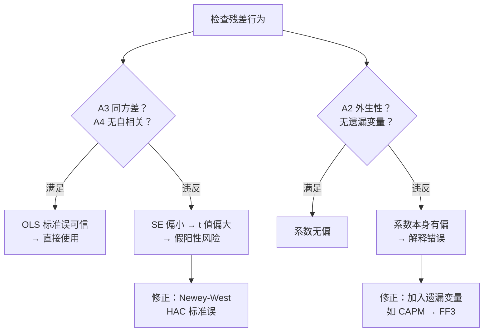
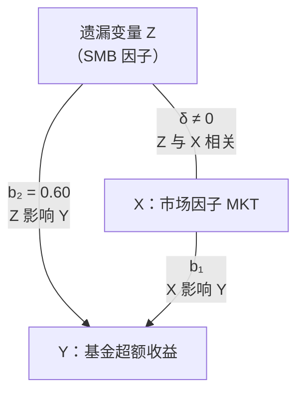

# Day 18：回归诊断——为什么金融数据需要特殊处理

> **总时长：** 2 小时
>
> **节奏：** 每 50 分钟休息 10 分钟
>
> **今日目标：** 理解 OLS 的 4 个关键假设，知道金融数据如何违反它们，掌握 3 个修正工具——Newey-West 标准误、多重共线性诊断、遗漏变量偏误分析
>
> **本文是完整讲义，包含所有知识点，不需要翻阅其他资料**

---

## 时间表

```
00:00 - 00:50  第一节：OLS 的 4 个假设与金融数据的违反
00:50 - 01:00  休息
01:00 - 01:50  第二节：修正工具——Newey-West、多重共线性、遗漏变量
01:50 - 02:00  休息 + 自测
```

---

## 第一节：OLS 的 4 个假设与金融数据的违反（50 分钟）

### 一、从 Day 17 接续：SE 可信吗？

Day 17 你学会了用 t 统计量判断因子是否显著：

$$t = \frac{\hat{b}_j}{SE(\hat{b}_j)}$$

$|t| > 1.96$ → 显著；$|t| < 1.96$ → 不显著。逻辑很清晰。

**但这个结论有一个隐藏的前提：$SE(\hat{b}_j)$ 本身必须是对的。**

$SE$ 的计算公式依赖一组关于残差 $\varepsilon$ 的假设。如果这些假设不成立，$SE$ 就是错的——可能偏大，也可能偏小。$SE$ 一错，$t$ 值就错；$t$ 值一错，"显著"与"不显著"的结论就不可信了。

Day 17 "今天不需要记住"中说过："OLS 假设条件的数学细节（同方差、无自相关等）→ Day 18 专门讲"。**现在就来了。**

---

### 二、OLS 的 4 个假设

#### 2.1 总览

OLS 的正确性依赖 4 个假设。先看全貌：

| 编号 | 假设 | 一句话翻译 | 金融数据通常满足吗？ |
|:---:|------|------|:---:|
| A1 | 线性关系 | $Y$ 和 $X$ 之间是直线关系 | 近似满足 |
| A2 | 外生性 | 没有遗漏重要变量 | **经常违反** |
| A3 | 同方差 | 残差的波动大小始终不变 | **几乎总是违反** |
| A4 | 无自相关 | 残差之间互不相关 | **经常违反** |

A1 通常没问题。A2、A3、A4 是金融数据中最常见的问题。今天的重点就是理解这三个假设为什么被违反，以及违反后会发生什么。

#### 2.2 A1 线性关系

**假设内容：$Y$ 和 $X$ 之间的真实关系是线性的。**

```
线性关系（A1 满足）：          非线性关系（A1 违反）：

  Y                              Y
  |          *                   |           *
  |        *                     |         *
  |      *                       |       *
  |    *                         |      *
  |  *                           |    *
  |*                             | *
  +----------→ X                 +----------→ X
  数据点围绕一条直线分布          数据点沿曲线分布
```

**因子投资中：** 因子收益率和个股收益率之间的关系通常近似线性——这是因为因子模型本身就是线性设计的（$R_i - R_f = \alpha + \beta \cdot MKT + \varepsilon$）。在标准因子分析中，A1 不是主要问题。

> **理解即可。** A1 在因子投资中通常近似满足。

#### 2.3 A2 外生性

**假设内容：** $E[\varepsilon|X] = 0$

**翻译成人话：残差和自变量无关——模型没有遗漏任何同时影响 $Y$ 并且与 $X$ 相关的变量。**

如果你漏掉了一个重要变量，这个变量的效果会"钻进"残差里。如果这个变量恰好又和 $X$ 相关，那残差就和 $X$ 产生了关联——A2 被违反。

**因子投资翻译：** 如果你用 CAPM（只有市场因子）去回归一只小盘价值股，SMB 和 HML 的效果就躲在残差里。而 SMB、HML 可能和 MKT 有微弱相关性——A2 被违反。Day 17 §3.2 的例子就展示了这个问题：CAPM alpha = 0.40%（显著），但加入 SMB 和 HML 后 alpha 降到 0.10%（不显著）。

**A2 的违反后果和 A3/A4 完全不同——第二节 §五会详细讨论。** 这里先记住一点：A2 违反 → 系数本身就错了（有偏），不只是 SE 的问题。

> **需要记住的：** A2 外生性 = 没有遗漏重要变量。违反 A2 → 系数有偏（最严重的后果）。

#### 2.4 A3 同方差（Homoscedasticity）

**假设内容：所有残差的方差相同。**（方差的概念回顾 Day 14。）

$$\text{Var}(\varepsilon_i) = \sigma^2 \quad \text{对所有 } i \text{ 成立}$$

**翻译成人话：** 模型预测误差的"波动幅度"始终不变——无论是牛市还是熊市，无论 $X$ 取什么值，残差的分散程度都一样大。

```
同方差（A3 满足）：               异方差（A3 违反）：

  Y                                Y
  |    *   *                       |         *
  |   * * *  *                     |       *   *
  | *  *  *   *                    |     * * *   *
  |  * * *  *                      |    * *  * *  *
  |   *  *                         |  ** **    *
  +----------→ X                   +----------→ X
  残差带宽始终一样                   残差带宽随 X 变大而变大
```

**金融数据为什么违反 A3？**

金融数据的波动率会随时间剧烈变化。2008 年金融危机期间，月收益率的波动可能是平时的 3-5 倍。这意味着危机时期的残差远大于平时——残差方差不恒定，A3 被违反。

**手算例子：5 个月数据的残差**

| 月份 | 残差 $\hat{e}_i$ | $\hat{e}_i^2$ | 时期 |
|:---:|:---:|:---:|------|
| 1 | 0.3 | 0.09 | 平静期 |
| 2 | -0.2 | 0.04 | 平静期 |
| 3 | 0.2 | 0.04 | 平静期 |
| 4 | 3.0 | 9.00 | 危机期 |
| 5 | -3.0 | 9.00 | 危机期 |

```
计算各时期的残差波动：

  平静期（月 1-3）：
    平均 e² = (0.09 + 0.04 + 0.04) / 3 = 0.17/3 ≈ 0.06

  危机期（月 4-5）：
    平均 e² = (9.00 + 9.00) / 2 = 18.0/2 = 9.0

  波动差异 = 9.0 / 0.06 = 150 倍！
```

**后果：OLS 系数无偏，但 SE 偏小。**

为什么 SE 偏小？OLS 的 SE 公式假设所有残差的方差一样大，用一个统一的 $\hat{\sigma}^2$ 来估计。当实际存在异方差时，这个统一估计被危机期的大残差拉大，被平静期的小残差拉小，最终取了一个"不上不下"的折中——对高波动期太小了，对低波动期太大了。总体效果是 SE 往往偏小。

SE 偏小 → $t$ 值偏大（$t = \hat{b}/SE$，分母小了）→ 更容易拒绝 $H_0$ → **假阳性风险增加**。

> **需要记住的：** 金融数据几乎都有异方差（波动率随时间变化）。后果：系数无偏，但 SE 偏小 → t 值偏大 → 假阳性。

#### 2.5 A4 无自相关（No Autocorrelation）

**假设内容：残差之间互不相关。**

$$\text{Cov}(\varepsilon_i, \varepsilon_j) = 0 \quad \text{对所有 } i \neq j$$

**翻译成人话：** 这个月的残差不应该影响下个月的残差。如果这个月模型"猜错了"（残差为正），下个月的残差应该和这次"猜错"没有关系。

```
无自相关（A4 满足）：             有自相关（A4 违反）：

  e                                e
  |  *        *                    |  * *
  |    *   *     *                 |      * *
  0----+----+----+----→ t          0----+----+----+----→ t
  |      *     *                   |          * *
  |  *                             |              * *
  残差随机跳动                       残差"成串"出现——
                                    连续几个月为正，然后连续为负
```

**金融数据为什么违反 A4？**

因子收益率有**短期持续性**。动量效应就是典型例子：过去涨的股票短期内倾向继续涨。这意味着因子收益率中有自相关结构，残差也可能呈现"成串"模式——连续几个月偏高，然后连续几个月偏低。

**后果与 A3 相同：OLS 系数无偏，但 SE 偏小。**

自相关导致 SE 偏小的直觉：如果残差"成串"出现，有效信息量比你以为的少。你以为有 120 个独立的月度观测，但因为自相关，实际独立信息可能只相当于 80 个月。SE 公式用了 $n = 120$，高估了精度 → SE 偏小。

> **需要记住的：** 金融因子收益率有短期持续性 → 残差自相关。后果同 A3：系数无偏，SE 偏小 → 假阳性。

#### 2.6 总结：4 种违反的后果

| 假设被违反 | 系数 $\hat{b}$ | $SE(\hat{b})$ | $t$ 值 | 严重性 |
|:---:|:---:|:---:|:---:|------|
| A1 线性 | 有偏 | 不可靠 | 不可靠 | 因子投资中少见 |
| A2 外生性 | **有偏** | 不可靠 | **不可靠** | **最严重** |
| A3 同方差 | 无偏 | **偏小** | **偏大** | 常见 |
| A4 无自相关 | 无偏 | **偏小** | **偏大** | 常见 |

**关键洞察：A3/A4 违反和 A2 违反的后果完全不同。**

- **A3/A4 违反** → 系数还是对的（无偏），只是 SE 错了 → 修正 SE 就行（第二节 §三的 Newey-West）
- **A2 违反** → 系数本身就错了（有偏）→ 修正 SE 没用，必须加入遗漏变量（第二节 §五）



---

### 第一节完成检查

- [ ] 知道 OLS 有 4 个关键假设（A1 线性、A2 外生性、A3 同方差、A4 无自相关）
- [ ] 能区分 A3/A4 违反和 A2 违反的后果（前者 SE 错，后者系数错）
- [ ] 知道金融数据为什么违反 A3（波动率随时间变化）和 A4（因子收益有短期持续性）
- [ ] 能用"SE 偏小 → t 值偏大 → 假阳性"这条逻辑链解释为什么需要修正
- [ ] 知道 A2 违反是最严重的——修正 SE 没用，必须加入遗漏变量
- [ ] 能说出 Day 17 §3.2 的 CAPM vs FF3 alpha 差异就是 A2 违反的例子

**休息 10 分钟。**

---

## 第二节：修正工具——Newey-West、多重共线性、遗漏变量（50 分钟）

### 三、Newey-West 标准误

#### 3.1 问题回顾

第一节讲了：A3（异方差）和 A4（自相关）违反后，OLS 的 SE 偏小，$t$ 值偏大。系数本身没问题，但我们对系数的"信心"被高估了。

**解决方案：不改系数，只修正 SE。** 用更准确的方法估计 SE，让 $t$ 值回到正确水平。

#### 3.2 White Robust SE——修正异方差

**White（1980）的思路：** 既然假设"方差恒定"不对，那就不假设了——直接用每个残差的实际大小来估计 SE。

**直觉：** OLS 标准 SE 假设所有残差穿同一尺码的鞋（$\sigma^2$ 恒定）。White robust SE 让每个残差穿自己的鞋——用 $\hat{e}_i^2$ 代替统一的 $\hat{\sigma}^2$。

White robust SE **只修正异方差**。如果数据还有自相关，White SE 仍然不够——需要更强的工具。

> **理解即可。** White SE 是过渡概念，实际中直接用 Newey-West。

#### 3.3 Newey-West = HAC（异方差 + 自相关同时修正）

**Newey 和 West（1987）在 White 的基础上更进一步：同时修正异方差和自相关。**

**HAC = Heteroscedasticity and Autocorrelation Consistent**（异方差和自相关一致）。

**概念公式**（基于 Day 12 §6.3 的矩阵形式 OLS）**：**

$$\text{Var}_{NW}(\hat{\boldsymbol{b}}) = (X'X)^{-1}\hat{S}(X'X)^{-1}$$

这叫"三明治估计量"——$(X'X)^{-1}$ 是两片面包，$\hat{S}$ 是中间的馅。

**和 OLS 标准公式的对比：**

| | OLS 标准 SE | Newey-West SE |
|---|---|---|
| 方差估计 | $\hat{\sigma}^2(X'X)^{-1}$ | $(X'X)^{-1}\hat{S}(X'X)^{-1}$ |
| 假设 | 残差同方差、无自相关 | 无假设 |
| 中间的 $\hat{S}$ | 简化为 $\hat{\sigma}^2 \cdot X'X$ | 用残差的实际行为估计 |

**关键区别：** OLS 标准 SE 用一个数 $\hat{\sigma}^2$ 概括所有残差的波动；NW SE 用矩阵 $\hat{S}$ 保留了残差的异方差结构和自相关结构。

**滞后参数 $L$（lag）：**

NW 需要指定"考虑多少期的自相关"。用月频数据时，常用 $L = 3 \sim 6$。$L$ 太小可能没修干净，$L$ 太大会损失精度。经验法则：$L \approx n^{1/3}$（$n = 120$ 时 $L \approx 5$）。

> **需要记住的：** Newey-West = HAC = 同时修正异方差和自相关。三明治结构。月频数据 $L$ 常用 3-6。NW 是因子研究的标配。

#### 3.4 手算对比：OLS SE vs Newey-West SE

**场景：** 复用 Day 17 §3.7 的大盘成长型基金 FF3 回归，补充 NW SE 列。系数不变——NW 只修正 SE。Day 17 §3.5 用 $t = \hat{b}_j / SE(\hat{b}_j)$ 判断显著性（Day 16 §2 的 t 检验），现在看看换成 NW SE 后结论会不会变。

```
═══════════════════════════════════════════════════════════════════════════
              Fama-French 三因子回归：OLS SE vs Newey-West SE
───────────────────────────────────────────────────────────────────────────
  变量      系数      OLS SE    OLS t    NW SE    NW t     结论变化？
───────────────────────────────────────────────────────────────────────────
  alpha    0.15%/月   0.12%     1.25     0.16%    0.94     不变（均不显著）
  MKT      1.12       0.08     14.00     0.11    10.18     不变（均显著）
  SMB     -0.35       0.10     -3.50     0.14    -2.50     不变（均显著）
  HML     -0.42       0.11     -3.82     0.22    -1.91     ⚠️ 翻转！
───────────────────────────────────────────────────────────────────────────
  NW 滞后参数 L = 4
═══════════════════════════════════════════════════════════════════════════
```

```
验算 NW t 值：
  alpha NW t = 0.15 / 0.16 = 0.94          |t| < 1.96 → 不显著
  MKT   NW t = 1.12 / 0.11 = 10.18         |t| > 1.96 → 显著
  SMB   NW t = -0.35 / 0.14 = -2.50        |t| > 1.96 → 显著
  HML   NW t = -0.42 / 0.22 = -1.91        |t| < 1.96 → 不显著 ⚠️

关键发现：HML 的显著性翻转了！
  OLS：|t| = 3.82 > 1.96 → "显著"
  NW：|t| = 1.91 < 1.96 → "不显著"

NW SE 比 OLS SE 大多少？
  alpha：0.16/0.12 = 1.33倍
  MKT：  0.11/0.08 = 1.38倍
  SMB：  0.14/0.10 = 1.40倍
  HML：  0.22/0.11 = 2.00倍 ← 最大膨胀

HML 的 NW SE 是 OLS SE 的 2 倍——说明 HML 因子收益的
自相关/异方差最严重。用了 NW 之后，我们对 HML 暴露
的"信心"大打折扣。
```

**教训：** 如果用 OLS 标准 SE，你会说"HML 暴露显著（t = -3.82）"。但用 NW SE 后，你会说"HML 暴露不显著（t = -1.91）"。**结论完全相反。** 这就是为什么 NW 是因子研究的标配——不用 NW，你可能会相信一个假的结论。

> **需要记住的：** NW SE ≥ OLS SE（永远不会更小）。NW SE 更大 → t 值更小 → 更难拒绝 $H_0$ → 更保守。边界案例可能翻转显著性结论。

#### 3.5 实践中怎么用

Python 中使用 NW SE 只需一个参数：

```python
# statsmodels
import statsmodels.api as sm
model = sm.OLS(Y, X).fit(cov_type='HAC', cov_kwds={'maxlags': 4})
```

`cov_type='HAC'` 就是 Newey-West。`maxlags` 是滞后参数 $L$。

> **理解即可。** 知道在 Python 中加 `cov_type='HAC'` 就行。

#### 3.6 什么时候可以不用 NW

NW 主要针对**时间序列回归**——数据按时间排列，有先后顺序。

如果是**横截面回归**（同一时间点，多只股票），数据没有时间顺序，通常不存在自相关问题——这时用 White robust SE 就够了（只修正异方差）。

Day 19 会讲 Fama-MacBeth 回归，它每个月做一次横截面回归——那时候每个横截面内部不需要 NW。

---

### 四、多重共线性

#### 4.1 定义：因子之间太像了

**多重共线性 = 自变量之间高度相关，回归无法区分各自变量的独立贡献。**

**为什么要学：** 如果你在因子模型中放了两个很相似的因子（比如 HML 和另一个价值因子），回归会"迷糊"——不知道收益率是被哪个因子解释的。

**连接 Day 12 §3.3：** OLS 公式 $\hat{\boldsymbol{b}} = (X'X)^{-1}X'Y$ 需要 $(X'X)^{-1}$ 存在。Day 12 讲过，行列式为零时矩阵不可逆（$\det = 0$）。在回归中，如果某个因子可以被其他因子完全线性表示（如 $X_3 = 2X_1 + X_2$），$(X'X)$ 的行列式就是零——这叫**完全共线性**，回归直接无法运行。

实际中完全共线性很少见（因子不会完美线性相关）。更常见的是**高度共线性**——因子之间相关性很高但不完美，比如 $\rho = 0.90$。回归能运行，但结果很不可靠。

**连接 Day 15 §2：** 因子之间的相关系数 $\rho$（Day 15 学的 Pearson 相关系数）越接近 $\pm 1$，共线性越严重。

#### 4.2 后果

| 后果 | 说明 |
|------|------|
| 系数不稳定 | 增减一个数据点，系数可能大幅变化 |
| SE 膨胀 | 标准误变得很大，t 值暴跌 |
| 符号翻转 | 系数可能出现与经济直觉相反的符号 |
| $R^2$ 不受影响 | 模型整体解释力没问题，但各因子的"功劳"分不清 |

**直觉：** 想象你和同事做了同一份报告。老板知道报告质量很高（$R^2$ 高），但分不清谁的贡献更大（各因子的系数和 t 值不可靠）。

#### 4.3 手算对比：FF3 vs FF3 + 冗余因子

**场景：** 在 Day 17 §3.7 的 FF3 回归基础上，加入一个与 HML 高度相关（$\rho = 0.95$）的冗余因子 VALUE2。

```
═══════════════════════════════════════════════════════════════
              FF3 回归 vs FF3 + 冗余因子回归
───────────────────────────────────────────────────────────────
                  FF3（原始）          FF3 + VALUE2
  变量      系数     SE     t       系数     SE     t
───────────────────────────────────────────────────────────────
  alpha    0.15%   0.12%   1.25    0.14%   0.12%   1.17
  MKT      1.12    0.08   14.00    1.11    0.08   13.88
  SMB     -0.35    0.10   -3.50   -0.34    0.10   -3.40
  HML     -0.42    0.11   -3.82   -0.15    0.28   -0.54  ⚠️
  VALUE2    —       —       —     -0.28    0.27   -1.04  ⚠️
───────────────────────────────────────────────────────────────
  R²       0.91                    0.912
═══════════════════════════════════════════════════════════════
```

**发生了什么？**

1. **HML 的 t 值从 -3.82 暴跌到 -0.54**——从高度显著变成完全不显著
2. HML 系数从 -0.42 变成 -0.15，VALUE2 系数为 -0.28。注意：$-0.15 + (-0.28) = -0.43 \approx -0.42$——**总效果几乎没变**，但被拆散到两个因子上了
3. VALUE2 自己也不显著（t = -1.04）
4. **$R^2$ 几乎没变**（0.91 → 0.912）——模型整体解释力不受影响

**教训：** 共线性不影响模型整体，但让你无法判断哪个因子重要。解决方法：别放太相似的因子。

#### 4.4 VIF：量化共线性的指标

**VIF（Variance Inflation Factor，方差膨胀因子）= 衡量某个自变量受其他自变量影响的程度。**

**公式：**

$$VIF_j = \frac{1}{1 - R_j^2}$$

其中 $R_j^2$ 是用所有其他自变量回归 $X_j$ 得到的 $R^2$。

**直觉：** 如果 $X_j$ 能被其他变量很好地"解释"（$R_j^2$ 接近 1），那 $X_j$ 的独立信息很少 → VIF 很大 → SE 膨胀严重。

**判断标准：**

| VIF 范围 | 判断 | 行动 |
|:---:|------|------|
| 1 - 5 | 正常 | 无需处理 |
| 5 - 10 | 中度共线性 | 关注，考虑是否需要处理 |
| > 10 | 严重共线性 | 必须处理 |

**手算例子：**

当只有两个自变量 $X_1$ 和 $X_2$ 时，$R_j^2 = \rho^2$（$\rho$ 是两者的相关系数），所以：

$$VIF = \frac{1}{1 - \rho^2}$$

```
给定 ρ = 0.92（如 HML 和 VALUE2 的相关系数）：

  R²_j = ρ² = 0.92² = 0.8464
  VIF = 1 / (1 - 0.8464) = 1 / 0.1536 = 6.5

  VIF = 6.5 → 中度共线性（5-10 范围），需要关注。
  SE 被膨胀为无共线性时的 √6.5 ≈ 2.55 倍。
```

> **需要记住的：** $VIF_j = 1/(1-R_j^2)$。VIF > 5 需要关注，> 10 严重。VIF 告诉你 SE 被膨胀了多少（$\sqrt{VIF}$ 倍）。

#### 4.5 处理方法

| 方法 | 思路 | 适用场景 |
|------|------|------|
| 删除冗余因子 | 直接去掉相关性最高的因子 | 最简单，首选 |
| 正交化 | 用残差替代原始因子（先回归去除共线部分） | 需要保留两个因子时 |
| PCA 降维 | 用主成分替代原始因子（Day 13 特征值分解的应用） | 因子很多时 |

**因子投资实践：** 标准因子模型（FF3、FF5）的因子已经被设计成低相关性。共线性问题通常出现在自己添加新因子时——添加前先检查新因子和已有因子的相关性。

---

### 五、遗漏变量偏误（OVB）

#### 5.1 定义

**遗漏变量偏误 = 漏掉了一个既影响 $Y$ 又与 $X$ 相关的变量，导致系数估计有偏。**

注意"两个条件同时满足"：

1. 遗漏变量 $Z$ 影响 $Y$（$b_2 \neq 0$）
2. 遗漏变量 $Z$ 与已有自变量 $X$ 相关（$\delta \neq 0$）

如果只满足其中一个，不会产生偏误：
- $Z$ 影响 $Y$ 但与 $X$ 无关 → 遗漏 $Z$ 只会增加残差方差，不会偏误 $\hat{b}_1$
- $Z$ 与 $X$ 相关但不影响 $Y$ → 遗漏 $Z$ 无所谓，反正它没用

#### 5.2 偏误方向公式

**真实模型：** $Y = a + b_1 X + b_2 Z + \varepsilon$

**短模型（遗漏 $Z$）：** $Y = a_{short} + b_{1,short} X + e$

$$\hat{b}_{1,short} = b_1 + b_2 \cdot \delta$$

其中 $\delta$ 是"辅助回归" $Z = c + \delta X + u$ 的斜率——衡量 $Z$ 和 $X$ 的相关方向。

**偏误 = $b_2 \cdot \delta$**

| $b_2$（$Z$ 对 $Y$ 的效果） | $\delta$（$Z$ 与 $X$ 的关系） | 偏误方向 |
|:---:|:---:|:---:|
| $+$ | $+$ | 正偏（高估 $b_1$） |
| $+$ | $-$ | 负偏（低估 $b_1$） |
| $-$ | $+$ | 负偏（低估 $b_1$） |
| $-$ | $-$ | 正偏（高估 $b_1$） |

**翻译成人话：** 偏误方向 = $b_2$ 和 $\delta$ 的乘积的符号。

#### 5.3 手算例子：CAPM 遗漏 SMB 导致 alpha 膨胀

**场景：** 呼应 Day 17 §3.2 的小盘价值型基金。

**真实模型（FF3）：**

$$R_i - R_f = 0.10\% + \beta_1 \cdot MKT + 0.60 \cdot SMB + \varepsilon$$

（为简化，只关注 SMB 的遗漏效果。）

**短模型（CAPM，遗漏 SMB）：**

$$R_i - R_f = \alpha_{CAPM} + \beta_1 \cdot MKT + e$$

```
OVB 计算：

  α̂_CAPM ≈ α̂_FF3 + β̂_SMB × mean(SMB)

  已知：
    α̂_FF3 = 0.10%/月（真实 alpha）
    β̂_SMB = 0.60（该基金对小盘因子的暴露）
    mean(SMB) = 0.50%/月（SMB 因子的历史平均收益）

  α̂_CAPM ≈ 0.10% + 0.60 × 0.50%
          = 0.10% + 0.30%
          = 0.40%

  偏误 = 0.30%/月
```

**解释：** 这只基金本身的真实 alpha 只有 0.10%/月（不显著，$t = 0.83$）。但因为它重仓小盘股（$\beta_{SMB} = 0.60$），而 SMB 因子平均每月赚 0.50%，CAPM 把这部分因子收益误算成了 alpha → alpha 从 0.10% 膨胀到 0.40%（显著，$t = 2.22$）。

**这就是 Day 17 §3.2 那个例子的数学解释。** 基金经理并没有选股能力——膨胀的 alpha 完全来自遗漏变量偏误。

#### 5.4 因果图



**两个条件都满足：**

1. SMB 影响基金收益（$b_2 = 0.60 \neq 0$）——基金重仓小盘股
2. SMB 与 MKT 有微弱相关性（$\delta \neq 0$）——小盘股在市场下跌时可能跌得更多

所以遗漏 SMB 会导致 CAPM 的系数估计有偏——不仅 alpha 膨胀，$\beta_{MKT}$ 也可能有偏。

#### 5.5 因子模型演化史 = 逐步修正 OVB

因子模型的历史，就是一部不断修正遗漏变量偏误的历史：

| 年份 | 模型 | 因子 | 修正了什么 OVB |
|------|------|------|------|
| 1964 | CAPM | MKT | 起点，没有考虑其他因子 |
| 1993 | Fama-French 三因子 | MKT + SMB + HML | 发现 CAPM 遗漏了规模和价值因子 |
| 2015 | Fama-French 五因子 | + RMW + CMA | 发现 FF3 遗漏了盈利能力和投资风格因子 |

- **RMW**（Robust Minus Weak）：高盈利公司 - 低盈利公司的收益差
- **CMA**（Conservative Minus Aggressive）：保守投资 - 激进投资的收益差

每次"升级"因子模型，本质上都是在说："之前的 alpha 可能是假的——换个更完整的模型试试"。

> **需要记住的：** 因子模型从 CAPM → FF3 → FF5 的演化，本质是逐步修正遗漏变量偏误。漏掉的因子越少，alpha 的估计越准。

---

### 第二节完成检查

- [ ] 知道 Newey-West = HAC = 同时修正异方差和自相关
- [ ] 知道 NW SE ≥ OLS SE → t 值更小 → 更保守，边界案例可能翻转结论
- [ ] 知道多重共线性 = 因子太相似，导致系数不稳定、SE 膨胀，但 $R^2$ 不受影响
- [ ] 能用 $VIF = 1/(1-R_j^2)$ 判断共线性严重程度（> 5 关注，> 10 严重）
- [ ] 知道遗漏变量偏误需要两个条件同时满足：$Z$ 影响 $Y$ 且 $Z$ 与 $X$ 相关
- [ ] 能用 Day 17 §3.2 的 CAPM vs FF3 例子解释 OVB 如何让 alpha 膨胀

---

## 收尾：自测（10 分钟）

**自测 1：** A3/A4 假设违反和 A2 假设违反的后果有什么关键区别？

```
→ 你的答案：_______________
→ 正确：
  A3/A4 违反 → 系数无偏，但 SE 偏小 → t 值偏大 → 假阳性。
  修正方法：用 Newey-West SE 替代 OLS SE。

  A2 违反 → 系数本身有偏 → 修正 SE 没用。
  修正方法：加入遗漏变量（如从 CAPM 升级到 FF3）。

  关键区别：A3/A4 只需要修正 SE，A2 需要改模型。
```

---

**自测 2：** Newey-West 标准误修正的是什么？为什么它叫"HAC"？

```
→ 你的答案：_______________
→ 正确：
  NW 同时修正异方差（Heteroscedasticity）和
  自相关（Autocorrelation），所以叫 HAC
  （Heteroscedasticity and Autocorrelation Consistent）。
  它不改变系数，只修正 SE，让 t 值更准确。
```

---

**自测 3：** 多重共线性对 $R^2$ 和个别因子的 $t$ 值分别有什么影响？

```
→ 你的答案：_______________
→ 正确：
  R² 几乎不受影响——模型整体解释力没问题。
  但个别因子的 t 值会暴跌——因为 SE 被膨胀了，
  回归无法区分各因子的独立贡献。
  总结："整体没问题，但功劳分不清"。
```

---

**自测 4：** 遗漏变量偏误的方向由什么决定？给定 $b_2 > 0$、$\delta < 0$，偏误方向是什么？

```
→ 你的答案：_______________
→ 正确：
  偏误方向 = sign(b₂ × δ)。
  b₂ > 0，δ < 0 → b₂ × δ < 0 → 负偏（低估 b₁）。
  公式：b̂₁_short = b₁ + b₂ × δ，
  因为 b₂ × δ < 0，所以 b̂₁_short < b₁。
```

---

**自测 5：** 从因子模型的演化角度，CAPM → FF3 → FF5 本质上在做什么？

```
→ 你的答案：_______________
→ 正确：
  本质上是逐步修正遗漏变量偏误（OVB）。
  CAPM 只有市场因子，遗漏了规模和价值 → FF3 加入 SMB 和 HML。
  FF3 遗漏了盈利能力和投资风格 → FF5 加入 RMW 和 CMA。
  每次升级都让 alpha 估计更准确——
  之前"显著的 alpha"可能只是遗漏因子带来的假象。
```

---

**自测 6（计算）：** 两个因子的相关系数 $\rho = 0.85$，计算 VIF。是否需要担心共线性？

```
→ 你的计算：_______________
→ 正确：
  R²_j = ρ² = 0.85² = 0.7225
  VIF = 1 / (1 - 0.7225) = 1 / 0.2775 = 3.60

  VIF = 3.60 < 5 → 正常范围，不需要担心。
```

---

**自测 7（计算）：** 如果相关系数提高到 $\rho = 0.95$，VIF 变成多少？和 $\rho = 0.85$ 时相比，SE 膨胀了多少倍？

```
→ 你的计算：_______________
→ 正确：
  ρ = 0.95：
  R²_j = 0.95² = 0.9025
  VIF = 1 / (1 - 0.9025) = 1 / 0.0975 = 10.26

  VIF = 10.26 > 10 → 严重共线性！

  SE 膨胀倍数对比：
  ρ = 0.85：SE 膨胀 √3.60 = 1.90 倍
  ρ = 0.95：SE 膨胀 √10.26 = 3.20 倍

  相关系数只从 0.85 升到 0.95（增加 12%），
  但 VIF 从 3.6 飙升到 10.3（增加 186%）——
  共线性的危害是非线性增长的。
```

---

**自测 8（计算）：** 给定 $\hat{b} = 0.25$，OLS SE = 0.12，NW SE = 0.15。分别计算 t 值，判断显著性是否翻转。

```
→ 你的计算：_______________
→ 正确：
  OLS t = 0.25 / 0.12 = 2.08
  |t| = 2.08 > 1.96 → 显著

  NW t = 0.25 / 0.15 = 1.67
  |t| = 1.67 < 1.96 → 不显著

  结论翻转！OLS 说显著，NW 说不显著。
  应该以 NW 结论为准——OLS 高估了确信度。
```

---

**自测 9（计算）：** 真实模型 $Y = 0.05\% + b_1 \cdot MKT + 0.80 \cdot SMB + \varepsilon$。如果遗漏 SMB，已知 $\overline{SMB} = 0.40\%$/月，CAPM 的 alpha 大约是多少？偏误是多少？

```
→ 你的计算：_______________
→ 正确：
  α̂_CAPM ≈ α̂_FF3 + β̂_SMB × mean(SMB)
          = 0.05% + 0.80 × 0.40%
          = 0.05% + 0.32%
          = 0.37%

  偏误 = 0.32%/月

  真实 alpha 只有 0.05%（几乎为零），
  但 CAPM 会报告 0.37% 的 alpha——
  是真实值的 7.4 倍。完全是 OVB 造成的假象。
```

---

**自测 10（读表）：** 以下回归同时给出 OLS 和 NW 结果，哪些因子的显著性结论发生了变化？

```
  变量      系数      OLS SE    OLS t    NW SE    NW t
  alpha    0.30%/月   0.14%     2.14     0.18%    1.67
  MKT      0.95       0.07     13.57     0.09    10.56
  SMB      0.40       0.12      3.33     0.15     2.67
  HML      0.22       0.10      2.20     0.14     1.57
```

```
→ 你的答案：_______________
→ 正确：
  验算 NW t 值：
    alpha：0.30/0.18 = 1.67 ✓
    MKT：0.95/0.09 = 10.56 ✓
    SMB：0.40/0.15 = 2.67 ✓
    HML：0.22/0.14 = 1.57 ✓

  显著性判断（|t| > 1.96 ?）：
    alpha：OLS |t|=2.14 显著 → NW |t|=1.67 不显著 ⚠️ 翻转
    MKT：  OLS 显著 → NW 显著（不变）
    SMB：  OLS 显著 → NW 显著（不变）
    HML：  OLS |t|=2.20 显著 → NW |t|=1.57 不显著 ⚠️ 翻转

  两个翻转：alpha 和 HML。
  用 NW 后，alpha 不再显著 → 基金没有真实超额收益。
  HML 不再显著 → 价值因子暴露不确定。
  MKT 和 SMB 仍然显著 → 这两个暴露是确定的。
```

---

### 评分标准

| 得分 | 状态 |
|------|------|
| 9-10 题 | 回归诊断掌握扎实，明天可以直接学 Fama-MacBeth 回归 |
| 7-8 题 | 不错，回看错误的部分 |
| 5-6 题 | 需要重点复习 NW 对比例子和 OVB 计算 |
| < 5 题 | 建议重新阅读本讲义，特别是 §2.6 总结表和 §3.4 对比表 |

---

## 今天不需要记住的内容

| 内容 | 为什么不需要 |
|---|---|
| Newey-West 公式的矩阵推导 | 记住"HAC = 修正异方差+自相关"就够了 |
| White SE 和 NW SE 的区别 | 实际中直接用 NW（NW 包含了 White 的功能） |
| Breusch-Pagan / Durbin-Watson 检验 | 这些是检测异方差/自相关的检验，因子投资中直接用 NW 更实际 |
| GLS / WLS（广义最小二乘 / 加权最小二乘） | 知道存在就行，NW 是因子研究标配 |
| VIF 的矩阵推导 | 记住公式 $1/(1-R_j^2)$ 和阈值就够了 |

---

## 明天预告

**Day 19：Fama-MacBeth 回归——从时间序列到横截面**

Day 17-18 讲的都是**时间序列回归**——一只股票（或基金）× 多个月份。这种回归回答的问题是"这只股票暴露于哪些因子"。

但因子投资还有一个核心问题：**因子溢价有多大？** 小盘股比大盘股平均多赚多少？这需要反过来——同一个月份 × 多只股票的**横截面回归**。

明天你将学到 Fama-MacBeth（1973）两步法：先在每个月做横截面回归，再对时间序列求平均——这是估计因子溢价的经典方法，至今仍是学术论文的标配。

> Day 17 学了"怎么做回归"，Day 18 学了"怎么做一个靠谱的回归"，Day 19 学"用什么样的回归来回答因子定价问题"。