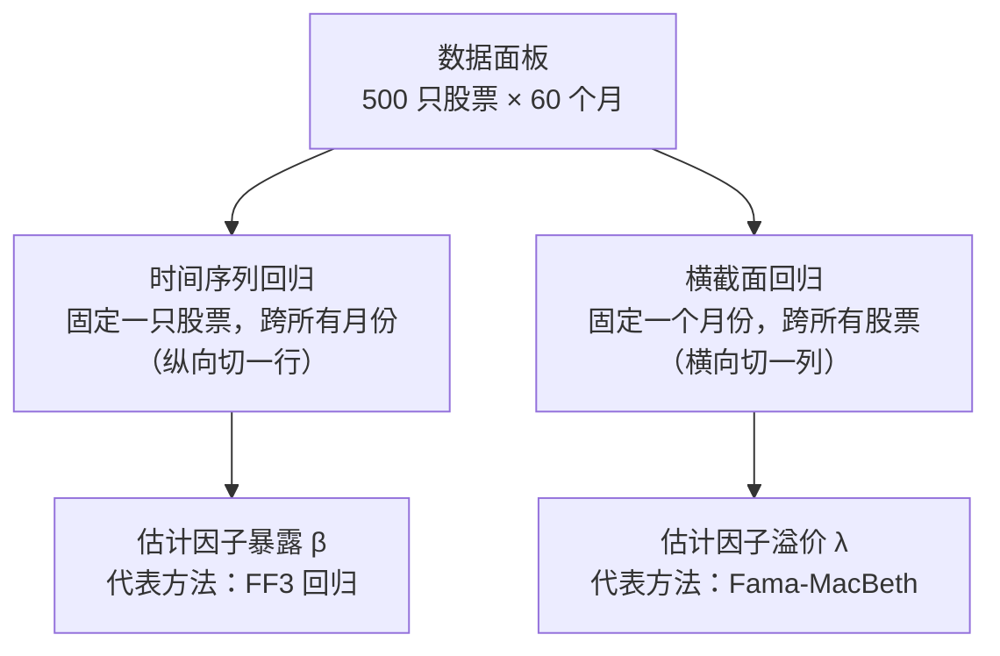

# Day 19：时间序列基础与横截面视角

> **总时长：** 2 小时
>
> **节奏：** 每 50 分钟休息 10 分钟
>
> **今日目标：** 理解为什么因子模型必须用收益率而不是价格，并区分时间序列回归和横截面回归这两种视角
>
> **本文是完整讲义，包含所有知识点，不需要翻阅其他资料**

---

## 时间表

```
00:00 - 00:50  第一节：平稳性与伪回归
00:50 - 01:00  休息
01:00 - 01:50  第二节：从时间序列到横截面
01:50 - 02:00  休息 + 自测
```

---

## 第一节：平稳性与伪回归（50 分钟）

### 一、时间序列是什么（5 分钟）

**一句话定义：按时间顺序排列的一组数据。**

Day 17-18 你一直在用时间序列——60 个月的基金收益率、60 个月的市场因子收益率，按月排列。OLS 回归的输入就是时间序列。

但 Day 17-18 有一个**隐藏的前提**：输入的时间序列必须满足一定条件，回归结果才是可信的。这个条件就是**平稳性**。

---

### 二、平稳性（15 分钟）

#### 2.1 一句话定义

**平稳性 = 统计性质不随时间变化。**

更准确地说（弱平稳 / 宽平稳）：

1. **均值恒定：** $E[r_t] = \mu$，对所有 $t$ 成立
2. **方差恒定：** $\text{Var}(r_t) = \sigma^2$，对所有 $t$ 成立
3. **自协方差只取决于滞后期数：** $\text{Cov}(r_t, r_{t-k})$ 只取决于 $k$，不取决于 $t$

> **术语说明：** 严平稳（strong stationarity）要求整个概率分布不变，弱平稳（weak stationarity）只要求均值、方差和自协方差不变。因子投资中只需要弱平稳，以下"平稳"都指弱平稳。

#### 2.2 直觉：平稳 = "没有趋势、没有膨胀"

**平稳序列**围绕一个固定均值上下波动，波动幅度大致恒定。

**非平稳序列**有趋势（均值随时间变化）或波动幅度在膨胀/收缩。

<svg width="480" height="220" viewBox="0 0 480 220" xmlns="http://www.w3.org/2000/svg">
  <!-- 背景 -->
  <rect width="480" height="220" fill="#fafafa" rx="8"/>
  <text x="240" y="20" text-anchor="middle" font-size="14" font-weight="bold" fill="#333">平稳序列 vs 非平稳序列</text>
  <!-- 左面板：平稳序列 -->
  <text x="130" y="38" text-anchor="middle" font-size="11" font-weight="bold" fill="#4a90d9">平稳（如收益率）</text>
  <line x1="40" y1="170" x2="220" y2="170" stroke="#666" stroke-width="1"/>
  <line x1="40" y1="170" x2="40" y2="42" stroke="#666" stroke-width="1"/>
  <text x="40" y="39" font-size="10" fill="#666">r</text>
  <text x="222" y="182" font-size="10" fill="#666">t</text>
  <!-- μ 均值线 -->
  <line x1="40" y1="105" x2="220" y2="105" stroke="#e74c3c" stroke-width="1" stroke-dasharray="4,3"/>
  <text x="32" y="109" text-anchor="end" font-size="10" fill="#e74c3c">μ</text>
  <!-- 平稳序列（围绕 μ 上下波动） -->
  <polyline points="48,105 56,78 66,122 76,72 86,128 96,82 108,118 118,70 128,126 138,85 150,115 160,78 170,120 180,90 192,108 202,80 212,105"
    fill="none" stroke="#4a90d9" stroke-width="2"/>
  <text x="130" y="190" text-anchor="middle" font-size="10" fill="#666">围绕均值 μ 上下波动</text>
  <text x="130" y="203" text-anchor="middle" font-size="10" fill="#666">波动幅度大致恒定</text>
  <!-- 右面板：非平稳序列 -->
  <text x="360" y="38" text-anchor="middle" font-size="11" font-weight="bold" fill="#e74c3c">非平稳（如股价）</text>
  <line x1="270" y1="170" x2="450" y2="170" stroke="#666" stroke-width="1"/>
  <line x1="270" y1="170" x2="270" y2="42" stroke="#666" stroke-width="1"/>
  <text x="270" y="39" font-size="10" fill="#666">P</text>
  <text x="452" y="182" font-size="10" fill="#666">t</text>
  <!-- 上升趋势序列 -->
  <polyline points="280,158 290,155 300,148 310,152 320,140 330,135 340,138 350,125 360,118 370,112 380,105 390,98 400,88 410,82 420,72 430,65 440,55"
    fill="none" stroke="#e74c3c" stroke-width="2"/>
  <text x="360" y="190" text-anchor="middle" font-size="10" fill="#666">有明显的上升趋势</text>
  <text x="360" y="203" text-anchor="middle" font-size="10" fill="#666">均值随时间不断增大</text>
</svg>

#### 2.3 金融例子：股价 vs 收益率

| | 股票价格 | 收益率 |
|---|---|---|
| 均值 | 随时间上涨（长期趋势） | 围绕某个均值波动 |
| 方差 | 随价格上涨而增大 | 大致恒定（虽然有波动聚集） |
| 平稳？ | **非平稳** | **近似平稳** |

**这就是为什么因子模型用收益率而不是价格。** Day 5 讲收益率的计算方法时，背后的统计原因就在这里——收益率是平稳的，可以做回归；价格不是，直接做回归会出问题。

---

### 三、差分——把非平稳变成平稳（10 分钟）

#### 3.1 一阶差分

**一阶差分 = 当前值减去上一期的值。**

$$\Delta P_t = P_t - P_{t-1}$$

对于股票：简单收益率就是差分除以上期价格（Day 5）：

$$r_t = \frac{P_t - P_{t-1}}{P_{t-1}} = \frac{\Delta P_t}{P_{t-1}}$$

对数收益率则直接等于对数价格的一阶差分：

$$r_t^{log} = \ln P_t - \ln P_{t-1} = \Delta \ln P_t$$

**关键：差分操作去除了趋势，把非平稳的价格变成了（近似）平稳的收益率。**

#### 3.2 手算例子：5 天股价 → 4 天收益率

```
给定 5 天收盘价：¥100, ¥103, ¥98, ¥105, ¥110

一阶差分（价格变化）：
  ΔP₂ = 103 - 100 = +3
  ΔP₃ =  98 - 103 = -5
  ΔP₄ = 105 -  98 = +7
  ΔP₅ = 110 - 105 = +5

简单收益率 = ΔP / P_{t-1}：
  r₂ =  3 / 100 = +3.0%
  r₃ = -5 / 103 = -4.9%
  r₄ =  7 /  98 = +7.1%
  r₅ =  5 / 105 = +4.8%

注意：5 个价格只能算出 4 个收益率（损失 1 个观测值）
```

| 日期 | 价格 $P_t$ | 差分 $\Delta P_t$ | 收益率 $r_t$ |
|:---:|:---:|:---:|:---:|
| 1 | 100 | — | — |
| 2 | 103 | +3 | +3.0% |
| 3 | 98 | -5 | -4.9% |
| 4 | 105 | +7 | +7.1% |
| 5 | 110 | +5 | +4.8% |

**观察：** 价格从 100 涨到 110，有上升趋势（非平稳）。但收益率在正负之间跳动，没有趋势（近似平稳）。

#### 3.3 为什么这一步如此重要

差分（价格 → 收益率）是因子投资数据管道的**第一步**：

```
原始数据（价格）→ 差分（收益率）→ 回归（因子模型）→ 检验（t 值、p 值）
      ↑                                              ↑
    非平稳                                          可信结论

    ⚠️ 跳过差分直接回归 → 伪回归 → 假结论
```

> **需要记住的：** 价格非平稳，收益率（近似）平稳。因子模型用收益率做回归，不用价格。这不是习惯，是统计学的硬性要求。

---

### 四、伪回归——不做差分的后果 ⭐（15 分钟）

#### 4.1 核心概念

**伪回归（spurious regression）= 两个不相关的非平稳序列做回归，也能得到很高的 $R^2$ 和"显著"的 $t$ 值。**

为什么？因为两个非平稳序列都有趋势。只要趋势方向一致（比如都在上涨），OLS 就会"发现"一个不存在的关系——它把"都在涨"当成了"有因果关系"。

#### 4.2 手算例子：股票价格 vs 商品价格

**场景：** 某科技股和某农产品价格在同一时期都在上涨，但二者完全没有经济联系。

| 月份 | 科技股 A 价格 | 农产品 B 价格 | $\Delta A$（收益） | $\Delta B$（收益） |
|:---:|:---:|:---:|:---:|:---:|
| 1 | 100 | 50 | — | — |
| 2 | 103 | 54 | 3 | 4 |
| 3 | 108 | 57 | 5 | 3 |
| 4 | 112 | 62 | 4 | 5 |
| 5 | 118 | 65 | 6 | 3 |
| 6 | 124 | 70 | 6 | 5 |

分别用**价格**和**收益率**做 OLS 回归（$A$ 对 $B$）：

```
═══════════════════════════════════════════════════════════════
             伪回归陷阱：价格 vs 收益率的 OLS 结果
───────────────────────────────────────────────────────────────
  数据         因变量      自变量        b̂      t 值     R²
───────────────────────────────────────────────────────────────
  价格水平     A 价格      B 价格      1.22    17.4    0.99 ⚠️
  收益率       ΔA          ΔB         -0.25   -0.34    0.04
───────────────────────────────────────────────────────────────
  样本量：6 个月（同一组数据，只是处理方式不同）
═══════════════════════════════════════════════════════════════
```

```
解读对比：

  价格回归：
    R² = 0.99 → "模型解释了 99% 的变异"
    t = 17.4 → |t| >> 1.96 → "高度显著"
    结论："科技股和农产品价格有极强的线性关系！"
    → ❌ 完全是假的。这叫伪回归。

  收益率回归：
    R² = 0.04 → "模型只解释了 4% 的变异"
    t = -0.34 → |t| << 1.96 → "完全不显著"
    结论："科技股收益率和农产品收益率没有关系。"
    → ✅ 这才是真实情况。
```

**同一组数据，只是做了差分（价格 → 收益率），结论从"高度显著"变成"完全不显著"。**

#### 4.3 为什么价格回归会得出假结论

```
两个上升趋势的叠加效应：

  A 价格          B 价格          散点图：A vs B
  |    *          |    *          A |         *
  |   *           |   *            |       *
  |  *            |  *             |     *
  | *             | *              |   *
  |*              |*               | *
  +→ t            +→ t             +--------→ B

  A 在涨           B 也在涨         看起来高度线性相关！
                                    但只是因为都有趋势
```

OLS 拟合的"直线"其实只是捕捉了**两个独立趋势的巧合同步**，而不是真正的经济关系。

#### 4.4 和 Day 18 的联系

你可能会想：Day 18 学的 Newey-West 能修正这个问题吗？

**不能。** 伪回归的问题不是 SE 偏小（A3/A4 违反），而是回归的**前提**就错了——非平稳数据不应该直接做 OLS 回归。

| 问题 | Day 18 的修正 | 能解决伪回归吗？ |
|---|---|:---:|
| A3 异方差 | Newey-West SE | ❌ |
| A4 自相关 | Newey-West SE | ❌ |
| A2 遗漏变量 | 加入遗漏变量 | ❌ |
| 非平稳数据 | **先差分，再回归** | ✅ |

**一句话总结：先差分，再回归——顺序不能反。NW 修正的是 SE，解决不了数据本身非平稳的问题。**

> **需要记住的：** 伪回归是最严重的回归陷阱之一。非平稳序列 + OLS = 虚假结论。唯一解决方法：先差分（价格 → 收益率），再做回归。

---

### 五、ADF 检验——怎么判断是否平稳（5 分钟）

#### 5.1 概念

**ADF（Augmented Dickey-Fuller）检验 = 判断一个时间序列是否平稳的统计检验。**

ADF 检验的假设：

| | 零假设 $H_0$ | 备择假设 $H_1$ |
|---|---|---|
| 内容 | 序列有单位根（非平稳） | 序列没有单位根（平稳） |

> **术语：** "单位根"是非平稳的数学特征。不需要理解其推导，只需要知道"有单位根 = 非平稳"。

#### 5.2 判断规则

和 Day 16 的假设检验一样：

$$p < 0.05 \quad \Rightarrow \quad \text{拒绝 } H_0 \quad \Rightarrow \quad \text{序列平稳}$$

$$p \geq 0.05 \quad \Rightarrow \quad \text{不能拒绝 } H_0 \quad \Rightarrow \quad \text{序列可能非平稳}$$

**典型结果：**

| 数据 | ADF p 值 | 结论 |
|---|:---:|---|
| 某股票价格序列 | 0.65 | $p > 0.05$ → 非平稳（符合预期） |
| 该股票收益率序列 | 0.001 | $p < 0.05$ → 平稳（符合预期） |

#### 5.3 Python 一行代码

```python
from statsmodels.tsa.stattools import adfuller

result = adfuller(returns)        # 输入收益率序列
print(f'p 值 = {result[1]:.4f}')  # result[1] 是 p 值
# p < 0.05 → 平稳，可以做回归
```

#### 5.4 因子投资实操

在跑因子回归之前，先对收益率做 ADF 检验确认平稳：

```
数据管道（完整版）：
  价格 → 差分 → 收益率 → ADF 检验 → 确认平稳 → 回归
                                     ↓
                                 p < 0.05 → ✅ 继续
                                 p ≥ 0.05 → ⚠️ 检查数据
```

> **理解即可。** ADF 的数学推导不需要掌握。记住：输入收益率 → 看 p 值 → $p < 0.05$ → 平稳 → 可以回归。

---

### 第一节完成检查

- [ ] 能解释为什么股价不能直接做回归（伪回归——非平稳序列回归出虚假结论）
- [ ] 能把 5 天股价手算成 4 天收益率（一阶差分 + 除以上期价格）
- [ ] 知道 ADF 检验的结论怎么读（$p < 0.05$ → 平稳）
- [ ] 能说出数据管道的正确顺序：价格 → 差分 → 收益率 → 回归
- [ ] 知道 NW 不能解决伪回归——伪回归需要差分来解决

**休息 10 分钟。**

---

## 第二节：从时间序列到横截面（50 分钟）

### 六、自相关函数 ACF（15 分钟）

#### 6.1 回顾 Day 18

Day 18 §2.5 讲了 A4 假设（无自相关）：残差之间互不相关。你学到金融数据的残差经常有自相关——连续几个月偏高，然后连续几个月偏低。NW SE 可以修正自相关带来的 SE 偏小问题。

但 Day 18 只讲了"残差有没有自相关"，没有量化"自相关有多强"。**ACF 就是量化自相关强度的工具。**

#### 6.2 定义

**ACF（Autocorrelation Function，自相关函数）= 滞后 $k$ 期的自相关系数。**

$$ACF(k) = \frac{\sum_{t=k+1}^{T}(r_t - \bar{r})(r_{t-k} - \bar{r})}{\sum_{t=1}^{T}(r_t - \bar{r})^2}$$

**翻译成人话：** $ACF(k)$ 就是"今天的收益率"和"$k$ 天前的收益率"之间的相关程度。

- $ACF(k) > 0$：$k$ 期前涨了，今天也倾向涨（**持续性 / 动量**）
- $ACF(k) < 0$：$k$ 期前涨了，今天倾向跌（**均值回复**）
- $ACF(k) \approx 0$：$k$ 期前的涨跌对今天没有预测力

**和 Day 15 的联系：** $ACF(k)$ 的公式结构和 Pearson 相关系数（Day 15 §2）完全一样——只是计算的不是"两个不同变量"的相关性，而是"同一个变量在不同时间点"的相关性。

#### 6.3 手算例子：5 个月收益率的 ACF(1)

```
给定 5 个月收益率：r₁=1%, r₂=2%, r₃=4%, r₄=5%, r₅=3%

第一步：计算均值
  r̄ = (1 + 2 + 4 + 5 + 3) / 5 = 15/5 = 3.0%

第二步：计算分母（所有偏差的平方和）
  (1-3)² + (2-3)² + (4-3)² + (5-3)² + (3-3)²
  = 4 + 1 + 1 + 4 + 0
  = 10

第三步：计算分子（滞后 1 期的交叉乘积和）
  配对：(r₂,r₁), (r₃,r₂), (r₄,r₃), (r₅,r₄)

  t=2: (r₂-r̄)(r₁-r̄) = (2-3)(1-3) = (-1)(-2) = +2
  t=3: (r₃-r̄)(r₂-r̄) = (4-3)(2-3) = (1)(-1)  = -1
  t=4: (r₄-r̄)(r₃-r̄) = (5-3)(4-3) = (2)(1)   = +2
  t=5: (r₅-r̄)(r₄-r̄) = (3-3)(5-3) = (0)(2)   = 0

  分子 = 2 + (-1) + 2 + 0 = 3

第四步：ACF(1) = 3 / 10 = 0.30
```

**解读：** $ACF(1) = 0.30 > 0$ → 正自相关 → 本月收益高于均值时，下月也倾向高于均值 → **动量 / 持续性**。

#### 6.4 读 ACF 图

实际中不手算 ACF，而是看 ACF 图：

<svg width="480" height="260" viewBox="0 0 480 260" xmlns="http://www.w3.org/2000/svg">
  <!-- 背景 -->
  <rect width="480" height="260" fill="#fafafa" rx="8"/>
  <!-- 标题 -->
  <text x="240" y="24" text-anchor="middle" font-size="14" font-weight="bold" fill="#333">ACF 图示意</text>
  <!-- 坐标轴 -->
  <line x1="80" y1="200" x2="430" y2="200" stroke="#666" stroke-width="1"/>
  <line x1="80" y1="200" x2="80" y2="35" stroke="#666" stroke-width="1"/>
  <text x="430" y="218" text-anchor="end" font-size="12" fill="#666">滞后期 k</text>
  <text x="40" y="38" text-anchor="start" font-size="12" fill="#666">ACF</text>
  <!-- 零基线 -->
  <line x1="80" y1="147" x2="420" y2="147" stroke="#666" stroke-width="1"/>
  <!-- 置信区间虚线 -->
  <line x1="80" y1="115" x2="420" y2="115" stroke="#e74c3c" stroke-width="1" stroke-dasharray="4,3"/>
  <line x1="80" y1="179" x2="420" y2="179" stroke="#e74c3c" stroke-width="1" stroke-dasharray="4,3"/>
  <!-- Y 轴刻度 -->
  <text x="72" y="44" text-anchor="end" font-size="10" fill="#666">1.0</text>
  <text x="72" y="97" text-anchor="end" font-size="10" fill="#666">0.5</text>
  <text x="72" y="119" text-anchor="end" font-size="10" fill="#e74c3c">0.3</text>
  <text x="72" y="151" text-anchor="end" font-size="10" fill="#666">0.0</text>
  <text x="72" y="183" text-anchor="end" font-size="10" fill="#e74c3c">−0.3</text>
  <!-- Lag 1: ACF ≈ 0.4（显著，超出 CI） -->
  <rect x="125" y="104" width="30" height="43" fill="#4a90d9" opacity="0.8"/>
  <!-- Lag 2: ACF ≈ 0.15（在 CI 内） -->
  <rect x="185" y="131" width="30" height="16" fill="#4a90d9" opacity="0.5"/>
  <!-- Lag 3: ACF ≈ 0.05（在 CI 内） -->
  <rect x="245" y="141" width="30" height="6" fill="#4a90d9" opacity="0.5"/>
  <!-- Lag 4: ACF ≈ −0.05（在 CI 内） -->
  <rect x="305" y="147" width="30" height="5" fill="#4a90d9" opacity="0.5"/>
  <!-- Lag 5: ACF ≈ −0.4（显著，超出 CI） -->
  <rect x="365" y="147" width="30" height="42" fill="#e74c3c" opacity="0.7"/>
  <!-- X 轴刻度 -->
  <text x="140" y="215" text-anchor="middle" font-size="10" fill="#666">1</text>
  <text x="200" y="215" text-anchor="middle" font-size="10" fill="#666">2</text>
  <text x="260" y="215" text-anchor="middle" font-size="10" fill="#666">3</text>
  <text x="320" y="215" text-anchor="middle" font-size="10" fill="#666">4</text>
  <text x="380" y="215" text-anchor="middle" font-size="10" fill="#666">5</text>
  <!-- 说明 -->
  <text x="240" y="242" text-anchor="middle" font-size="10" fill="#666">超出虚线 = 自相关显著 ｜ 在虚线内 = 不显著</text>
</svg>

**虚线 = 95% 置信区间**（约 $\pm 1.96 / \sqrt{T}$）。柱子超出虚线 → 该滞后期的自相关显著；在虚线内 → 不显著。

#### 6.5 因子投资联系

| ACF 特征 | 经济含义 | 因子投资关联 |
|---|---|---|
| $ACF(1) > 0$ | 短期持续性 | **动量因子**：过去涨的继续涨 |
| $ACF(1) < 0$ | 短期反转 | **均值回复策略**：过去涨的倾向跌回来 |
| 所有 $ACF(k) \approx 0$ | 无可预测性 | 弱有效市场假说（Day 10） |

> **需要记住的：** $ACF(k)$ 衡量滞后 $k$ 期的自相关强度。$ACF > 0$ → 动量；$ACF < 0$ → 均值回复。ACF 图中超出虚线的柱子 = 显著的自相关。

---

### 七、两种回归视角 ⭐⭐（20 分钟）

#### 7.1 回顾：Day 17-18 的回归是什么视角

Day 17-18 你做的所有回归都是**时间序列回归**——数据结构：**一只基金 × 60 个月**。

$$R_{i,t} - R_{f,t} = \alpha_i + \beta_{i,MKT} \cdot MKT_t + \beta_{i,SMB} \cdot SMB_t + \beta_{i,HML} \cdot HML_t + \varepsilon_{i,t}$$

下标 $t$ 是时间（$t = 1, 2, ..., 60$ 月），$i$ 是固定的（一只基金）。

**回答的问题："这只基金暴露于哪些因子？"** 具体来说，Day 17 §3.7 中 $\hat{\beta}_{i,SMB} = -0.35$ 表示这只基金对小盘因子有负暴露（大盘风格）。

#### 7.2 新视角：横截面回归

但因子投资还有一个核心问题——**"小盘因子每个月到底能赚多少？"即因子的风险溢价有多大。**

回答这个问题需要反过来切数据：

数据结构：**一个月 × 500 只股票**

$$R_{i,t} - R_{f,t} = \lambda_{0,t} + \lambda_{1,t} \cdot \hat{\beta}_{i,MKT} + \lambda_{2,t} \cdot \hat{\beta}_{i,SMB} + \eta_{i,t}$$

下标 $i$ 是股票（$i = 1, 2, ..., 500$），$t$ 是固定的（某个月）。

**回答的问题："在这个月，因子暴露 $\beta$ 高的股票是否真的赚得更多？"** 回归系数 $\hat{\lambda}_{1,t}$ 就是当月市场因子的风险溢价估计。

#### 7.3 对比表

| | 时间序列回归 | 横截面回归 |
|---|---|---|
| **切数据方式** | 固定一只股票，跨所有月份 | 固定一个月份，跨所有股票 |
| **样本量** | $T$（月份数，如 60） | $N$（股票数，如 500） |
| **估计什么** | 因子暴露 $\beta_i$ | 因子溢价 $\lambda_t$ |
| **回答什么问题** | "这只股票暴露于哪些因子？" | "这个因子的溢价有多大？" |
| **代表方法** | FF3 回归（Day 17） | Fama-MacBeth 回归（Day 24） |
| **NW 修正** | 需要（时间序列有自相关） | 每个截面内不需要（Day 18 §3.6） |

#### 7.4 数据面板的两种切法



用表格直觉理解"两种切法"：

```
              1月    2月    3月    ...   60月
  股票 1     [r₁₁]  [r₁₂]  [r₁₃]  ...  [r₁,₆₀]  ← 时间序列回归
  股票 2      r₂₁    r₂₂    r₂₃   ...   r₂,₆₀     （取一行）
  股票 3      r₃₁    r₃₂    r₃₃   ...   r₃,₆₀
  ...         ...    ...    ...   ...    ...
  股票 500    r₅₀₀,₁ r₅₀₀,₂ r₅₀₀,₃ ... r₅₀₀,₆₀
                ↑
           横截面回归
           （取一列）
```

#### 7.5 为什么需要两种视角

**时间序列回归告诉你"因子暴露是多少"，但不直接告诉你"因子暴露值不值钱"。**

Day 17 §3.7 的例子中，你知道某基金 $\hat{\beta}_{SMB} = -0.35$（大盘风格）。但这只告诉你它偏好大盘股——没有回答"大盘好还是小盘好"。要回答"小盘溢价有多大"，你需要在每个月对比小盘暴露高的股票和低的股票，看谁赚得多——这正是横截面回归做的事情。

> **需要记住的：** 时间序列回归估计 $\beta$（因子暴露），横截面回归估计 $\lambda$（因子溢价）。两者缺一不可：$\beta$ 告诉你风险在哪，$\lambda$ 告诉你风险值不值得承担。

---

### 八、Fama-MacBeth 直觉预览（15 分钟）

#### 8.1 问题

横截面回归有一个棘手的统计问题：**同一个月内，500 只股票的残差 $\eta_i$ 不是独立的。**

为什么？因为同一个月所有股票都受到了相同的宏观冲击（如美联储加息、疫情暴发）。这导致残差之间存在**截面相关性**——违反了 OLS 的独立性假设。

如果直接用普通 OLS 做单次横截面回归，SE 会偏小 → 假阳性风险增加——这和 Day 18 §2.5 的自相关问题类似，但发生在"同一时间的不同股票之间"而不是"同一股票的不同时间之间"。

#### 8.2 Fama-MacBeth 两步法（高层直觉）

Fama 和 MacBeth（1973）提出了一个精巧的解决方案：

**第一步：每个月做一次横截面回归**

```
1月：R_i,1 = λ₀,₁ + λ₁,₁ · β̂_i + η_i,1    → 得到 λ̂₁,₁
2月：R_i,2 = λ₀,₂ + λ₁,₂ · β̂_i + η_i,2    → 得到 λ̂₁,₂
3月：R_i,3 = λ₀,₃ + λ₁,₃ · β̂_i + η_i,3    → 得到 λ̂₁,₃
...
60月：R_i,60 = λ₀,₆₀ + λ₁,₆₀ · β̂_i + η_i,60 → 得到 λ̂₁,₆₀
```

每个月得到一个因子溢价的估计值 $\hat{\lambda}_{1,t}$。

**第二步：对所有月份的估计求平均**

$$\hat{\lambda}_1 = \frac{1}{T}\sum_{t=1}^{T}\hat{\lambda}_{1,t}$$

$$t_{\lambda} = \frac{\hat{\lambda}_1}{SE(\hat{\lambda}_1)}$$

其中 $SE(\hat{\lambda}_1) = \frac{\sigma(\hat{\lambda}_{1,t})}{\sqrt{T}}$（$\hat{\lambda}_{1,t}$ 在时间上的标准误）。

#### 8.3 为什么这样做

**妙处在于：截面相关性在第一步中被"吸收"了。**

每个月的横截面回归确实受到截面相关性的影响——但 FM 不关心单个月的 SE。它只关心**60 个 $\hat{\lambda}_{1,t}$ 的时间序列平均值**。

在第二步中，$\hat{\lambda}_{1,1}, \hat{\lambda}_{1,2}, ..., \hat{\lambda}_{1,60}$ 是不同月份的估计——月份之间不存在截面相关性。$SE$ 用的是这 60 个数的时间序列标准误，不受截面相关性影响。

#### 8.4 和 Day 18 的联系

| | 第一步（横截面） | 第二步（时间序列平均） |
|---|---|---|
| 数据结构 | 一个月 × 多只股票 | 多个月 × 一个 $\hat{\lambda}$ |
| 需要 NW 吗？ | **不需要**（无时间顺序） | **可以用**（时间序列可能有自相关） |

**呼应 Day 18 §3.6：** "如果是横截面回归，横截面内部不需要 NW。" 现在你知道为什么了——FM 第一步就是横截面回归。但第二步对 $\hat{\lambda}_t$ 求时间平均时，如果 $\hat{\lambda}_t$ 有自相关，可以用 NW 修正。

#### 8.5 今天到此为止

> ⚠️ **Day 24 会完整学习 FM 回归的数学细节——包括第一步中 $\hat{\beta}_i$ 的估计（需要先用时间序列回归）、generated regressor 问题、以及完整的手算例子。今天只需要理解"两步法在做什么"和"为什么这样做"。**

---

### 第二节完成检查

- [ ] 能手算 ACF(1)（分子 = 滞后 1 期的交叉乘积和，分母 = 偏差平方和）
- [ ] 能说出时间序列回归和横截面回归分别回答什么问题（因子暴露 vs 因子溢价）
- [ ] 能用自己的话描述 Fama-MacBeth 两步法的直觉（每月横截面回归 → 时间平均）
- [ ] 知道 FM 的完整数学推导会在 Day 24 展开

---

## 收尾：自测（10 分钟）

**自测 1：** 什么是弱平稳？列出三个条件。

```
→ 你的答案：_______________
→ 正确：
  弱平稳 = 统计性质不随时间变化。三个条件：
  1. 均值恒定：E[rₜ] = μ
  2. 方差恒定：Var(rₜ) = σ²
  3. 自协方差只取决于滞后期数 k，不取决于时间 t

  直觉：围绕固定均值波动，波动幅度不变。
```

---

**自测 2：** 为什么不能直接用股票价格做回归？

```
→ 你的答案：_______________
→ 正确：
  因为股票价格是非平稳的（有趋势）。
  对非平稳序列做回归会产生伪回归——
  R² 虚高、t 值膨胀，得到完全虚假的"显著"结论。

  解决方法：先差分（价格 → 收益率），再做回归。
  收益率是（近似）平稳的，回归结果才可信。
```

---

**自测 3：** ADF 检验的 p 值 = 0.32，你该怎么解读？

```
→ 你的答案：_______________
→ 正确：
  p = 0.32 > 0.05 → 不能拒绝"非平稳"的零假设。
  结论：该序列可能非平稳，不能直接用来做回归。
  应该先做差分，然后再对差分后的序列做 ADF 检验。
```

---

**自测 4：** Newey-West 标准误能解决伪回归吗？为什么？

```
→ 你的答案：_______________
→ 正确：
  不能。NW 修正的是 SE（让 t 值更准确），
  但伪回归的问题不是 SE 偏小——
  是回归的前提就错了（数据非平稳）。

  NW 解决：A3 异方差 + A4 自相关 → SE 偏小
  差分解决：数据非平稳 → 伪回归
  这是两个不同层面的问题。
```

---

**自测 5：** 时间序列回归和横截面回归分别回答什么问题？各自的代表方法是什么？

```
→ 你的答案：_______________
→ 正确：
  时间序列回归：
    回答"这只股票暴露于哪些因子？"（估计 β）
    数据结构：一只股票 × 多个月
    代表方法：FF3 回归（Day 17）

  横截面回归：
    回答"因子溢价有多大？"（估计 λ）
    数据结构：一个月 × 多只股票
    代表方法：Fama-MacBeth 回归（Day 24）
```

---

**自测 6（计算）：** 给定 5 天股价 ¥50, ¥52, ¥48, ¥53, ¥55，计算 4 天的简单收益率。

```
→ 你的计算：_______________
→ 正确：
  r₂ = (52-50)/50 = +4.0%
  r₃ = (48-52)/52 = -7.7%
  r₄ = (53-48)/48 = +10.4%
  r₅ = (55-53)/53 = +3.8%

  注意：5 个价格 → 4 个收益率（损失 1 个观测值）
  价格有上升趋势（50→55），但收益率正负交替，
  没有趋势——差分去除了趋势。
```

---

**自测 7（计算）：** 某研究用两只股票的价格序列做 OLS 回归，得到 $R^2 = 0.95$，$t = 12.3$。你会怎么评价这个结果？

```
→ 你的答案：_______________
→ 正确：
  高度怀疑是伪回归！

  两个疑点：
  1. R² = 0.95 对价格回归来说太高了——
     很可能只是两个趋势的巧合同步
  2. 用的是价格（非平稳），不是收益率

  建议：
  1. 对两个价格序列做 ADF 检验（很可能非平稳）
  2. 转换为收益率后重新回归
  3. 看收益率回归的 R² 和 t 值（大概率会大幅下降）
```

---

**自测 8（计算）：** 给定 5 个月收益率：3%, -1%, 2%, 0%, 1%。计算 ACF(1)。

```
→ 你的计算：_______________
→ 正确：
  第一步：均值
    r̄ = (3-1+2+0+1)/5 = 5/5 = 1.0%

  第二步：分母
    (3-1)² + (-1-1)² + (2-1)² + (0-1)² + (1-1)²
    = 4 + 4 + 1 + 1 + 0 = 10

  第三步：分子（滞后 1 期）
    t=2: (-1-1)(3-1) = (-2)(2) = -4
    t=3: (2-1)(-1-1) = (1)(-2) = -2
    t=4: (0-1)(2-1)  = (-1)(1) = -1
    t=5: (1-1)(0-1)  = (0)(-1) = 0

    分子 = -4 + (-2) + (-1) + 0 = -7

  ACF(1) = -7/10 = -0.70

  解读：ACF(1) = -0.70 < 0 → 强负自相关
  → 本月涨了下月倾向跌 → 均值回复特征
```

---

**自测 9：** ACF(1) = 0.35 意味着什么？在因子投资中和什么概念相关？

```
→ 你的答案：_______________
→ 正确：
  ACF(1) = 0.35 > 0 → 正自相关
  → 本月收益高于均值时，下月也倾向高于均值
  → 即"涨了还会涨，跌了还会跌"

  因子投资联系：动量因子（momentum）。
  动量策略（买入过去赢家、卖出过去输家）
  的数学基础就是收益率的正自相关。
```

---

**自测 10（读表）：** 以下两个回归用的是同一组数据，哪个结果更可信？为什么？

```
  回归 A（用价格水平）：R² = 0.92，t = 15.6
  回归 B（用收益率）：  R² = 0.08，t = 1.23
```

```
→ 你的答案：_______________
→ 正确：
  回归 B（收益率）更可信。

  回归 A 用的是价格（非平稳），R² = 0.92 和 t = 15.6
  很可能是伪回归——两个趋势的巧合同步造成的假象。

  回归 B 用的是收益率（平稳），R² = 0.08 和 t = 1.23
  告诉你两者之间其实没有显著关系
  （|t| = 1.23 < 1.96 → 不显著）。

  教训：永远用收益率（平稳序列）做回归，
  不要被价格回归的高 R² 和高 t 值迷惑。
```

---

### 评分标准

| 得分 | 状态 |
|------|------|
| 9-10 题 | 时间序列基础和横截面视角都掌握了，明天可以学优化 |
| 7-8 题 | 不错，回看错误的部分 |
| 5-6 题 | 需要重点复习伪回归例子和 ACF 计算 |
| < 5 题 | 建议重新阅读本讲义，特别是 §四 伪回归和 §七 两种回归视角 |

---

## 今天不需要记住的内容

| 内容 | 为什么不需要 |
|---|---|
| PACF（偏自相关函数） | 用于 ARIMA 定阶，因子投资不做时序预测 |
| AR(1) / ARIMA 模型 | 时间序列预测模型，因子投资侧重截面分析 |
| ADF 检验的公式推导 | 知道怎么读结果就够了（$p < 0.05$ → 平稳） |
| FM 回归的完整数学 | Day 24 会系统学习，今天只需要理解两步法直觉 |
| 单位根理论 | 纯计量经济学，知道"非平稳 → 伪回归"就够了 |
| 协整（cointegration） | 非平稳序列间的高级关系，因子投资基础阶段不需要 |

---

## 明天预告

**Day 20：约束优化与均值-方差优化**

Day 12-19 完成了因子投资的"检验"部分：怎么判断一个因子是不是真的（回归 + 假设检验）。

但知道因子有效还不够——你还需要用这些因子来**构建投资组合**。给定 10 只股票的预期收益和协方差矩阵，怎么分配权重才能让组合的风险最小？这就是**均值-方差优化**——Markowitz 组合理论的数学核心。

明天你将学到拉格朗日乘数法和二次规划的直觉，并手算一个简单的最优组合。

> Day 12-18 建立了"检验因子"的工具箱，Day 19 补充了数据管道的第一步（差分）和两种回归视角。Day 20 开始建立"用因子构建组合"的工具箱。
