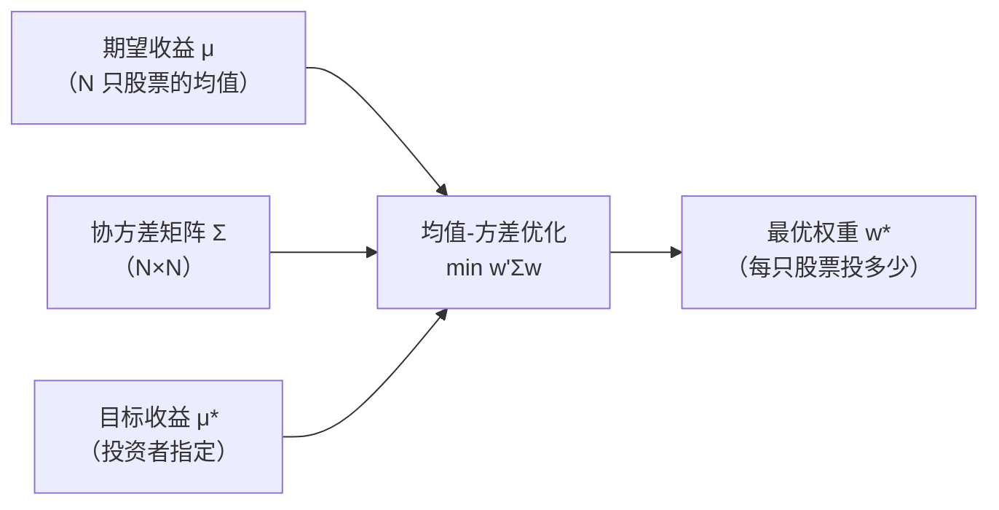
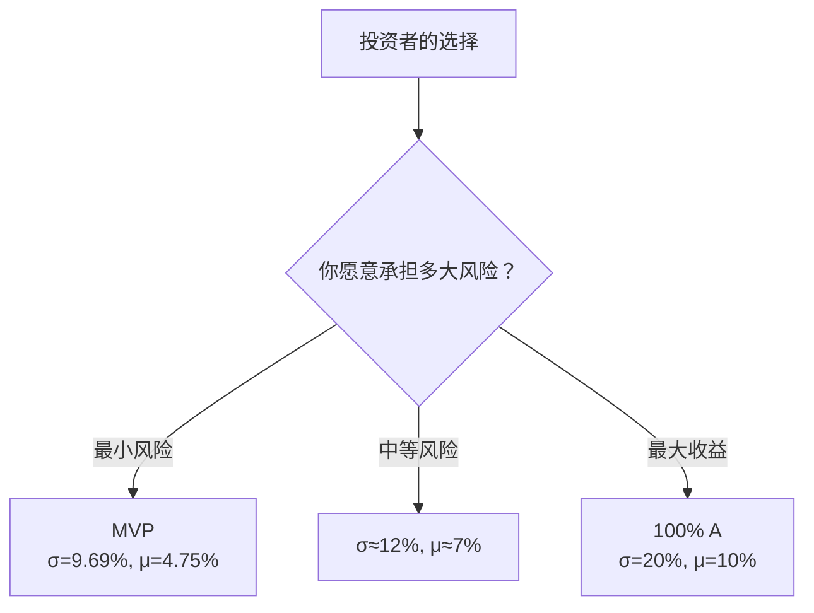
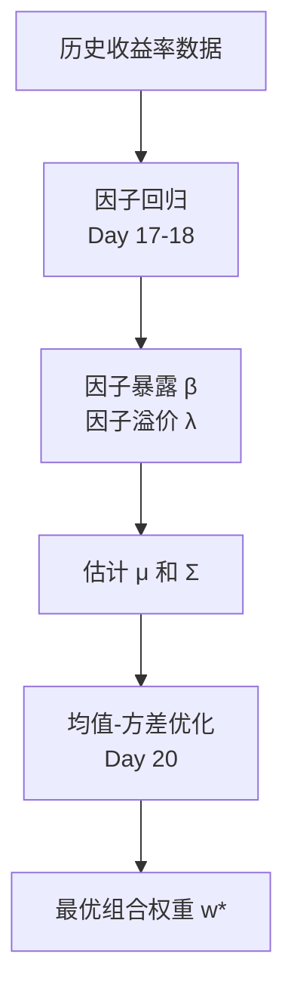

# Day 20：约束优化与均值-方差优化

> **总时长：** 2 小时
>
> **节奏：** 每 50 分钟休息 10 分钟
>
> **今日目标：** 理解拉格朗日乘数法的直觉和计算，能手算两资产的最小方差组合和有效前沿
>
> **本文是完整讲义，包含所有知识点，不需要翻阅其他资料**

---

## 时间表

```
00:00 - 00:50  第一节：优化基础与拉格朗日乘数法
00:50 - 01:00  休息
01:00 - 01:50  第二节：均值-方差优化与有效前沿
01:50 - 02:00  休息 + 自测
```

---

## 第一节：优化基础与拉格朗日乘数法（50 分钟）

### 一、从因子检验到组合构建（5 分钟）

Day 12-19 完成了因子投资的**检验链路**：


**但知道因子有效还不够**——你还需要用这些因子来**构建投资组合**。

给定 10 只股票的预期收益率和协方差矩阵，怎么分配权重才能在目标收益下让组合的风险最小？这就是**均值-方差优化**。

Day 6-7 你从直觉上理解了投资组合理论和有效前沿。**今天的目标是用数学把它算出来。**

---

### 二、优化问题是什么（8 分钟）

#### 2.1 一句话定义

**优化 = 找到让某个函数取最小值（或最大值）的输入。**

$$\min_x f(x)$$

翻译成人话：找到一个 $x$，使得 $f(x)$ 尽可能小。

#### 2.2 无约束优化：导数 = 0

**一维情况：** 函数的最小值出现在导数为零的点。

$$f'(x^*) = 0$$

**手算例子：**

```
f(x) = x² - 4x + 5

  f'(x) = 2x - 4 = 0
  → x* = 2

  f(2) = 4 - 8 + 5 = 1  ← 最小值

  验证：f(0) = 5，f(1) = 2，f(2) = 1，f(3) = 2，f(4) = 5
  确实在 x = 2 时最小。
```

```
函数图形：

  f(x)
  5 |*               *
    |  \           /
  3 |    \       /
    |      \   /
  1 |        *  ← 最小值在 x = 2
    +--+--+--+--+--→ x
       0  1  2  3  4
```

#### 2.3 和因子投资的联系

投资组合优化就是一个优化问题：

$$\min_{\boldsymbol{w}} \sigma_p^2(\boldsymbol{w})$$

找到一组权重 $\boldsymbol{w}$，使得组合方差 $\sigma_p^2$ 最小。

但有一个问题：如果不加限制，答案是 $\boldsymbol{w} = \boldsymbol{0}$（什么都不买，方差 = 0）。这显然没用——所以需要加**约束条件**。

> **理解即可。** 无约束优化的关键：导数 = 0。但实际问题几乎都有约束。

---

### 三、凸函数——为什么优化能保证找到最优解（7 分钟）

#### 3.1 一句话定义

**凸函数 = "碗形"函数：任意两点之间的连线都在函数图形的上方。**

```
凸函数（碗形）：                  非凸函数：

  f(x)                            f(x)
  |  \    /                       |  \  /\  /
  |   \  /                        |   \/  \/
  |    \/  ← 唯一谷底              |  多个谷底
  +------→ x                      +------→ x
  任何谷底都是全局最优              可能掉进"错误的谷"
```

#### 3.2 为什么凸性很重要

| | 凸优化 | 非凸优化 |
|---|---|---|
| 谷底数量 | 只有一个 | 可能多个 |
| 导数 = 0 | 一定是全局最优 | 可能只是局部最优 |
| 求解难度 | 有高效算法，保证找到最优 | 可能找不到全局最优 |
| 投资组合优化 | **是凸的** ✅ | — |

#### 3.3 为什么组合方差是凸的

组合方差 $\sigma_p^2 = \boldsymbol{w}'\Sigma\boldsymbol{w}$，其中 $\Sigma$ 是协方差矩阵。

Day 13 讲过：**协方差矩阵是半正定矩阵**（所有特征值 $\geq 0$）。半正定矩阵构成的二次型 $\boldsymbol{w}'\Sigma\boldsymbol{w}$ 是凸函数。

**直觉：** 半正定 = 从任何方向看都是"碗形"或"平底碗"——不会出现"马鞍形"的情况。所以组合方差函数有唯一的最低点。

> **需要记住的：** 组合方差是凸函数（因为协方差矩阵半正定），所以 Markowitz 优化有唯一最优解。

---

### 四、有约束优化与拉格朗日乘数法 ⭐（25 分钟）

#### 4.1 为什么需要约束

无约束地最小化组合方差，答案是 $\boldsymbol{w} = \boldsymbol{0}$（全部持有现金）。但这不是一个有用的投资组合。

实际中至少需要两个约束：

| 约束 | 数学表达 | 含义 |
|------|---------|------|
| 预算约束 | $w_1 + w_2 + ... + w_N = 1$ | 权重之和为 1（满仓） |
| 收益约束 | $\boldsymbol{w}'\boldsymbol{\mu} = \mu^*$ | 组合的期望收益率 = 目标值 |

**有约束优化 = 在满足约束的前提下，找到函数的最小值。**

#### 4.2 几何直觉

```
等高线图（f = x² + y²）：

  y
  |    /  constraint: x + y = 1
  |   /
  |  * ← 约束下最优解（等高线与约束线的切点）
  | / )
  |/ · )  ← f 的等高线（同心圆）
  +--------→ x

  无约束最优：(0, 0)（原点，f = 0）
  有约束最优：(0.5, 0.5)（约束线上离原点最近的点，f = 0.5）
```

**直觉：** 沿着约束线走，找到函数值最小的点。这个点恰好在等高线和约束线**相切**的地方——切点处，等高线的"梯度"和约束线的"梯度"平行。

#### 4.3 拉格朗日乘数法

**拉格朗日乘数法 = 把"有约束优化"转化为"无约束优化"的技巧。**

**问题：** $\min f(x, y)$ 使得 $g(x, y) = c$

**构造拉格朗日函数：**

$$L(x, y, \lambda) = f(x, y) - \lambda \cdot [g(x, y) - c]$$

其中 $\lambda$（lambda）叫**拉格朗日乘子**。

**求解：** 对 $x$、$y$、$\lambda$ 分别求偏导并令其为零：

$$\frac{\partial L}{\partial x} = 0, \quad \frac{\partial L}{\partial y} = 0, \quad \frac{\partial L}{\partial \lambda} = 0$$

第三个方程自动还原约束条件 $g(x, y) = c$。

> **翻译成人话：** 拉格朗日函数把约束"吸收"进了目标函数。求解 $L$ 的无约束最优点，就等同于求解原问题的有约束最优点。

#### 4.4 手算例子

**问题：** $\min f(x, y) = x^2 + y^2$ 使得 $x + y = 1$

这个问题的含义：在 $x + y = 1$ 这条线上，找到离原点最近的点。

**第一步：构造拉格朗日函数**

$$L(x, y, \lambda) = x^2 + y^2 - \lambda(x + y - 1)$$

**第二步：求偏导并令其为零**

```
∂L/∂x = 2x - λ = 0      → x = λ/2     ... (1)
∂L/∂y = 2y - λ = 0      → y = λ/2     ... (2)
∂L/∂λ = -(x + y - 1) = 0 → x + y = 1   ... (3)
```

**第三步：解方程组**

```
从 (1) 和 (2)：x = y = λ/2
代入 (3)：λ/2 + λ/2 = 1  →  λ = 1

→  x* = 1/2，y* = 1/2，λ* = 1

f(1/2, 1/2) = 1/4 + 1/4 = 1/2
```

**验证：** 约束线 $x + y = 1$ 上的其他点：

```
(0, 1)：f = 0 + 1 = 1 > 0.5
(1, 0)：f = 1 + 0 = 1 > 0.5
(0.3, 0.7)：f = 0.09 + 0.49 = 0.58 > 0.5
(0.5, 0.5)：f = 0.25 + 0.25 = 0.5  ← 最小 ✓
```

#### 4.5 $\lambda$ 的含义：影子价格

$\lambda^* = 1$ 的含义：如果把约束从 $x + y = 1$ 放松为 $x + y = 1.01$，最优值大约从 0.5 变为 $0.5 - 1 \times 0.01 = 0.49$。

**翻译成人话：** $\lambda$ 告诉你"放松约束 1 单位能带来多少改善"。

**在投资组合中：** 收益约束的 $\lambda$ 告诉你"多要求 1% 的收益率，最小方差会增加多少"——这就是有效前沿的斜率。

#### 4.6 和投资组合的联系

刚才的例子可以直接翻译成投资组合问题：

| 数学例子 | 投资组合对应 |
|---------|------------|
| $x$, $y$ | 两只股票的权重 $w_1$, $w_2$ |
| $x^2 + y^2$ | 简化版的组合"集中度"（和方差相关） |
| $x + y = 1$ | 预算约束（权重之和 = 1） |
| $x^* = y^* = 0.5$ | 等权分配 |

实际的 Markowitz 问题中，$f = w_1^2\sigma_1^2 + w_2^2\sigma_2^2 + 2w_1w_2\sigma_{12}$（组合方差），约束更复杂——但方法完全一样。第二节就来算。

> **需要记住的：** 拉格朗日函数 $L = f - \lambda(g - c)$。求解：对所有变量求偏导令其为零。$\lambda$ = 影子价格（放松约束的边际收益）。

---

### 第一节完成检查

- [ ] 知道优化问题 = 找到使函数最小的输入
- [ ] 知道凸函数 = "碗形"，任何谷底都是全局最优
- [ ] 知道组合方差是凸的（因为协方差矩阵半正定）→ Markowitz 有唯一最优解
- [ ] 能写出拉格朗日函数 $L = f - \lambda(g - c)$
- [ ] 能手算 $\min x^2 + y^2$ s.t. $x + y = 1$（答案：$x = y = 1/2$）
- [ ] 能解释 $\lambda$ 的经济含义（放松约束的边际收益）

**休息 10 分钟。**

---

## 第二节：均值-方差优化与有效前沿（50 分钟）

### 五、Markowitz 问题的数学表述 ⭐⭐（10 分钟）

#### 5.1 问题定义

**均值-方差优化 = 在给定目标收益率下，找到组合方差最小的权重分配。**

$$\min_{\boldsymbol{w}} \quad \boldsymbol{w}'\Sigma\boldsymbol{w}$$

$$\text{s.t.} \quad \boldsymbol{w}'\boldsymbol{\mu} = \mu^*, \quad \boldsymbol{w}'\boldsymbol{1} = 1$$

| 符号 | 含义 | 维度 | 来源 |
|------|------|------|------|
| $\boldsymbol{w}$ | 权重向量 | $N \times 1$ | **要求解的** |
| $\Sigma$ | 协方差矩阵 | $N \times N$ | Day 13, 15 |
| $\boldsymbol{\mu}$ | 期望收益率向量 | $N \times 1$ | Day 14 |
| $\mu^*$ | 目标收益率 | 标量 | 投资者指定 |
| $\boldsymbol{1}$ | 全 1 向量 | $N \times 1$ | — |

#### 5.2 输入和输出



**连接前序知识：**
- $\boldsymbol{\mu}$ 和 $\Sigma$ 的估计来自历史数据（Day 14-15）或因子模型（Day 17-18）
- $\boldsymbol{w}'\Sigma\boldsymbol{w}$ 是 Day 12 学过的矩阵乘法
- $\Sigma$ 半正定（Day 13）保证问题有唯一最优解（§三）

#### 5.3 两资产简化

当只有 2 只股票时，$w_2 = 1 - w_1$（预算约束），问题简化为**一元函数的最小化**：

**组合方差公式**（Day 7 / Day 15 的两资产公式）：

$$\sigma_p^2 = w_1^2 \sigma_1^2 + w_2^2 \sigma_2^2 + 2w_1 w_2 \sigma_{12}$$

其中 $\sigma_{12} = \rho_{12} \sigma_1 \sigma_2$。代入 $w_2 = 1 - w_1$ 后，$\sigma_p^2$ 变成 $w_1$ 的二次函数——导数 = 0 就能求解。

> **需要记住的：** Markowitz 优化的输入 = $\boldsymbol{\mu}$（期望收益）+ $\Sigma$（协方差矩阵）+ $\mu^*$（目标收益），输出 = $\boldsymbol{w}^*$（最优权重）。

---

### 六、两资产手算——最小方差组合（15 分钟）

#### 6.1 设定

| | 股票 A | 股票 B |
|---|:---:|:---:|
| 期望收益率 $\mu$ | 10%/年 | 4%/年 |
| 波动率 $\sigma$ | 20%/年 | 10%/年 |
| 相关系数 $\rho_{AB}$ | 0.25 | |

协方差：$\sigma_{AB} = \rho_{AB} \cdot \sigma_A \cdot \sigma_B = 0.25 \times 0.20 \times 0.10 = 0.005$

**目标：** 找到使组合方差最小的权重 $w_A$（**最小方差组合 / MVP**）。

#### 6.2 推导组合方差

代入 $w_B = 1 - w_A$：

$$\sigma_p^2 = w_A^2 \sigma_A^2 + (1-w_A)^2 \sigma_B^2 + 2w_A(1-w_A)\sigma_{AB}$$

```
展开：
  = w² × 0.04 + (1-w)² × 0.01 + 2w(1-w) × 0.005
  = 0.04w² + (1 - 2w + w²) × 0.01 + (2w - 2w²) × 0.005
  = 0.04w² + 0.01 - 0.02w + 0.01w² + 0.01w - 0.01w²
  = (0.04 + 0.01 - 0.01)w² + (-0.02 + 0.01)w + 0.01

  σ²_p = 0.04w² - 0.01w + 0.01

  （其中 w = w_A，省略下标）
```

这是一个关于 $w$ 的二次函数，开口朝上（$0.04 > 0$）→ 有唯一最小值。

#### 6.3 求最小方差组合（MVP）

```
令导数 = 0：

  dσ²_p / dw = 0.08w - 0.01 = 0
  → w_A* = 0.01 / 0.08 = 1/8 = 0.125 = 12.5%
  → w_B* = 1 - 0.125 = 87.5%
```

**MVP 的方差和收益率：**

```
σ²_MVP = 0.04 × (1/8)² - 0.01 × (1/8) + 0.01
       = 0.04 × 0.015625 - 0.00125 + 0.01
       = 0.000625 - 0.00125 + 0.01
       = 0.009375

σ_MVP = √0.009375 = 9.69%

μ_MVP = 0.125 × 10% + 0.875 × 4%
      = 1.25% + 3.50%
      = 4.75%
```

#### 6.4 MVP 的公式（两资产通用）

$$w_1^{MVP} = \frac{\sigma_2^2 - \sigma_{12}}{\sigma_1^2 + \sigma_2^2 - 2\sigma_{12}}$$

```
验证：
  分子 = σ²_B - σ_AB = 0.01 - 0.005 = 0.005
  分母 = σ²_A + σ²_B - 2σ_AB = 0.04 + 0.01 - 0.01 = 0.04
  w_A = 0.005 / 0.04 = 0.125 = 12.5%  ✓
```

#### 6.5 关键发现：分散投资的数学证明

$$\sigma_{MVP} = 9.69\% < \sigma_B = 10\%$$

**在一个只有 B（波动率 10%）的组合中加入 12.5% 的 A（波动率 20%），组合的风险反而从 10% 降到了 9.69%！**

这就是**分散投资**的数学本质——只要 $\rho < 1$（相关性不完美），混合两个资产的风险就可以低于任何单一资产的风险。

```
分散投资的效果：

  σ (%)
  20 |*（100% A）
     |
  15 |
     |
  10 |*（100% B）   9.69|  * ← MVP（12.5% A + 87.5% B）
     |         比 100% B 的风险更低！
   0 +---+---+---+---+---→ w_A (%)
      0  12.5 25  50  75  100
```

Day 7 讲过"分散投资能降低风险"。**现在你从数学上证明了这一点。**

> **需要记住的：** 只要 $\rho < 1$，MVP 的风险就低于任何单一资产。这是分散投资的数学基础。MVP 公式：$w_1 = (\sigma_2^2 - \sigma_{12}) / (\sigma_1^2 + \sigma_2^2 - 2\sigma_{12})$。

---

### 七、有效前沿 ⭐（15 分钟）

#### 7.1 不同目标收益 → 不同最优组合

MVP 是"风险最小的组合"。但如果投资者愿意承担更多风险来换取更高收益呢？

**方法：给定不同的目标收益 $\mu^*$，分别求出最优权重。**

对于两资产：目标收益约束 $w_A \times 10\% + (1-w_A) \times 4\% = \mu^*$ 直接决定了 $w_A$：

$$w_A = \frac{\mu^* - 4\%}{10\% - 4\%} = \frac{\mu^* - 4\%}{6\%}$$

然后代入 $\sigma_p^2 = 0.04w^2 - 0.01w + 0.01$ 计算对应的风险。

#### 7.2 手算有效前沿上的 5 个点

```
═════════════════════════════════════════════════════════════
                   有效前沿：不同目标收益对应的最优组合
─────────────────────────────────────────────────────────────
  目标 μ*    w_A      w_B       σ²_p        σ_p      备注
─────────────────────────────────────────────────────────────
  4.00%      0%      100%     0.01000     10.00%    全部 B
  4.75%    12.5%     87.5%    0.00938      9.69%    MVP ⭐
  5.50%    25.0%     75.0%    0.01000     10.00%    和全部 B 同风险
  7.00%    50.0%     50.0%    0.01500     12.25%    等权
 10.00%   100.0%      0%     0.04000     20.00%    全部 A
─────────────────────────────────────────────────────────────
  σ²_p = 0.04w² - 0.01w + 0.01
═════════════════════════════════════════════════════════════
```

```
验算 μ* = 5.5%（w_A = 25%）：
  w_A = (5.5% - 4%) / 6% = 1.5/6 = 0.25  ✓
  σ²_p = 0.04(0.0625) - 0.01(0.25) + 0.01
       = 0.0025 - 0.0025 + 0.01
       = 0.01
  σ_p = √0.01 = 10.00%  ✓

验算 μ* = 7%（w_A = 50%）：
  w_A = (7% - 4%) / 6% = 0.50  ✓
  σ²_p = 0.04(0.25) - 0.01(0.50) + 0.01
       = 0.01 - 0.005 + 0.01
       = 0.015
  σ_p = √0.015 = 12.25%  ✓
```

#### 7.3 画出有效前沿

```
  μ (期望收益)
  |
 10%|                              * 全部 A
    |                           ·
    |                        ·
  8%|                     ·
    |                  ·
  7%|              *  ← 等权（50/50）        有效前沿
    |           ·                            （上半弧）
  6%|        ·
    |     ·
5.5%|   *   ← 同风险(10%)但更高收益
    |   |
4.75%|  * ← MVP（风险最低点）
    |   \
  4%|    * 全部 B                             无效部分
    |                                        （下半弧）
    +--+--+---+---+---+---+---→ σ (风险)
       8  10  12  14  16  18  20 (%)
```

#### 7.4 有效前沿的三个关键观察

**观察 1：MVP 的风险低于任何单一资产。**

$\sigma_{MVP} = 9.69\% < \sigma_B = 10\%$。这是分散投资的力量。

**观察 2：有效前沿分为上半弧和下半弧。**

看 $\mu^* = 4\%$（全部 B）和 $\mu^* = 5.5\%$（25% A + 75% B）：两者的风险都是 10%，但后者的收益更高（5.5% > 4%）。所以全部 B 是"无效"的——有另一个组合在同样的风险下给你更高的收益。

**有效前沿 = MVP 以上的部分。** 理性投资者只会选择有效前沿上的组合。

**观察 3：有效前沿是一条"子弹形"曲线。**



每个投资者根据自己的风险偏好，在有效前沿上选择一个点。风险厌恶者选靠近 MVP 的点，风险偏好者选靠右的点。

> **需要记住的：** 有效前沿 = MVP 以上的"子弹形"曲线。MVP 以下的部分是无效的（同风险但收益更低）。理性投资者只在有效前沿上选择。

---

### 八、从数学到实践（10 分钟）

#### 8.1 N 资产的矩阵形式

实际投资组合不止 2 只股票。$N$ 资产的 Markowitz 问题用拉格朗日乘数法求解：

$$L = \boldsymbol{w}'\Sigma\boldsymbol{w} - \lambda_1(\boldsymbol{w}'\boldsymbol{\mu} - \mu^*) - \lambda_2(\boldsymbol{w}'\boldsymbol{1} - 1)$$

对 $\boldsymbol{w}$ 求导令其为零：

$$\frac{\partial L}{\partial \boldsymbol{w}} = 2\Sigma\boldsymbol{w} - \lambda_1\boldsymbol{\mu} - \lambda_2\boldsymbol{1} = \boldsymbol{0}$$

$$\boldsymbol{w}^* = \frac{1}{2}\Sigma^{-1}(\lambda_1\boldsymbol{\mu} + \lambda_2\boldsymbol{1})$$

再代入两个约束条件求出 $\lambda_1$ 和 $\lambda_2$。

**要点：** 解中出现了 $\Sigma^{-1}$（协方差矩阵的逆）——这就是 Day 12 §四讲逆矩阵时提到的"OLS 和组合优化都需要矩阵求逆"。

> **理解即可。** 知道 N 资产问题需要矩阵求逆就够了。实际中用 Python 求解。

#### 8.2 Python 一行求解

```python
import numpy as np
from scipy.optimize import minimize

# 输入
mu = np.array([0.10, 0.04])           # 期望收益
cov = np.array([[0.04, 0.005],         # 协方差矩阵
                [0.005, 0.01]])

# 目标函数：组合方差
def portfolio_var(w):
    return w @ cov @ w

# 约束
constraints = [
    {'type': 'eq', 'fun': lambda w: w.sum() - 1},        # 权重之和 = 1
    {'type': 'eq', 'fun': lambda w: w @ mu - 0.07},       # 目标收益 = 7%
]

# 求解
result = minimize(portfolio_var, x0=[0.5, 0.5], constraints=constraints)
print(f'最优权重: {result.x}')  # [0.5, 0.5]
print(f'最小方差: {result.fun:.6f}')  # 0.015000
```

#### 8.3 估计误差问题

Markowitz 优化有一个著名的弱点：**对输入极度敏感。**

$\boldsymbol{\mu}$ 和 $\Sigma$ 都是从历史数据**估计**的。如果估计有误差（几乎总是有），优化器会把误差放大——可能给出"全仓一只股票"的极端建议。

$$\text{估计不准的 } \boldsymbol{\mu} \text{ 和 } \Sigma \quad \xrightarrow{\text{优化}} \quad \text{极端的 } \boldsymbol{w}^*$$

**因子模型的价值就在这里：** 用因子模型（Day 17-18）估计的 $\boldsymbol{\mu}$ 和 $\Sigma$ 比纯历史数据估计更稳定——因为因子模型提供了**结构**（几个因子解释了大部分变异），减少了需要估计的参数数量。

| 估计方法 | 需要估计的参数 | 稳定性 |
|---------|:---:|:---:|
| 纯历史数据 | $N + N(N+1)/2$（如 $N=500$：125,750 个） | 不稳定 |
| 因子模型（$K$ 个因子） | $NK + K(K+1)/2$（如 $K=3, N=500$：1,506 个） | 更稳定 |

**这就是 Day 12-19 的数学工具和 Day 20 的优化框架如何汇合在一起的：**



> **需要记住的：** Markowitz 优化对输入敏感。因子模型通过减少参数数量、提供结构，让输入更可靠——这是因子投资和组合优化之间的核心联系。

---

### 第二节完成检查

- [ ] 能写出 Markowitz 问题的数学表述（目标：$\min \boldsymbol{w}'\Sigma\boldsymbol{w}$，约束：权重之和 = 1、目标收益）
- [ ] 能说出 Markowitz 优化的输入（$\boldsymbol{\mu}$, $\Sigma$, $\mu^*$）和输出（$\boldsymbol{w}^*$）
- [ ] 能手算两资产的 MVP 权重和风险（$w_A = 12.5\%$，$\sigma_{MVP} = 9.69\%$）
- [ ] 知道 $\sigma_{MVP} < \sigma_B$ 的含义（分散投资能降低风险到低于任何单一资产）
- [ ] 知道有效前沿 = MVP 以上的部分，MVP 以下是无效的
- [ ] 知道 Markowitz 对输入敏感 → 因子模型提供更可靠的输入

---

## 收尾：自测（10 分钟）

**自测 1：** 什么是凸函数？为什么凸性对 Markowitz 优化很重要？

```
→ 你的答案：_______________
→ 正确：
  凸函数 = "碗形"函数，任意两点间的连线在函数上方。
  凸性意味着只有一个谷底（全局最优），
  不会存在多个局部最优的问题。

  组合方差 w'Σw 是凸的（因为 Σ 半正定），
  所以 Markowitz 优化有唯一最优解。
```

---

**自测 2：** 拉格朗日乘子 $\lambda$ 的经济含义是什么？

```
→ 你的答案：_______________
→ 正确：
  λ = "影子价格"，衡量放松约束 1 单位能带来的改善。

  在投资组合中：收益约束的 λ 告诉你
  "多要求 1% 的收益率，最小方差会增加多少"
  = 有效前沿的斜率。
```

---

**自测 3：** Markowitz 优化的输入和输出分别是什么？

```
→ 你的答案：_______________
→ 正确：
  输入：
  1. μ（N 只股票的期望收益率向量）
  2. Σ（N×N 协方差矩阵）
  3. μ*（投资者指定的目标收益率）

  输出：
  w*（N 只股票的最优权重向量）
```

---

**自测 4：** 为什么有效前沿只包括 MVP 以上的部分？

```
→ 你的答案：_______________
→ 正确：
  MVP 以下的组合是"无效"的——
  对于同样的风险水平，MVP 以上存在收益更高的组合。

  例子：全部 B（μ=4%, σ=10%）和 25% A + 75% B（μ=5.5%, σ=10%）
  风险相同，但后者收益更高。
  所以没有理性投资者会选择全部 B。
```

---

**自测 5：** 为什么因子模型能改善 Markowitz 优化的效果？

```
→ 你的答案：_______________
→ 正确：
  Markowitz 优化对输入（μ 和 Σ）极度敏感。
  纯历史数据估计的参数太多（500 只股票需要 125,750 个参数），
  估计误差大 → 优化结果不可靠。

  因子模型用少量因子解释收益率的结构，
  大幅减少需要估计的参数（3 因子只需 ~1,500 个），
  估计更稳定 → 优化结果更可靠。
```

---

**自测 6（计算）：** $\min f(x) = 3x^2 - 12x + 15$，求最小值点和最小值。

```
→ 你的计算：_______________
→ 正确：
  f'(x) = 6x - 12 = 0
  → x* = 2

  f(2) = 3(4) - 12(2) + 15 = 12 - 24 + 15 = 3

  最小值点 x* = 2，最小值 f(x*) = 3。
```

---

**自测 7（计算）：** $\min x^2 + y^2$ 使得 $x + y = 2$。用拉格朗日乘数法求解。

```
→ 你的计算：_______________
→ 正确：
  L = x² + y² - λ(x + y - 2)

  ∂L/∂x = 2x - λ = 0    → x = λ/2
  ∂L/∂y = 2y - λ = 0    → y = λ/2
  ∂L/∂λ = -(x + y - 2) = 0  → x + y = 2

  从前两个方程：x = y = λ/2
  代入约束：λ/2 + λ/2 = 2 → λ = 2
  → x* = 1，y* = 1

  f(1, 1) = 1 + 1 = 2
```

---

**自测 8（计算）：** 两只股票：$\sigma_A = 15\%$，$\sigma_B = 10\%$，$\rho = 0.40$。计算 $w_A = 30\%$ 时的组合波动率 $\sigma_p$。

```
→ 你的计算：_______________
→ 正确：
  σ_AB = ρ × σ_A × σ_B = 0.40 × 0.15 × 0.10 = 0.006

  σ²_p = w²_A × σ²_A + w²_B × σ²_B + 2 × w_A × w_B × σ_AB
       = 0.09 × 0.0225 + 0.49 × 0.01 + 2 × 0.30 × 0.70 × 0.006
       = 0.002025 + 0.0049 + 0.00252
       = 0.009445

  σ_p = √0.009445 = 9.72%

  注意：σ_p = 9.72% < σ_B = 10% → 分散投资降低了风险。
```

---

**自测 9（计算）：** 用 §六 的数据（$\sigma_A = 20\%$，$\sigma_B = 10\%$，$\rho = 0.25$），计算目标收益 $\mu^* = 8.5\%$ 时的最优权重和组合风险。

```
→ 你的计算：_______________
→ 正确：
  w_A = (μ* - μ_B) / (μ_A - μ_B) = (8.5% - 4%) / (10% - 4%) = 4.5/6 = 0.75
  w_B = 1 - 0.75 = 0.25

  σ²_p = 0.04w² - 0.01w + 0.01（§六 推导的公式）
       = 0.04 × 0.5625 - 0.01 × 0.75 + 0.01
       = 0.0225 - 0.0075 + 0.01
       = 0.025

  σ_p = √0.025 = 15.81%
```

---

**自测 10（读表）：** 以下哪个组合在有效前沿上，哪个不在？为什么？

```
  组合    μ_p      σ_p
  P1      4.0%     10.0%
  P2      5.5%     10.0%
  P3      4.75%     9.69%
  P4      7.0%     12.25%
```

```
→ 你的答案：_______________
→ 正确：
  P3（MVP）：在有效前沿上 ✅（风险最低点）
  P4：在有效前沿上 ✅（MVP 以上，无更优替代）
  P2：在有效前沿上 ✅（和 P1 同风险但收益更高）
  P1：不在有效前沿 ❌（和 P2 同风险但收益更低）

  P1 被 P2 "支配"——同样 10% 的风险，
  P2 的收益（5.5%）高于 P1（4.0%）。
  理性投资者不会选 P1。
```

---

### 评分标准

| 得分 | 状态 |
|------|------|
| 9-10 题 | 优化基础扎实，明天可以学 PCA 和整合复习 |
| 7-8 题 | 不错，回看错误的部分 |
| 5-6 题 | 需要重点复习拉格朗日乘数法和有效前沿 |
| < 5 题 | 建议重新阅读本讲义，特别是 §四 和 §六-七 |

---

## 今天不需要记住的内容

| 内容 | 为什么不需要 |
|---|---|
| KKT 条件 | 这是处理不等式约束（如禁止卖空 $w_i \geq 0$）的推广，了解存在即可 |
| 梯度下降 / 数值优化算法 | 实际用 Python 库求解，不需要知道内部算法 |
| $N$ 资产 Markowitz 的矩阵求解细节 | 知道需要 $\Sigma^{-1}$ 就够了，实际用 scipy.optimize |
| Black-Litterman 模型 | 改进 Markowitz 的高级方法，因子投资基础阶段不需要 |
| 交易成本约束 | 实际中重要，但数学上是对 Markowitz 的扩展，后续再学 |
| 二次规划的对偶理论 | 纯数学，知道 Markowitz 是二次规划就够了 |

---

## 明天预告

**Day 21：PCA 直觉与整合复习**

Day 13 你学了特征值分解——把矩阵分解成"方向"和"大小"。明天你将看到它最重要的应用：**PCA（主成分分析）**。

PCA 可以从 500 只股票的收益率中"提取"几个潜在因子——第一个主成分几乎总是市场因子，后续主成分对应行业、规模等。这就是**统计因子模型**的基础，和 Day 17-18 的经济因子模型（FF3）形成对照。

最后，我们会用一张全景图把 Day 12-20 的所有数学工具串成一条完整的链路——从数据获取到因子检验到组合构建。

> Day 12-19 学了各种数学工具，Day 20 学了优化框架，Day 21 补上最后一块拼图（PCA）并把所有工具串起来。
