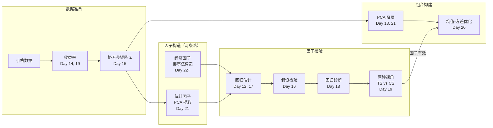

# Day 21：PCA 直觉与整合复习

> **总时长：** 2 小时
>
> **节奏：** 每 50 分钟休息 10 分钟
>
> **今日目标：** 理解 PCA 如何从收益率数据中提取统计因子，并把 Day 12-20 的所有数学工具串成因子投资的完整管道
>
> **本文是完整讲义，包含所有知识点，不需要翻阅其他资料**

---

## 时间表

```
00:00 - 00:50  第一节：PCA——从特征分解到统计因子
00:50 - 01:00  休息
01:00 - 01:50  第二节：统计因子 vs 经济因子 + 整合复习
01:50 - 02:00  休息 + 自测
```

---

## 第一节：PCA——从特征分解到统计因子（50 分钟）

### 一、回顾与衔接（5 分钟）

#### 1.1 Day 13 已经告诉你的

Day 13 你学到了三个关键结论：

| 结论 | Day 13 原话 |
|------|------------|
| PCA 的数学本质 | PCA 就是对协方差矩阵做特征分解 |
| 特征值 = 方差 | 每个特征值代表对应方向上的方差 |
| PC1 像市场因子 | 第一个特征向量的分量同号 → 同涨同跌 |

Day 13 用 $\Sigma = [[5, 2], [2, 2]]$ 算出了 $\lambda_1 = 6$（86%）和 $\lambda_2 = 1$（14%），并给出了金融解读。

#### 1.2 今天的新问题

Day 13 是从协方差矩阵**直接出发**做特征分解。但实际中你拿到的不是协方差矩阵，而是**原始收益率数据**。

今天要回答的问题：

1. **从原始数据到 PC 得分**：完整计算流程是什么？（§三）
2. **为什么 PC1 是"最好的"方向？**：方差最大化的数学直觉（§二）
3. **选几个主成分？**：怎么决定保留 $k$ 个而不是全部 $N$ 个？（§四）
4. **PCA 在因子投资中怎么用？**：三个具体应用场景（§五）

---

### 二、PCA 的两种理解方式（10 分钟）

#### 2.1 方差最大化：找到数据"散布最广"的方向

**PCA 的第一主成分 = 使投影方差最大的方向。**

把散点数据投影到某个方向 $\boldsymbol{w}$ 上，投影后的方差是：

$$\text{Var}(\text{投影}) = \boldsymbol{w}'\Sigma\boldsymbol{w}$$

其中 $\Sigma$ 是协方差矩阵，$\boldsymbol{w}$ 是单位向量（$\boldsymbol{w}'\boldsymbol{w} = 1$）。

PCA 要找的就是：

$$\max_{\boldsymbol{w}} \boldsymbol{w}'\Sigma\boldsymbol{w} \quad \text{s.t.} \quad \boldsymbol{w}'\boldsymbol{w} = 1$$

翻译成人话：在所有单位方向中，找到一个方向，使得数据投影到这个方向后的方差最大。

#### 2.2 和 Day 20 拉格朗日的联系

这是一个**有约束优化问题**——和 Day 20 的拉格朗日乘数法完全一样。

构造拉格朗日函数：

$$L(\boldsymbol{w}, \lambda) = \boldsymbol{w}'\Sigma\boldsymbol{w} - \lambda(\boldsymbol{w}'\boldsymbol{w} - 1)$$

对 $\boldsymbol{w}$ 求导令其为零：

$$\frac{\partial L}{\partial \boldsymbol{w}} = 2\Sigma\boldsymbol{w} - 2\lambda\boldsymbol{w} = 0$$

$$\Sigma\boldsymbol{w} = \lambda\boldsymbol{w}$$

这正是 Day 13 学过的**特征方程**。所以：

- **PC1 的方向 = $\Sigma$ 的最大特征值对应的特征向量**
- **PC1 的方差 = 最大特征值 $\lambda_1$**
- PC2 = 第二大特征值的特征向量，以此类推

> **需要记住的：** PCA 的第一主成分方向就是协方差矩阵最大特征值对应的特征向量。这不是巧合——而是拉格朗日乘数法直接推出的结果。

#### 2.3 重构误差最小化：另一种等价理解

PCA 还有第二种理解方式：用 $k$ 个方向**近似**原始 $N$ 维数据，使重构误差最小。

```
原始数据（N 维）
   │
   ▼  投影到 k 个方向
低维表示（k 维）
   │
   ▼  从 k 维重建
重构数据（N 维）
   │
   └→ 重构误差 = 原始 - 重构

PCA 选择的 k 个方向，使得重构误差最小。
这和方差最大化是同一个问题的两面。
```

**直觉：** 保留方差最大的方向 = 丢掉方差最小的方向 = 最小化信息损失。

> **理解即可。** 两种理解方式等价。记住"方差最大化"这一种就够了。

---

### 三、PCA 完整计算流程 ⭐（15 分钟）

#### 3.1 五个步骤

```
第 1 步：收集收益率矩阵 X（T 行 × N 列）
         T = 时间期数，N = 股票数
              │
              ▼
第 2 步：去均值（每列减去该列的均值）
         得到去均值矩阵 X̃
              │
              ▼
第 3 步：计算协方差矩阵
         Σ = X̃'X̃ / (T-1)
              │
              ▼
第 4 步：特征分解（Day 13 的内容）
         Σ = QΛQ'
         特征值从大到小排列：λ₁ ≥ λ₂ ≥ ... ≥ λ_N
              │
              ▼
第 5 步：投影（新内容）
         PC 得分 = X̃ × Q
         第 t 期的 PC1 得分 = X̃ 的第 t 行 · v₁
```

> **需要记住的：** 这 5 步就是 PCA 的全部。Step 1-3 是数据预处理，Step 4 是 Day 13 学过的特征分解，Step 5 是今天新增的投影。

#### 3.2 手算：5 期 × 2 只股票的完整 PCA

**Step 1：原始收益率数据（%）**

```
            股票 A    股票 B
  第 1 期      5         3
  第 2 期      1        -1
  第 3 期      3         1
  第 4 期     -1         1
  第 5 期      2         1
```

**Step 2：去均值**

```
  均值：A 的均值 = (5+1+3-1+2)/5 = 10/5 = 2
        B 的均值 = (3-1+1+1+1)/5 = 5/5 = 1

  去均值后（每个值减去该列均值）：

            d_A       d_B
  第 1 期   5-2= 3    3-1= 2
  第 2 期   1-2=-1   -1-1=-2
  第 3 期   3-2= 1    1-1= 0
  第 4 期  -1-2=-3    1-1= 0
  第 5 期   2-2= 0    1-1= 0
```

**Step 3：计算协方差矩阵**

```
  Var(A) = (3² + (-1)² + 1² + (-3)² + 0²) / (5-1)
         = (9 + 1 + 1 + 9 + 0) / 4
         = 20 / 4 = 5

  Var(B) = (2² + (-2)² + 0² + 0² + 0²) / 4
         = (4 + 4 + 0 + 0 + 0) / 4
         = 8 / 4 = 2

  Cov(A,B) = (3×2 + (-1)×(-2) + 1×0 + (-3)×0 + 0×0) / 4
           = (6 + 2 + 0 + 0 + 0) / 4
           = 8 / 4 = 2

  Σ = [[5, 2],
       [2, 2]]
```

这正是 Day 13 用过的协方差矩阵。

**Step 4：特征分解（复用 Day 13 结论）**

Day 13 已经算过，直接引用：

```
  λ₁ = 6,  v₁ = [2/√5, 1/√5] ≈ [0.89, 0.45]
  λ₂ = 1,  v₂ = [1/√5, -2/√5] ≈ [0.45, -0.89]
```

**Step 5：投影——计算 PC 得分（今天的新步骤）**

PC 得分 = 去均值数据在特征向量方向上的投影。

$$\text{PC1}_t = d_{A,t} \times v_{1,A} + d_{B,t} \times v_{1,B}$$

$$\text{PC2}_t = d_{A,t} \times v_{2,A} + d_{B,t} \times v_{2,B}$$

```
  PC1 得分（投影到 v₁ = [0.89, 0.45]）：

  t=1:  3 × 0.89 + 2 × 0.45  =  2.68 + 0.89  =  3.58
  t=2: -1 × 0.89 + (-2)×0.45 = -0.89 - 0.89   = -1.79
  t=3:  1 × 0.89 + 0 × 0.45  =  0.89 + 0      =  0.89
  t=4: -3 × 0.89 + 0 × 0.45  = -2.68 + 0      = -2.68
  t=5:  0 × 0.89 + 0 × 0.45  =  0    + 0      =  0

  PC2 得分（投影到 v₂ = [0.45, -0.89]）：

  t=1:  3 × 0.45 + 2 × (-0.89) =  1.34 - 1.79  = -0.45
  t=2: -1 × 0.45 + (-2)×(-0.89)= -0.45 + 1.79  =  1.34
  t=3:  1 × 0.45 + 0 × (-0.89) =  0.45 + 0     =  0.45
  t=4: -3 × 0.45 + 0 × (-0.89) = -1.34 + 0     = -1.34
  t=5:  0 × 0.45 + 0 × (-0.89) =  0    + 0     =  0
```

#### 3.3 解读 PC 得分

**PC1 得分 = "市场方向"的度量：**

| 期 | 股票 A | 股票 B | PC1 得分 | 解读 |
|----|--------|--------|---------|------|
| 1 | +3 | +2 | +3.58 | 两只都涨，市场强 |
| 2 | -1 | -2 | -1.79 | 两只都跌，市场弱 |
| 3 | +1 | 0 | +0.89 | 小涨，市场微正 |
| 4 | -3 | 0 | -2.68 | A 跌很多，市场偏弱 |
| 5 | 0 | 0 | 0 | 无变化 |

PC1 得分大 → 两只股票同涨（市场好）；PC1 得分负 → 同跌（市场差）。

**PC2 得分 = "相对差异"的度量：**

| 期 | 股票 A | 股票 B | PC2 得分 | 解读 |
|----|--------|--------|---------|------|
| 1 | +3 | +2 | -0.45 | A 比 B 涨得多，PC2 微负 |
| 2 | -1 | -2 | +1.34 | B 比 A 跌得多，PC2 正 |
| 4 | -3 | 0 | -1.34 | A 跌 B 不跌，PC2 负 |

PC2 捕捉的是两只股票之间的**相对表现差异**。

#### 3.4 验证：PC 得分的方差 = 特征值

```
  Var(PC1) = (3.58² + 1.79² + 0.89² + 2.68² + 0²) / 4
           = (12.82 + 3.20 + 0.79 + 7.18 + 0) / 4
           = 24.00 / 4
           = 6.00 = λ₁  ✓

  Var(PC2) = (0.45² + 1.34² + 0.45² + 1.34² + 0²) / 4
           = (0.20 + 1.80 + 0.20 + 1.80 + 0) / 4
           = 4.00 / 4
           = 1.00 = λ₂  ✓
```

> 翻译成人话：投影到 PC1 方向后的方差 = 6（最大特征值），投影到 PC2 方向后的方差 = 1（最小特征值）。PC1 确实捕捉了最多的方差。而且 6 + 1 = 7 = 总方差（trace），没有信息丢失。

#### 3.5 Python 代码（了解即可）

```python
import numpy as np

# Step 1: 收益率数据
X = np.array([[5, 3],
              [1, -1],
              [3, 1],
              [-1, 1],
              [2, 1]])

# Step 2: 去均值
X_centered = X - X.mean(axis=0)

# Step 3: 协方差矩阵
Sigma = np.cov(X_centered, rowvar=False)  # [[5, 2], [2, 2]]

# Step 4: 特征分解
eigenvalues, eigenvectors = np.linalg.eigh(Sigma)
# eigh 专门用于对称矩阵，结果从小到大排列
# 翻转为从大到小
idx = eigenvalues.argsort()[::-1]
eigenvalues = eigenvalues[idx]      # [6, 1]
eigenvectors = eigenvectors[:, idx]  # 列为特征向量

# Step 5: 投影
PC_scores = X_centered @ eigenvectors  # T×N 矩阵
```

> **知道存在就行：** 实际中用 `np.linalg.eigh` 一行搞定 Step 4。`eigh` 比 `eig` 更适合协方差矩阵，因为它利用了对称性，数值更稳定。

---

### 四、选几个主成分？（10 分钟）

#### 4.1 累积方差解释比

**方差解释比** = 每个主成分解释了总方差的多少：

$$\text{第 } i \text{ 个主成分的方差解释比} = \frac{\lambda_i}{\sum_{j=1}^{N} \lambda_j}$$

**累积方差解释比** = 前 $k$ 个主成分一起解释了总方差的多少：

$$\text{累积方差解释比}(k) = \frac{\sum_{i=1}^{k} \lambda_i}{\sum_{j=1}^{N} \lambda_j}$$

翻译成人话：如果我只保留前 $k$ 个主成分，能保留原始数据多少比例的信息。

**手算例子：**

```
  我们的 2 只股票例子：
  λ₁ = 6,  方差解释比 = 6/7 = 86%
  λ₂ = 1,  方差解释比 = 1/7 = 14%

  累积：保留 PC1 → 86%
        保留 PC1+PC2 → 100%（只有 2 维，全部保留）
```

#### 4.2 Scree Plot：用"肘部"判断保留几个

Scree plot = 把特征值从大到小画出来，找"陡变到平坦"的转折点。

假设 10 只股票的协方差矩阵有以下特征值：

```
  λ     Scree Plot（特征值 vs 主成分编号）
  │
  25│  *
    │
  20│
    │
  15│
    │     *
  10│
    │
   5│        *    *
    │                 *    *    *    *    *    *
   0├──┬──┬──┬──┬──┬──┬──┬──┬──┬──→ 主成分编号
      1  2  3  4  5  6  7  8  9  10

      ↑ 在这里出现"肘部"——前 3 个下降快，后面趋于平坦
        → 保留 3 个主成分
```

#### 4.3 经验法则

| 规则 | 说明 |
|------|------|
| 累积方差 80-90% | 保留前 $k$ 个主成分，使累积方差解释比达到 80-90% |
| Scree plot 肘部 | 特征值从"急降"变"平坦"的转折点 |
| Kaiser 准则 | 只保留特征值 > 均值的主成分（了解即可） |

#### 4.4 金融数据的典型情况

| 数据规模 | 前几个 PC 解释的方差 | 含义 |
|---------|---------------------|------|
| 2 只股票 | PC1 ≈ 86% | 大部分风险是市场方向 |
| 30 只股票（沪深 300 成分） | 前 5 个 PC ≈ 60-70% | 市场 + 行业 + 风格 |
| 500 只股票 | 前 5 个 PC ≈ 50-60% | 少数几个因子解释了大部分风险 |
| 3000 只股票（全 A 股） | 前 10 个 PC ≈ 50-60% | 需要更多主成分，但 10 个已覆盖过半 |

**关键洞察：** 几千只股票的收益率看似是几千维的数据，但实际上只被少数几个潜在因子驱动。PCA 帮你找到这些因子。

> **需要记住的：** 金融数据中，前 5-10 个主成分通常能解释总方差的 50-70%。这说明股票市场的风险维度远低于股票数量。

---

### 五、PCA 在因子投资中的三个应用（10 分钟）

#### 5.1 应用一：提取统计因子

**Connor & Korajczyk（1986）的思路：**

对大量股票的收益率做 PCA，前 $k$ 个主成分就是 $k$ 个统计因子。

```
  500 只股票 × 60 个月的收益率
        │
        ▼  PCA
  PC1 得分序列 → 统计因子 1（类似市场因子）
  PC2 得分序列 → 统计因子 2（类似行业轮动）
  PC3 得分序列 → 统计因子 3（类似大小盘分化）
  ...
  保留前 5 个 PC → 5 因子统计模型
```

每只股票在每个 PC 上的**载荷**（loading）= 特征向量中对应该股票的分量 = 该股票对这个统计因子的**暴露度**。

**在因子投资中的联系：** 这就是**统计因子模型**——和 Day 17-18 讲的 Fama-French 经济因子模型形成对照（§六会详细对比）。

#### 5.2 应用二：协方差矩阵降噪

500 只股票的协方差矩阵是 $500 \times 500$，有 125,250 个参数需要估计。用 60 个月的数据去估计这么多参数，噪声会很大。

**PCA 降噪思路：**

```
  Σ（原始，噪声大）
    │
    ▼  特征分解
  λ₁, λ₂, ..., λ₅₀₀  和对应的特征向量
    │
    ▼  只保留前 k 个
  Σ̂ = λ₁v₁v₁' + λ₂v₂v₂' + ... + λₖvₖvₖ'
    │
    └→ 降噪后的协方差矩阵（更稳定）
```

小特征值对应的方向主要是**噪声**，去掉后矩阵估计更稳定。这个降噪后的协方差矩阵可以作为 Day 20 均值-方差优化的输入。

**在因子投资中的联系：** Markowitz 优化对协方差矩阵的估计误差非常敏感（Day 20 提过）。PCA 降噪是实际中最常用的改进方法之一。

#### 5.3 应用三：多因子合成

当你同时使用多个因子（价值、动量、质量、低波动......），这些因子之间可能存在相关性。

```
  价值因子 ─┐
  动量因子 ─┤
  质量因子 ─┼→ PCA → 几个不相关的合成因子
  低波因子 ─┤
  成长因子 ─┘
```

PCA 可以把相关的因子**降维**成少数几个不相关的合成因子，减少多重共线性（Day 18）问题。

### 第一节完成检查

- [ ] 我能解释 PCA 的方差最大化含义，以及它和拉格朗日乘数法的联系
- [ ] 我能说出 PCA 的 5 个步骤（收益率 → 去均值 → 协方差 → 特征分解 → 投影）
- [ ] 我能解释 PC 得分的含义（PC1 = 市场方向，PC2 = 相对差异）
- [ ] 我知道用累积方差解释比或 Scree plot 来决定保留几个主成分
- [ ] 我能说出 PCA 在因子投资中的三个应用

**休息 10 分钟。**

---

## 第二节：统计因子 vs 经济因子 + 整合复习（50 分钟）

### 六、统计因子模型 vs 经济因子模型 ⭐（15 分钟）

#### 6.1 两条路径

因子模型有两种构造方式，Day 17-18 讲的是第一种，今天的 PCA 是第二种：

```
  方式一（经济因子）：           方式二（统计因子）：
  人先定义因子是什么             让数据自己"说话"
        │                            │
        ▼                            ▼
  市值排序 → SMB                收益率矩阵 → PCA
  账面市值比排序 → HML          → PC1, PC2, PC3, ...
  Fama-French 三因子             Connor & Korajczyk
```

#### 6.2 对比表

| 维度 | 经济因子模型 | 统计因子模型 |
|------|------------|------------|
| **代表** | Fama-French 三/五因子 | Connor & Korajczyk, BARRA |
| **因子来源** | 经济直觉 + 排序法 | PCA 从数据提取 |
| **因子含义** | 明确（市场、规模、价值...） | 需要事后解读 |
| **可解释性** | 高：每个因子有经济故事 | 低：PC2 是什么？不确定 |
| **灵活性** | 低：只能检验预先定义的因子 | 高：能发现未预料到的风险来源 |
| **因子正交性** | 不保证（SMB 和 HML 可能相关） | 保证（主成分天然正交） |
| **数据依赖性** | 需要公司财务数据 | 只需要收益率数据 |
| **稳定性** | 因子定义不变 | 不同时间段 PCA 结果可能不同 |

#### 6.3 PC 和经济因子的近似对应

实证研究中发现：

| 主成分 | 近似对应的经济因子 | 对应程度 |
|--------|------------------|---------|
| PC1 | MKT（市场因子） | 很强：PC1 和市场指数的相关系数通常 > 0.95 |
| PC2 | SMB 或行业因子 | 中等：取决于市场结构 |
| PC3 | HML 或其他风格因子 | 较弱：对应关系不稳定 |
| PC4+ | 无明确对应 | 弱 |

**为什么 PC1 几乎总是市场因子？**

因为所有股票最大的共同风险来源是市场的整体涨跌。PC1 捕捉的是方差最大的方向，而"大盘涨跌"贡献了最大的方差——所以 PC1 自然指向"市场方向"。

#### 6.4 实际中的选择

| 场景 | 推荐 | 原因 |
|------|------|------|
| 学术研究 / 因子检验 | 经济因子 | 需要可解释性，方便对比不同论文 |
| 风险模型 / 协方差矩阵估计 | 统计因子 | PCA 降噪更有效 |
| 商业风险模型（BARRA） | 混合 | PCA 提取 + 经济因子标签 |

> **需要记住的：** 经济因子和统计因子是因子模型的两条路径。经济因子可解释性强，统计因子灵活性强。实际中经常混合使用。

---

### 七、整合复习：从数据到组合的完整管道 ⭐⭐（25 分钟）

#### 7.1 Day 12-21 工具对照表

| Day | 数学工具 | 因子投资管道中的角色 |
|-----|---------|-------------------|
| Day 12 | 向量、矩阵、基本运算 | 因子模型的矩阵写法 $r = Xb + e$ |
| Day 13 | 特征值、正定矩阵 | 协方差矩阵的结构分析，PCA 的数学基础 |
| Day 14 | 期望、方差、分布 | 用概率语言描述收益率 |
| Day 15 | 协方差、相关性、大数定律 | 组合方差公式，分散投资的数学 |
| Day 16 | 假设检验 | 检验因子的 $\alpha$ 是否显著 |
| Day 17 | OLS 回归 | 估计因子模型，算出 $\beta$ 和 $\alpha$ |
| Day 18 | 回归诊断 | 处理金融数据的异方差、自相关、多重共线性 |
| Day 19 | 时间序列 vs 横截面 | 时间序列回归 vs Fama-MacBeth 横截面回归 |
| Day 20 | 约束优化 | 均值-方差优化，构建有效组合 |
| Day 21 | PCA | 提取统计因子，协方差矩阵降噪 |

#### 7.2 全景图



#### 7.3 四个管道阶段详解

**阶段一：数据准备（Day 14, 15, 19）**

```
  原始价格 → 收益率（Day 19 讲了为什么必须用收益率而非价格）
           → 收益率的分布特征（Day 14：期望、方差、偏态、峰态）
           → 股票间的关系（Day 15：协方差矩阵）
```

**阶段二：因子构造（Day 21 + Day 22 以后）**

```
  经济因子路径：
    用经济直觉定义因子（Day 22 开始学）
    例：市值排序 → 大/小盘 → SMB

  统计因子路径：
    对收益率矩阵做 PCA（Day 21）
    例：PC1 → 统计市场因子
```

**阶段三：因子检验（Day 16, 17, 18, 19）**

```
  第一步：估计（Day 12, 17）
    矩阵写法 r = Xb + e，用 OLS 估计 β 和 α

  第二步：检验（Day 16）
    α 的 t 统计量 > 2？p 值 < 0.05？因子显著吗？

  第三步：诊断（Day 18）
    用 Newey-West 修正异方差和自相关
    检查多重共线性（VIF）
    排除遗漏变量偏误

  第四步：两个视角（Day 19）
    时间序列回归：每只股票的 α 和 β
    Fama-MacBeth 回归：因子溢价 λ 是否显著
```

**阶段四：组合构建（Day 13, 15, 20, 21）**

```
  输入：预期收益率（来自因子模型）+ 协方差矩阵
    │
    ├→ PCA 降噪协方差矩阵（Day 21）
    │
    └→ 均值-方差优化（Day 20）
       min w'Σw  s.t. w'μ = μ*, w'1 = 1
       │
       └→ 最优权重 w*
```

#### 7.4 端到端串联：价值因子从数据到组合

用一个具体例子把全部工具串起来：

```
  假设你要用"价值因子"（低估值股票表现更好）来投资。

  Step 1 数据准备
  ├ 获取 500 只股票 60 个月的价格数据
  ├ 计算月收益率（Day 19：对数差分）
  └ 计算协方差矩阵 Σ（Day 15：500×500）

  Step 2 因子构造
  ├ 按 B/P（账面市值比）排序（Day 22+）
  ├ 做多高 B/P，做空低 B/P → HML 因子收益率
  └ 同时用 PCA 提取 5 个统计因子（Day 21）

  Step 3 因子检验
  ├ 对每只股票回归：rᵢ - rf = α + β₁MKT + β₂SMB + β₃HML + e
  │                                              （Day 17：OLS）
  ├ 检验 α 是否显著（Day 16：t 检验）
  ├ 用 Newey-West 修正标准误（Day 18）
  └ Fama-MacBeth 回归检验 HML 的溢价（Day 19）

  Step 4 组合构建
  ├ PCA 降噪协方差矩阵（Day 21）
  ├ 结合因子暴露和预期收益率
  └ 均值-方差优化求最优权重（Day 20）
```

> 这就是 Day 12-21 所有数学工具的汇聚。从明天开始，你将学习 Step 2 中"因子构造"的具体方法。

---

### 八、数学基础的局限与展望（10 分钟）

#### 8.1 我们学了什么

Day 12-21 的 10 天，你建立了因子投资所需的全部数学基础：

| 模块 | Day | 核心能力 |
|------|-----|---------|
| 线性代数 | 12-13 | 能读懂因子模型的矩阵写法，理解协方差矩阵的结构 |
| 概率统计 | 14-16 | 能用概率语言描述收益率，能检验因子是否显著 |
| 回归分析 | 17-19 | 能估计因子模型，能诊断回归问题，能区分 TS/CS 视角 |
| 优化与降维 | 20-21 | 能理解组合优化的数学框架，能用 PCA 提取因子 |

#### 8.2 我们没有学什么（以及为什么不需要）

| 没学的内容 | 为什么不需要 |
|-----------|------------|
| 严格的矩阵理论证明 | 因子投资需要会用，不需要会证 |
| 测度论概率 | 因子投资用的是基本概率，不需要测度论 |
| 贝叶斯统计 | 很有用，但不是因子投资的核心工具 |
| 高级时间序列（GARCH 等） | Day 19 的基础已够用，GARCH 以后需要时再学 |
| 非线性优化 | Markowitz 是凸优化（Day 20），非线性不是必需 |
| 核 PCA / 稀疏 PCA | PCA 的高级变体，了解基本 PCA 就够了 |

#### 8.3 从数学到方法论

从明天开始，你将进入**因子投资方法论模块**。数学工具不再单独学习，而是融入具体的投资方法中。

```
  Day 12-21（已完成）            Day 22+（即将开始）
  ┌──────────────────┐         ┌──────────────────┐
  │  数学工具箱       │  ──→   │  因子投资方法论    │
  │  矩阵、统计、回归 │         │  排序法、回归法    │
  │  优化、PCA       │         │  因子构造、检验    │
  └──────────────────┘         └──────────────────┘
    "怎么算"                      "怎么用"
```

### 第二节完成检查

- [ ] 我能说出经济因子模型和统计因子模型的核心区别（至少 3 个维度）
- [ ] 我知道 PC1 近似对应市场因子，以及为什么
- [ ] 我能说出 Day 12-21 每天学了什么数学工具
- [ ] 我能画出从"数据"到"组合"的完整管道，标注每个步骤用到哪天的工具
- [ ] 我理解为什么 Day 22 开始学因子构造方法

---

## 收尾：自测（10 分钟）

**自测 1：** PCA 的第一主成分方向是什么？用一句话和一个公式概括。

```
→ 你的答案：_______________
→ 正确：使投影方差最大的方向。公式：max w'Σw s.t. w'w = 1，
  解就是 Σ 的最大特征值对应的特征向量。
```

---

**自测 2：** PCA 的方差最大化问题和 Day 20 的什么方法直接相关？

```
→ 你的答案：_______________
→ 正确：拉格朗日乘数法。构造 L = w'Σw - λ(w'w - 1)，
  求导令其为零得到 Σw = λw，这就是特征方程。
```

---

**自测 3：** PCA 的完整计算流程有 5 步，请列出。

```
→ 你的答案：_______________
→ 正确：
  1. 收集收益率矩阵 X（T×N）
  2. 去均值（每列减去列均值）
  3. 计算协方差矩阵 Σ = X̃'X̃ / (T-1)
  4. 对 Σ 做特征分解，特征值从大到小排列
  5. 投影：PC 得分 = 去均值数据 × 特征向量矩阵
```

---

**自测 4：** 500 只股票的 PCA 中，前 5 个主成分通常能解释多少比例的总方差？

```
→ 你的答案：_______________
→ 正确：约 50-60%。这说明几千只股票的风险实际上被少数
  几个潜在因子驱动。
```

---

**自测 5：** 经济因子模型和统计因子模型的最大区别是什么？各自的优势是什么？

```
→ 你的答案：_______________
→ 正确：最大区别是因子的来源——经济因子由人定义（经济直觉），
  统计因子由 PCA 从数据提取。经济因子的优势是可解释性强，
  统计因子的优势是灵活性强、能发现未预料到的风险来源。
```

---

**自测 6（计算）：** 去均值后的数据 $d_A = 3$, $d_B = 2$。特征向量 $v_1 = [0.89, 0.45]$。计算该期的 PC1 得分。

```
→ 你的计算：_______________
→ 正确：PC1 = 3 × 0.89 + 2 × 0.45 = 2.68 + 0.90 = 3.58
```

---

**自测 7（计算）：** 三个主成分的特征值分别是 $\lambda_1 = 10$，$\lambda_2 = 3$，$\lambda_3 = 2$。计算 PC1 和 PC2 的累积方差解释比。

```
→ 你的计算：_______________
→ 正确：总方差 = 10 + 3 + 2 = 15
  PC1 方差解释比 = 10/15 = 66.7%
  PC1+PC2 累积方差解释比 = (10+3)/15 = 13/15 = 86.7%
  → 保留前 2 个主成分就能解释 86.7% 的方差。
```

---

**自测 8（计算）：** 协方差矩阵的特征值是 $\lambda_1 = 6$, $\lambda_2 = 1$。PC1 的方差应该等于多少？总方差等于多少？

```
→ 你的计算：_______________
→ 正确：PC1 的方差 = λ₁ = 6。
  总方差 = trace(Σ) = λ₁ + λ₂ = 6 + 1 = 7。
  PC1 解释了 6/7 ≈ 86% 的总方差。
```

---

**自测 9：** PCA 在因子投资中有三个应用，请列出。

```
→ 你的答案：_______________
→ 正确：
  1. 提取统计因子（Connor & Korajczyk 方法）
  2. 协方差矩阵降噪（去掉小特征值对应的噪声）
  3. 多因子合成（相关因子 → PCA 降维为不相关的合成因子）
```

---

**自测 10：** 在因子投资的完整管道中，Day 17 的 OLS 回归和 Day 16 的假设检验分别用在哪个阶段？

```
→ 你的答案：_______________
→ 正确：都用在"因子检验"阶段。
  Day 17 OLS 回归：估计因子模型 rᵢ - rf = α + β·F + e，
                   得到每只股票的 α 和 β。
  Day 16 假设检验：检验 α 的 t 统计量是否显著（|t| > 2），
                   判断因子是否能解释收益率。
```

---

### 评分标准

| 得分 | 状态 |
|------|------|
| 9-10 题 | 数学基础模块圆满完成，可以开始因子投资方法论 |
| 7-8 题 | 不错，回看错误的部分 |
| 5-6 题 | 建议复习 PCA 流程（§三）和整合管道（§七） |
| < 5 题 | 建议重新阅读 §三、§六、§七 |

---

## 今天不需要记住的内容

| 内容 | 为什么不需要 |
|------|------------|
| PCA 方差最大化的严格证明 | 知道"PC1 方向 = 最大特征值的特征向量"的结论就够了 |
| 核 PCA / 稀疏 PCA | PCA 的高级变体，基础 PCA 已足够因子投资使用 |
| 因子旋转（varimax 等） | 统计学中用于提高可解释性，因子投资中不常用 |
| Connor & Korajczyk 的完整数学 | 知道"对收益率做 PCA → 统计因子"的思路就行 |
| 随机矩阵理论 | 用于确定"哪些特征值是噪声"，高级话题 |
| 重构误差最小化的等价性证明 | 知道两种理解等价就行，不需要证明 |

---

## 明天预告

**Day 22：因子投资全景与排序法入门（进入因子投资模块）**

数学基础模块到今天结束。从明天开始，你将学习**因子投资的具体方法论**。

第一个方法是**排序法**——把股票按某个指标（市值、估值、动量......）排序，分成几组，比较各组的收益率差异。这是 Fama-French 构造 SMB、HML 的基础方法，也是因子投资论文中最常见的第一步。

> Day 12-21 你装好了工具箱（矩阵、统计、回归、优化、PCA），Day 22 开始用这些工具来做因子投资。
