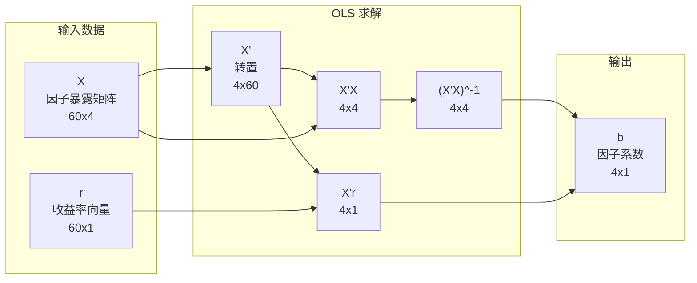

# Day 1：向量、矩阵与基本运算

> **总时长：** 2 小时
> **节奏：** 每 50 分钟休息 10 分钟
> **今日目标：** 看懂因子模型的矩阵写法 R = Xb + e，知道每个符号是什么、维度是多少
> **本文是完整讲义，包含所有知识点，不需要翻阅其他资料**

---

## 时间表

```
00:00 - 00:50  第一节：向量——从箭头到投资组合
00:50 - 01:00  休息
01:00 - 01:50  第二节：矩阵——从数表到因子模型
01:50 - 02:00  休息 + 自测
```

---

## 第一节：向量（50 分钟）

### 一、向量是什么

#### 1.1 三个视角

**向量 = 一组有序的数字。** 就这么简单。

但同一个向量可以从三个角度理解：

| 视角 | 怎么看 | 例子 |
|------|--------|------|
| 几何视角 | 从原点出发的箭头，有方向和长度 | 平面上的一个箭头 (3, 2) |
| 数据视角 | 一列数据 | 某只股票过去 3 个月的收益率 [+3%, -1%, +2%] |
| 代数视角 | 可以做加法和乘法的对象 | 两个组合的收益率相加 |

**因子投资中最常用的是数据视角。** 你不需要画箭头，只需要把向量看作"一列数字"。

> **需要记住的：** 向量就是一列数字，用方括号表示，如 [3, -1, 2]。

#### 1.2 为什么要学向量

因子投资中到处都是向量：

| 金融概念 | 对应的向量 | 例子 |
|---------|-----------|------|
| 一只股票的历史收益率 | T 维向量（T = 天数/月数） | 过去 60 个月的月收益率 |
| 投资组合的权重 | N 维向量（N = 股票数） | 300 只股票各自占多少比例 |
| 所有股票某个月的收益率 | N 维向量 | 5000 只 A 股本月的收益率 |
| 因子暴露 | N 维向量 | 5000 只 A 股的市值对数 |

#### 1.3 向量的基本运算

**加法：** 对应位置相加。

```
[3, -1, 2] + [1, 4, -3] = [4, 3, -1]
```

> 金融含义：如果你持有两只股票，它们的收益率分别是 [3%, -1%, 2%] 和 [1%, 4%, -3%]，那么"两只股票收益率之和"就是向量加法。（当然，实际组合收益率是加权求和，见下面的点积。）

**标量乘法：** 每个元素乘以同一个数。

```
2 × [3, -1, 2] = [6, -2, 4]
```

> 金融含义：如果你把仓位翻倍（权重从 w 变成 2w），收益率的贡献也翻倍。

#### 1.4 点积（内积）——今天最重要的运算

**点积 = 对应位置相乘，然后求和。**

```
[w1, w2, w3] · [r1, r2, r3] = w1*r1 + w2*r2 + w3*r3
```

这个运算在因子投资中无处不在，因为：

> **投资组合收益 = 权重向量 · 收益率向量**

**手算例子：**

你的投资组合持有 3 只股票：

| 股票 | 权重 w | 本月收益率 r |
|------|--------|------------|
| 茅台 | 50% | +4% |
| 宁德时代 | 30% | -2% |
| 招商银行 | 20% | +1% |

组合收益 = w · r = 0.50 × 4% + 0.30 × (-2%) + 0.20 × 1%

= 2.0% - 0.6% + 0.2%

= **1.6%**

这就是点积。权重向量 [0.50, 0.30, 0.20] 和收益率向量 [4%, -2%, 1%] 的点积 = 1.6%。

> **需要记住的：** 点积 = 对应位置相乘再求和。投资组合收益就是点积。

#### 1.5 向量的转置

**转置 = 把"一列"变成"一行"，或把"一行"变成"一列"。** 记号是右上角加 T 或撇号。

```
列向量:        转置后变成行向量:
[3]
[-1]    →     [3, -1, 2]
[2]
```

为什么需要转置？因为矩阵乘法对"行×列"有严格的维度要求。你会在很多公式里看到转置符号，比如：

- `w'r`（w 转置乘以 r）= 投资组合收益
- `X'X`（X 转置乘以 X）= 出现在回归公式中

现在不需要深究为什么公式长这样，只需要知道：**看到转置符号时，就是把行和列互换了。**

> **需要记住的：** 转置 = 行列互换。记号 `w'` 或 `w^T`。

#### 1.6 向量的维度

**向量有几个数字，就是几维。** 记号：n 维向量写作 R^n。

| 向量 | 维度 | 说明 |
|------|------|------|
| [3, -1] | 2 维（R^2） | 平面上的点 |
| [3, -1, 2] | 3 维（R^3） | 空间中的点 |
| 60 个月收益率 | 60 维（R^60） | 无法画图，但数学上完全一样 |
| 5000 只股票的权重 | 5000 维（R^5000） | 因子投资的日常 |

> 几何直觉在 2D/3D 有用，但因子投资中经常是几百、几千维。这时候不要试图"想象"，只要把向量当作"一列数字"来运算就行。

### 第一节完成检查

- [ ] 我知道向量就是一列有序的数字
- [ ] 我能说出因子投资中 3 个向量的例子（权重、收益率、因子暴露）
- [ ] 我能手算两个向量的点积
- [ ] 我能计算一个 3 只股票的投资组合的收益率（用点积）
- [ ] 我知道转置就是行列互换，记号是 `'` 或 `^T`

**休息 10 分钟。**

---

## 第二节：矩阵（50 分钟）

### 二、矩阵是什么

#### 2.1 从一只股票到多只股票

第一节我们用一个向量表示一只股票的历史收益率。那如果有 3 只股票、每只有 4 个月的数据呢？

```
              茅台    宁德    招行
1月          +4%     -2%     +1%
2月          -1%     +3%     +2%
3月          +2%     +1%     -1%
4月          +3%     -3%     +2%
```

**矩阵 = 把多个向量排在一起，形成一个数字表格。**

这个表格就是一个 4×3 矩阵（4 行 3 列），记作：

```
R = [ +4  -2  +1 ]
    [ -1  +3  +2 ]
    [ +2  +1  -1 ]
    [ +3  -3  +2 ]
```

> **金融含义：** 行 = 时间（每一行是一个月），列 = 股票（每一列是一只股票）。矩阵 R 把所有股票所有时间的收益率装在一个容器里。

#### 2.2 矩阵的维度

**m×n 矩阵 = m 行 n 列。** 永远先说行，再说列。

| 金融场景 | 矩阵维度 | 行代表 | 列代表 |
|---------|---------|--------|--------|
| 60 个月、300 只股票的收益率 | 60×300 | 月份 | 股票 |
| 5000 只股票、3 个因子的暴露 | 5000×3 | 股票 | 因子 |
| 300 只股票的协方差矩阵 | 300×300 | 股票 | 股票 |

> 因子投资中遇到的矩阵通常很大（几千行、几百列），但运算规则和 2×2 矩阵完全一样。

#### 2.3 矩阵乘法

矩阵乘法的规则看起来不太直觉，但它是有道理的。

**规则：(m×n) 乘以 (n×p) = (m×p)**

```
   A          B          C
(m×n)  ×  (n×p)  =  (m×p)
         ↑
      这两个必须相等
```

C 的第 (i,j) 个元素 = A 的第 i 行和 B 的第 j 列做点积。

**手算例子：**

```
A = [1  2]    B = [5]
    [3  4]        [6]

A × B = [1×5 + 2×6] = [17]
        [3×5 + 4×6]   [39]

维度检查：(2×2) × (2×1) = (2×1) ✓
```

> **为什么矩阵乘法这样定义？** 因为它对应的是"对每一行做点积"。上面的例子中，A 的第一行 [1, 2] 和 B 的 [5, 6] 做点积得到 17，A 的第二行 [3, 4] 和 B 的 [5, 6] 做点积得到 39。

**金融含义：**

如果 A 是 2 只股票的权重矩阵（两个不同的组合），B 是收益率向量，那么 A × B 就是两个组合各自的收益率。

```
A = [0.50  0.50]    B = [+4%]
    [0.80  0.20]        [-2%]

组合1收益 = 0.50×4% + 0.50×(-2%) = 1%
组合2收益 = 0.80×4% + 0.20×(-2%) = 2.8%

A × B = [1.0%]
        [2.8%]
```

> **需要记住的：** 矩阵乘法 = 左矩阵的每一行和右矩阵的每一列做点积。维度规则：内侧相等，外侧决定结果。

#### 2.4 矩阵转置

和向量转置一样，**矩阵转置 = 行变列、列变行**。

```
A = [1  2  3]       A' = [1  4]
    [4  5  6]            [2  5]
                         [3  6]

(2×3) 矩阵  →  转置后变成 (3×2) 矩阵
```

你会在因子模型的公式中反复看到转置。比如 `X'X`：

- X 是 T×K 矩阵（T 个月，K 个因子）
- X' 是 K×T 矩阵
- X'X 是 K×K 矩阵（维度检查：(K×T) × (T×K) = K×K）

> 现在不需要理解 X'X 为什么出现在回归公式里（Day 6 会详细讲），只需要能做维度检查。

#### 2.5 几个特殊矩阵

| 名称 | 长什么样 | 因子投资中哪里会见到 |
|------|---------|-------------------|
| 单位矩阵 I | 对角线是 1，其余是 0 | A × I = A，相当于"乘以 1" |
| 对角矩阵 | 只有对角线有值 | 独立风险模型（假设股票间无相关性） |
| 对称矩阵 | A = A'（转置等于自身） | 协方差矩阵一定是对称的 |

单位矩阵长这样：

```
I = [1  0  0]
    [0  1  0]
    [0  0  1]
```

> 对称矩阵意味着第 (i,j) 个元素等于第 (j,i) 个元素。协方差矩阵就是对称的，因为 Cov(A,B) = Cov(B,A)。

### 三、行列式

#### 3.1 直觉

**行列式 = 矩阵对空间的"缩放倍数"。**

一个 2×2 矩阵作用在平面上的一个单位正方形，会把它变成一个平行四边形。行列式就是这个平行四边形的面积（带正负号）。

- det > 0：面积放大了（或不变），方向没翻转
- det < 0：面积放大了，但方向翻转了（镜像）
- **det = 0：面积变成了 0——整个平面被压扁成了一条线甚至一个点**

> det = 0 是最重要的情况。它意味着信息丢失了，无法还原。

#### 3.2 计算（2×2 就够了）

2×2 矩阵的行列式：

```
A = [a  b]
    [c  d]

det(A) = a*d - b*c
```

**手算例子：**

```
A = [3  1]
    [2  4]

det(A) = 3×4 - 1×2 = 12 - 2 = 10

det ≠ 0 → 这个矩阵可以求逆
```

```
B = [2  4]
    [1  2]

det(B) = 2×2 - 4×1 = 4 - 4 = 0

det = 0 → 这个矩阵不可逆（第二行是第一行的一半，信息重复了）
```

#### 3.3 和因子投资的联系

> det = 0 在因子投资中意味着**完全多重共线性**。
>
> 比如你在因子模型中同时放入"市值"和"市值的 2 倍"作为两个因子，这两列完全线性相关，因子暴露矩阵的行列式为 0，回归就算不出来。
>
> 实际中不会这么极端，但因子之间高度相关（接近共线性）时，行列式接近 0，回归结果会变得不稳定。Day 7 会详细讲这个问题。

> **需要记住的：** det = 0 → 不可逆 → 回归算不出来。因子不能线性相关。

### 四、逆矩阵

#### 4.1 直觉

**逆矩阵 = "撤销"操作。**

如果矩阵 A 把空间做了某个变换（旋转、拉伸），那么 A 的逆矩阵 A^{-1} 就是把这个变换还原。

```
A × A^{-1} = I（单位矩阵）
```

翻译成人话：先做 A 变换，再做 A^{-1} 变换，等于什么都没做。

#### 4.2 什么时候不可逆

**det(A) = 0 时，A 不可逆。**

直觉：如果 A 把平面压扁成了一条线（丢失了一个维度的信息），你无法从一条线还原出原来的平面。

#### 4.3 计算（2×2 就够了）

```
A = [a  b]          A^{-1} = (1/det) × [ d  -b]
    [c  d]                              [-c   a]
```

**手算例子：**

```
A = [3  1]
    [2  4]

det(A) = 10（前面算过）

A^{-1} = (1/10) × [ 4  -1] = [0.4   -0.1]
                   [-2   3]   [-0.2   0.3]

验证：A × A^{-1} = [3×0.4+1×(-0.2)    3×(-0.1)+1×0.3 ] = [1  0] = I ✓
                    [2×0.4+4×(-0.2)    2×(-0.1)+4×0.3 ]   [0  1]
```

#### 4.4 和因子投资的联系

逆矩阵在因子投资中最重要的出场：**OLS 回归的求解公式**。

```
b = (X'X)^{-1} X'r
```

翻译成人话：
- X 是因子暴露矩阵
- r 是收益率向量
- (X'X)^{-1} 是"X 转置乘以 X"的逆矩阵
- 整个公式 = 求出最佳的因子系数 b

> 你不需要手算这个公式。Python 的 `numpy.linalg.solve()` 或 `statsmodels.OLS` 会帮你算。但你需要知道：**如果 X'X 不可逆（因子之间线性相关），这个公式就失效了。**

> **需要记住的：** 逆矩阵 = 撤销变换。不可逆 = 信息丢失。回归公式中用到了逆矩阵。

### 五、矩阵的秩

#### 5.1 直觉

**秩 = 矩阵中"真正独立"的行（或列）有几个。**

```
A = [1  2]    秩 = 2（两行独立）
    [3  4]

B = [1  2]    秩 = 1（第二行 = 第一行 × 2，只有1个独立方向）
    [2  4]
```

翻译成人话：秩告诉你"数据中有多少个独立的维度"。

#### 5.2 和因子投资的联系

| 情况 | 秩 | 含义 |
|------|-----|------|
| 3 个因子完全独立 | 秩 = 3 | 正常，回归可以做 |
| 3 个因子中有 2 个高度相关 | 秩 ≈ 2 | 多重共线性，回归不稳定 |
| 3 个因子中有 1 个是另外 2 个的线性组合 | 秩 = 2 | 完全共线性，回归失败（det = 0） |

> 秩 < 列数 → 多重共线性问题。Day 7 会详细讲怎么检测和处理。

> **理解即可：** 不需要手算矩阵的秩。知道"秩不够 = 因子有冗余"就行。

### 六、把它们串起来：因子模型的矩阵形式

这是今天的终极目标。我们来把 Fama-French 三因子模型写成矩阵形式。

#### 6.1 单只股票的因子模型（标量形式）

假设我们要检验某只股票的收益率能否被三个因子解释：

```
r_t = alpha + b1 * MKT_t + b2 * SMB_t + b3 * HML_t + e_t
```

- `r_t`：这只股票在第 t 个月的超额收益率（减去无风险利率后）
- `MKT_t`：市场因子在第 t 月的收益率
- `SMB_t`：规模因子在第 t 月的收益率（Small Minus Big）
- `HML_t`：价值因子在第 t 月的收益率（High Minus Low）
- `alpha`：截距项——因子解释不了的"超额收益"
- `b1, b2, b3`：因子载荷（这只股票对每个因子的敏感度）
- `e_t`：残差（噪声）

这是一个普通的多元回归方程。如果有 60 个月的数据，就有 60 个这样的等式。

#### 6.2 矩阵形式

把 60 个等式叠在一起：

```
r = X b + e
```

其中：

```
r = [r_1  ]     X = [1  MKT_1  SMB_1  HML_1]     b = [alpha]     e = [e_1 ]
    [r_2  ]         [1  MKT_2  SMB_2  HML_2]         [b1   ]         [e_2 ]
    [r_3  ]         [1  MKT_3  SMB_3  HML_3]         [b2   ]         [e_3 ]
    [ ... ]         [ ...                   ]         [b3   ]         [ ...]
    [r_60 ]         [1  MKT_60 SMB_60 HML_60]                        [e_60]
```

**维度检查：**

```
r:  60×1（60 个月的收益率）
X:  60×4（60 个月 × 4 列：截距 + 3 个因子）
b:  4×1 （4 个待估计的系数）
e:  60×1（60 个月的残差）

验证：X × b = (60×4) × (4×1) = (60×1) ✓ 和 r 的维度一致
```

> X 的第一列全是 1，这是截距项的"占位符"。看起来奇怪，但这是回归公式的标准写法——把截距 alpha 也当作一个"系数"，对应的"因子"是常数 1。

#### 6.3 OLS 求解

回归的目标：找到 b 使得残差 e = r - Xb 尽可能小。

OLS 的解：

```
b = (X'X)^{-1} X'r
```

维度检查：

```
X':    4×60
X'X:   (4×60)(60×4) = 4×4
(X'X)^{-1}: 4×4
X'r:   (4×60)(60×1) = 4×1
b:     (4×4)(4×1)   = 4×1 ✓
```

> **翻译成人话：** 这个公式从 60 个月的因子数据和收益率数据中，算出最优的 4 个系数 [alpha, b1, b2, b3]。
>
> alpha 是否显著不为零 → 这只股票有没有"因子解释不了的超额收益"。
> b1, b2, b3 的大小 → 这只股票对市场、规模、价值因子的敏感度。

#### 6.4 全景图



### 第二节完成检查

- [ ] 我知道矩阵就是把多个向量排成一个表格
- [ ] 我能做维度检查：(m×n)(n×p) = (m×p)
- [ ] 我能手算 2×2 矩阵乘以 2×1 向量
- [ ] 我知道行列式 = 0 意味着不可逆（信息丢失、因子共线）
- [ ] 我能手算 2×2 矩阵的行列式和逆矩阵
- [ ] 我能读懂因子模型 r = Xb + e 中每个符号的含义和维度
- [ ] 我能对 b = (X'X)^{-1}X'r 做维度检查

---

## 收尾：自测（10 分钟）

**自测 1：** 向量 [0.40, 0.35, 0.25] 和 [+5%, -3%, +2%] 的点积是多少？这个计算在金融中代表什么？

→ 你的答案：_______________

→ 正确：0.40×5% + 0.35×(-3%) + 0.25×2% = 2.0% - 1.05% + 0.5% = **1.45%**。代表投资组合的收益率（权重 × 收益率）。

---

**自测 2：** (3×5) 矩阵乘以 (5×2) 矩阵，结果是几乘几？

→ 你的答案：_______________

→ 正确：**(3×2)**。内侧的 5 必须相等（消掉），外侧 3 和 2 决定结果维度。

---

**自测 3：** 矩阵 A 是 60×4，向量 b 是 4×1，A×b 的结果维度是？这在因子模型中代表什么？

→ 你的答案：_______________

→ 正确：**60×1**。代表模型预测的 60 个月的收益率（Xb = 因子能解释的部分）。

---

**自测 4：** 计算行列式。A = [[4, 2], [1, 3]]，det(A) = ？

→ 你的计算：_______________

→ 正确：4×3 - 2×1 = **10**。

---

**自测 5：** 矩阵 B = [[3, 6], [1, 2]]，det(B) = ？这意味着什么？

→ 你的计算：_______________

→ 正确：3×2 - 6×1 = **0**。意味着 B 不可逆，第二行是第一行的某个倍数（信息冗余），对应因子投资中的完全多重共线性。

---

**自测 6：** 求矩阵 A = [[4, 2], [1, 3]] 的逆矩阵。

→ 你的计算：_______________

→ 正确：det = 10（自测 4 已算），A^{-1} = (1/10) × [[3, -2], [-1, 4]] = **[[0.3, -0.2], [-0.1, 0.4]]**。

---

**自测 7：** 在因子模型 r = Xb + e 中，如果有 120 个月的数据、5 个因子（含截距），X 的维度是？b 的维度是？

→ 你的答案：_______________

→ 正确：X 是 **120×5**，b 是 **5×1**。

---

**自测 8：** 转置一个 (3×2) 矩阵后，维度变成？

→ 你的答案：_______________

→ 正确：**(2×3)**。行列互换。

---

**自测 9：** 为什么协方差矩阵一定是对称矩阵？（用一句话回答）

→ 你的答案：_______________

→ 正确：因为 Cov(A,B) = Cov(B,A)，所以矩阵的第 (i,j) 个元素等于第 (j,i) 个元素。

---

**自测 10：** 什么情况下 OLS 回归公式 b = (X'X)^{-1}X'r 会失效？用因子投资的语言描述。

→ 你的答案：_______________

→ 正确：当 X'X 不可逆时（det = 0），即**因子之间存在完全线性相关**（完全多重共线性）时，回归无法求解。

---

### 评分标准

| 得分 | 状态 |
|------|------|
| 9-10 题 | 线性代数基础扎实，明天继续 |
| 7-8 题 | 不错，回看错误的部分 |
| 5-6 题 | 需要重点复习第二节（矩阵运算和因子模型部分） |
| < 5 题 | 建议重新阅读本讲义，配合 3Blue1Brown Ep 1-6 观看 |

---

## 今天不需要记住的内容

| 内容 | 为什么不需要 |
|------|------------|
| 3×3 以上矩阵的行列式计算 | 实际中用 `numpy.linalg.det()` |
| 3×3 以上矩阵的逆矩阵计算 | 实际中用 `numpy.linalg.inv()` 或更好的 `numpy.linalg.solve()` |
| 矩阵乘法的结合律、分配律等代数性质 | 了解即可，不需要证明 |
| 线性变换的几何意义 | 对因子投资不直接有用，感兴趣可以看 3Blue1Brown |
| 线性无关的严格定义 | 知道"不能被其他向量表示"的直觉就够了 |

---

## 明天预告

明天学特征值与协方差矩阵。

特征值回答的问题是："一个矩阵在哪些方向上只做拉伸不做旋转？拉伸了多少倍？"

这直接对应投资组合的风险分解——协方差矩阵的特征值告诉你"风险最大的方向是什么、那个方向上风险有多大"。这就是 PCA（主成分分析）的数学基础。
