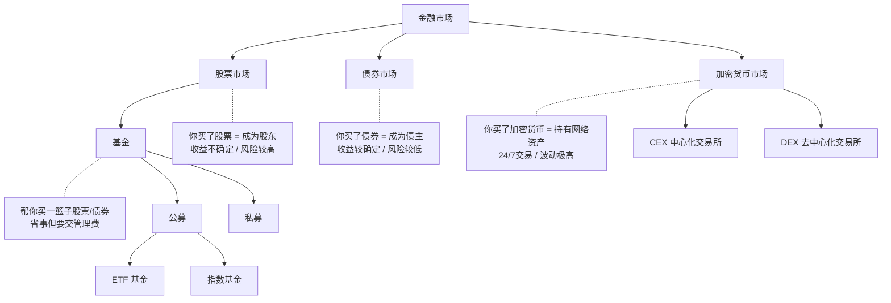

# Day 1：金融市场全貌 + 向量与矩阵

> 总时长：4 小时
> 节奏：每 50 分钟休息 10 分钟（番茄钟）
> 今日目标：搞懂"钱投进去后发生了什么"（传统金融+加密货币），复习向量/矩阵的直觉

---

## 时间表总览

```
00:00 - 00:50  [金融 第1节] 股票基本概念 + 两种定价理论（坚实基础 vs 空中楼阁）
00:50 - 01:00  休息
01:00 - 01:50  [金融 第2节] 债券、基金和加密货币——三种不同的投资品
01:50 - 02:00  休息
02:00 - 02:50  [数学 第1节] 向量是什么？线性组合是什么？
02:50 - 03:00  休息
03:00 - 03:50  [编码 第1节] 搭建项目环境 + Jupyter 验证向量运算
03:50 - 04:00  休息
04:00 - 04:30  [收尾] 整理笔记 + 自测
```

---

## 第一节：股票与两种定价理论（60 分钟）

### 步骤 1：先建立基本概念（15 分钟）

在读书之前，先通过搜索快速了解股票的基本概念：

**搜索 1**："股票入门 什么是股票 知乎"
- 找一篇高赞回答，快速浏览
- 核心理解：**股票 = 公司所有权的一小份**。你买了 100 股茅台，就拥有了茅台极小一部分的所有权
- 赚钱方式：(1) 资本利得（低买高卖）(2) 股息/分红

**搜索 2**："A股 一共有多少只股票"
- 记下这个数字（截至目前大约 5000+ 只）
- 感受一下：因子投资就是要从这 5000 多只股票里系统性地选出好的

**搜索 3**："上证指数 是什么"
- 理解"指数"的概念：用一个数字代表一篮子股票的整体涨跌
- 记住几个关键指数名称：上证指数、沪深300、中证500

### 步骤 2：阅读《漫步华尔街》第 1 章（35 分钟）

打开《漫步华尔街》（A Random Walk Down Wall Street），阅读**第 1 章**。

> 如果没有纸质书，可以用以下替代方案（任选一个）：
> - 微信读书搜索"漫步华尔街"
> - 京东读书 / 豆瓣阅读电子版
> - B站搜索"漫步华尔街 讲解"看一个 20-30 分钟的拆书视频

第 1 章介绍了股票定价的**两大理论流派**。阅读时带着以下问题，在笔记本上写下答案：

```
问题 1："坚实基础理论"（Firm Foundation Theory）的核心观点是什么？
→ 用自己的话写 2-3 句。
  参考答案：每只股票（或任何投资品）都有一个"内在价值"，
  可以通过分析公司的未来盈利、分红等基本面来计算。
  当市场价格低于内在价值时买入，高于时卖出。
  代表人物：格雷厄姆（Benjamin Graham）、巴菲特（Warren Buffett）。

问题 2："空中楼阁理论"（Castle-in-the-Air Theory）的核心观点是什么？
→ 用自己的话写 2-3 句。
  参考答案：不需要关心股票的"真实价值"，
  重要的是判断大众心理——别人愿意出多少钱买。
  赚钱的关键是比别人更早判断出市场情绪的变化。
  代表人物：凯恩斯（John Maynard Keynes）。

问题 3：这两种理论和因子投资有什么关系？
→ 思考一下，写下你的理解。
  参考答案：
  - 坚实基础理论 → 对应"价值因子"：寻找被低估的股票
  - 空中楼阁理论 → 对应"动量因子"：跟随市场情绪/趋势
  因子投资某种程度上是把这两种思路都系统化、量化了。

问题 4：作者 Merta 自己倾向于哪种观点？
→ 用一句话总结。
  参考答案：作者认为市场在大多数时候是有效的（随机漫步），
  两种理论各有道理但都不完美。
```

### 步骤 3：补充搜索（10 分钟）

**搜索 4**："股票 债券 基金 区别 一张图"
- 找一张对比图，截图保存到笔记里

**搜索 5**："坚实基础理论 空中楼阁理论 区别"
- 如果读书时某些概念没看懂，搜索中文解读加深理解

### 步骤 1-3 完成后，你应该能回答：
- [x] 股票是什么？→ 公司所有权的一份
- [x] 坚实基础理论的核心？→ 股票有内在价值，基于基本面分析
- [x] 空中楼阁理论的核心？→ 价格由市场心理驱动，判断别人怎么想
- [x] 什么是指数？→ 一篮子股票的价格加权平均

**休息 10 分钟，站起来走走。**

---

## 第二节：债券、基金和加密货币（60 分钟）

### 步骤 3：通过搜索了解债券和基金（25 分钟）

> 《漫步华尔街》不讲"债券/基金是什么"这类入门概念，
> 所以这部分通过搜索来学习，效率更高。

**搜索 1**："债券是什么 入门 知乎"（8 分钟）
- 找一篇高赞回答，阅读并在笔记本上写下答案：

```
问题 6：债券是什么？和股票最大的区别是什么？
→ 参考答案：
  债券 = 你借钱给别人（公司或政府），对方承诺按时还本付息。
  股票 = 你成为公司的主人（所有权）
  债券 = 你成为公司的债主（债权）
  核心区别：股票收益不确定但上限高，债券收益较确定但上限低。
```

**搜索 2**："基金是什么 ETF 区别"（8 分钟）

```
问题 7：什么是基金？基金和直接买股票的区别？
→ 参考答案：
  基金 = 把很多人的钱凑在一起，交给专业的基金经理去投资。
  区别：自己买股票像自己做饭，买基金像点外卖。
  好处：分散风险、有专人管理。
  坏处：要交管理费、收益受基金经理水平影响。

问题 8：什么是 ETF？和普通基金的区别？
→ 参考答案：
  ETF（交易所交易基金）= 可以像股票一样在交易所买卖的基金。
  普通基金每天只能按收盘价申购/赎回，ETF 可以盘中实时买卖。
  很多 ETF 跟踪指数（如沪深300 ETF），属于被动投资。
```

**搜索 3**："股票 债券 基金 区别 一张图"（4 分钟）
- 找一张对比图，截图保存到笔记里

**搜索 4**："坚实基础理论 空中楼阁理论 区别"（5 分钟）
- 如果上一节读书时某些概念没看懂，搜索中文解读加深理解

### 步骤 4：了解加密货币市场（20 分钟）

打开浏览器，访问 Binance Academy（https://academy.binance.com）或搜索以下内容：

**搜索 1**："什么是比特币 Bitcoin 入门"（5 分钟）
- 比特币（BTC）= 第一个去中心化的数字货币，2009 年诞生
- 没有公司、没有董事会、没有财报——和股票完全不同
- 发行总量固定 2100 万枚，类似"数字黄金"

**搜索 2**："什么是以太坊 Ethereum"（5 分钟）
- 以太坊（ETH）= 可编程的区块链，支持智能合约
- 大量 DeFi（去中心化金融）和 NFT 项目建立在以太坊上
- ETH 是加密市场市值第二大的资产

**搜索 3**："CEX DEX 区别"（5 分钟）
- CEX（中心化交易所）= 类似传统股票交易所，如 Binance、OKX、Coinbase
- DEX（去中心化交易所）= 没有中间人，用户直接和智能合约交易，如 Uniswap
- 我们做因子投资主要在 CEX 上操作（流动性好、API 完善）

在笔记本上回答：

```
问题 9：加密货币和股票的核心区别是什么？（至少写 3 点）
→ 参考答案：
  (1) 股票背后是公司，加密货币背后是协议/网络（没有财报）
  (2) 股票有交易时间限制，加密货币 24/7 全年无休
  (3) 股票有涨跌停保护，加密货币没有（一天跌 50% 也可能）
  (4) 股票在受监管的交易所交易，加密货币监管程度因国家而异
  (5) 加密货币是 T+0（买了马上可以卖），A股是 T+1

问题 10：这四种投资品，风险从高到低排序？
→ 参考答案：加密货币 > 股票 > 基金 > 债券（一般情况下）
  加密货币的日波动率通常是股票的 3-5 倍
```

### 步骤 5：画一张关系图（15 分钟）

在笔记本上画出以下关系图（手画即可，不需要很漂亮）：



> 如果在 GitHub 上看这个文件，mermaid 图会自动渲染。
> 如果在本地看，可以把上面的结构理解为：
>
> | 层级 | 内容 | 说明 |
> |------|------|------|
> | 金融市场 | 股票市场 | 买股票 = 成为股东，收益不确定，风险较高 |
> | | 债券市场 | 买债券 = 成为债主，收益较确定，风险较低 |
> | | 加密货币市场 | 买币 = 持有网络资产，24/7交易，波动极高 |
> | | 基金 | 帮你买一篮子股票/债券，省事但要交管理费 |
> | 基金分类 | 公募 / 私募 | 公募门槛低，私募门槛高 |
> | 公募细分 | ETF 基金 / 指数基金 | 跟踪指数，属于被动投资 |
> | 加密交易方式 | CEX / DEX | CEX 类似传统交易所，DEX 无中间人 |

然后写下这句话，以后会反复用到：

> **因子投资的目标：用系统化的方法，从几千只股票/几百种加密货币中，
> 找出未来可能表现更好的那一批，构建一个投资组合。**

### 步骤 3-5 完成后，你应该能回答：
- [x] 债券和股票的本质区别？→ 债权 vs 所有权
- [x] 基金是什么？→ 帮你投资的"拼车"
- [x] ETF 和普通基金的区别？→ 能在盘中实时买卖
- [x] 加密货币和股票的区别？→ 无财报、24/7交易、T+0、无涨跌停、波动更大

**休息 10 分钟。**

---

## 第三节：向量是什么？线性组合是什么？（60 分钟）

### 步骤 6：看视频（50 分钟）

打开 B 站（或 YouTube），搜索 **"3Blue1Brown 线性代数的本质"**。

> B 站链接参考：搜索 "3Blue1Brown 线性代数" 找到合集
> 注意选**中文字幕**版本

依次观看以下 3 集：

```
第 1 集：向量究竟是什么？（约 10 分钟）
────────────────────────────────────
看完后在笔记上写下：
- 向量可以理解为：________________（从原点出发的箭头 / 一组有序数字）
- 二维向量 [3, 2] 的意思是：x 方向走 3 步，y 方向走 2 步
- 为什么程序员应该关心向量？
  → 因子投资中，每只股票在某个时间点的因子值就是一个向量
    比如 [市值, PE, 动量, ROE] = [500亿, 15, 0.2, 0.18]


第 2 集：线性组合、张成的空间与基（约 10 分钟）
────────────────────────────────────
看完后在笔记上写下：
- 线性组合的定义：a·v⃗ + b·w⃗，其中 a 和 b 是数字（标量）
- "张成的空间" 是什么意思？
  → 通过调整 a 和 b，所有可能的 a·v⃗ + b·w⃗ 组成的集合
- 这和投资有什么关系？
  → 投资组合就是各只股票收益率的线性组合：
    组合收益 = w1·r1 + w2·r2 + ... + wn·rn


第 3 集：矩阵与线性变换（约 12 分钟）
────────────────────────────────────
看完后在笔记上写下：
- 矩阵可以理解为：________________（一种线性变换/函数）
- 矩阵乘以向量 = 对向量做变换
- 2x2 矩阵的两列分别是变换后的基向量
```

### 步骤 7：手写练习（10 分钟）

在笔记本上手算以下题目（不用计算器，练手感）：

```
练习 1：向量加法
[2]   [1]   [?]
[3] + [4] = [?]
答案：[3, 7]

练习 2：标量乘法
    [2]   [?]
3 × [3] = [?]
答案：[6, 9]

练习 3：线性组合
      [1]       [0]   [?]
2  ×  [0]  + 3× [1] = [?]
答案：[2, 3]

练习 4：矩阵乘向量
[1  2] × [3] = [1×3 + 2×1] = [?]
[3  4]   [1]   [3×3 + 4×1]   [?]
答案：[5, 13]
```

### 步骤 6-7 完成后，你应该能回答：
- [x] 向量是什么？→ 一组有序数字 / 空间中的箭头
- [x] 线性组合是什么？→ 向量的标量倍数之和
- [x] 矩阵乘向量在做什么？→ 对向量做线性变换

**休息 10 分钟。**

---

## 第四节：搭建项目环境 + 验证向量运算（50 分钟）

### 步骤 8：搭建学习项目（15 分钟）

打开终端，逐条输入以下命令。**每输完一条确认输出正常后再输下一条。**

```bash
# ── 第 1 步：进入工作目录 ──
cd ~/Work/Trade/factor-investing-study

# 确认你在正确的位置
pwd
# 你应该看到：/Users/kai/Work/Trade/factor-investing-study
```

```bash
# ── 第 2 步：创建项目目录结构 ──
mkdir -p code/notebooks
mkdir -p code/data

# 确认目录创建成功
ls code/
# 你应该看到：data      notebooks
```

```bash
# ── 第 3 步：进入 code 目录，用 uv 初始化项目 ──
cd code
uv init

# 你应该看到类似：
# Initialized project `code`
# 会生成 pyproject.toml 等文件

ls
# 你应该看到：data  hello.py  notebooks  pyproject.toml  README.md
```

```bash
# ── 第 4 步：安装本阶段需要的核心依赖 ──
uv add numpy pandas matplotlib jupyter

# 这会花 1-2 分钟下载安装
# 安装完成后你应该看到类似：
# Resolved XX packages in XXs
# Installed XX packages in XXs
#  + jupyter x.x.x
#  + matplotlib x.x.x
#  + numpy x.x.x
#  + pandas x.x.x
```

```bash
# ── 第 5 步：验证安装成功 ──
uv run python -c "import numpy; import pandas; import matplotlib; print('全部安装成功!')"

# 你应该看到：全部安装成功!
```

```bash
# ── 第 6 步：启动 Jupyter Notebook ──
uv run jupyter notebook --notebook-dir=notebooks

# 浏览器会自动打开 Jupyter 页面
# 如果没有自动打开，手动复制终端中显示的 URL（带 token 的那个）到浏览器
```

> **从现在起，所有代码练习都在 Jupyter Notebook 里完成。**
> 每天新建一个 notebook，方便回顾。

### 步骤 9：新建 Notebook

在 Jupyter 页面中：
1. 点击右上角 **"New"** → **"Python 3"**
2. 点击最上方的 "Untitled" 重命名为 **"Week01_Day1_向量运算"**

### 步骤 10：跟着敲代码（30 分钟）

**一个代码块一个代码块地敲，不要复制粘贴。** 敲代码的过程就是在学习。
每个代码块下面都有"你应该看到"的输出，用来确认你敲对了。

```python
# ===== 第一段：导入 numpy =====
# numpy 是 Python 的数学库，做向量/矩阵运算全靠它
import numpy as np

print("numpy 导入成功，版本:", np.__version__)
```
你应该看到：`numpy 导入成功，版本: 1.xx.x`（具体版本号不重要）

---

```python
# ===== 第二段：创建向量 =====
# 在 numpy 里，向量就是一维数组

a = np.array([2, 3])       # 向量 a = [2, 3]
b = np.array([1, 4])       # 向量 b = [1, 4]

print("向量 a:", a)
print("向量 b:", b)
print("a 的维度:", a.shape)  # 应该是 (2,) 表示 2 维向量
```
你应该看到：
```
向量 a: [2 3]
向量 b: [1 4]
a 的维度: (2,)
```

---

```python
# ===== 第三段：向量加法 =====
# 对应位置相加：[2,3] + [1,4] = [3,7]

c = a + b
print("a + b =", c)

# 验证：和你手算的结果一样吗？
assert list(c) == [3, 7], "结果不对！"
print("✓ 验证通过")
```
你应该看到：
```
a + b = [3 7]
✓ 验证通过
```

---

```python
# ===== 第四段：标量乘法 =====
# 每个元素都乘以同一个数：3 × [2,3] = [6,9]

d = 3 * a
print("3 × a =", d)

assert list(d) == [6, 9], "结果不对！"
print("✓ 验证通过")
```
你应该看到：
```
3 × a = [6 9]
✓ 验证通过
```

---

```python
# ===== 第五段：线性组合 =====
# 2×[1,0] + 3×[0,1] = [2,3]
# 这就是"用基向量的线性组合表示任意向量"

e1 = np.array([1, 0])  # x 方向的基向量
e2 = np.array([0, 1])  # y 方向的基向量

result = 2 * e1 + 3 * e2
print("2×e1 + 3×e2 =", result)

assert list(result) == [2, 3], "结果不对！"
print("✓ 验证通过")
```
你应该看到：
```
2×e1 + 3×e2 = [2 3]
✓ 验证通过
```

---

```python
# ===== 第六段：矩阵乘向量 =====
# 矩阵 M 乘以向量 v = 对 v 做线性变换
#
# [1 2]   [3]   [1×3 + 2×1]   [5 ]
# [3 4] × [1] = [3×3 + 4×1] = [13]

M = np.array([[1, 2],
              [3, 4]])    # 2x2 矩阵

v = np.array([3, 1])      # 2 维向量

result = M @ v             # @ 是矩阵乘法运算符
print("M × v =", result)

assert list(result) == [5, 13], "结果不对！"
print("✓ 验证通过")
```
你应该看到：
```
M × v = [ 5 13]
✓ 验证通过
```

---

```python
# ===== 第七段：和投资的联系 =====
# 假设你持有 3 只股票，权重分别是 50%、30%、20%
# 今天 3 只股票的收益率分别是 2%、-1%、3%
# 你的组合收益率 = 权重向量 · 收益率向量（点积）

weights = np.array([0.5, 0.3, 0.2])          # 投资权重
returns = np.array([0.02, -0.01, 0.03])       # 今日收益率

portfolio_return = np.dot(weights, returns)    # 点积 = 加权求和
print(f"组合收益率: {portfolio_return:.4f}")
print(f"也就是: {portfolio_return*100:.2f}%")

# 手动验证: 0.5×0.02 + 0.3×(-0.01) + 0.2×0.03
#         = 0.01 - 0.003 + 0.006
#         = 0.013
print(f"手算验证: {0.5*0.02 + 0.3*(-0.01) + 0.2*0.03:.4f}")
```
你应该看到：
```
组合收益率: 0.0130
也就是: 1.30%
手算验证: 0.0130
```

> **这就是向量在投资中最基础的用途：组合收益 = 权重 · 收益率（向量点积）**

---

```python
# ===== 第八段：矩阵在投资中的含义（了解即可）=====
# 假设有 3 只股票 5 天的收益率数据
# 这就构成了一个 5×3 的矩阵（5行=5天，3列=3只股票）

returns_matrix = np.array([
    [0.02, -0.01,  0.03],   # 第1天
    [0.01,  0.02, -0.01],   # 第2天
    [-0.03, 0.01,  0.02],   # 第3天
    [0.02,  0.00,  0.01],   # 第4天
    [0.01, -0.02,  0.03],   # 第5天
])

print("收益率矩阵的形状:", returns_matrix.shape)  # (5, 3)
print("含义: 5天 × 3只股票")
print()

# 每只股票的平均收益率（沿着天数方向求平均）
mean_returns = returns_matrix.mean(axis=0)  # axis=0 表示沿行（天数）方向
print("3只股票的平均日收益率:", mean_returns)
print(f"  股票1: {mean_returns[0]*100:.2f}%")
print(f"  股票2: {mean_returns[1]*100:.2f}%")
print(f"  股票3: {mean_returns[2]*100:.2f}%")
```
你应该看到：
```
收益率矩阵的形状: (5, 3)
含义: 5天 × 3只股票

3只股票的平均日收益率: [ 0.006  0.     0.016]
  股票1: 0.60%
  股票2: 0.00%
  股票3: 1.60%
```

### 步骤 11：保存 Notebook

按 `Ctrl + S` 保存。文件已自动存储在 `code/notebooks/Week01_Day1_向量运算.ipynb`。

---

## 收尾：整理笔记 + 自测（20 分钟）

### 步骤 12：整理今日笔记

打开一个新文件（或纸质笔记本），写下：

```
# Day 1 学习笔记 - [今天的日期]

## 金融部分
1. 股票 = 公司所有权的一份，赚钱方式：资本利得 + 分红
2. 坚实基础理论 = 股票有内在价值，通过基本面分析判断 → 对应价值因子
3. 空中楼阁理论 = 价格由市场心理驱动，判断别人怎么想 → 对应动量因子
4. 债券 = 借钱给别人，收利息
5. 基金 = 把钱交给专业人士管理；ETF = 可以盘中买卖的基金
6. 加密货币 = 去中心化的数字资产（BTC、ETH等）
7. 加密 vs 股票：无财报、24/7交易、T+0、无涨跌停、波动更大
8. 风险排序：加密货币 > 股票 > 基金 > 债券
9. 因子投资 = 系统化地从几千只股票/几百种加密货币中选出好的组合

## 数学部分
1. 向量 = 一组有序数字，如 [2, 3]
2. 线性组合 = a·v + b·w
3. 矩阵 × 向量 = 线性变换
4. 投资组合收益 = 权重向量 · 收益率向量（点积）

## 今天写的代码
- numpy 创建向量：np.array([2, 3])
- 向量加法：a + b
- 标量乘法：3 * a
- 矩阵乘法：M @ v
- 点积（组合收益）：np.dot(weights, returns)
- 矩阵的形状：matrix.shape
- 按列求平均：matrix.mean(axis=0)

## 环境相关
- 用 uv init 初始化了项目
- uv add numpy pandas matplotlib jupyter 安装了依赖
- uv run jupyter notebook 启动 Jupyter
- Notebook 存放在 code/notebooks/ 目录下
```

### 步骤 13：自测（必须全部通过才算完成今天的学习）

拿一张白纸，不看任何资料，回答以下问题：

```
自测 1："坚实基础理论"和"空中楼阁理论"各自的核心观点？
→ 你的答案：_______________
→ 正确：坚实基础 = 股票有内在价值，基于基本面分析；
  空中楼阁 = 价格由市场心理驱动，关键是判断别人怎么想

自测 2：这两种理论分别对应因子投资中的什么因子？
→ 你的答案：_______________
→ 正确：坚实基础 → 价值因子（寻找被低估的股票）；
  空中楼阁 → 动量因子（跟随市场趋势/情绪）

自测 3：加密货币和股票有哪些关键区别？（至少说 3 点）
→ 你的答案：_______________
→ 正确：无财报、24/7交易、T+0、无涨跌停、波动更大、全球统一市场

自测 4：CEX 和 DEX 分别是什么？
→ 你的答案：_______________
→ 正确：CEX=中心化交易所（如Binance），DEX=去中心化交易所（如Uniswap）

自测 5：向量 [1,2] + [3,4] = ？
→ 你的答案：_______________
→ 正确：[4, 6]

自测 6：矩阵 [[1,0],[0,2]] × [3,4] = ？
→ 你的答案：_______________
→ 正确：[3, 8]（第一行 1×3+0×4=3，第二行 0×3+2×4=8）

自测 7：如果持有两只股票，权重 [0.6, 0.4]，
       收益率 [0.05, -0.02]，组合收益率是多少？
→ 你的答案：_______________
→ 正确：0.6×0.05 + 0.4×(-0.02) = 0.03 - 0.008 = 0.022 = 2.2%
```

**7 道全对**：今天的学习完美完成，明天继续！
**5-6 道对**：再看看错的部分对应的内容，搞懂了就行。
**4 道以下**：建议明天开始前先花 30 分钟复习今天的内容。

---

## 今天没听懂也不要慌的内容

以下概念今天只需要有个印象，后面几周会反复用到并逐渐深入：

| 概念 | 今天需要理解到什么程度 | 什么时候会深入 |
|------|---------------------|--------------|
| 线性变换 | 知道"矩阵乘向量=变换"就行 | 第 3 周（投资组合优化） |
| 张成的空间 | 知道有这个概念就行 | 第 11 周（因子正交化） |
| 基向量 | 知道 [1,0] 和 [0,1] 是二维空间的基 | 第 5 周（因子模型） |
| 指数基金 | 知道"跟踪指数"就行 | 第 4 周（被动投资 vs 主动投资） |
| 链上数据/NVT/MVRV | 知道"加密货币有自己的估值指标"就行 | 第 8 周（价值因子） |
| DeFi/智能合约 | 知道有这个概念就行 | 第 14 周（另类因子） |

---

## 明天预告

**Day 2** 会学习：
- **金融**：交易机制——你下单后发生了什么？A股交易规则 vs 加密交易所规则的对比
- **数学**：矩阵乘法、行列式、逆矩阵——为什么这些在投资中重要？

建议今晚睡前花 5 分钟回忆今天学了什么，不用翻笔记，能想起多少算多少。
这叫"间隔回忆"，是最有效的记忆方法。
