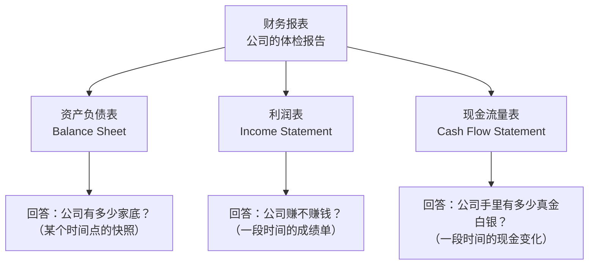
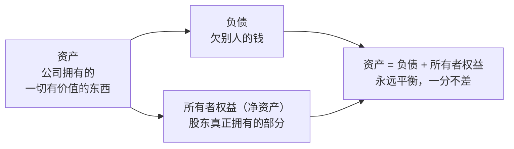
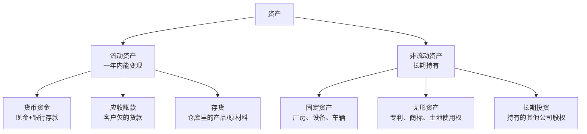
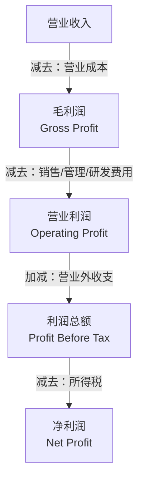
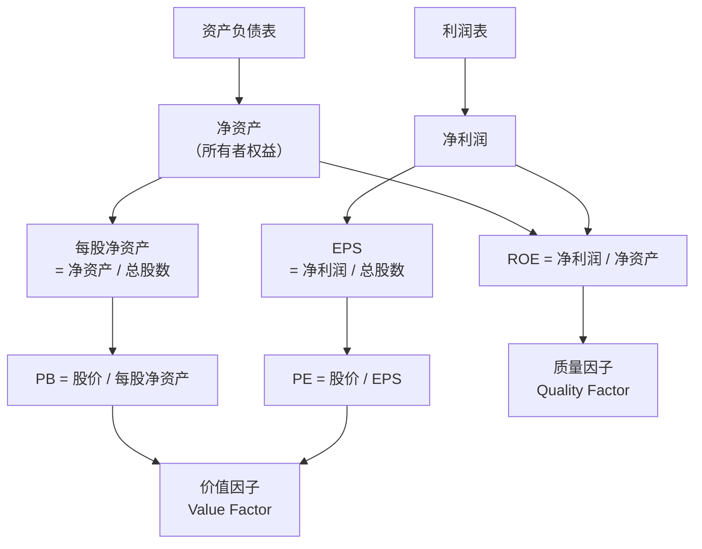

# Day 3：资产负债表与利润表

> **总时长：** 2 小时
>
> **节奏：** 每 50 分钟休息 10 分钟
>
> **今日目标：** 看懂一家上市公司的"家底"（资产负债表）和"赚钱能力"（利润表），理解 PE、PB、EPS 这些指标到底怎么来的
>
> **本文是完整讲义，包含所有知识点，不需要翻阅其他资料**

---

## 时间表

```
00:00 - 00:50  [第1节] 财报入门 + 资产负债表
00:50 - 01:00  休息
01:00 - 01:50  [第2节] 利润表 + 两张表的联系
01:50 - 02:00  [收尾] 自测
```

---

## 第一节：财报入门 + 资产负债表（50 分钟）

### 一、为什么要学财务报表

#### 1.1 一句话定义

**财务报表 = 一家公司的"体检报告"，用标准化的格式记录公司的财务状况。**

你去医院体检，医生会出一份报告：血压多少、血糖多少、各项指标是否正常。上市公司也一样——每年必须出一份"体检报告"（年度报告），告诉所有投资者：我有多少钱、欠多少债、今年赚了多少。

#### 1.2 三张表各回答什么问题

一套完整的财务报表包含**三张核心表**，每张回答一个根本问题：



| 表 | 核心问题 | 时间特征 |
|---|---------|---------|
| **资产负债表** | 公司**有什么**（资产）、**欠什么**（负债）、股东**真正拥有多少**（净资产） | **时间点**（比如 12月31日那天的状态） |
| **利润表** | 这段时间**赚了多少钱**，怎么赚的 | **时间段**（比如 1月1日到12月31日） |
| **现金流量表** | 实际**收到/花出**了多少现金 | **时间段** |

> **为什么要三张表，一张不够吗？** 因为它们看问题的角度不同。一家公司可能"账面上赚了 1 亿"（利润表好看），但实际到手的现金只有 3000 万（现金流量表一般），同时欠了 5 亿债（资产负债表揭示风险）。只看一张表会被骗。

> 今天学前两张（资产负债表 + 利润表），Day 4 学现金流量表和综合分析。

#### 1.3 和因子投资的关系

Day 1 提到过 PE 和 PB，当时只给了直觉。现在可以揭示它们的来源了：

| 指标 | 全称 | 公式 | 分子来自 | 分母来自 | 衡量什么 |
|------|------|------|---------|---------|---------|
| **PB**（市净率） | Price-to-Book ratio | $\text{股价} / \text{每股净资产}$ | 股票市场 | **资产负债表** | 家底贵不贵 |
| **PE**（市盈率） | Price-to-Earnings ratio | $\text{股价} / \text{EPS}$ | 股票市场 | **利润表** | 赚钱能力贵不贵 |
| **ROE**（净资产收益率） | Return On Equity | $\text{净利润} / \text{净资产}$ | **利润表** | **资产负债表** | 股东的钱用得好不好 |

> **缩写怎么记？** Book 指 Book Value（账面价值），就是资产负债表上的净资产；Earnings 指净利润；Equity 在 ROE 里指所有者权益（净资产）。

> 这三个指标是构造**价值因子**和**质量因子**的核心原料。今天学完财报，你就知道这些数字从哪来、什么意思了。

#### 1.4 在哪里看上市公司的财报

你不需要买书、不需要去公司要——所有上市公司的财报都是**公开免费**的：

| 渠道 | 说明 | 适合 |
|------|------|------|
| **巨潮资讯网**（cninfo.com.cn） | 证监会指定的信息披露网站，最官方 | 看原始 PDF 文件 |
| **东方财富网** | 在个股页面点"财务分析"，数据已整理成表格 | 快速查看关键数字 |
| **同花顺/雪球** | 类似东方财富，移动端体验好 | 手机上随便翻翻 |

> **小白提示：** 你现在不需要真去看。后面编程实战阶段会用代码自动获取财务数据（通过 Tushare 或 AkShare 等 Python 库），比手动翻方便得多。今天只需要理解财报的结构和含义。

**上市公司什么时候发财报？**

| 报告类型 | 覆盖时间段 | 披露截止日期 |
|---------|----------|------------|
| **一季报** | 1-3 月 | 4月30日前 |
| **半年报（中报）** | 1-6 月 | 8月31日前 |
| **三季报** | 1-9 月 | 10月31日前 |
| **年报** | 1-12 月 | 次年4月30日前 |

四份报告都**必须发布**，但可靠性不同：只有**年报必须经过外部审计**（由会计师事务所独立审核），其他三份是公司自己编的，数据可靠性相对低一些。因子投资中用年度数据构造因子，数据质量最高；用季度数据更及时，但要承担未经审计的风险。

> 注意：财报覆盖的时间段和实际披露日期之间有**时间差**。比如 2024 年的年报，最晚到 2025 年 4 月才出来。
> 这个时间差在因子投资中非常重要——你不能用"未来的数据"来做"过去的决策"，否则就是**前视偏差（Look-Ahead Bias）**。
> 回测时必须确保：用来计算因子的财务数据，在调仓日已经公开发布了。

---

### 二、资产负债表

#### 2.1 最核心的公式

**会计恒等式：**

$$\text{资产} = \text{负债} + \text{所有者权益}$$

这是整个会计学的基石，叫**会计恒等式**。它永远成立，一分钱都不能差。

**直觉类比：** 你买了一套 300 万的房子。你自己出了 100 万首付，银行贷款 200 万。

```
房子（资产）300万 = 贷款（负债）200万 + 你自己出的钱（所有者权益）100万
```

不管房价涨跌，这个等式永远平衡。如果房价涨到 400 万：
```
房子（资产）400万 = 贷款（负债）200万 + 你的权益（所有者权益）200万
```
涨的 100 万归你（所有者权益增加），和银行没关系。

> **所有者权益还有一个更直白的名字：净资产。**
>
> 净资产 = 资产 - 负债 = 你把所有东西卖掉、把所有债还清后，真正属于股东的部分。
>
> 这两个词是同一个东西，只是场合不同：财报上写"所有者权益"，日常讨论写"净资产"。



#### 2.2 资产端：公司有什么

资产就是公司拥有的"值钱的东西"。按照用途和变现速度，分成几大类：



逐一解释每类资产：

**货币资金**（最重要的流动资产）

**货币资金 = 公司手里的现金 + 银行存款 + 其他随时能用的钱。**

相当于你钱包里的现金 + 银行卡余额 + 余额宝里的钱。

> 一家公司货币资金充裕，说明"手头宽裕"、不容易因为缺钱而出问题。
> 但货币资金太多也不好——说明公司找不到好的投资机会，钱闲着。
>
> 茅台的货币资金常年在 **600-700 亿元**以上。一家酒厂账上趴着几百亿现金，这就是印钞机。

**应收账款**

**应收账款 = 东西卖出去了，但钱还没收到。**

你开了一家小店，把 1 万块的货卖给了隔壁公司，约定 3 个月后付款。这 1 万块在你的财报上就是"应收账款"。

> 应收账款**不是越多越好**——多了说明客户老是拖欠货款，公司收不回钱。
> 极端情况下，客户破产了不给钱，这笔账就变成**坏账**（钱要不回来了）。

**存货**

**存货 = 仓库里还没卖掉的东西。**

- 对茅台来说：存货 = 存放的白酒（越放越值钱）
- 对服装公司来说：存货 = 仓库里的衣服（过季就不值钱了）

> 同样是"存货"，对不同行业的含义完全不同。茅台的存货是资产，服装公司的存货可能是负担。

**固定资产**

**固定资产 = 公司用来生产经营的"硬件"：厂房、设备、车辆等。**

- 制造业公司（比亚迪）：固定资产很多（工厂、生产线）
- 互联网公司（腾讯）：固定资产相对少（主要是服务器）

> 固定资产会**折旧**——一台 100 万的设备，用 10 年，每年在利润表上扣 10 万的折旧费。
> 但这 10 万不是真金白银的支出（钱已经在买设备时花了），这是利润和现金差异的一个重要来源。

**无形资产**

**无形资产 = 看不见但有价值的东西：专利、商标、土地使用权等。**

> 中国的土地属于国有，公司买的只是"土地使用权"（通常 40-70 年），计入无形资产。

#### 2.3 负债端：公司欠什么

负债就是公司欠别人的钱，按还款期限分为两类：

| 类别 | 定义 | 常见项目 |
|------|------|---------|
| **流动负债** | 一年内要还的 | 短期借款、应付账款、预收款项 |
| **非流动负债** | 一年以上才还的 | 长期借款、应付债券 |

几个重要的负债项目：

**应付账款**

**应付账款 = 公司买了东西，但钱还没给。**

和"应收账款"正好反过来。你从供应商那里进了 1 万块的原材料，约定 3 个月后付款，这 1 万就是你的应付账款。

> 应付账款多不一定是坏事。对于强势企业（比如茅台、苹果），供应商愿意让它们晚付款，
> 这说明公司在产业链中有话语权。用别人的钱做自己的生意，这叫**经营杠杆**。

**预收款项（合同负债）**

**预收款项 = 钱已经收了，但东西还没交。**

茅台的经销商要先付款，再等茅台发货。这笔钱对茅台来说是"预收款项"——钱收了但还"欠"对方货。

> 预收款项多往往是好事——说明产品**供不应求**，客户抢着付钱排队买。

**有息负债 vs 无息负债**

这是一个重要的区分：

| 类型 | 定义 | 例子 | 好坏 |
|------|------|------|------|
| **有息负债** | 要付利息的 | 银行贷款、公司债 | 有成本、有压力 |
| **无息负债** | 不用付利息的 | 应付账款、预收款项 | 相当于免费用别人的钱 |

> 看一家公司的负债，不能只看总数，更要看**有息负债占多少**。
> 茅台的负债主要是预收款项（无息），几乎没有有息负债——不需要借钱，有人抢着把钱送来。

#### 2.4 所有者权益：股东真正拥有多少

**所有者权益：**

$$\text{所有者权益} = \text{资产} - \text{负债}$$

它的主要组成部分：

| 项目 | 含义 |
|------|------|
| **实收资本（股本）** | 股东投入的本金（发行股票时收到的钱） |
| **资本公积** | 股票发行溢价（股票卖了 10 元，面值 1 元，多出的 9 元算这里） |
| **盈余公积** | 从历年利润中按规定提取的留存 |
| **未分配利润** | 历年赚的钱中，还没分给股东的部分（最重要的组成部分） |

> 未分配利润是所有者权益中最值得关注的——它代表公司**历年累积的赚钱能力**。
> 未分配利润持续增长的公司，说明它在不断赚钱、不断积累。

#### 2.5 用茅台的真实数据看资产负债表

下面用贵州茅台 2023 年年报的数据来实际看一遍（数字取近似值）：

**茅台资产端（简化）：**

| 资产项目 | 金额（亿元） | 说明 |
|---------|:----------:|------|
| 货币资金 | ~700 | 账上现金极多，"不差钱" |
| 应收账款 | ~0 | 几乎为零！经销商先付钱，茅台不赊账 |
| 存货 | ~400 | 主要是储存中的白酒，越存越值钱 |
| 固定资产 | ~180 | 酿酒车间、厂房 |
| 其他资产 | ~1120 | 在建工程、投资等 |
| **资产合计** | **~2400** | |

**茅台负债 + 权益端（简化）：**

| 项目 | 金额（亿元） | 说明 |
|------|:----------:|------|
| 应付账款 | ~50 | 欠供应商的 |
| 合同负债（预收款） | ~140 | 经销商预付的货款 |
| 其他负债 | ~510 | 应交税费等 |
| **负债合计** | **~700** | 注意：几乎没有银行贷款（有息负债极少） |
| **所有者权益** | **~1700** | 这就是"净资产" |
| **负债 + 权益** | **~2400** | = 资产合计，完美平衡 |

> 验证会计恒等式：资产 2400 = 负债 700 + 所有者权益 1700。

从这张表能看出什么？
- **应收账款接近零** → 产品强势，不赊账
- **货币资金 700 亿** → 现金充裕到"花不完"
- **有息负债几乎为零** → 完全不需要借钱
- **所有者权益 1700 亿** → 股东的"家底"非常厚

> 这就是为什么茅台被称为"A 股之王"——从资产负债表就能看出它是一台印钞机。

#### 2.6 和因子投资的关系：PB（市净率）

现在你理解了"净资产（所有者权益）"，就能真正理解 PB 了：

**PB（市净率）：**

$$\text{PB} = \frac{\text{股价}}{\text{每股净资产}}$$

```
每股净资产 = 所有者权益 / 总股数
           = 1700 亿 / 12.6 亿股
           ≈ 135 元

茅台 PB   = 股价 1500 元 / 每股净资产 135 元
           ≈ 11.1
```

PB = 11.1 意味着：你花 **11 块钱**才能买到茅台 **1 块钱的净资产**。很贵！

再看一个反例——**工商银行：**

```
工商银行每股净资产 ≈ 10 元
工商银行股价      ≈ 5 元
工商银行 PB       = 5 / 10 = 0.5
```

PB = 0.5 意味着：你花 **5 毛钱**就能买到工商银行 **1 块钱的净资产**。打了五折！

| 公司 | 股价 | 每股净资产 | PB | 含义 |
|------|:----:|:--------:|:--:|------|
| 贵州茅台 | ~1500 元 | ~135 元 | ~11 | 市场认为茅台的品牌、盈利能力远超账面资产 |
| 工商银行 | ~5 元 | ~10 元 | ~0.5 | 市场认为银行的资产质量有折扣（坏账风险） |

> **PB < 1 就一定便宜吗？** 不一定。银行 PB 低是因为市场担心它的贷款收不回来（账面资产"注水"）。
> PB 低可能是真便宜，也可能是"便宜有便宜的道理"——这就是 Day 1 说的**"价值陷阱"**。

> **因子投资怎么用 PB？** 价值因子策略之一：把所有股票按 PB 从低到高排列，买入 PB 最低的一组，卖出 PB 最高的一组。
> 学术研究发现，长期来看低 PB 的股票组平均收益高于高 PB 的股票组。这就是**价值溢价**。
> 我们在因子投资阶段会详细讲解，编程实战阶段会用代码实现这个策略。

---

### 第一节完成检查

- [x] 知道三张财务报表各回答什么问题
- [x] 记住会计恒等式：资产 = 负债 + 所有者权益
- [x] 知道"净资产"和"所有者权益"是同一个东西
- [x] 能说出资产端几个重要项目（货币资金、应收账款、存货、固定资产）
- [x] 知道有息负债和无息负债的区别
- [x] 能用茅台的数据验证会计恒等式
- [x] 理解 PB 的公式和含义
- [x] 知道 PB < 1 不一定是便宜

**休息 10 分钟。**

---

## 第二节：利润表 + 两张表的联系（50 分钟）

### 三、利润表

#### 3.1 利润表的核心逻辑

**利润表回答的问题：这段时间内，公司赚了多少钱？**

利润表的核心逻辑极其简单：

**利润公式：**

$$\text{收入} - \text{成本费用} = \text{利润}$$


**直觉类比：** 你开了一家煎饼摊：
- 今天卖了 200 个煎饼，每个 10 元 → **营业收入 2000 元**
- 面粉、鸡蛋、薄脆花了 600 元 → **营业成本 600 元**
- 摊位租金 200 元、水电费 50 元 → **费用 250 元**
- **利润 = 2000 - 600 - 250 = 1150 元**

上市公司的利润表逻辑完全一样，只是数字大得多、项目更细。

#### 3.2 营业收入

**营业收入 = 公司通过主营业务卖东西/提供服务赚到的总金额。**

- 茅台的营业收入 = 卖白酒收到的钱
- 腾讯的营业收入 = 游戏充值 + 广告费 + 金融科技收入
- 比亚迪的营业收入 = 卖汽车 + 卖电池收到的钱

> **营收增长是公司成长的第一信号。** 如果一家公司的营收连续几年下降，说明产品卖不动了，通常不是好兆头。

> **"营业收入"和"到手的现金"不一样。** 你卖了 100 万的货，但客户说 3 个月后付钱。
> 利润表上记 100 万营收（因为交易已完成），但现金流量表上这 100 万还没到账。
> 这就是"利润"和"现金"可能不一致的原因之一。

#### 3.3 四个层次的利润

利润不是一个数字，而是**层层递减**的：



逐层解释：

**第一层：毛利润**

**毛利润：**

$$\text{毛利润} = \text{营业收入} - \text{营业成本}$$

营业成本是"直接和生产产品相关的支出"：原材料、直接人工、制造费用。

```
茅台2023年：
营业收入    ≈ 1500 亿
营业成本    ≈ 130 亿
毛利润      ≈ 1370 亿
毛利率      = 1370 / 1500 ≈ 91%
```

**毛利率 91%** 意味着：卖 100 块钱的茅台酒，原材料成本只有 9 块钱。剩下 91 块是"毛赚"。

> **毛利率是判断生意好坏的第一指标。** 不同行业差异巨大：

| 行业 | 毛利率参考 | 说明 |
|------|:--------:|------|
| 高端白酒（茅台） | ~90% | 品牌溢价极高 |
| 软件/互联网 | 60-80% | 边际成本低（见下方解释） |
| 制造业（汽车） | 15-25% | 原材料和人工占比大 |
| 零售/超市 | 15-25% | 商品加价空间小 |
| 航空公司 | 5-15% | 燃油和人力成本高 |

> **什么是边际成本？** 边际成本 = 多生产/多服务一个单位产品所增加的成本。
> 腾讯开发一款游戏花了 1 亿（研发成本），但第 1 个用户玩和第 100 万个用户玩，服务器成本几乎没差别——每多一个用户的额外成本接近零，所以毛利率很高。
> 对比汽车厂：每多造一台车，就要多花一份钢材、电池、人工的钱，边际成本高，毛利率就低。

> **和因子投资的关系：** 毛利率稳定且高的公司，通常具有**竞争护城河**（品牌、专利、规模效应）。
> 这类公司在**质量因子（Quality Factor）** 的筛选中往往得分高。

**第二层：营业利润**

**营业利润：**

$$\text{营业利润} = \text{毛利润} - \text{三费}$$

毛利润只扣了"生产成本"，但公司还有其他花钱的地方：

| 费用 | 包含什么 | 茅台的例子 |
|------|---------|----------|
| **销售费用** | 广告、促销、销售人员工资 | 广告和市场活动费用 |
| **管理费用** | 办公室租金、管理层薪酬、行政开支 | 行政管理人员成本 |
| **研发费用** | 新产品研发、技术投入 | 酿酒工艺研究（金额很小） |

> **"三项费用"（也叫"期间费用"）是区分"赚钱"和"会花钱"的关键。**
> 有些公司毛利率很高，但销售费用巨大（狂打广告），导致营业利润并不高。

```
茅台2023年：
毛利润      ≈ 1370 亿
三项费用    ≈ 100 亿（茅台几乎不需要打广告）
营业利润    ≈ 1050 亿
```

**第三层：利润总额**

**利润总额：**

$$\text{利润总额} = \text{营业利润} + \text{营业外收支}$$

营业外收支是和主营业务无关的一次性事件：政府补贴、罚款、资产处置损益等。

> 大多数情况下，营业外收支金额不大，利润总额和营业利润差别不会太大。

**第四层：净利润**

**净利润：**

$$\text{净利润} = \text{利润总额} - \text{所得税}$$

中国企业所得税标准税率是 **25%**。高新技术企业可以享受 **15%** 的优惠税率。

```
茅台2023年：
利润总额    ≈ 1050 亿
所得税      ≈ 260 亿（税率约25%）
净利润      ≈ 750 亿
```

> **净利润是投资者最关注的"底线数字"。** PE 里的"E"（Earnings）指的就是净利润。

#### 3.4 非经常性损益

利润表里有一个很容易被忽视但很重要的概念：

**非经常性损益 = 一次性的、不会年年发生的收入或支出。**

常见的非经常性损益：

| 项目 | 例子 | 特点 |
|------|------|------|
| 政府补贴 | 收到地方政府给的 5000 万产业扶持资金 | 明年不一定有 |
| 处置资产收益 | 卖掉一栋闲置厂房赚了 2 亿 | 厂房只有一栋，卖完就没了 |
| 诉讼赔偿 | 打官司赔了 1 亿 | 不会每年都打同样的官司 |
| 投资收益 | 持有的其他公司股票涨了，卖掉赚钱 | 股市涨跌不可预测 |

**为什么要区分？**

| | 扣除非经常性损益前的净利润 | **扣非净利润** |
|--|------------------------|--------------|
| 含义 | 包含一切收入和支出 | 只看主营业务赚的钱 |
| 可持续性 | 可能虚高（一次性收益撑起来的） | 更反映真实赚钱能力 |
| 因子投资用 | 一般不直接用 | **优先使用** |

> **一个真实的陷阱：** 某公司去年净利润 5 亿，但其中 4 亿是卖了一栋楼赚的。
> 扣非净利润只有 1 亿。如果你用 5 亿算 PE，会严重低估这只股票的真实估值。
>
> **因子投资中计算 PE 时，通常用扣非净利润**，以避免被一次性损益误导。

#### 3.5 用茅台的真实数据看利润表

把茅台 2023 年的利润表串起来：

```
营业收入            1500 亿   ← 卖酒赚了这么多
- 营业成本           130 亿   ← 原材料等直接成本
= 毛利润            1370 亿   ← 毛利率 91%，恐怖
- 销售费用            40 亿
- 管理费用            50 亿
- 研发费用            10 亿
= 营业利润          1050 亿
± 营业外收支          很小
= 利润总额          ~1050 亿
- 所得税              260 亿   ← 税率约 25%
= 净利润             ~750 亿   ← 最终赚了 750 亿
```

> **茅台净利率 = 750/1500 = 50%。** 每卖 100 块钱的酒，有 50 块变成净利润。
> 对比一下：大多数制造业公司的净利率只有 3-8%。

#### 3.6 和因子投资的关系：PE 和 EPS

**EPS（每股收益，Earnings Per Share）：**

$$\text{EPS} = \frac{\text{净利润}}{\text{总股数}}$$

```
茅台 EPS = 750 亿 / 12.6 亿股 ≈ 60 元/股
```

EPS = 60 元意味着：你持有的每一股茅台，今年为你赚了 60 元。

**PE（市盈率）：**

$$\text{PE} = \frac{\text{股价}}{\text{EPS}}$$

```
茅台 PE = 1500 元 / 60 元 = 25
```

PE = 25 意味着：按当前盈利水平，你需要 **25 年**才能通过利润赚回你的投入。

再对比工商银行：

```
工商银行 EPS ≈ 0.9 元
工商银行 PE  = 5 元 / 0.9 元 ≈ 5.5
```

| 公司 | 股价 | EPS | PE | 含义 |
|------|:----:|:---:|:--:|------|
| 贵州茅台 | ~1500 元 | ~60 元 | ~25 | 按当前利润 25 年回本 |
| 工商银行 | ~5 元 | ~0.9 元 | ~5.5 | 按当前利润 5.5 年回本 |

> **PE = 25，回本要 25 年，不是坏事吗？** 不一定。PE = 25 是按**当前**利润算的回本年数，但如果茅台利润每年还在增长，实际回本时间会比 25 年短得多。投资者愿意出高价买 PE = 25 的茅台，正是因为他们预期未来的 E（Earnings）会越来越大。反过来看工商银行 PE = 5.5，不是因为"5.5 年回本所以更好"，而是市场认为银行利润增长空间有限（甚至可能因坏账而下滑），所以没人愿意出高价。
>
> **PE 本身没有"好坏"，它是市场预期的温度计：**
>
> | | PE 高（如 25） | PE 低（如 5.5） |
> |--|--------------|---------------|
> | 市场在说 | "这公司未来还能赚更多，我愿意等" | "这公司增长到头了，我不愿多付" |
> | 可能是 | 成长股（好事） | 低估的便宜货（好事） |
> | 也可能是 | 炒作过头（坏事） | 基本面在恶化（坏事） |

> **PE 低就一定好吗？** 不一定。PE 低可能是因为：
> 1. 股票真的被低估了（价值因子的机会）
> 2. 公司利润在走下坡路，市场提前反映了（价值陷阱）
>
> **PE 高就一定贵吗？** 也不一定。PE 高可能是因为：
> 1. 市场对公司未来增长预期很高（成长股）
> 2. 公司利润暂时很低（周期底部），拉高了 PE
>
> 因子投资不做主观判断"谁好谁坏"，而是统计规律：**长期来看，低 PE 的一组股票平均收益高于高 PE 的一组。**

> **用哪个 PE？** PE 有好几种算法：
>
> | 类型 | 计算方法 | 特点 |
> |------|---------|------|
> | **静态 PE** | 股价 / 上一年度 EPS | 数据确定，但可能过时 |
> | **滚动 PE（TTM）** | 股价 / 最近 12 个月 EPS | 更及时，因子投资最常用 |
> | **动态 PE** | 股价 / 预测未来 EPS | 依赖预测，不够客观 |
>
> 因子投资通常用 **TTM PE**（Trailing Twelve Months），因为它既及时又客观。

---

### 四、两张表的联系

#### 4.1 利润和现金不是一回事

这是初学者最容易犯的错误：**利润表上赚了钱 ≠ 银行卡里多了钱。**

| 情况 | 利润表 | 实际现金 |
|------|--------|---------|
| 卖了 100 万货，客户还没付钱 | 记了 100 万收入 | 0 元到账 |
| 买了一台 500 万的设备 | 今年只扣 50 万折旧 | 花了 500 万现金 |
| 预收了客户 200 万定金 | 不算收入（货还没交） | 收到了 200 万现金 |

> 这就是为什么需要**现金流量表**（Day 4 学）——利润表告诉你"账面上赚了多少"，
> 现金流量表告诉你"真金白银进出了多少"。

> **一个经典的警告信号：** 如果一家公司利润很高，但经营现金流很差（甚至为负），
> 要小心——可能利润是"纸面富贵"（比如大量应收账款收不回来）。

#### 4.2 ROE：连接两张表的桥梁

**ROE（净资产收益率）：**

$$\text{ROE} = \frac{\text{净利润}}{\text{净资产（所有者权益）}}$$

ROE 同时用到了利润表（净利润）和资产负债表（净资产），是衡量"股东投入的钱赚了多少回报"的指标。

```
茅台 ROE = 750 亿 / 1700 亿 ≈ 44%
工商银行 ROE = 3600 亿 / 34000 亿 ≈ 10.6%
```

| 公司 | 净利润 | 净资产 | ROE | 含义 |
|------|:------:|:-----:|:---:|------|
| 贵州茅台 | ~750 亿 | ~1700 亿 | ~44% | 股东每投入 100 元，一年赚 44 元 |
| 工商银行 | ~3600 亿 | ~34000 亿 | ~10.6% | 股东每投入 100 元，一年赚 10.6 元 |

> 工商银行净利润是茅台的近 5 倍，但 ROE 只有茅台的四分之一。
> 因为银行需要大量资本才能运转（净资产庞大），而茅台用很少的资本就能产生巨额利润。
> **ROE 高 = 赚钱效率高。**

巴菲特曾说："如果只能用一个指标来判断一家公司，我会用 ROE。"

> **ROE 的因子投资应用：** ROE 是构造**质量因子（Quality Factor）** 的核心指标。
> 高 ROE 的公司意味着"用股东的钱赚钱效率高"。学术研究发现，高 ROE 的股票长期跑赢低 ROE 的股票。
> 这就是**盈利溢价（Profitability Premium）**，Fama-French 五因子模型中专门有一个因子捕捉它。
> 因子投资阶段会详细讲。

#### 4.3 完整的因子映射

现在你可以完整理解这张图了：



| 因子 | 核心指标 | 数据来源 | 策略逻辑 | 学习时间 |
|------|---------|---------|---------|---------|
| **价值因子** | PE、PB | 利润表 + 资产负债表 | 买低估卖高估 | 因子投资阶段 |
| **质量因子** | ROE、毛利率 | 利润表 + 资产负债表 | 买高质量卖低质量 | 因子投资阶段 |
| **市值因子** | 市值 | 资产负债表（总股数）+ 股价 | 买小盘卖大盘 | 因子投资阶段 |

> Day 1 说过："PE 看赚钱能力贵不贵，PB 看家底贵不贵。"
> 现在你知道了：PE 的"赚钱能力"来自利润表，PB 的"家底"来自资产负债表。

> **加密协议的"财务报表"在哪？**
> 加密货币协议没有传统的资产负债表和利润表，但有类比指标：
> - **TVL（总锁仓量）** ≈ 资产规模——DeFi 协议锁住多少资产，类似银行的总存款
> - **协议收入（手续费/gas 费）** ≈ 营业收入——Uniswap 赚交易手续费，Ethereum 赚 gas 费
> - **NVT（网络价值/交易量比）** ≈ PE——Day 1 §2.6 已经介绍过
> - **MVRV（市值/已实现价值比）** ≈ PB——衡量当前价格相对于"链上成本基础"的高低
>
> 和上市公司最大的不同：**链上数据完全透明，实时可查。** 你不需要等季报发布，任何人都可以在 Etherscan 或 Dune Analytics 上查看协议的"财务数据"。信息不对称比传统市场低得多——但信息的**解读门槛**更高。

#### 4.4 不同行业适合不同的估值指标

PE 和 PB 不是"万能钥匙"，不同行业要看不同的指标：

| 行业 | 适合的指标 | 为什么 |
|------|----------|--------|
| **银行** | PB | 银行资产以金融资产为主，账面价值和实际价值接近 |
| **消费品**（茅台） | PE | 品牌价值无法反映在账面上，PB 失真 |
| **周期行业**（钢铁、煤炭） | PB | 利润波动大，PE 在亏损时无意义 |
| **科技/成长股** | PE（或 PS） | 轻资产，PB 无意义；如果还没盈利就用 PS（市销率） |
| **房地产** | PB（+ NAV） | 持有大量土地和房产，资产价值是关键 |

> **PS 是什么？** PS = 股价 / 每股营业收入。用于还没盈利的公司（净利润为负，PE 无法计算）。
> 你现在知道有这个东西就行，Day 4 综合分析时会再提到。

---

### 第二节完成检查

- [x] 知道利润表的核心逻辑：收入 - 成本 = 利润
- [x] 能说出利润的四个层次（毛利润 → 营业利润 → 利润总额 → 净利润）
- [x] 知道毛利率代表什么，不同行业的差异
- [x] 理解非经常性损益是什么，为什么因子投资要用扣非净利润
- [x] 理解 EPS 的公式和含义
- [x] 理解 PE 的公式和含义，知道 TTM PE 最常用
- [x] 知道利润和现金不是一回事
- [x] 理解 ROE 的公式和含义，知道它是质量因子的核心
- [x] 知道 PE/PB 在不同行业的适用性

---

## 收尾：自测（10 分钟）

拿一张白纸，**不看任何资料**，回答以下问题。先自己写，再对答案：

```
自测 1：三张财务报表各回答什么问题？
→ 你的答案：_______________
→ 正确：资产负债表：公司有多少家底（时间点快照）。
  利润表：公司赚了多少钱（时间段成绩单）。
  现金流量表：实际收到/花出多少现金（时间段）。

自测 2：会计恒等式是什么？
→ 你的答案：_______________
→ 正确：资产 = 负债 + 所有者权益。永远平衡，一分不差。

自测 3："净资产"和"所有者权益"是什么关系？
→ 你的答案：_______________
→ 正确：同一个东西。净资产 = 资产 - 负债 = 所有者权益。

自测 4：PB 的公式？PB = 0.5 意味着什么？
→ 你的答案：_______________
→ 正确：PB = 股价 / 每股净资产。PB = 0.5 意味着你用5毛钱就能买到
  1块钱的净资产，相当于打了五折。

自测 5：利润的四个层次，从上到下是？
→ 你的答案：_______________
→ 正确：毛利润 → 营业利润 → 利润总额 → 净利润。

自测 6：毛利率 = 90% 意味着什么？
→ 你的答案：_______________
→ 正确：卖100块钱的产品，直接成本只有10块，毛赚90块。

自测 7：什么是非经常性损益？因子投资为什么要用扣非净利润？
→ 你的答案：_______________
→ 正确：一次性的、不可持续的收入或支出（如卖楼、政府补贴）。
  用扣非净利润才能反映真实的持续赚钱能力，避免被一次性事件误导。

自测 8：EPS 和 PE 的公式？
→ 你的答案：_______________
→ 正确：EPS = 净利润 / 总股数。PE = 股价 / EPS。

自测 9：ROE 的公式？巴菲特为什么看重 ROE？
→ 你的答案：_______________
→ 正确：ROE = 净利润 / 净资产。ROE 衡量股东的钱赚了多少回报，
  ROE高说明公司赚钱效率高。

自测 10：PE 和 PB 分别来自哪张表？
→ 你的答案：_______________
→ 正确：PE 的分母（EPS）来自利润表，PB 的分母（每股净资产）来自资产负债表。

自测 11：为什么利润高不等于现金多？举一个例子。
→ 你的答案：_______________
→ 正确：利润表用"权责发生制"记账，比如卖了100万货但客户没付钱，
  利润表记了100万收入，但现金一分没收到。

自测 12：什么是前视偏差？在因子投资中怎么避免？
→ 你的答案：_______________
→ 正确：用未来才公布的数据做过去的决策。避免方法：回测时确保
  用来计算因子的财务数据在调仓日之前已经公开发布。
```

**11-12 道对：** 完美！
**8-10 道对：** 回看错的部分，搞懂就行。
**7 道以下：** 建议花 20 分钟回顾讲义。

---

## 今天不需要记住的内容

| 概念 | 今天理解到什么程度 | 什么时候深入 |
|------|------------------|------------|
| 各资产科目的具体细节 | 知道大分类（货币资金、应收账款、存货、固定资产）就够 | 不涉及深入会计 |
| 折旧和摊销 | 知道"设备每年计提费用"的概念 | 不涉及计算 |
| 无形资产的具体分类 | 知道有专利、商标、土地使用权 | 不涉及 |
| 所有者权益的具体组成 | 知道"未分配利润"最重要 | 不涉及 |
| PS（市销率） | 知道存在，用于没盈利的公司 | Day 4 会再提 |
| ROE 的杜邦分解 | 今天不需要 | Day 4 综合分析 |
| 现金流量表 | 知道"利润不等于现金"的原因 | Day 4 详细讲 |

---

## 今日知识点与因子投资的关联

| 今日知识点 | 关联的因子/概念 | 怎么关联 | 深入时间 |
|-----------|---------------|---------|---------|
| 净资产（所有者权益） | **PB → 价值因子（Value）** | PB = 股价 / 每股净资产；低 PB 组长期跑赢高 PB 组 | 因子投资阶段 |
| 净利润 | **PE → 价值因子（Value）** | PE = 股价 / EPS；低 PE 组长期跑赢高 PE 组 | 因子投资阶段 |
| EPS（每股收益） | **PE 的分母** | 因子投资通常用 TTM PE（最近 12 个月滚动） | 因子投资阶段 |
| ROE（净资产收益率） | **质量因子（Quality）核心** | 高 ROE = 赚钱效率高；Fama-French 五因子模型专门捕捉盈利溢价 | 因子投资阶段 |
| 毛利率 | **质量因子（Quality）** | 毛利率高且稳定 = 竞争护城河强，质量因子筛选常用 | 因子投资阶段 |
| 扣非净利润 | **因子计算用的利润口径** | 用扣非净利润算 PE，避免被一次性损益误导 | 编程实战阶段 |
| 前视偏差（Look-Ahead Bias） | **回测数据纪律** | 回测时只能用调仓日之前已公开的财务数据 | 编程实战阶段 |
| 不同行业适合不同指标 | **因子构造的行业中性化** | 银行用 PB、消费用 PE、科技用 PS，行业内排序比全市场排序更合理 | 因子投资阶段 |

> 今天学的财务报表是因子投资最核心的"原材料仓库"——价值因子和质量因子的所有指标都从资产负债表和利润表中提取。

---

## 明天预告

**Day 4** 会学习：
- 现金流量表：经营/投资/筹资活动的现金流各代表什么
- 三张表的综合分析：怎么把三张表串起来看一家公司
- 完整计算 PE、PB、ROE、EPS、股息率

> 建议今晚花 5 分钟回忆：资产负债表和利润表各有哪些关键数字？PB 和 PE 分别看的是什么？
