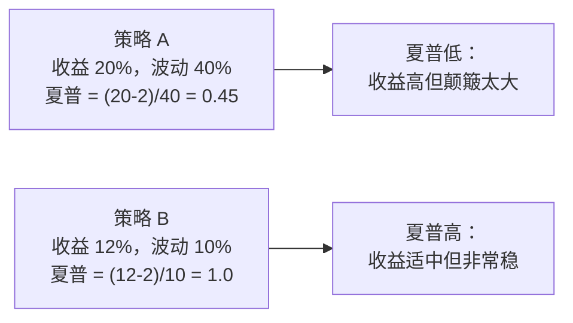
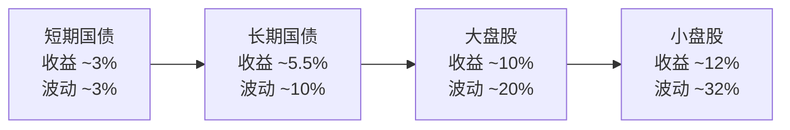
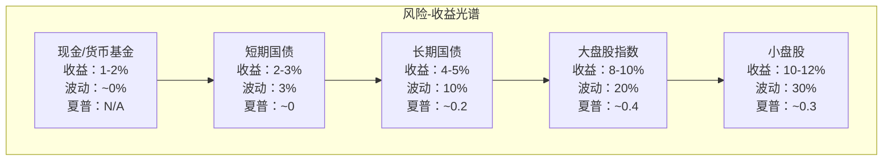

# Day 5：风险与收益

> **总时长：** 2 小时
>
> **节奏：** 每 50 分钟休息 10 分钟
>
> **今日目标：** 学会计算收益率、衡量风险、用夏普比率判断一个策略"值不值得做"——这些是评估因子策略表现的基本工具
>
> **本文是完整讲义，包含所有知识点，不需要翻阅其他资料**

---

## 时间表

```
00:00 - 00:50  [第1节] 收益率计算 + 波动率 + VaR
00:50 - 01:00  休息
01:00 - 01:50  [第2节] 风险溢价 + 夏普比率 + 历史收益回顾
01:50 - 02:00  [收尾] 自测
```

---

## 第一节：收益率与风险度量（50 分钟）

### 一、收益率：衡量"赚了多少"

Day 3-4 学的是"一家公司赚不赚钱"。从今天开始换一个视角：**我投资这家公司，我赚了多少？** 这就需要收益率。

#### 1.1 简单收益率（Simple Return）

**简单收益率 = （期末价格 - 期初价格）/ 期初价格**

这是最直觉的算法——你 100 块买的，涨到 110 块，赚了 10%。

$$R = \frac{P_{end} - P_{start}}{P_{start}}$$

例子：你以 1500 元买了一股茅台，一个月后涨到 1575 元。

```
R = (1575 - 1500) / 1500 = 75 / 1500 = 5%
```

如果期间有分红，分红也算进去：

$$R = \frac{P_{end} - P_{start} + D}{P_{start}}$$

```
假设茅台在这个月还分了 10 元：
R = (1575 - 1500 + 10) / 1500 = 85 / 1500 ≈ 5.67%
```

> **简单收益率和日常说的"涨了多少"是一个意思。** 你在券商 APP 上看到的涨跌幅就是简单收益率。

#### 1.2 对数收益率（Logarithmic Return）

**对数收益率 = ln(期末价格 / 期初价格)**

其中 ln 是自然对数。

$$r = \ln\left(\frac{P_{end}}{P_{start}}\right)$$

同样的茅台例子：

```
r = ln(1575 / 1500) = ln(1.05) ≈ 0.0488 ≈ 4.88%
```

注意：简单收益率是 5%，对数收益率是 4.88%——**数值接近但不完全一样。** 当收益率较小（比如日收益率）时，两者几乎没有区别；当收益率很大时，差异才明显。

> **"对数"听起来很可怕，其实只是在计算器上多按一个 ln 键。** 不需要理解对数的数学推导，只需要知道什么时候该用它。

#### 1.3 为什么要有两种收益率

既然简单收益率更直觉，为什么还要多此一举搞个对数收益率？

因为**对数收益率有两个非常好的数学性质**，在量化投资中极其方便：

**性质一：时间可加性**

假设你连续两天投资，第一天赚了 r1，第二天赚了 r2。

```
对数收益率：两天的总收益 = r1 + r2    （直接加！）
简单收益率：两天的总收益 ≠ R1 + R2    （不能直接加）
```

用具体数字说明：

```
某股票：
  周一 100 元 → 周二 110 元 → 周三 99 元

简单收益率：
  周一到周二：R1 = (110-100)/100 = +10%
  周二到周三：R2 = (99-110)/110 = -10%
  两天总简单收益率 = (99-100)/100 = -1%
  但 R1 + R2 = +10% + (-10%) = 0%    ← 不等于 -1%！

对数收益率：
  周一到周二：r1 = ln(110/100) = +9.53%
  周二到周三：r2 = ln(99/110) = -10.54%
  两天总对数收益率 = ln(99/100) = -1.005%
  而 r1 + r2 = 9.53% + (-10.54%) = -1.01%  ← 几乎等于 -1.005%（微小差异是四舍五入）
```

> 能直接"加"在一起，意味着处理时间序列数据时极其方便。你有 250 个交易日的日对数收益率，一加就得到年收益率。简单收益率做不到这一点，需要用乘法累积，计算更麻烦。

**性质二：统计分布更好**

对数收益率在统计上更接近正态分布（钟形曲线），而简单收益率是有偏的——它的下界是 -100%（最多亏光），但上界无穷大。对数收益率的下界是负无穷，上界是正无穷，更对称。

> 这意味着用对数收益率做统计分析（算均值、标准差、建模）时，很多统计公式可以直接用，结果更可靠。

#### 1.4 什么时候用哪个

| 场景 | 用哪个 | 原因 |
|------|--------|------|
| 日常交流、报告投资业绩 | **简单收益率** | 直觉好懂，"涨了 10%"谁都懂 |
| 量化建模、因子计算、时间序列分析 | **对数收益率** | 可加性、统计性质好 |
| 日收益率（很小的数字） | **都行** | 两者几乎相等 |
| 长期累积收益（几个月、几年） | 各有用途 | 简单收益率用于报告，对数收益率用于计算 |

> **因子投资实操中：** 计算因子收益率时几乎总是用对数收益率，因为要在时间序列上做大量统计分析。但在展示策略业绩（给人看的报告）时，用简单收益率。
>
> 编程实战阶段你会经常写 `np.log(price / price.shift(1))` 来计算日对数收益率——到时候就明白为什么今天要学这个了。

#### 1.5 年化收益率

投资期限不同的收益率无法直接比较。你说"我赚了 20%"——是一年赚 20%，还是十年赚 20%？差别巨大。

**年化收益率（Annualized Return）：** 把任意期限的收益率换算成"相当于一年赚多少"的标准化指标。

$$R_{annual} = (1 + R_{total})^{1/n} - 1$$

其中 $R_{total}$ = 总简单收益率，$n$ = 投资年数。

例子：

```
情况 A：3 年赚了 33%
  年化 = (1 + 0.33)^(1/3) - 1 = 1.33^0.333 - 1 ≈ 10%

情况 B：10 年赚了 100%（翻倍了）
  年化 = (1 + 1.0)^(1/10) - 1 = 2^0.1 - 1 ≈ 7.2%

情况 C：0.5 年（半年）赚了 10%
  年化 = (1 + 0.10)^(1/0.5) - 1 = 1.10^2 - 1 = 21%
```

> **直觉理解：** 年化收益率回答的问题是"如果每年都按这个速度赚，结果会怎样？"。三年赚 33% 相当于每年赚 10%，十年翻倍相当于每年赚 7.2%。

> **"复利"的力量：** 年化收益率是复利计算。如果每年赚 10%，10 年后不是赚 100%，而是 (1.10)^10 - 1 = 159%。这就是为什么爱因斯坦（据说）称复利为"世界第八大奇迹"。在因子投资中，一个年化超额收益只有 3% 的因子，30 年后的累积效果是惊人的。

#### 1.6 多期收益的累积

如果你有每日的收益率数据，怎么算出一整年的收益率？

**简单收益率：连乘**

$$R_{total} = (1 + R_1) \times (1 + R_2) \times \cdots \times (1 + R_n) - 1$$

**对数收益率：直接相加**

$$r_{total} = r_1 + r_2 + \cdots + r_n$$

这就是对数收益率"可加性"的实际用途——处理大量每日收益率数据时，加法比乘法快得多，也不容易出精度问题。

> 一年大约有 250 个交易日。用对数收益率，把 250 天的日收益率加起来就是年收益率。用简单收益率，要做 250 次乘法。当你在编程实战阶段处理几千只股票、每只几千天数据时，这个差别会非常明显。

---

### 二、波动率：衡量"有多颠簸"

学了收益率，你知道"赚了多少"。但投资不只看赚多少，还要看**赚钱的过程有多颠簸**。

**直觉类比：** 你从家到公司有两条路：
- A 路：平坦的高速公路，每天 30 分钟到，误差在 2 分钟以内
- B 路：翻山越岭的小路，平均也是 30 分钟，但有时 15 分钟，有时 60 分钟

平均时间一样，但 B 路体验糟糕得多。股票也一样：平均年收益率可能相同，但过程的颠簸程度（波动率）完全不同。

#### 2.1 标准差：波动率的数学定义

**波动率 = 收益率的标准差（Standard Deviation）**

标准差衡量"数据偏离平均值的程度"。标准差越大，数据越分散，波动越剧烈。

计算步骤：

```
第 1 步：算出每个收益率和平均收益率的差
第 2 步：把这些差值平方（消除正负号）
第 3 步：求平均 → 这就是方差（Variance）
第 4 步：开根号 → 这就是标准差（Standard Deviation）
```

用 5 天的收益率数据演示：

```
某股票连续 5 天的日收益率：+2%, -1%, +3%, -2%, +1%

第 1 步：平均收益率 = (2 - 1 + 3 - 2 + 1) / 5 = 0.6%

第 2 步：每天和平均值的差：
  Day 1: 2% - 0.6% = +1.4%
  Day 2: -1% - 0.6% = -1.6%
  Day 3: 3% - 0.6% = +2.4%
  Day 4: -2% - 0.6% = -2.6%
  Day 5: 1% - 0.6% = +0.4%

第 3 步：差值平方的平均（方差）：
  方差 = (1.4² + 1.6² + 2.4² + 2.6² + 0.4²) / 5
       = (1.96 + 2.56 + 5.76 + 6.76 + 0.16) / 5
       = 17.2 / 5 = 3.44

第 4 步：开根号（标准差）：
  标准差 = √3.44 ≈ 1.85%
```

> **结果解读：** 这只股票的日波动率约 1.85%，意味着每天的收益率和平均值的偏差大约在正负 1.85% 之内。
>
> **实际计算中**你不需要手算——Python 一行代码 `returns.std()` 就能搞定。今天只需要理解标准差代表什么。

#### 2.2 年化波动率

日波动率数字很小（通常 1-3%），不太直观。通常换算成年化波动率来比较：

**年化波动率：**

$$\sigma_{annual} = \sigma_{daily} \times \sqrt{250}$$

其中 250 是一年的大约交易天数，$\sqrt{250} \approx 15.81$。

```
日波动率 1.85% → 年化波动率 = 1.85% × 15.81 ≈ 29.3%
```

> **为什么乘以 $\sqrt{250}$ 而不是 250？** 下面用四步推导说明。

**推导过程：**

假设每天的对数收益率 $r_1, r_2, \dots, r_{250}$ 是**独立同分布**的随机变量，每天的方差都是 $\sigma_{daily}^2$。

```
第 1 步：年收益率 = 250 天日收益率之和（对数收益率的可加性，见 1.3 节）

  r_annual = r_1 + r_2 + ... + r_250

第 2 步：独立随机变量之和的方差 = 各自方差之和

  Var(r_annual) = Var(r_1) + Var(r_2) + ... + Var(r_250)

第 3 步：每天方差相同，所以直接乘 250

  Var(r_annual) = 250 × σ_daily²

第 4 步：标准差 = 方差开根号

  σ_annual = √(250 × σ_daily²) = σ_daily × √250
```

| 层面 | 操作 | 原因 |
|------|------|------|
| 方差（$\sigma^2$） | 直接 × 250 | 独立变量方差可加 |
| 标准差（$\sigma$） | × $\sqrt{250}$ | 标准差 = 方差的平方根 |

> **注意：** 这个推导依赖"每天收益率独立且波动率相同"的假设。实际中不完全成立（股市存在短期动量效应和波动率聚集现象），但作为快速估算已经足够好，业界广泛使用。编程实战时会用到：`annual_vol = daily_returns.std() * np.sqrt(250)`。

#### 2.3 波动率的参考值

不同资产的年化波动率大致范围：

| 资产类别 | 年化波动率（大约） | 直觉描述 |
|---------|:----------------:|---------|
| 货币基金 | 0.1 - 0.5% | 几乎不波动 |
| 国债 | 3 - 8% | 小幅波动 |
| 沪深 300 指数 | 20 - 30% | 中等波动 |
| 单只 A 股 | 30 - 60% | 剧烈波动 |
| 比特币 | 50 - 80% | 极端波动 |

> A 股波动率 25% 的直觉含义：**如果你持有沪深 300，在一年中，你大约有 68% 的概率遇到年收益率在"平均值上下各 25%"这个范围内波动的情况。** 假设平均年收益率 10%，则大概率（68%）落在 -15% 到 +35% 之间。

> **波动率和因子投资的关系：**
> - **低波动因子（Low Volatility）** 是一个经典因子——学术研究发现，低波动率的股票长期收益反而不输高波动率的股票（违反直觉！）
> - 波动率也是衡量任何因子策略好坏的基础指标——两个年化收益 15% 的策略，波动率 10% 的远优于波动率 40% 的

#### 2.4 波动率的局限

标准差把**上涨和下跌同等对待**——涨 5% 和跌 5% 对标准差的"贡献"是一样的。但作为投资者，你显然更讨厌下跌而不是上涨。

这是波动率最大的批评之一。后续会学到"下行风险"等指标来弥补这一点，但今天只需知道这个局限性存在。

---

### 三、VaR：在险价值

#### 3.1 定义

**VaR（Value at Risk，在险价值）：在给定的置信水平下，投资组合在未来某段时间内可能遭受的最大损失。**

这个定义有点绕，用例子说明：

```
"95% VaR = 10 万元"的含义：
在正常市场条件下，未来一天亏损超过 10 万元的概率不超过 5%。
换句话说：95% 的情况下，你一天最多亏 10 万。
```

**直觉类比：** 天气预报说"明天降雨概率 5%"。你可以不带伞——95% 的情况下不会淋雨。VaR 也类似：它告诉你"95% 的情况下，你的最大损失是多少"。

> 但请注意：5% 的概率并不是零。就像 5% 的下雨概率并不意味着不会下雨——只是大多数时候不会。VaR 不告诉你那 5% 的极端情况会亏多少。

#### 3.2 怎么计算

最简单的 VaR 计算方法（参数法，假设正态分布）：

```
VaR = 投资金额 × z × 波动率
```

其中 $z$ 是正态分布的分位数：
- 95% 置信水平：$z = 1.65$
- 99% 置信水平：$z = 2.33$

例子：

```
你有 100 万元投资沪深 300，日波动率约 1.5%

95% 日 VaR = 100 万 × 1.65 × 1.5% = 2.475 万元

含义：在正常市场下，你一天最多亏约 2.5 万的概率为 95%。
      也就是说，大约每 20 个交易日（1/5%=20）会有一天亏损超过 2.5 万。
```

> "每 20 天超一次"——一年 250 个交易日，大约有 12-13 天亏损会超过 VaR。这听起来还挺多的！所以 VaR 不是安全保证，只是一个风险参考值。

#### 3.3 VaR 的局限

VaR 有两个主要问题：

| 问题 | 说明 |
|------|------|
| **不告诉你尾部风险** | VaR 只说"95% 的情况下最多亏 X"，但剩下 5% 可能亏多少？可能是 X 的 2 倍，也可能是 10 倍 |
| **假设正态分布** | 金融市场的收益率并不完美地服从正态分布——极端事件（黑天鹅）发生的概率比正态分布预测的要高得多 |

> **2008 年金融危机的教训：** 很多银行的风控模型使用 VaR，认为"99% VaR 以内就安全"。但实际亏损远超 VaR 预测——因为那 1% 的极端事件比模型假设的严重得多。
>
> **因子投资中的应用：** VaR 是策略风控的基础工具之一。你在回测因子策略时，会计算策略的 VaR 来评估风险敞口。但不能只依赖 VaR——还需要结合最大回撤等指标综合判断（第二节会讲）。

> **今天对 VaR 的掌握程度：** 知道定义、会用公式算即可。VaR 的高级话题（条件 VaR、历史模拟法等）不在本讲义范围内。

---

### 第一节完成检查

- [ ] 能写出简单收益率和对数收益率的公式
- [ ] 知道对数收益率的两个优势（可加性、统计分布）
- [ ] 知道量化投资为什么偏好对数收益率
- [ ] 能用年化公式把 n 年总收益换算成年化收益率
- [ ] 理解标准差衡量的是"偏离平均值的程度"
- [ ] 知道年化波动率 = 日波动率 × $\sqrt{250}$
- [ ] 知道 VaR 的含义——在给定置信水平下的最大可能损失
- [ ] 知道 VaR 的主要局限（不反映尾部风险、假设正态分布）

**休息 10 分钟。**

---

## 第二节：风险溢价、夏普比率与历史收益（50 分钟）

### 四、无风险利率与风险溢价

#### 4.1 无风险利率

**无风险利率（Risk-Free Rate）：承担零风险能获得的收益率。**

理论上不存在完全"零风险"的投资，但实际中用以下资产近似：

| 国家 | 无风险利率的代理 | 当前大约水平 |
|------|----------------|:-----------:|
| 中国 | 一年期国债利率 / 货币基金收益率 | 约 1.5 - 2% |
| 美国 | 美国短期国债（T-Bill）收益率 | 约 4 - 5% |

> **为什么国债被认为"无风险"？** 因为国债是政府发的，政府可以印钱还债（理论上不会违约）。当然，这也不是 100% 无风险——但在所有投资中，它是最接近无风险的。

> **为什么要关心无风险利率？** 因为它是衡量任何投资"值不值"的基准线。你的策略年化收益 8%，看起来不错？如果无风险利率就有 5%，你多承担了风险只多赚了 3%——可能并不划算。

#### 4.2 风险溢价（Risk Premium）

**风险溢价 = 投资的预期收益率 - 无风险利率**

$$\text{风险溢价} = E(R) - R_f$$

**直觉类比：** 你有两份工作机会：
- A：国企，月薪 1 万，铁饭碗（≈ 无风险利率）
- B：创业公司，预期月薪 2 万，但可能发不出工资（≈ 风险投资）

B 比 A 多的 1 万块就是"风险溢价"——你为了承担额外风险，要求的额外报酬。如果 B 也只给 1 万，没人愿意去——风险溢价为零，没有补偿。

```
例子：
  沪深 300 长期年化收益率 ≈ 10%
  中国无风险利率        ≈ 2%
  股票风险溢价          ≈ 10% - 2% = 8%
```

> 8% 的风险溢价意味着：投资者因为承担了股票的波动风险（年化波动率 25% 左右），平均每年多获得 8% 的补偿。

#### 4.3 为什么存在风险溢价


> 风险溢价的存在是因为**大多数人不喜欢风险**。如果所有人都不怕风险，股票价格会被买到很高，预期收益就会降到和国债一样——风险溢价就消失了。正是因为人们厌恶风险，才给了愿意承担风险的投资者"溢价"。

> **因子投资与风险溢价：** 这是理解因子投资最核心的概念之一。
> - **市场风险溢价**：持有股票（而非国债）获得的额外收益 → Day 8 的 CAPM 模型会详细讲
> - **价值溢价**：持有低估值股票获得的额外收益 → 可能因为低估值公司风险更大
> - **规模溢价**：持有小盘股获得的额外收益 → 可能因为小公司风险更大
>
> 每个因子的超额收益，本质上都可能是某种风险溢价。"因子投资是否只是在承担更多风险"——这是学术界持续争论的核心问题，Day 9-10 会回到这个话题。

#### 4.4 实际收益率 vs 名义收益率

还有一个容易混淆的概念需要澄清：

**名义收益率（Nominal Return）：** 没有扣除通胀的收益率——你看到的涨跌幅。

**实际收益率（Real Return）：** 扣除通胀后的收益率——购买力实际增加了多少。

```
实际收益率 ≈ 名义收益率 - 通胀率
```

```
例子：
  你今年投资赚了 8%（名义收益率）
  今年通胀率 3%
  实际收益率 ≈ 8% - 3% = 5%

  你的购买力只增加了 5%，不是 8%。
```

> **为什么要区分？** 如果通胀 5%，你的投资赚了 4%，看起来是正收益——但实际上你的购买力在缩水。长期投资分析中通常看实际收益率。

---

### 五、夏普比率

#### 5.1 公式

**夏普比率（Sharpe Ratio）= （投资收益率 - 无风险利率）/ 波动率**

$$\text{Sharpe Ratio} = \frac{R_p - R_f}{\sigma_p}$$

其中：
- $R_p$ = 投资组合的收益率
- $R_f$ = 无风险利率
- $\sigma_p$ = 投资组合的波动率（标准差）

```
例子：
  某因子策略年化收益 15%，年化波动率 20%，无风险利率 2%
  Sharpe = (15% - 2%) / 20% = 13% / 20% = 0.65
```

#### 5.2 直觉理解

**夏普比率衡量的是"每承担一单位风险，获得多少超额收益"。**

**直觉类比：** 你比较两家餐厅：
- A 餐厅：菜好吃（收益高），但排队 2 小时（风险大）
- B 餐厅：菜也好吃，排队 30 分钟（风险小）

"性价比" = 好吃程度 / 排队时间。B 餐厅的性价比更高。

夏普比率就是投资的"性价比"——单位风险获得的超额回报。



> 策略 B 的绝对收益低于策略 A，但夏普比率更高——意味着策略 B 的"性价比"更好。如果你可以加杠杆（借钱放大收益），策略 B 加 2 倍杠杆后收益 24%，波动 20%，比策略 A 更优。这就是为什么专业投资者更看重夏普比率而非绝对收益。

#### 5.3 多少算好

| 夏普比率 | 评价 | 说明 |
|:-------:|------|------|
| < 0 | 差 | 还不如买国债——承担了风险反而亏钱 |
| 0 - 0.5 | 一般 | 风险补偿不够充分 |
| 0.5 - 1.0 | 不错 | 多数主动型基金在这个范围 |
| 1.0 - 2.0 | 优秀 | 非常好的策略 |
| > 2.0 | 罕见 | 长期维持几乎不可能；如果回测出这么高，要怀疑是否过拟合 |

> **"夏普 1.0 算好还是差？"** 答：算好。对于一个长期运行的策略，夏普 1.0 意味着每承担 1% 的波动，获得 1% 的超额收益。这在业界已经是非常不错的水平了。

一些参考值：

```
沪深 300 长期夏普比率 ≈ 0.3 - 0.5（中国股市波动大，拉低了夏普）
标普 500 长期夏普比率 ≈ 0.4 - 0.5
巴菲特长期夏普比率   ≈ 0.7 - 0.8（已经是传奇级别）
文艺复兴大奖章基金   ≈ 传闻 > 2.0（极其罕见的例外）
```

#### 5.4 夏普比率的局限

| 局限 | 说明 |
|------|------|
| **对上涨和下跌同等惩罚** | 和波动率一样的问题——大幅上涨也会增加波动率，从而压低夏普 |
| **假设收益正态分布** | 如果收益分布有"肥尾"（极端事件比正态分布预测的多），夏普比率会高估策略质量 |
| **对时间窗口敏感** | 用不同的时间段计算，夏普比率可能差异很大 |
| **不反映最大回撤** | 一个夏普 1.0 的策略可能中间经历过 -50% 的回撤——夏普比率看不出来 |

> **改进版本：** 有些人用 **Sortino 比率** 替代夏普——只惩罚下行波动（亏损的波动），不惩罚上行波动（盈利的波动）。但夏普比率仍然是最主流、最广泛使用的风险调整收益指标。

---

### 六、最大回撤

#### 6.1 定义

**最大回撤（Maximum Drawdown, MDD）= 从历史最高点到最低点的最大跌幅。**

```
最大回撤 = (最低点 - 之前的最高点) / 之前的最高点
```

例子：

```
某策略净值变化：
  100 → 120 → 115 → 130 → 90 → 110 → 140

最高点到最低点：从 130 跌到 90
最大回撤 = (90 - 130) / 130 = -30.8%
```


#### 6.2 为什么最大回撤重要

**直觉类比：** 你去体检，医生说"你的平均血压正常"。但如果某次血压飙到 200，差点中风——平均值掩盖了风险。最大回撤就是投资中的"血压峰值"。

| 最大回撤 | 需要多少涨幅才能回本 |
|:-------:|:----------------:|
| -10% | +11.1% |
| -20% | +25% |
| -30% | +42.9% |
| -50% | +100%（翻倍！） |
| -70% | +233% |

> **关键洞见：亏损和盈利不对称。** 亏 50% 需要涨 100% 才能回本。这就是为什么控制回撤如此重要——一次大亏可能让几年的收益化为乌有。

> **因子投资中的最大回撤：** 每个因子策略都有自己的最大回撤。价值因子在某些年份（如 2018-2020 年）经历了极端回撤——很多投资者因为无法忍受回撤而放弃了策略，恰好错过了后来的反弹。能否忍受最大回撤，是因子投资成功的关键心理门槛。

#### 6.3 回撤与夏普比率的互补

夏普比率和最大回撤从不同角度衡量风险：

| 指标 | 衡量什么 | 类比 |
|------|---------|------|
| 夏普比率 | "日常颠簸"的性价比 | 道路的平均颠簸程度 |
| 最大回撤 | "最糟糕的一次"有多惨 | 道路上最大的坑有多深 |

> 一个好的策略需要两者兼顾——夏普高且最大回撤可控。光看夏普高不行（可能某次暴亏 -80%），光看回撤小也不行（可能收益太低）。

---

### 七、历史收益回顾

学了上面的工具，现在用它们来看看真实的历史数据。

#### 7.1 美国市场历史数据（1926-2023，约 100 年）

| 资产类别 | 年化名义收益率 | 年化实际收益率 | 年化波动率 | 最差单年 |
|---------|:----------:|:----------:|:--------:|:------:|
| 大盘股（标普 500） | ~10% | ~7% | ~20% | -43%（1931） |
| 小盘股 | ~12% | ~9% | ~32% | -58%（1937） |
| 长期国债 | ~5.5% | ~2.5% | ~10% | -15%（2022） |
| 短期国债（T-Bill） | ~3.3% | ~0.3% | ~3% | — |
| 通胀率 | ~3% | — | — | — |

**几个关键观察：**

**1. 股票长期跑赢一切，但波动巨大**

```
100 年前投资 1 美元：
  大盘股 → 约 11,000 美元（名义）
  长期国债 → 约 200 美元
  短期国债 → 约 22 美元

差距惊人——这就是复利 + 风险溢价的威力。
```

**2. 小盘股收益更高，波动也更大**

小盘股年化 12% vs 大盘股 10%，看起来只多 2%——但 100 年复利后差距巨大。这个 2% 的超额收益就是**规模溢价（Size Premium）**，是 Fama-French 三因子模型中"规模因子（SMB）"的历史来源。

> 但注意波动率：小盘股 32% vs 大盘股 20%——多承担了 60% 的波动，只多赚了 2% 的年化收益。从夏普比率看，小盘股不一定更优。

**3. 高收益 = 高风险，没有例外**



> 从左到右，收益递增，风险也递增。这不是巧合——这就是风险溢价在起作用。

#### 7.2 中国 A 股历史数据

A 股从 1990 年建立至今约 35 年，数据量不如美股，但仍有参考价值：

| 指标 | 大约值 | 备注 |
|------|:-----:|------|
| 上证指数年化收益率 | ~10-12% | 波动极大，不同起止时间差异很大 |
| 沪深 300 年化收益率（2005 年至今） | ~8-10% | 比上证更有代表性 |
| 年化波动率 | ~25-30% | 高于美股 |
| 历史最大回撤 | -72%（2007-2008） | 从 6124 点跌到 1664 点 |

> **A 股的特点：**
> - **牛短熊长**：猛涨一波，然后长期阴跌。2007 年 6124 → 2008 年 1664，2015 年 5178 → 2016 年 2638
> - **散户比例高**：导致波动率比成熟市场更大
> - **长期收益和美股差不多**：虽然中间颠簸得厉害，但拉长看年化大约 10% 左右

#### 7.3 各类资产风险收益对比

把上面的数据整合成一张图：



> 这张图有一个重要发现：**小盘股虽然收益最高，但夏普比率不一定最高。** 大盘股指数的夏普比率可能反而更好——用更少的波动获得了"够好"的收益。这也是为什么被动指数投资（买沪深 300/标普 500）是很难被打败的策略。

#### 7.4 历史数据的三个关键教训

**教训一：长期持有，股票跑赢一切**

任何 20 年以上的持有期，美国大盘股都没有亏过钱（实际收益率）。短期波动巨大，长期几乎确定正收益。

**教训二：短期什么都可能发生**

单年最大亏损 -43%，两年连续亏损也不罕见。如果你只看一两年的收益率来判断一个策略好不好，可能完全被误导。

**教训三：风险溢价不是白拿的**

股票的 10% 年化收益包含了约 6-8% 的风险溢价——这些收益的"代价"是你要忍受 20-30% 的年化波动和偶尔 -40% 以上的回撤。有些年份你会严重怀疑自己的策略——这恰恰是风险溢价存在的原因：**如果没有痛苦，就不会有溢价。**

> **和因子投资的联系：**
> - 因子投资的核心假设就是**某些因子存在持续的风险溢价**
> - Day 9-10 会学到，价值因子、规模因子、动量因子等在历史上都有显著的风险溢价
> - 但正如历史数据所示，这些溢价**不是稳定的**——某些年份因子会大幅亏损
> - 能否在亏损年份坚持不放弃，决定了你能否最终获得这些溢价

---

### 第二节完成检查

- [ ] 知道无风险利率的含义和中美的大致水平
- [ ] 能说出风险溢价的公式和直觉含义
- [ ] 知道夏普比率的公式：$\text{Sharpe} = (R_p - R_f) / \sigma_p$
- [ ] 理解夏普比率衡量的是"每承担一单位风险获得的超额收益"
- [ ] 知道夏普 1.0 已经算优秀
- [ ] 知道最大回撤的定义和"亏损不对称"的道理
- [ ] 知道美国大盘股长期年化约 10%，波动约 20%
- [ ] 理解"风险溢价不是白拿的"这个核心教训

---

## 收尾：自测（10 分钟）

拿一张白纸，**不看任何资料**，回答以下问题。先自己写，再对答案：

```
自测 1：简单收益率和对数收益率的公式分别是什么？
→ 你的答案：_______________
→ 正确：简单收益率 R = (P_end - P_start) / P_start。
  对数收益率 r = ln(P_end / P_start)。

自测 2：量化投资为什么偏好对数收益率？
→ 你的答案：_______________
→ 正确：两个优势：（1）可加性——多期收益率可以直接相加，
  不需要连乘；（2）更接近正态分布，便于统计分析。

自测 3：一只股票 3 年总收益 33%，年化收益率是多少？
→ 你的答案：_______________
→ 正确：年化 = (1 + 0.33)^(1/3) - 1 ≈ 10%。

自测 4：年化波动率怎么从日波动率换算？
→ 你的答案：_______________
→ 正确：年化波动率 = 日波动率 × sqrt(250)。
  因为方差可以相加（250天），标准差是方差的平方根，所以乘 sqrt(250)。

自测 5：VaR 95% = 5 万元，这句话是什么意思？
→ 你的答案：_______________
→ 正确：在正常市场条件下，未来一天（或指定时间段内）
  亏损超过 5 万元的概率不超过 5%。

自测 6：风险溢价的公式是什么？为什么存在风险溢价？
→ 你的答案：_______________
→ 正确：风险溢价 = 投资收益率 - 无风险利率。
  因为大多数人厌恶风险，需要额外补偿才愿意持有风险资产。

自测 7：夏普比率的公式是什么？
→ 你的答案：_______________
→ 正确：Sharpe = (R_p - R_f) / σ_p，
  即（投资收益率 - 无风险利率）/ 波动率。

自测 8：夏普 1.0 算好还是差？为什么？
→ 你的答案：_______________
→ 正确：算好。夏普 1.0 意味着每承担 1% 波动获得 1% 超额收益，
  在业界已是优秀水平。巴菲特长期夏普约 0.7-0.8。

自测 9：亏损 50% 后需要涨多少才能回本？
→ 你的答案：_______________
→ 正确：需要涨 100%（翻倍）。这就是"亏损不对称"——
  控制回撤远比追求高收益重要。

自测 10：美国大盘股过去 100 年的年化收益率和波动率大约是多少？
→ 你的答案：_______________
→ 正确：年化名义收益率约 10%，年化波动率约 20%，
  风险溢价约 6-8%。
```

**9-10 道对：** 完美，收益与风险度量的基本工具已经掌握。
**7-8 道对：** 不错，回看错的部分就好。
**6 道以下：** 建议花 20 分钟重新阅读讲义，重点看公式和例子。

---

## 今天不需要记住的内容

| 概念 | 今天理解到什么程度 | 什么时候深入 |
|------|------------------|------------|
| 对数收益率的数学推导 | 知道 ln 这个运算、知道可加性就行 | 数学基础阶段 |
| 标准差的样本修正（n-1） | 知道标准差衡量"偏离程度"就行 | 数学基础阶段 |
| VaR 的其他计算方法（历史模拟法、蒙特卡洛） | 知道定义和参数法公式就行 | 不涉及（太深了） |
| 条件 VaR（CVaR / Expected Shortfall） | 知道 VaR 有尾部风险的局限就行 | 不涉及 |
| Sortino 比率 | 知道它是夏普的改进版就行 | 编程实战阶段 |
| 正态分布的详细性质 | 知道"钟形曲线"和 68-95-99.7 法则就行 | 数学基础阶段 |
| 各国具体的历史收益数据 | 记住美股约 10%、波动约 20% 就行 | 不需要更精确 |

---

## 今日知识点与因子投资的关联

| 今日知识点 | 关联的因子/概念 | 怎么关联 | 深入时间 |
|-----------|---------------|---------|---------|
| 对数收益率 | **因子收益率计算基础** | 计算因子日收益率时用 `ln(P_t / P_{t-1})`，可加性让时间序列分析成为可能 | 编程实战阶段 |
| 波动率（标准差） | **低波动因子（Low Vol）** | 低波动率股票长期收益不输高波动率股票——"低波动异象" | Day 9-10 |
| VaR | **策略风控** | 回测因子策略时用 VaR 评估风险敞口，设定止损线 | 编程实战阶段 |
| 风险溢价 | **因子存在的理论基础** | 每个因子的超额收益可能是某种风险的补偿——风险溢价解释 | Day 8-10 |
| 夏普比率 | **策略评估的核心指标** | 比较不同因子策略好坏时，夏普比率是第一个要看的数字 | 编程实战阶段 |
| 最大回撤 | **策略可行性判断** | 即使夏普高，回撤太大的策略也不可执行——心理承受力是真实约束 | 编程实战阶段 |
| 历史收益（股票 ~10%，溢价 ~6-8%） | **因子溢价的基准参照** | 如果一个因子的历史溢价远低于 2%/年，可能不值得单独配置 | Day 9-10 |

> 今天学的这些工具——收益率、波动率、夏普比率、最大回撤——是评估任何投资策略的"标准体检项目"。未来每次回测因子策略，你都会用到它们。从 Day 6 开始，进入投资组合理论——学习如何把多个资产（或多个因子）组合在一起，进一步降低风险、提高夏普。

---

## 明天预告

**Day 6** 进入新模块——**投资组合理论**。

今天你学会了衡量单个资产或单个策略的收益和风险。但实际投资中，你不会只买一只股票——你会买一篮子。明天的核心问题是：

**把多个资产放在一起，风险是怎么变化的？**

你会发现一个反直觉的结论：两个高风险资产组合在一起，总风险可能比任何一个单独持有都低。这就是"分散化"的魔法——也是投资组合理论和因子投资的数学基础。

> Day 6 会涉及效用函数和资本配置线。数学会比今天再多一点，但仍然在高中水平以内。
