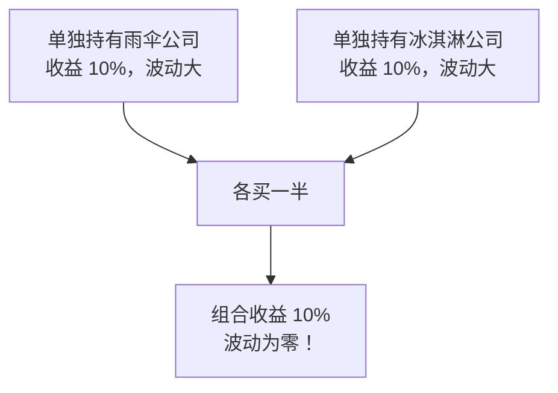
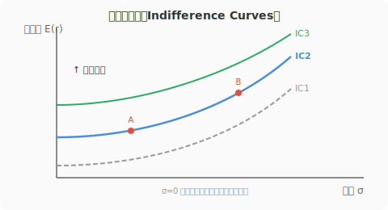
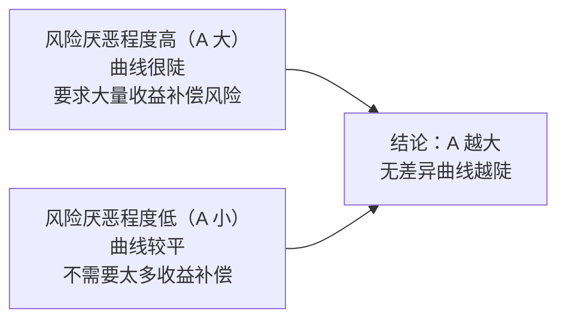
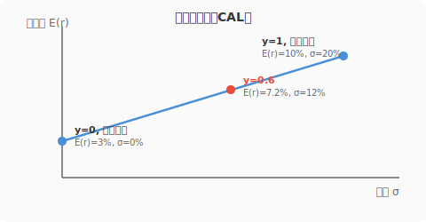
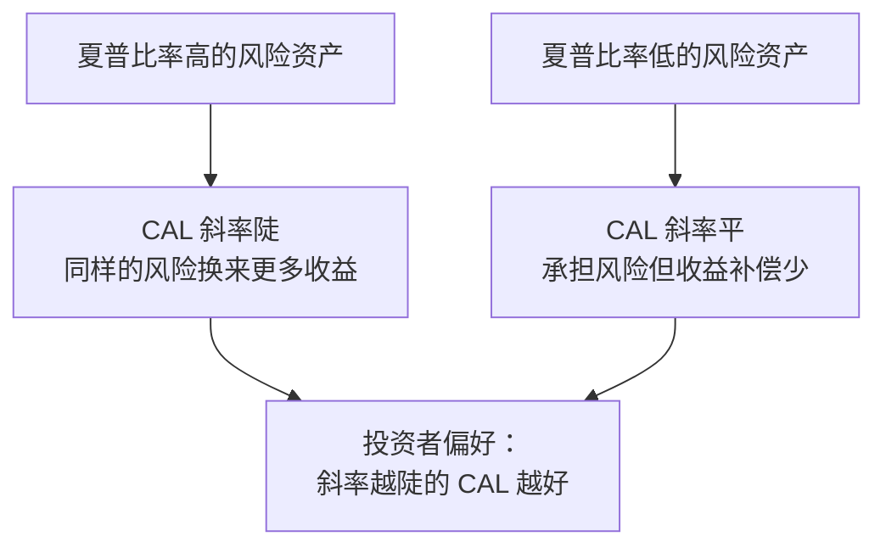
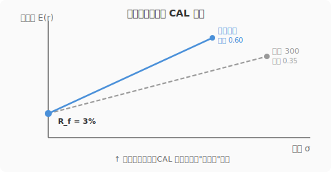
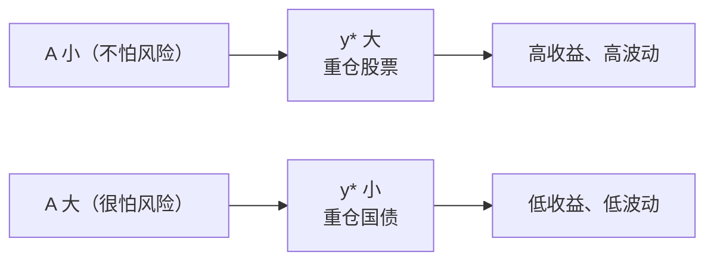
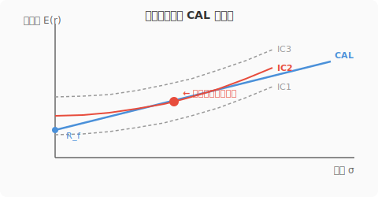
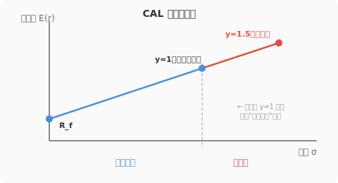
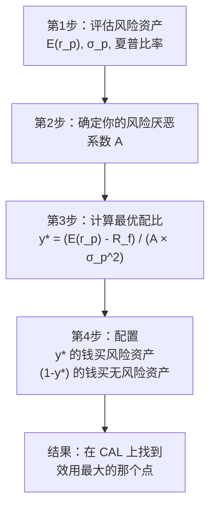

# Day 6：风险资产配置

> **总时长：** 2 小时
>
> **节奏：** 每 50 分钟休息 10 分钟
>
> **今日目标：** 理解"风险资产和无风险资产怎么分配"这个核心问题，掌握资本配置线（CAL）这个可视化工具，学会用效用函数找到适合自己的最优配比
>
> **本文是完整讲义，包含所有知识点，不需要翻阅其他资料**

---

## 时间表

```
00:00 - 00:50  [第1节] 分散化初步 + 风险厌恶 + 效用函数
00:50 - 01:00  休息
01:00 - 01:50  [第2节] 资本配置线（CAL）+ 最优配置 + 杠杆
01:50 - 02:00  [收尾] 自测
```

---

## 第一节：风险厌恶与效用函数（50 分钟）

### 一、从单个资产到组合：为什么要"配置"

Day 5 学的是衡量**一个**资产或**一个**策略的收益和风险。但现实中没有人只买一样东西——你会把钱分配在不同资产上。这就引出了今天的核心问题：**钱应该怎么分？**

#### 1.1 分散化的直觉

**分散化（Diversification）：把钱分散投资到多个资产上，降低整体风险。**

**直觉类比：** 你有 10 个鸡蛋，一个篮子。篮子掉了，10 个全碎。如果你用 5 个篮子装，掉一个只碎 2 个。

这不是什么深奥的理论——你妈妈都知道"不要把所有鸡蛋放在一个篮子里"。但投资中，分散化有一个更有趣的结论：

> **两个高风险资产组合在一起，整体风险可能比任何一个单独持有都低。**

这不是直觉能猜到的。用一个经典例子说明。

#### 1.2 雨伞公司和冰淇淋公司

假设有两只股票：

| | 雨伞公司 | 冰淇淋公司 |
|--|---------|-----------|
| 雨天（概率 50%） | 赚 30% | 亏 10% |
| 晴天（概率 50%） | 亏 10% | 赚 30% |
| **期望收益** | **10%** | **10%** |

两家公司单独看，期望收益都是 10%，但波动都很大（在 +30% 和 -10% 之间摇摆）。

如果你各买一半呢？

```
雨天：组合收益 = 50% × 30% + 50% × (-10%) = 10%
晴天：组合收益 = 50% × (-10%) + 50% × 30% = 10%
```

**无论晴天雨天，组合收益都是 10%！波动率变成了零！**



> 这个例子当然是理想化的——雨伞和冰淇淋的收益"完全相反"（一个涨另一个就跌）。现实中很少有完全相反的资产，但只要两个资产不是"完全同涨同跌"，组合起来就能降低风险。
>
> **这就是分散化的魔法：不是通过降低收益来降低风险，而是利用资产之间"不同步"的特性来抵消波动。**

#### 1.3 今天的核心问题

分散化的完整数学（相关系数、协方差、有效前沿）留到 Day 7。今天先解决一个更基本的问题：

**你有两类资产——无风险资产（如国债）和风险资产（如股票指数），应该各放多少钱？**

这就是"资本配置"问题。要回答这个问题，首先需要搞清楚：你有多怕风险？

---

### 二、风险厌恶

#### 2.1 一个赌博实验

假设有人给你一个选择：

| 选项 | 内容 |
|------|------|
| 选项 A | 稳拿 5 万元 |
| 选项 B | 抛硬币：正面拿 10 万，反面拿 0 元 |

两个选项的**期望值**完全一样——都是 5 万元。但大多数人会选 A。

为什么？因为"稳拿 5 万"和"可能拿 0 或 10 万"感觉完全不一样——后者有风险，而大多数人不喜欢风险。

> 如果你选 A：你是**风险厌恶者**
> 如果你无所谓：你是**风险中性者**
> 如果你选 B（觉得赌一把更刺激）：你是**风险偏好者**

#### 2.2 三种投资者

**风险厌恶（Risk Averse）：面对相同期望收益，选择风险更低的方案。需要额外补偿才愿意承担风险。**

这是金融学最基本的假设——大多数投资者是风险厌恶的。

| 类型 | 态度 | 在投资中的表现 |
|------|------|--------------|
| **风险厌恶**（绝大多数人） | 同等收益下选风险低的 | 要求风险溢价才愿意买股票 |
| **风险中性**（极少） | 只看期望收益，不管风险 | 只要期望收益相同就无所谓 |
| **风险偏好**（极少） | 喜欢冒险的刺激感 | 愿意为"赌一把"牺牲期望收益 |

> **Day 5 学的"风险溢价"就建立在风险厌恶的假设上。** 如果所有人都风险中性，没人要求额外补偿来持有股票，股票的预期收益就会等于国债收益——风险溢价就不存在了。正因为大多数人厌恶风险，风险资产才需要提供溢价来"吸引"投资者。

**为什么"全员风险中性 → 股票预期收益 = 国债收益"？** 用供需来想：假设股票期望收益 10%、国债 3%。风险中性者只看期望值、完全不在乎波动，所以所有人都会涌向股票 → 股票价格被抬高 → 同样的未来现金流对应更高的买入价 → 预期收益率下降；同时抛售国债 → 国债价格下跌 → 收益率上升。这个过程持续到两者预期收益相等才会停止——没有人需要额外补偿，风险溢价为零。反过来，现实中大多数人风险厌恶，即使股票期望收益略高于国债，大家仍然偏好国债 → 股票价格被压低 → 预期收益被推高，直到多出来的溢价足以说服风险厌恶者承担风险。**风险溢价的本质就是"市场用来说服风险厌恶者持有风险资产的代价"。**

> **"风险厌恶"不是贬义词。** 它不意味着胆小或保守——它是理性的。面对 50% 概率赚 10 万、50% 概率赔 10 万的赌局，拒绝参加完全合理，因为亏 10 万带来的痛苦远大于赚 10 万带来的快乐。

#### 2.3 确定性等价

**确定性等价（Certainty Equivalent）：一个风险投资在你心中等价于多少钱的"稳拿"。**

回到赌博实验：抛硬币，正面拿 10 万，反面拿 0。期望值 5 万。

- 如果有人出价稳给你 3 万来换走这次赌博机会，你觉得"行，拿 3 万和赌一把对我来说差不多"——你的确定性等价 = 3 万（低于期望值 5 万）
- 你为了避免风险"放弃"的 2 万元（5 万 - 3 万），叫做**风险溢价**（从投资者的角度看，为了避免风险愿意放弃的收益）

> 确定性等价越低于期望值，说明你越厌恶风险。这个差距越大，你的"风险厌恶程度"越高。

> **在投资中：** 假设沪深 300 的期望年收益率 10%，波动率 25%。一个风险厌恶程度高的人可能觉得"这和稳拿 4% 差不多"（确定性等价低），他就不会把太多钱放在股票上。一个风险厌恶程度低的人可能觉得"这相当于稳拿 8%"（确定性等价高），他愿意重仓股票。

---

### 三、效用函数

"风险厌恶程度"是一个模糊的概念。效用函数把它变成一个精确的数字，让我们可以计算"最优配置"。

#### 3.1 公式

**效用函数：**

$$U = E(r) - \frac{1}{2} A \sigma^2$$

其中：
- $U$ = 效用值（你对这个投资"满意度"的数字化表达）
- $E(r)$ = 期望收益率
- $A$ = 风险厌恶系数（你有多怕风险，数字越大越怕）
- $\sigma^2$ = 方差（波动率的平方）

> **这个公式在说什么？** 你的"满意度"= 期望收益（好的部分）减去一个"风险惩罚"（坏的部分）。风险越大（$\sigma^2$ 越大），惩罚越重；你越怕风险（$A$ 越大），惩罚也越重。

#### 3.2 用具体数字感受

假设你在评估两个投资方案：

| 方案 | 期望收益率 $E(r)$ | 波动率 $\sigma$ | 方差 $\sigma^2$ |
|------|:-------------:|:-------:|:------:|
| 方案 X（股票指数） | 10% | 20% | 0.04 |
| 方案 Y（债券基金） | 5% | 8% | 0.0064 |

对于**保守型投资者**（$A = 4$）：

```
方案 X 的效用 = 10% - 0.5 × 4 × 0.04 = 10% - 8% = 2%
方案 Y 的效用 = 5% - 0.5 × 4 × 0.0064 = 5% - 1.28% = 3.72%
```

保守型投资者选方案 Y——虽然收益低，但风险惩罚也小，总体"满意度"更高。

对于**激进型投资者**（$A = 1$）：

```
方案 X 的效用 = 10% - 0.5 × 1 × 0.04 = 10% - 2% = 8%
方案 Y 的效用 = 5% - 0.5 × 1 × 0.0064 = 5% - 0.32% = 4.68%
```

激进型投资者选方案 X——他不太怕风险，风险惩罚小，高收益的吸引力占主导。

> **关键点：同一个投资方案，不同风险厌恶程度的人给出不同的效用值。** 没有"客观上更好"的投资——只有"对你来说更好"的投资。这就是效用函数的价值。

#### 3.3 风险厌恶系数 $A$

| $A$ 的值 | 类型 | 特征 |
|:-----:|------|------|
| $A < 0$ | 风险偏好 | 喜欢冒险（极少见） |
| $A = 0$ | 风险中性 | 只看期望收益 |
| $A = 1 \text{-} 3$ | 轻度风险厌恶 | 愿意承担较多风险换取高收益 |
| $A = 3 \text{-} 5$ | 中度风险厌恶 | 多数普通投资者 |
| $A > 5$ | 高度风险厌恶 | 非常保守，强烈回避波动 |

> **"我的 $A$ 是多少？"** 学术上有问卷可以测量，但实际中，$A$ 是一个理论工具，不需要精确知道自己的值。你只需要理解：$A$ 越大 → 越怕风险 → 越偏好低波动的投资。

> **因子投资中的应用：** 不同风险厌恶程度的投资者，应该给因子策略分配不同的仓位比例。$A$ 很大的人可能只把 20% 的钱放在因子策略里，其余放国债；$A$ 很小的人可能 100% 甚至加杠杆投入因子策略。效用函数帮你算出"最合适的比例"。

#### 3.4 无差异曲线

**无差异曲线（Indifference Curve）：让你"满意度相同"的所有收益率-风险组合连成的线。**

在"风险（横轴）- 收益（纵轴）"的图上，无差异曲线是一组**向右上方倾斜的曲线**：



**每条曲线上所有点的效用值 $U$ 相同。** 比如 IC2 上有两个点：
- 点 A：收益 8%，波动 10%
- 点 B：收益 15%，波动 25%

这两个点让你一样满意——B 收益高但风险大，A 收益低但风险小，效用相同。

**为什么曲线向右上方倾斜？** 因为你是风险厌恶的——要你承担更多风险（往右走），就必须用更高的收益（往上走）来补偿，你的满意度才能保持不变。



> **无差异曲线的实际用途：** 在后面学资本配置线时，"最优配置"就是你的无差异曲线和资本配置线的切点——这个点是你能达到的"最高满意度"。

> **今天对无差异曲线的掌握程度：** 知道它是什么、为什么向右上倾斜、$A$ 越大越陡就够了。不需要画精确的图。

---

### 第一节完成检查

- [x] 理解分散化的直觉——雨伞和冰淇淋的例子
- [x] 知道风险厌恶的含义：同等期望收益下，选风险低的
- [x] 知道确定性等价的概念
- [x] 能写出效用函数公式：$U = E(r) - \frac{1}{2} A \sigma^2$
- [x] 能用效用函数比较两个投资方案
- [x] 知道 $A$ 越大越怕风险，无差异曲线越陡
- [x] 理解"没有客观上更好的投资，只有对你来说更好的投资"

**休息 10 分钟。**

---

## 第二节：资本配置线与最优配置（50 分钟）

### 四、最简单的资本配置问题

#### 4.1 问题设定

假设你手里有 100 万，面前只有两种资产：

| 资产 | 期望收益率 | 波动率 |
|------|:--------:|:-----:|
| 无风险资产（国债/货币基金） | $R_f$ = 3% | 0% |
| 风险资产（沪深 300 指数基金） | $E(r_p)$ = 10% | $\sigma_p$ = 20% |

**问题：你应该把多少钱放在股票里，多少钱放在国债里？**

用 $y$ 表示放在风险资产（股票）里的比例：
- $y = 0$：全买国债，收益 3%，波动 0%
- $y = 1$：全买股票，收益 10%，波动 20%
- $y = 0.6$：60% 股票 + 40% 国债

#### 4.2 组合的收益率

**组合期望收益率：**

$$E(r_c) = y \times E(r_p) + (1-y) \times R_f = R_f + y \times [E(r_p) - R_f]$$

第二种写法更有洞察力：组合收益 = 无风险利率 + $y$ × 风险溢价。

```
例子（y = 0.6）：
E(r_c) = 3% + 0.6 × (10% - 3%) = 3% + 4.2% = 7.2%
```

> **直觉：** 无风险利率是"底薪"，风险溢价是"绩效奖金"，$y$ 是"你投入了多大比例在拿奖金这件事上"。全力拿奖金（$y=1$），底薪加全额奖金；一半精力（$y=0.5$），拿一半奖金。

#### 4.3 组合的波动率

**组合波动率：**

$$\sigma_c = y \times \sigma_p$$

这个公式特别简洁——因为无风险资产的波动率为零，不贡献任何风险。

```
例子（y = 0.6）：
σ_c = 0.6 × 20% = 12%
```

> **"为什么这么简单？"** 因为无风险资产的波动率 = 0，和任何资产的相关性也 = 0。组合的风险完全来自风险资产的那部分。如果你把 60% 放在股票里，你就承受了 60% 的股票波动。

#### 4.4 不同配比的效果

| 配比 $y$ | 国债比例 | 期望收益 | 波动率 | 直觉描述 |
|:-----:|:------:|:------:|:-----:|---------|
| 0% | 100% | 3% | 0% | 零风险，低收益 |
| 20% | 80% | 4.4% | 4% | 很保守 |
| 40% | 60% | 5.8% | 8% | 偏保守 |
| 60% | 40% | 7.2% | 12% | 均衡 |
| 80% | 20% | 8.6% | 16% | 偏激进 |
| 100% | 0% | 10% | 20% | 全仓股票 |

> 从上到下，收益增加，风险也增加——没有免费的午餐。但你会注意到一个重要性质：**收益和风险成正比增长。** 这意味着这些组合在"收益-风险"图上排成一条直线。

---

### 五、资本配置线（CAL）

#### 5.1 定义

**资本配置线（Capital Allocation Line, CAL）：无风险资产和风险资产的所有可能组合，在"风险-收益"图上画出的直线。**

把上面表格中的点连起来：



**这条从无风险利率出发、向右上方延伸的直线，就是资本配置线（CAL）。**

线上每一个点代表一种配比——越靠右上，股票比例越高，收益越高，风险也越大。

> **为什么是直线？** 把前面两个公式联立就能看出来。从 $\sigma_c = y \sigma_p$ 解出 $y = \frac{\sigma_c}{\sigma_p}$，代入组合收益率公式：
>
> $$E(r_c) = R_f + \frac{E(r_p) - R_f}{\sigma_p} \times \sigma_c$$
>
> 这是一个以 $\sigma_c$ 为自变量的**一次函数**——截距是 $R_f$，斜率是 $\frac{E(r_p) - R_f}{\sigma_p}$。所以 CAL 不是一个独立的新概念，它就是组合收益率公式在 $\sigma$-$E(r)$ 坐标系上的图形。

#### 5.2 CAL 的斜率 = 夏普比率

CAL 的斜率有一个非常特殊的含义：

$$\text{CAL 斜率} = \frac{E(r_p) - R_f}{\sigma_p}$$

这个公式你是不是很眼熟？没错——**CAL 的斜率就是风险资产的夏普比率！**

```
斜率 = (10% - 3%) / 20% = 7% / 20% = 0.35
```

> **几何含义：** CAL 的斜率 = 你每承担 1% 的额外波动率，能获得多少额外的期望收益。斜率越陡，"性价比"越好。



> **核心洞见：** 你想要的不只是高收益或低风险——你想要**最陡的 CAL**，也就是夏普比率最高的风险资产。这就是为什么 Day 5 强调夏普比率是评估策略的核心指标——它直接决定了你资本配置线的"质量"。

#### 5.3 如果有多种风险资产可选

假设有两个风险资产可以作为你的"风险组合"：

| 风险资产 | 期望收益 | 波动率 | 夏普比率 |
|---------|:------:|:-----:|:------:|
| 沪深 300 指数 | 10% | 20% | 0.35 |
| 某因子策略 | 12% | 15% | 0.60 |



**你会选择夏普比率更高的那条 CAL——因为在任何风险水平下，它都能给你更高的收益。**

> **因子投资的意义在这里凸显：** 如果某个因子策略的夏普比率高于市场指数，那么以它为风险资产画出的 CAL 更陡——同样的风险承受能力下，你的收益更高。这就是为什么量化投资者孜孜不倦地寻找高夏普因子策略——每提高 0.1 的夏普，CAL 就更陡一点，你的收益就更好一点。

---

### 六、最优配置：到底放多少在股票里

#### 6.1 用效用函数求解

第一节学了效用函数，第二节学了 CAL。现在把两者结合——在 CAL 上找到**效用最大**的那个点。

数学上，把组合的收益率和波动率代入效用函数：

$$U = E(r_c) - \frac{1}{2} A \sigma_c^2 = [R_f + y \times (E(r_p) - R_f)] - \frac{1}{2} A (y \sigma_p)^2$$

对 $y$ 求最大值（求导令导数等于零），得到最优配比：

$$y^* = \frac{E(r_p) - R_f}{A \sigma_p^2}$$

**最优风险资产比例 = 风险溢价 / (风险厌恶系数 × 方差)**

> **不需要记推导过程，只需要记住这个结论公式。** 它说的其实很直觉：
> - 风险溢价越大（分子越大）→ 股票越划算 → 多买股票 → $y^*$ 越大
> - 你越怕风险（$A$ 越大）→ 少买股票 → $y^*$ 越小
> - 股票波动越大（$\sigma_p^2$ 越大）→ 风险惩罚越重 → 少买 → $y^*$ 越小

#### 6.2 数字例子

继续用前面的数据：

```
E(r_p) = 10%，R_f = 3%，σ_p = 20%
```

**保守型投资者（$A = 4$）：**

```
y* = (10% - 3%) / (4 × 0.20²) = 7% / (4 × 0.04) = 7% / 16% = 43.75%
```

→ 建议把约 44% 的钱放在股票里，56% 放在国债里。

```
组合收益 = 3% + 0.4375 × 7% ≈ 6.06%
组合波动 = 0.4375 × 20% = 8.75%
```

**激进型投资者（$A = 1$）：**

```
y* = (10% - 3%) / (1 × 0.20²) = 7% / 0.04 = 175%
```

→ 建议放 175% 在股票里——意味着**借钱买股票（杠杆）！**

> $y^* > 100\%$ 意味着不仅把自己的钱全部投入股票，还要借钱投入更多。这就是杠杆，下一节详细讲。

#### 6.3 配比与风险厌恶的关系

| 风险厌恶系数 $A$ | 最优股票比例 $y^*$ | 组合收益 | 组合波动 | 投资者类型 |
|:------------:|:-------------:|:------:|:------:|-----------|
| 1 | 175% | 15.25% | 35% | 极激进（需要杠杆） |
| 2 | 87.5% | 9.13% | 17.5% | 激进 |
| 3 | 58.3% | 7.08% | 11.7% | 中等 |
| 4 | 43.8% | 6.06% | 8.75% | 偏保守 |
| 6 | 29.2% | 5.04% | 5.83% | 保守 |
| 8 | 21.9% | 4.53% | 4.38% | 极保守 |



> **注意：** 这些都是理论上的"最优"。现实中不需要精确按公式操作——重要的是理解原理：你越厌恶风险，应该越少配置股票；风险资产的夏普比率越高，值得配置的比例越高。

#### 延伸：应该在组合中配多少 BTC？

把同样的最优配比公式用在 BTC 上，看看会得出什么结论。

**参数对比：**

| 参数 | 股票（沪深 300） | BTC |
|------|:-------------:|:---:|
| 期望收益 $E(r_p)$ | 10% | 30% |
| 波动率 $\sigma_p$ | 25% | 70% |
| 无风险利率 $R_f$ | 4% | 4% |
| 夏普比率 | 0.24 | 0.37 |

BTC 的夏普比率看起来比股票还高？但用公式算一下最优配比：

**偏保守投资者（$A = 4$）：**

$$y^*_{\text{股票}} = \frac{10\% - 4\%}{4 \times 0.25^2} = \frac{0.06}{0.25} = 24\%$$

$$y^*_{BTC} = \frac{30\% - 4\%}{4 \times 0.70^2} = \frac{0.26}{1.96} \approx 13.3\%$$

```
BTC 虽然期望收益高，但最优配比反而更低！
原因：分母是 σ² ——BTC 波动率是股票的 2.8 倍，但 σ² 是股票的 7.8 倍
```

这解释了为什么专业机构通常只配 **1-5% 的 BTC**——即使你对 BTC 的前景非常乐观，它的极端波动率也会在数学上把最优配比压得很低。而且上面用的 30% 预期收益已经非常激进，如果用更保守的 15%，$y^*$ 只有约 5.6%。

> **现实中还有额外的约束：**
> - 许多机构（养老金、保险公司）的投资政策完全禁止加密资产
> - BTC 的波动率不是稳定的——牛市中可能降到 50%，恐慌期可能飙到 100%+
> - 最优配比公式假设正态分布，但 BTC 的收益率有明显的"肥尾"（极端涨跌出现的频率远高于正态分布的预测），实际风险比 $\sigma$ 显示的更大

#### 6.4 几何理解：无差异曲线与 CAL 的切点

把第一节的无差异曲线和第二节的 CAL 画在同一张图上：



- 你想让无差异曲线尽量高（效用越大越好）
- 但你只能选 CAL 上的点（受投资机会限制）
- **切点就是你能达到的最高效用**——这就是最优配置

> IC1 和 CAL 相交，说明 CAL 上有更好的点（可以到 IC2）。IC3 和 CAL 不相交，说明这个效用水平达不到。IC2 和 CAL 刚好相切——这是"刚好够得到的最高满意度"。

---

### 七、杠杆投资

#### 7.1 什么是杠杆

**杠杆（Leverage）：借钱投资。在资本配置中，$y > 100\%$ 意味着不仅用自己全部的钱买股票，还借钱买更多。**

例子：你有 100 万，以无风险利率 3% 借了 50 万，总共 150 万全部买股票。

```
y = 150 / 100 = 1.5（150% 配置在风险资产）
1 - y = -0.5（相当于"负"的国债持有，即借钱）
```

```
组合收益 = 3% + 1.5 × (10% - 3%) = 3% + 10.5% = 13.5%
组合波动 = 1.5 × 20% = 30%
```

| | 无杠杆（y=1） | 1.5 倍杠杆（y=1.5） |
|--|:----------:|:---------------:|
| 投入自有资金 | 100 万 | 100 万 |
| 借入资金 | 0 | 50 万（利率 3%） |
| 总投资金额 | 100 万 | 150 万 |
| 期望收益 | 10% | 13.5% |
| 波动率 | 20% | 30% |

#### 7.2 杠杆在 CAL 上的位置



**CAL 在 $y=1$ 之后继续延伸——那部分就是杠杆区域。** 收益更高，但风险也成比例增大。

> **杠杆没有改变 CAL 的斜率（夏普比率不变）。** 杠杆只是让你在 CAL 上移动到更右上的位置——收益和风险都放大了，但"性价比"不变。

#### 7.3 杠杆的危险

杠杆放大了收益，同时也放大了亏损——而且还要支付借款利息。

```
假设 1.5 倍杠杆，股票那年跌了 30%：

无杠杆：亏损 = -30%
1.5 倍杠杆：
  股票部分亏损 = 150 万 × (-30%) = -45 万
  借款利息     = 50 万 × 3% = -1.5 万
  自有资金亏损 = (-45 - 1.5) / 100 = -46.5%

  用公式：组合收益 = 3% + 1.5 × (-30% - 3%) = 3% - 49.5% = -46.5%
```

| 市场收益 | 无杠杆 | 1.5 倍杠杆 | 2 倍杠杆 |
|:------:|:-----:|:---------:|:-------:|
| +20% | +20% | +28.5% | +37% |
| +10% | +10% | +13.5% | +17% |
| -10% | -10% | -16.5% | -23% |
| -30% | -30% | -46.5% | -63% |
| -50% | -50% | -76.5% | -103%（爆仓！） |

> **2 倍杠杆下市场跌 50%，你会亏 103%——亏光所有本金还倒欠 3%。** 这就是"爆仓"。
>
> Day 5 学过"亏损不对称"：亏 50% 需要涨 100% 回本。加了杠杆后这个不对称更加极端。

> **因子投资中的杠杆：**
> - 机构投资者经常使用适度杠杆来放大高夏普策略的收益——如果某因子策略夏普 1.0、波动 10%，适度加杠杆可以在保持合理风险的同时显著提高收益
> - 但这需要严格的风控——杠杆放大了一切，包括你的错误
> - 个人投资者通常不建议使用杠杆，除非对策略有极深的理解和严格的纪律

> **加密市场的杠杆：更极端的赌博**
> 加密交易所常提供 10x-125x 杠杆。用上面的公式算一下：
> - BTC 日波动率约 3.5%，10 倍杠杆下组合日波动率 = **35%**
> - 这意味着任何 **10% 的日跌幅**就会触发爆仓（10 倍杠杆 × 10% = 100% 亏损）
> - **2020 年 3 月 12 日"黑色星期四"：** BTC 单日暴跌约 40%。3 倍杠杆的多头直接归零，10 倍杠杆的多头在跌幅达到 10% 时就已经被强制清算
>
> 更可怕的是**连环清算机制**：大量杠杆多头被强制清算 → 交易所卖出头寸产生抛压 → 价格进一步下跌 → 触发更多清算 → 更多抛压 → 价格雪崩。2020.3.12 当天 BTC 在几分钟内从 $6,000 闪崩到 $3,800，就是连环清算的结果。

---

### 八、完整的资本配置框架

把今天学的所有概念串起来：



**这个框架在因子投资中的完整应用：**

1. 你用回测确定了一个因子策略的期望收益和波动率
2. 根据自身风险承受能力，决定把多少钱投入这个策略
3. 策略的夏普比率越高 → 值得配置的比例越高
4. 剩余的钱放在无风险资产里"压舱"

> **从 Day 5 到 Day 6 的联系：** Day 5 教你评估一个策略（收益、波动、夏普），Day 6 教你"评估完了，然后放多少钱进去"。这两步合在一起，就是投资决策的核心流程。

> **明天要解决的问题：** 今天假设只有"一个"风险资产。但现实中有几千只股票、几十个因子——怎么把它们组合成最优的"风险组合"？这需要相关系数和有效前沿理论，也就是 Day 7 的内容。

---

### 第二节完成检查

- [ ] 知道资本配置问题：无风险资产和风险资产怎么分
- [ ] 能写出组合收益率公式：$E(r_c) = R_f + y \times [E(r_p) - R_f]$
- [ ] 能写出组合波动率公式：$\sigma_c = y \times \sigma_p$
- [ ] 知道资本配置线（CAL）是什么——风险收益图上的一条直线
- [ ] 知道 CAL 的斜率 = 夏普比率
- [ ] 知道最优配比公式：$y^* = \frac{E(r_p) - R_f}{A \sigma_p^2}$
- [ ] 理解"风险厌恶程度高 → 少配风险资产"
- [ ] 理解杠杆的含义（$y > 1$）和危险（放大亏损、可能爆仓）

---

## 收尾：自测（10 分钟）

拿一张白纸，**不看任何资料**，回答以下问题。先自己写，再对答案：

```
自测 1：什么是分散化？为什么"雨伞+冰淇淋"组合能消除风险？
→ 你的答案：_______________
→ 正确：分散化是把钱分散到多个资产上来降低风险。
  雨伞和冰淇淋的收益完全相反（一涨一跌），组合后正负抵消，波动为零。

自测 2：什么是风险厌恶？大多数投资者属于哪种类型？
→ 你的答案：_______________
→ 正确：风险厌恶 = 面对相同期望收益，选择风险低的方案。
  大多数投资者是风险厌恶的——这也是风险溢价存在的原因。

自测 3：效用函数公式是什么？各项代表什么？
→ 你的答案：_______________
→ 正确：U = E(r) - 0.5 × A × σ²。
  E(r) 是期望收益，A 是风险厌恶系数，σ² 是方差。
  含义：满意度 = 收益 - 风险惩罚。

自测 4：风险厌恶系数 A = 4 和 A = 1 的投资者，谁会多买股票？
→ 你的答案：_______________
→ 正确：A = 1 的投资者多买股票。A 越小越不怕风险，
  股票配比 y* 越大。

自测 5：组合了无风险资产和风险资产后，组合的波动率公式是什么？
→ 你的答案：_______________
→ 正确：σ_c = y × σ_p。
  y 是风险资产的配比，σ_p 是风险资产的波动率。

自测 6：CAL 是什么？它的斜率代表什么？
→ 你的答案：_______________
→ 正确：CAL（资本配置线）是无风险资产和风险资产所有可能组合在
  风险-收益图上画出的直线。斜率 = 风险资产的夏普比率。

自测 7：最优风险资产配比 y* 的公式是什么？
→ 你的答案：_______________
→ 正确：y* = [E(r_p) - R_f] / (A × σ_p²)。
  风险溢价越大、风险厌恶越低、波动越小 → y* 越大。

自测 8：E(r_p)=12%, R_f=2%, σ_p=25%, A=3，求 y*。
→ 你的答案：_______________
→ 正确：y* = (12%-2%) / (3 × 0.25²) = 10% / (3 × 0.0625)
  = 10% / 18.75% ≈ 53.3%。约 53% 放股票，47% 放国债。

自测 9：y = 1.5 意味着什么？有什么风险？
→ 你的答案：_______________
→ 正确：y = 1.5 意味着借了 50% 的额外资金投入股票（杠杆投资）。
  风险是亏损也被放大——如果市场跌幅足够大可能"爆仓"（亏光本金还倒欠钱）。

自测 10：为什么因子投资者追求高夏普比率的策略？用 CAL 解释。
→ 你的答案：_______________
→ 正确：夏普比率越高，CAL 斜率越陡——在任何风险水平下都能获得更高收益。
  高夏普的因子策略让你的资本配置线"质量"更好，投资更有"性价比"。
```

**9-10 道对：** 完美，资本配置理论已经扎实了。
**7-8 道对：** 不错，回看错的部分就好。
**6 道以下：** 建议花 20 分钟重新阅读讲义，重点看公式和数字例子。

---

## 今天不需要记住的内容

| 概念 | 今天理解到什么程度 | 什么时候深入 |
|------|------------------|------------|
| 效用函数的公理化推导 | 知道公式 $U = E(r) - \frac{1}{2}A\sigma^2$ 会用就行 | 不涉及 |
| 无差异曲线的精确绘制 | 知道"向右上倾斜、$A$ 大则陡"就行 | 不涉及 |
| 最优配比公式的微积分推导 | 记住结论公式就行 | 不涉及 |
| 保证金账户、融资融券的具体规则 | 知道"可以借钱买股票"就行 | 编程实战阶段 |
| 多种风险资产之间的配置 | 今天只考虑"一个风险资产+无风险" | Day 7（明天） |
| 行为金融对风险厌恶的修正（前景理论） | 知道"大多数人风险厌恶"就行 | Day 11 |

---

## 今日知识点与因子投资的关联

| 今日知识点 | 关联的因子/概念 | 怎么关联 | 深入时间 |
|-----------|---------------|---------|---------|
| 分散化 | **多因子策略的理论基础** | 多个不完全相关的因子组合，总风险低于单因子——和"雨伞+冰淇淋"原理相同 | Day 7、Day 9-10 |
| 风险厌恶 | **风险溢价的存在前提** | 因子溢价存在的根本原因：投资者厌恶风险，需要补偿才持有风险资产 | Day 8 |
| 效用函数 | **仓位管理工具** | 根据自身风险厌恶系数 $A$，确定因子策略应该配多少仓位 | 编程实战阶段 |
| 资本配置线（CAL） | **策略评估的可视化** | 夏普比率决定 CAL 斜率，高夏普因子策略让 CAL 更陡 → 更优的投资选择 | 编程实战阶段 |
| 最优配置公式 | **因子策略的仓位决策** | $y^* = \frac{\text{风险溢价}}{A \sigma_p^2}$ 直接决定"因子策略放多少钱" | 编程实战阶段 |
| 杠杆 | **高夏普策略的收益放大** | 机构用适度杠杆放大低波动高夏普因子策略，但需严格风控 | 编程实战阶段 |

> 今天的核心框架——"评估策略(Day 5) → 决定放多少钱(Day 6)"——是因子投资从研究到实盘的关键桥梁。明天 Day 7 将扩展到多资产组合，学习如何把多个因子"最优地"混合在一起。

---

## 明天预告

**Day 7** 进入投资组合理论的核心——**最优组合与有效前沿**。

今天只考虑了"一个风险资产 + 无风险资产"。但现实中你有成百上千的风险资产可选——沪深 300、创业板、银行股、茅台、比特币……怎么在这些资产中找到最优组合？

明天将学习：
- **相关系数**——两个资产"同涨同跌"的程度，它是分散化的数学核心
- **有效前沿**——所有可能的组合中，"最优"的那条边界线
- 为什么 Markowitz 凭一篇论文拿了诺贝尔奖——因为他解决了"怎么组合最优"这个问题

> 如果说 Day 6 解决的是"买多少"的问题，那 Day 7 解决的就是"买什么组合"的问题。两者合在一起，就是完整的投资组合理论。
