# Day 7：最优组合与有效前沿

> **总时长：** 2 小时
>
> **节奏：** 每 50 分钟休息 10 分钟
>
> **今日目标：** 理解"为什么分散投资能降低风险"的数学原理，掌握有效前沿的概念，知道如何在多个风险资产中找到最优组合——这是因子投资中"多因子组合"的理论基础
>
> **本文是完整讲义，包含所有知识点，不需要翻阅其他资料**

---

## 时间表

```
00:00 - 00:50  [第1节] 相关系数 + 两资产组合 + 系统性风险
00:50 - 01:00  休息
01:00 - 01:50  [第2节] 有效前沿 + 最优组合 + 现代投资组合理论
01:50 - 02:00  [收尾] 自测
```

---

## 第一节：相关系数与分散化的数学（50 分钟）

### 一、从 Day 6 到 Day 7

Day 6 解决的问题是：**手里有一个风险资产和一个无风险资产，怎么分配比例。** 工具是资本配置线（CAL）。

但留了一个问题没回答：**那个"风险资产"本身应该是什么？** 市场上有几千只股票、几十个行业、多种资产类别——你应该怎么把它们混合成一个最优的"风险组合"？

今天就来回答这个问题。关键工具是**相关系数**和**有效前沿**。

---

### 二、协方差与相关系数

Day 6 的雨伞-冰淇淋例子说明了分散化的直觉。现在给这个直觉加上数学。

#### 2.1 协方差

**协方差（Covariance）：衡量两个资产"一起动"的程度。**

```
Cov(A, B) = 两个资产收益率偏差的乘积的平均值
```

| 协方差的值 | 含义                                     |
| :--------: | ---------------------------------------- |
|    正数    | A 涨时 B 也倾向于涨，A 跌时 B 也倾向于跌 |
|    负数    | A 涨时 B 倾向于跌，反之亦然              |
|     零     | A 和 B 的涨跌没有关系                    |

> 协方差的问题是**没有标准化**——数值大小取决于收益率的单位，很难判断"关系有多强"。所以需要一个标准化版本。

#### 2.2 相关系数

**相关系数（Correlation Coefficient）= 协方差除以两个资产各自的标准差，把协方差压缩到 -1 到 +1 之间。**

$$\rho(A,B) = \frac{\text{Cov}(A,B)}{\sigma_A \times \sigma_B}$$

其中 $\rho$（希腊字母 rho）就是相关系数。

| 相关系数 $\rho$ | 含义                         | 直觉                         |
| :-------------: | ---------------------------- | ---------------------------- |
|       +1        | 完全正相关——完全同涨同跌     | 两人手拉手走路，步调完全一致 |
|  +0.5 到 +0.9   | 较强正相关——大多数时候同方向 | 同一个行业的两只股票         |
|        0        | 不相关——涨跌毫无关系         | 天气和股价                   |
|  -0.5 到 -0.9   | 较强负相关——大多数时候反方向 | 航空股和原油期货             |
|       -1        | 完全负相关——完全反向         | Day 6 的雨伞和冰淇淋         |

**直觉类比：** 相关系数就像两个人跳舞：

- $\rho = +1$：两人跳一模一样的舞步（完全同步）
- $\rho = 0$：两人各跳各的，毫无配合
- $\rho = -1$：一人进一步、另一人退一步（完全互补）

#### 2.3 真实资产之间的相关系数

| 资产对                   | 相关系数（近似） | 说明                                        |
| ------------------------ | :--------------: | ------------------------------------------- |
| 工商银行 vs 建设银行     |  +0.85 到 +0.95  | 同行业，高度同步                            |
| 沪深 300 vs 中证 500     |  +0.80 到 +0.90  | 都是 A 股，受相同宏观因素影响               |
| 茅台 vs 宁德时代         |   +0.3 到 +0.5   | 不同行业，有一定相关性（都受 A 股大盘影响） |
| A 股 vs 美股（标普 500） |   +0.2 到 +0.4   | 不同市场，相关性较低                        |
| 股票 vs 国债             |   -0.1 到 +0.2   | 常常反向（避险情绪下资金从股市流向国债）    |
| 股票 vs 黄金             |   -0.1 到 +0.1   | 几乎不相关                                  |
| **BTC vs 标普 500**      |   +0.3 到 +0.5   | 2020 年后上升，此前接近 0                    |
| **BTC vs 黄金**          |   +0.1 到 +0.3   | "数字黄金"说法名不副实——相关性并不高         |
| **BTC vs A 股**          |   +0.1 到 +0.3   | 跨市场 + 跨资产类别，相关性低                |
| **ETH vs BTC**           |  +0.85 到 +0.95  | 加密内部高度同步——和同行业股票类似           |
| **山寨币 vs BTC**        |   +0.6 到 +0.8   | 加密内部分散化效果有限                       |

> **BTC 的分散化价值：** BTC 与传统资产（股票、债券、黄金）的相关性较低，理论上是组合分散化的好工具。但有两个重要注意：
> 1. **加密资产内部的相关性很高**——ETH 和 BTC 的 $\rho$ 高达 0.85-0.95。持有 30 个山寨币**不等于**持有 30 只不同行业的股票，分散化效果远不如跨资产类别配置
> 2. **相关性不稳定**——在市场恐慌时（如 2020 年 3 月、2022 年 LUNA 崩盘），BTC 和股票的相关性会突然飙升到 +0.7 以上。分散化效果在最需要的时候可能失效

> **关键发现：** 现实中几乎没有 $\rho = -1$ 的资产对。大多数股票之间的相关系数在 +0.3 到 +0.8 之间——不完全同步，但也不完全独立。好消息是：**只要 $\rho < 1$，分散化就有效。** 不需要 $\rho = -1$ 才能降低风险。

> **为什么同行业的股票相关性高？** 因为它们受到相同因素的影响——银行政策影响所有银行股，消费趋势影响所有消费股。**为什么不同行业的相关性低一些？** 因为影响它们的因素不同——白酒涨不涨和新能源没什么关系。

---

### 三、两资产组合的风险公式

这是今天最重要的公式——它揭示了分散化"魔法"的数学本质。

#### 3.1 组合收益率

两个资产 A 和 B，权重分别为 $w_A$ 和 $w_B$（$w_A + w_B = 1$）：

**组合期望收益率：**

$$E(r_p) = w_A \times E(r_A) + w_B \times E(r_B)$$

这部分很直觉——收益率是加权平均，没有魔法。

#### 3.2 组合波动率（关键！）

**组合方差：**

$$\sigma_p^2 = w_A^2 \sigma_A^2 + w_B^2 \sigma_B^2 + 2 \cdot w_A \cdot w_B \cdot \sigma_A \cdot \sigma_B \cdot \rho$$

开根号得到组合波动率：

$$\sigma_p = \sqrt{w_A^2 \sigma_A^2 + w_B^2 \sigma_B^2 + 2 \cdot w_A \cdot w_B \cdot \sigma_A \cdot \sigma_B \cdot \rho}$$

> **这个公式是整个投资组合理论的核心。** 看着复杂，但关键只有一点：**最后一项（$2 \times w_A \times w_B \times \sigma_A \times \sigma_B \times \rho$）里有个 $\rho$。**

为什么 $\rho$ 这么重要？

- 当 $\rho = +1$ 时，最后一项最大 → 组合风险最大 → 分散化无效
- 当 $\rho$ 下降时，最后一项变小 → 组合风险降低 → 分散化开始起作用
- 当 $\rho = -1$ 时，最后一项最小（为负） → 组合风险最小 → 分散化效果最大

**换句话说：相关系数越低，组合风险降低得越多。这就是分散化的数学本质。**

#### 3.3 数字例子

假设两只股票：

|          | 股票 A | 股票 B |
| -------- | ------ | ------ |
| 期望收益 | 12%    | 8%     |
| 波动率   | 25%    | 15%    |

各买一半（$w_A = w_B = 0.5$），看不同相关系数下的组合风险：

```
组合收益率 = 0.5 × 12% + 0.5 × 8% = 10% （无论 ρ 多少，收益都不变）

组合波动率（代入公式）：
σ_p² = 0.5² × 0.25² + 0.5² × 0.15² + 2 × 0.5 × 0.5 × 0.25 × 0.15 × ρ
     = 0.015625 + 0.005625 + 0.01875 × ρ
     = 0.02125 + 0.01875ρ
```

| 相关系数 $\rho$ | 组合方差 | 组合波动率 $\sigma_p$ | 对比单独持有                                     |
| :-------------: | :------: | :-------------------: | ------------------------------------------------ |
|      +1.0       | 0.04000  |       **20.0%**       | 波动率 = 加权平均（25% 和 15% 的平均），没有降低 |
|      +0.5       | 0.03063  |       **17.5%**       | 低于两者的平均值 20%，分散化开始起作用           |
|        0        | 0.02125  |       **14.6%**       | 显著低于两者的平均值                             |
|      -0.5       | 0.01188  |       **10.9%**       | 大幅降低——比最低波动的 B（15%）还低              |
|      -1.0       | 0.00250  |       **5.0%**        | 极端降低——接近消除风险                           |

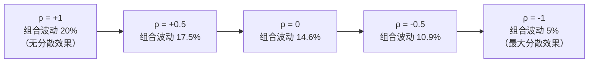

> **核心发现：** 组合收益率始终是 10%（不受 $\rho$ 影响），但组合波动率从 20% 降到 5%！**收益不变，风险大幅降低——这就是分散化的"免费午餐"。**

> **"为什么说分散化是投资中唯一的免费午餐？"** 这句话来自诺贝尔奖得主 Markowitz。通常在投资中，降低风险必须牺牲收益（Day 5 讲过的风险-收益权衡）。但分散化是例外——它在不降低预期收益的情况下降低风险。前提是资产之间不是完全正相关的。

#### 3.4 相关系数为什么不能改变收益率

有读者可能会问：**为什么 $\rho$ 只影响风险不影响收益？**

因为收益率的期望值是线性运算（加权平均），而风险（方差）是非线性运算（涉及交叉项）。这个交叉项里包含了 $\rho$，所以 $\rho$ 能影响风险。但 $\rho$ 在收益率的加权平均中根本不出现。

> 类比：你混合了两杯液体——温度（类比收益）是加权平均，不管两杯液体是否"相关"；但颜色的混合效果（类比风险）取决于两种颜色的关系——红+红还是红，红+绿变成灰。

---

### 四、系统性风险与非系统性风险

分散化能降低风险，但**不能消除所有风险**。这引出了两种风险的区分。

#### 4.1 两种风险

**非系统性风险（Unsystematic Risk / 特异风险 / 个股风险）：**

只影响个别公司或行业的风险。可以通过分散化消除。

> 例：茅台的酒窖着火、某科技公司的 CEO 辞职、某药企的新药试验失败。这些只影响个别公司，和其他公司无关。

**系统性风险（Systematic Risk / 市场风险）：**

影响所有资产的风险。无法通过分散化消除。

> 例：经济衰退、央行加息、战争、全球疫情。这些影响整个市场，所有股票都受波及。

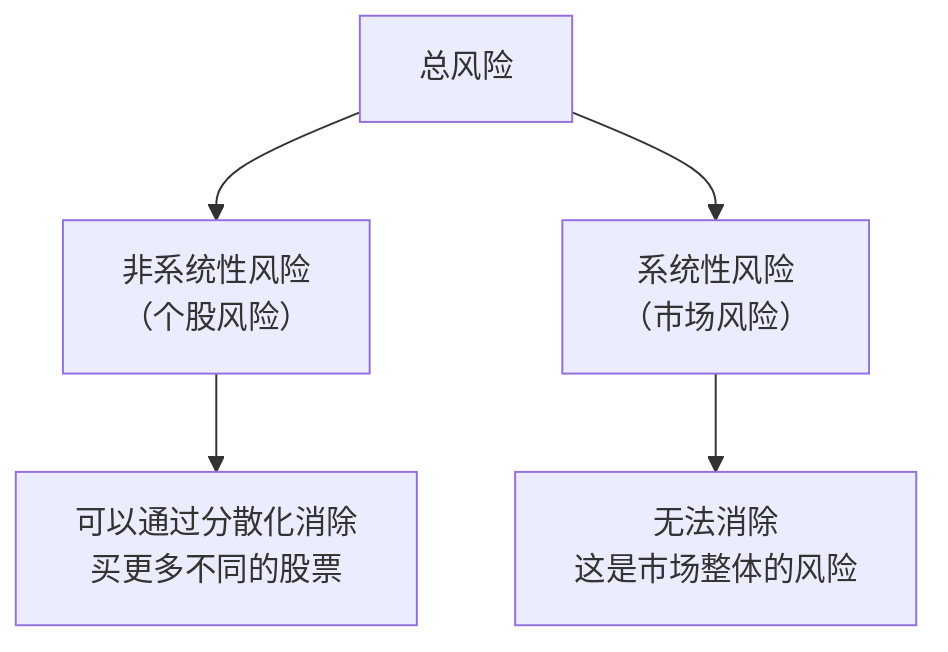

#### 4.2 分散化的效果：持股数量与风险

随着你持有的股票数量增加，组合的总风险逐渐降低：

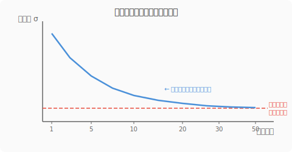

| 持股数量  | 大约能消除的非系统性风险 |
| :-------: | :----------------------: |
|   1 只    |      0%（全部暴露）      |
|   5 只    |           ~50%           |
|   10 只   |           ~70%           |
|   20 只   |           ~85%           |
|   30 只   |          ~90%+           |
| 50 只以上 |  ~95%+（接近完全消除）   |

> **实用结论：** 持有大约 20-30 只不同行业的股票，就能消除绝大部分非系统性风险。继续增加数量的边际效果递减。

> **因子投资的处理方式：** 因子策略通常持有几十到几百只股票——自然消除了非系统性风险。你承担的主要是系统性风险（市场风险）和因子风险。这也是为什么因子投资不会去分析单只股票的基本面——单只股票的特异风险会在组合中被分散掉。

#### 4.3 为什么系统性风险消不掉

**因为所有股票都受到共同因素的影响。**

经济衰退时，消费减少，企业利润下降——几乎所有公司都受害。你买 100 只股票也没用，因为它们都在跌。

> 用数学语言说：所有股票和市场的相关系数 $\rho > 0$。只要 $\rho$ 不等于零，组合中就剩余一部分无法消除的风险——这就是系统性风险。
>
> **关键概念：投资者承担系统性风险会获得补偿（风险溢价），但承担非系统性风险不会获得补偿——因为后者可以免费消除。** 这是 Day 8 CAPM 的核心逻辑预告。

---

### 第一节完成检查

- [ ] 知道协方差和相关系数的含义
- [ ] 知道相关系数 $\rho$ 的范围是 -1 到 +1
- [ ] 能写出两资产组合的波动率公式
- [ ] 理解 $\rho$ 越低，组合风险越低——分散化效果越好
- [ ] 知道现实中大部分股票之间 $\rho$ 在 +0.3 到 +0.8 之间
- [ ] 理解"分散化是免费午餐"——降低风险但不降低预期收益
- [ ] 能区分系统性风险和非系统性风险
- [ ] 知道分散化只能消除非系统性风险，不能消除系统性风险
- [ ] 知道大约 20-30 只股票就能消除大部分非系统性风险

**休息 10 分钟。**

---

## 第二节：有效前沿与最优组合（50 分钟）

### 五、从两个资产到 N 个资产

第一节讲的是两个资产的组合。现实中有成百上千个资产可选。

#### 5.1 两资产组合的所有可能

先回到两个资产的情况。改变 $w_A$ 和 $w_B$ 的比例（从 0% 到 100%），可以画出所有可能的组合：

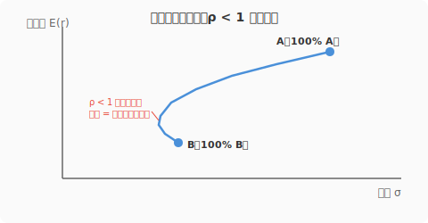

- 当 $\rho = +1$ 时：所有组合在一条直线上（A 到 B 的连线）
- 当 $\rho < +1$ 时：线向左弯曲——**弯曲的部分就是分散化带来的风险降低**
- $\rho$ 越小，弯曲越明显

> **弯曲 = 免费午餐。** 线弯到 B 的左边，意味着有些组合的风险比 A 和 B 单独任何一个都低，但收益在两者之间。这就是分散化的力量。

#### 5.2 N 个资产的组合空间

当资产数量增加到 N 个，所有可能的组合不再是一条线，而是一个**区域**——在风险-收益图上形成一大片"可行域"：

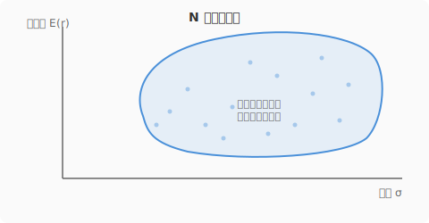

这个区域里有无数种组合——但其中大部分都不是最优的。

---

### 六、有效前沿

#### 6.1 定义

**有效前沿（Efficient Frontier）：在所有可能的组合中，对于每个风险水平，收益最高的那些组合连成的线。**

换句话说：有效前沿是可行域的**左上边界**——不可能再往左（更低风险）或往上（更高收益）了。

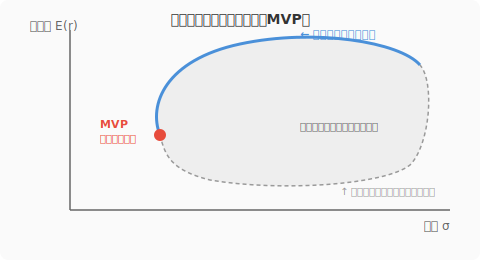

#### 6.2 为什么有效前沿是这个形状

有效前沿的形状像一个**开口朝右的弧线**（上半部分），原因是：

1. **分散化的效果**：不同资产的组合使风险低于单个资产的加权平均 → 可行域的左边界向左凸出
2. **风险-收益权衡**：要获得更高收益，必须接受更高风险 → 前沿向右上延伸

> 有效前沿的弯曲程度取决于资产之间的相关性——相关性越低，弯曲越明显（分散化效果越好），前沿越往左凸。

#### 6.3 有效前沿上 vs 有效前沿下

| 位置             |    是否理性    | 说明                                           |
| ---------------- | :------------: | ---------------------------------------------- |
| **有效前沿上方** |   不可能达到   | 超出了所有可行组合的能力                       |
| **有效前沿上**   | 理性的最优选择 | 同等风险下收益最高，同等收益下风险最低         |
| **有效前沿下方** |     不理性     | 同样的风险可以获得更高的收益（往上移到前沿上） |

> **所有理性投资者都应该选择有效前沿上的组合。** 具体选前沿上的哪个点，取决于个人的风险厌恶程度（Day 6 的效用函数）。

#### 6.4 最小方差组合

有效前沿的最左端有一个特殊的点——**最小方差组合（Minimum Variance Portfolio, MVP）**：风险最小的组合。

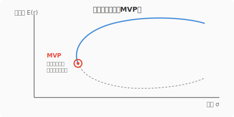

> MVP 以下的弧线部分（前沿的下半段）是"无效的"——和 MVP 以上的对应点相比，风险相同但收益更低。所以有效前沿只取 MVP 以上的部分。

---

### 七、最优风险组合

#### 7.1 把无风险资产加进来

Day 6 学了资本配置线（CAL）——从无风险利率出发，连到一个风险组合，画一条直线。

现在有效前沿上有无数个风险组合可选——**应该选哪个作为 CAL 的"风险端"？**

答案：**选那个让 CAL 斜率最大（夏普比率最高）的组合。**

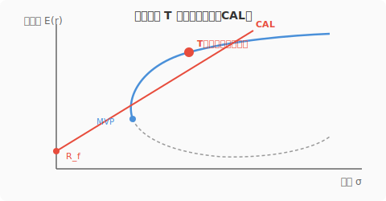

从无风险利率 $R_f$ 画一条线，和有效前沿**相切**——切点 T 就是**最优风险组合（Optimal Risky Portfolio）**，也叫**切线组合（Tangency Portfolio）**。

#### 7.2 为什么切线组合最优

| CAL 的选择         | 夏普比率 | 效果                                 |
| ------------------ | :------: | ------------------------------------ |
| 连到前沿上偏左的点 |   较低   | CAL 斜率平，同等风险下收益低         |
| **连到切点 T**     | **最高** | **CAL 斜率最陡，同等风险下收益最高** |
| 连到前沿上偏右的点 |   较低   | CAL 斜率平，不如切点                 |

> Day 6 的结论是"选夏普比率最高的风险资产画 CAL"。今天的结论是这个"最高夏普比率的风险资产"**就是有效前沿上的切线组合**。Day 6 和 Day 7 的知识在这里合流了。

#### 7.3 资本市场线（CML）

当切线组合恰好是整个市场组合（包含所有可交易资产的组合）时，这条 CAL 有一个特殊的名字：

**资本市场线（Capital Market Line, CML）= 从无风险利率到市场组合的 CAL。**

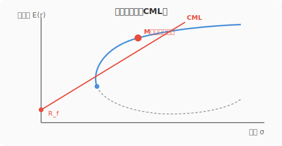

> **"市场组合"在理论上包含世界上所有的可交易资产——所有股票、所有债券、所有房产等。** 实际中用市场指数（如沪深 300、标普 500）近似。这是一个理论概念，Day 8 的 CAPM 模型会详细讲。

> CML 的意义：**每个投资者都应该持有相同的风险组合（市场组合），只是根据自身风险厌恶程度调整无风险资产的比例。** 这个结论叫做**分离定理（Separation Theorem）**——下面详细说明。

---

### 八、分离定理

#### 8.1 一个简洁有力的结论

**分离定理（Separation Theorem）：投资决策可以分成两个独立的步骤：**

**第 1 步（对所有人相同）：** 找到最优风险组合（有效前沿上的切线组合）。这是一个纯技术问题，和个人偏好无关。

**第 2 步（因人而异）：** 根据自身风险厌恶程度，在最优风险组合和无风险资产之间分配比例（Day 6 的 $y^*$ 公式）。

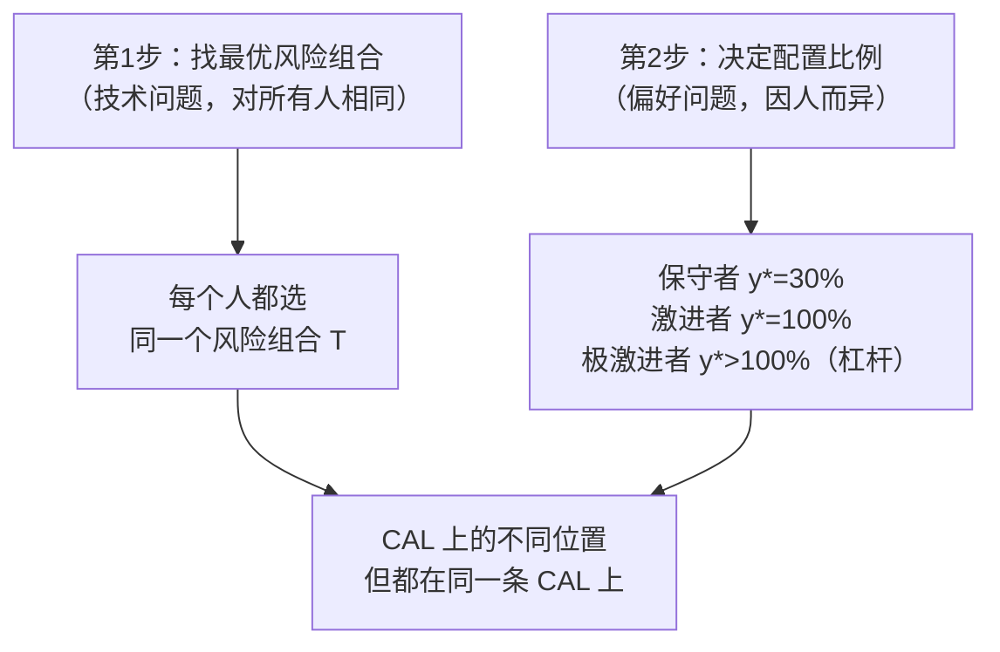

> **直觉类比：** 所有人都应该买同一款最高品质的巧克力（最优风险组合），区别只在于你吃多少（配置比例）。保守的人吃一小块配一大杯牛奶（大量无风险资产），激进的人吃一大块，极端的人还嫌不够要借钱多买两块。

> **为什么叫"分离"？** 因为"选什么风险组合"和"承担多少风险"这两个决策被**分开**了。不需要为保守的人专门找一个低风险组合，也不需要为激进的人找一个高风险组合——**所有人用同一个最优组合，只是加减无风险资产的比例不同。**

#### 8.2 分离定理与因子投资

这个定理对因子投资有深刻的含义：

> **因子投资的核心任务就是第 1 步——找到最优的风险组合。** 通过构造高夏普比率的多因子组合（价值 + 质量 + 动量 + 低波动等），你在试图找到一个比单纯的市场指数更优的"切线组合"。
>
> 如果成功了，你的 CAL 比市场 CML 更陡 → 在任何风险水平下，你的预期收益都高于被动持有市场指数。
>
> 这就是因子投资存在的理论意义。

---

### 九、现代投资组合理论的全貌

#### 9.1 Markowitz 的贡献

1952 年，Harry Markowitz 发表了论文 "Portfolio Selection"，提出了以上所有概念——用均值和方差来分析组合，用有效前沿来找最优组合。

这篇论文奠定了现代金融学的基础，Markowitz 因此获得 1990 年诺贝尔经济学奖。

> **在 Markowitz 之前：** 人们知道"不要把鸡蛋放在一个篮子里"，但不知道应该放几个篮子、每个篮子放几个。
>
> **Markowitz 的贡献：** 把"分散化"从一句谚语变成了一套精确的数学框架。他证明了最优的组合不是简单地"买很多只股票"，而是要考虑资产之间的相关性来精心配置权重。

#### 9.2 完整的决策框架

把 Day 5-7 的知识串在一起：

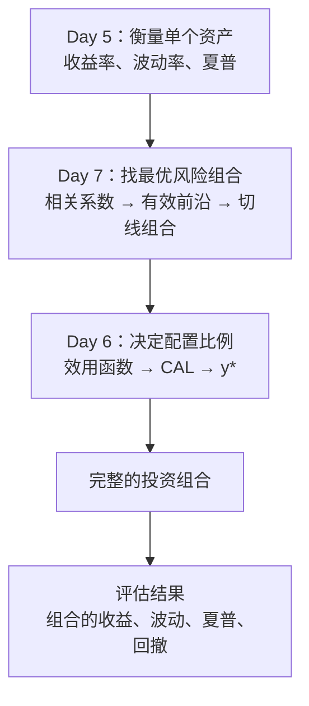

#### 9.3 现代投资组合理论的局限性

Markowitz 的理论很美，但在实际应用中有一些问题：

| 局限                   | 说明                                                                                                     | 因子投资怎么处理                                                 |
| ---------------------- | -------------------------------------------------------------------------------------------------------- | ---------------------------------------------------------------- |
| **需要估计大量参数**   | N 只股票需要估计 N 个收益率、N 个波动率、$N \times (N-1)/2$ 个相关系数。1000 只股票 = 近 50 万个相关系数 | 用因子模型降维——不直接估计股票间的相关系数，而是通过因子间接推算 |
| **对输入参数极度敏感** | 期望收益率估计稍有偏差，最优组合就可能大幅变化                                                           | 用更稳健的方法（如缩减估计、等权重配置）                         |
| **假设收益正态分布**   | 现实中收益率有"肥尾"（极端事件更频繁）                                                                   | 补充使用 VaR、最大回撤等非正态指标                               |
| **只考虑均值和方差**   | 没考虑偏度（收益分布是否对称）、峰度（极端值的频率）                                                     | 实践中会补充考虑更高阶矩                                         |
| **假设投资者完全理性** | 现实中人会恐慌抛售、追涨杀跌                                                                             | Day 11 的行为金融会讲解                                          |

> **Malkiel（《漫步华尔街》作者）的观点：** Markowitz 的理论在概念上是对的——分散化确实有效，相关性确实重要。但在实际操作中，不需要去精确计算有效前沿——只要**广泛分散**（持有指数基金）+ **跨资产类别配置**（股票 + 债券 + 实物资产），就能获得分散化的大部分好处。
>
> 这也是为什么被动指数投资如此强大——它自动做到了广泛分散。

---

### 十、一个完整的数字案例

用三个资产构造组合，把今天的所有概念串一遍：

**资产数据：**

| 资产     | 期望收益 | 波动率 | 类型     |
| -------- | :------: | :----: | -------- |
| 沪深 300 |   10%    |  25%   | 大盘股   |
| 中证 500 |   12%    |  30%   | 中小盘股 |
| 国债指数 |   3.5%   |   4%   | 债券     |

**相关系数矩阵：**

|          | 沪深 300 | 中证 500 | 国债  |
| -------- | :------: | :------: | :---: |
| 沪深 300 |    1     |   0.85   | -0.1  |
| 中证 500 |   0.85   |    1     | -0.05 |
| 国债     |   -0.1   |  -0.05   |   1   |

**观察：**

- 沪深 300 和中证 500 高度相关（0.85）——都是 A 股，分散化效果有限
- 股票和国债相关性接近零甚至为负——分散化效果好

**一个简单的配置：** 50% 沪深 300 + 30% 中证 500 + 20% 国债

```
组合收益 = 0.5 × 10% + 0.3 × 12% + 0.2 × 3.5% = 5% + 3.6% + 0.7% = 9.3%
```

组合波动率的完整计算涉及所有两两协方差（计算比较多，编程实战中用 Python 秒算），但大致结果约为 **18-19%**。

对比只持有沪深 300（收益 10%，波动 25%）：

- 收益从 10% 降到 9.3%（稍低，因为加了低收益的国债）
- 波动从 25% 降到约 18%（大幅降低！）

> 放弃了 0.7% 的收益，换来了约 7% 的波动率降低——这笔"交易"是非常划算的。这就是跨资产类别分散化的价值——股票和债券的低相关性带来了显著的风险降低。

#### 延伸：加入 BTC 后有效前沿会怎样变？

在传统的 60/40（股票/债券）组合中加入少量 BTC（比如 1-5%），有效前沿会向**左上方移动**——也就是说，在相同的风险下获得更高的收益，或者在相同的收益下承受更低的风险。

**为什么少量 BTC 就能改善组合？**

关键不在于 BTC 本身的收益高（虽然确实高），而在于它和传统资产的**低相关性**。回忆 §2.3 的相关系数表：

- BTC vs 股票：$\rho \approx +0.3$
- BTC vs 国债：$\rho \approx 0$ 到 $+0.1$

当一个新资产和组合中现有资产的相关性低时，即使它本身波动很大，少量配置也能降低组合整体的波动。这就是 Day 6 中 BTC 最优配比虽然不高（~5-13%）但确实为正的原因。

**具体感受：**

```
60% 股票 + 40% 债券：            收益 ≈ 7.6%，波动 ≈ 10.5%
57% 股票 + 38% 债券 + 5% BTC：   收益 ≈ 8.7%，波动 ≈ 10.8%
```

加入 5% BTC，波动率只增加了 0.3%，但收益增加了 1.1%——夏普比率明显改善。

> **但这里有一个陷阱：相关性不稳定。**
> 上面的分析假设相关系数是稳定的，但现实中 BTC 和股票的相关性在危机时期会**突然飙升**（从 +0.3 跳到 +0.7 以上）。这意味着你指望 BTC 帮你分散风险的时候——恰恰是市场恐慌、所有资产一起跌的时候——分散化效果可能大打折扣。这是"**相关性不稳定**"问题，在 Day 6 的 BTC 配置讨论中也提到过。

---

### 第二节完成检查

- [ ] 知道有效前沿是什么——所有可能组合中，风险-收益最优的那条边界
- [ ] 知道有效前沿的形状（向左凸的弧线上半部分）
- [ ] 知道最小方差组合（MVP）是有效前沿的最左端
- [ ] 理解最优风险组合 = 有效前沿和 CAL 的切点
- [ ] 知道切线组合的夏普比率最高
- [ ] 理解分离定理：所有人持有相同的最优风险组合，只是配比不同
- [ ] 知道现代投资组合理论的核心贡献（Markowitz）
- [ ] 知道现代投资组合理论的主要局限（参数估计难、对输入敏感）

---

## 收尾：自测（10 分钟）

拿一张白纸，**不看任何资料**，回答以下问题。先自己写，再对答案：

```
自测 1：相关系数 ρ 的范围是多少？ρ = +1 和 ρ = -1 分别代表什么？
→ 你的答案：_______________
→ 正确：ρ 范围 -1 到 +1。
  ρ = +1 表示完全同涨同跌，ρ = -1 表示完全反向。

自测 2：为什么说"分散化是投资中唯一的免费午餐"？
→ 你的答案：_______________
→ 正确：因为只要 ρ < 1，组合的风险低于加权平均风险，
  但组合的期望收益仍然等于加权平均——风险降了，收益没降。

自测 3：两只股票各买一半，ρ 从 +1 变为 0，组合风险会怎样？收益会怎样？
→ 你的答案：_______________
→ 正确：组合风险会显著降低（公式中交叉项从正变为零），
  但组合收益完全不变（收益率是加权平均，不受 ρ 影响）。

自测 4：系统性风险和非系统性风险有什么区别？哪个能被分散化消除？
→ 你的答案：_______________
→ 正确：系统性风险影响整个市场（如经济衰退），不能消除。
  非系统性风险只影响个别公司（如CEO辞职），可以通过分散化消除。

自测 5：大约持有多少只股票就能消除大部分非系统性风险？
→ 你的答案：_______________
→ 正确：约 20-30 只不同行业的股票就能消除 90% 以上的
  非系统性风险。

自测 6：有效前沿是什么？
→ 你的答案：_______________
→ 正确：有效前沿是所有可能的资产组合中，对于每个风险水平
  收益最高的那些组合连成的线。它是可行域的左上边界。

自测 7：最优风险组合（切线组合）是怎么找到的？
→ 你的答案：_______________
→ 正确：从无风险利率画一条线和有效前沿相切，
  切点就是最优风险组合——它的夏普比率在所有组合中最高。

自测 8：分离定理说了什么？
→ 你的答案：_______________
→ 正确：投资决策分两步：(1) 找到最优风险组合（对所有人相同）；
  (2) 根据个人风险偏好决定在最优组合和无风险资产之间的配比。

自测 9：Markowitz 对投资学最大的贡献是什么？
→ 你的答案：_______________
→ 正确：把"分散投资"从直觉谚语变成精确的数学框架——
  用均值-方差分析找到最优组合，提出了有效前沿的概念。

自测 10：现代投资组合理论最大的实际困难是什么？
→ 你的答案：_______________
→ 正确：需要估计大量参数（期望收益、波动率、相关系数），
  且结果对参数估计极其敏感——输入稍有偏差，最优组合就大幅变化。
```

**9-10 道对：** 完美，投资组合理论已经掌握。
**7-8 道对：** 不错，回看错的部分就好。
**6 道以下：** 建议花 20 分钟重新阅读讲义，重点是两资产组合公式和有效前沿的概念。

---

## 今天不需要记住的内容

| 概念                               | 今天理解到什么程度               | 什么时候深入             |
| ---------------------------------- | -------------------------------- | ------------------------ |
| 协方差的精确计算公式               | 知道"衡量两资产一起动的程度"就行 | 数学基础阶段             |
| N 资产组合方差的矩阵形式           | 知道两资产公式就行               | 数学基础阶段（线性代数） |
| 有效前沿的数值求解方法（二次规划） | 知道概念就行，编程时调库         | 编程实战阶段             |
| 最小方差组合的解析解               | 知道它是前沿最左端就行           | 不涉及                   |
| Black-Litterman 模型               | 不需要知道                       | 不涉及                   |
| 缩减估计（Shrinkage Estimation）   | 知道"参数估计是个问题"就行       | 编程实战阶段             |
| 投资组合再平衡策略                 | 今天不涉及                       | 编程实战阶段             |

---

## 今日知识点与因子投资的关联

| 今日知识点              | 关联的因子/概念          | 怎么关联                                                                                | 深入时间     |
| ----------------------- | ------------------------ | --------------------------------------------------------------------------------------- | ------------ |
| 相关系数                | **多因子组合的核心**     | 价值因子和动量因子相关性低（甚至为负），组合后风险大幅降低，夏普显著提升                | Day 9-10     |
| 组合波动率公式          | **因子组合风险计算**     | 回测多因子策略时用此公式（矩阵版）计算组合的预期波动率                                  | 编程实战阶段 |
| 系统性 vs 非系统性风险  | **因子策略的风险分解**   | 因子策略自动分散了非系统性风险，剩余的是系统性风险和因子风险                            | Day 8        |
| 有效前沿                | **多因子策略的优化目标** | 寻找最优的因子权重组合（价值多少、动量多少）就是在因子空间里找有效前沿                  | 编程实战阶段 |
| 切线组合 / 最优风险组合 | **因子投资的终极目标**   | 构建夏普比率最高的多因子组合，使其成为比市场指数更优的"切线组合"                        | 编程实战阶段 |
| 分离定理                | **仓位管理原则**         | 先找最优因子组合（第 1 步），再根据风险偏好定仓位（第 2 步）——两步分离                  | 编程实战阶段 |
| MPT 的局限              | **因子模型的必要性**     | 直接估计股票间相关系数太难，因子模型通过少量因子间接推算——这正是 Day 9 多因子模型的动机 | Day 9        |

> 模块四（投资组合理论）至此完结。Day 6-7 告诉你"怎么把资产组合在一起"，接下来的模块五将回答一个更根本的问题："资产的收益率到底是由什么决定的？"——这就是 CAPM 和多因子模型的领域，也是因子投资理论的核心。

---

## 明天预告

**Day 8** 进入全新且最核心的模块——**资产定价模型（CAPM）**。

今天学了"最优组合应该是市场组合"。明天要回答的问题是：

**如果市场组合是最优的，那么单个资产的定价应该是怎样的？一个资产的合理预期收益率是多少？**

你将第一次接触两个在因子投资中无处不在的概念：

- **Beta（贝塔）**——衡量一个资产对市场的敏感度
- **Alpha（阿尔法）**——超出模型预期的"异常收益"，每个因子投资者追求的圣杯

> CAPM 是理解因子投资的基石。Day 8-10 是整个金融基础部分的核心中的核心。
