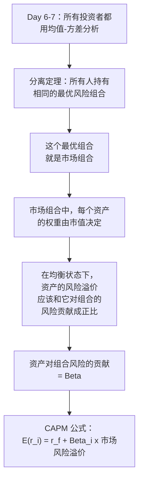
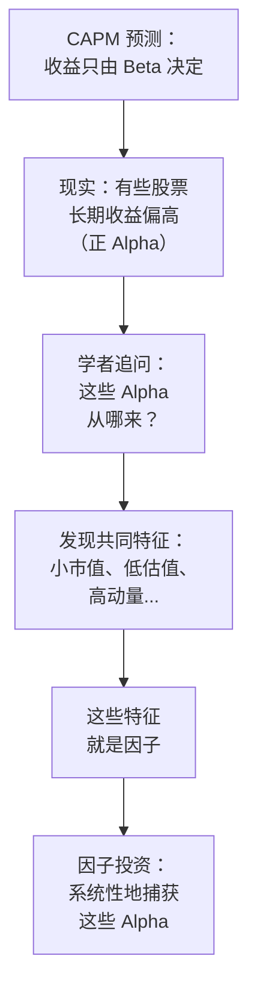
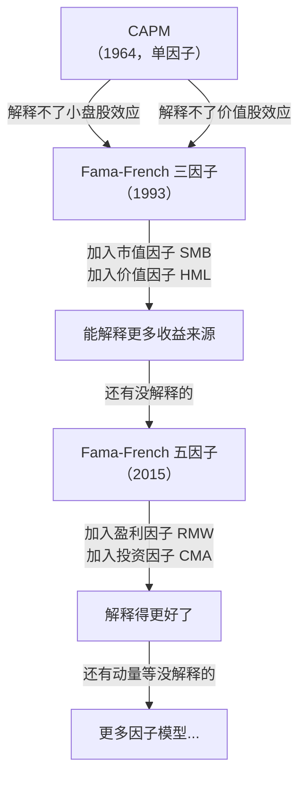

# Day 8：CAPM 资本资产定价模型

> **总时长：** 2 小时
>
> **节奏：** 每 50 分钟休息 10 分钟
>
> **今日目标：** 理解 Beta 如何衡量资产对市场的敏感度，掌握 CAPM 公式的含义，知道 Alpha 是超出模型预期的"异常收益"——Alpha 是每一个因子投资者追求的目标
>
> **本文是完整讲义，包含所有知识点，不需要翻阅其他资料**

---

## 时间表

```
00:00 - 00:50  [第1节] CAPM 的逻辑推导 + Beta + 市场风险溢价
00:50 - 01:00  休息
01:00 - 01:50  [第2节] 证券市场线 + Alpha + CAPM 的局限
01:50 - 02:00  [收尾] 自测
```

---

## 第一节：从市场组合到 CAPM（50 分钟）

### 一、从 Day 7 到 Day 8

Day 7 解决的问题是：**怎么把多个资产组合在一起，找到最优的风险组合。** 答案是有效前沿上的切线组合（夏普比率最高的那个）。分离定理告诉我们，如果所有人都理性，这个最优风险组合就是市场组合。

但这留下了一个更根本的问题：**如果市场组合是最优的，那么单个资产的合理价格应该是多少？一只股票的预期收益率应该是多少？**

Day 7 是"从下往上"——把资产组合起来。Day 8 是"从上往下"——从市场组合出发，反推每个资产应该有多少回报。

回答这个问题的模型叫做 **CAPM（Capital Asset Pricing Model，资本资产定价模型）**，由 William Sharpe 在 1964 年提出。Sharpe 因此获得 1990 年诺贝尔经济学奖（和 Markowitz 同年）。

> **为什么要学 CAPM？** 它是因子投资的起点。因子投资的核心思路是：CAPM 说"资产的收益只由市场风险决定"，但现实中有些收益 CAPM 解释不了——这些"解释不了的部分"就是 Alpha，也就是因子投资要捕获的东西。不懂 CAPM，就无法理解 Alpha 从哪来。

---

### 二、CAPM 的假设

CAPM 是一个理论模型，建立在一组简化假设之上。这些假设不完全符合现实——但正是**假设和现实的偏差**，才给因子投资创造了机会。

| 假设 | 含义 | 现实情况 |
|------|------|----------|
| 投资者都用均值-方差分析 | 每个人都像 Day 6-7 学的那样做优化 | 大部分散户凭直觉交易 |
| 所有投资者有相同的预期 | 对每只股票的预期收益和风险，所有人看法一致 | 不同人对同一只股票看法差异极大 |
| 可以无限制地以无风险利率借贷 | 想借多少借多少，利率相同 | 借钱利率远高于存款利率 |
| 没有税收和交易成本 | 买卖不花钱 | Day 2 讲过，交易成本真实存在 |
| 所有资产都可自由交易 | 任何资产都能买卖，可以无限分割 | 有些资产有门槛，不能买零点几股 |
| 信息完全公开 | 所有人同时获得相同信息 | 有人先知道，有人后知道 |

> **这些假设意味着什么？** 如果所有假设都成立，所有投资者会做出完全相同的决策——选择同一个最优风险组合。根据分离定理，这个组合就是市场组合。CAPM 就是在这个逻辑下推导出来的。
>
> **假设不成立怎么办？** 不影响我们学习 CAPM。重要的是理解它的逻辑框架，然后看它**哪里和现实不符**——这正是因子投资的切入点。

---

### 三、Beta：衡量系统性风险

#### 3.1 Beta 的直觉

Day 7 讲了两种风险：系统性风险（消不掉的市场风险）和非系统性风险（可以分散掉的个股风险）。CAPM 的核心观点是：

**既然非系统性风险可以免费消除，投资者不应该因为承担它而获得回报。只有承担系统性风险（市场风险）才能获得补偿。**

那么问题来了：**不同资产承担的系统性风险不一样多——有的对市场波动非常敏感，有的不太敏感。怎么衡量一个资产承担了多少系统性风险？**

答案就是 **Beta（贝塔，$\beta$）**。

**Beta 衡量一个资产的收益率对市场收益率的敏感程度。市场涨 1%，这个资产平均涨多少？**

#### 3.2 Beta 的值怎么理解

| Beta 值 | 含义 | 直觉 |
|:-------:|------|------|
| $\beta = 1$ | 和市场同步——市场涨 1%，它平均涨 1% | 跟着大部队走，不快不慢 |
| $\beta = 1.5$ | 比市场更敏感——市场涨 1%，它平均涨 1.5% | 大部队走一步，它走一步半——弹性大 |
| $\beta = 0.5$ | 比市场不敏感——市场涨 1%，它平均只涨 0.5% | 大部队走一步，它只走半步——比较稳 |
| $\beta = 0$ | 和市场完全无关——市场涨跌不影响它 | 完全独立行动（理论上的无风险资产） |
| $\beta < 0$ | 和市场反向——市场涨时它跌 | 很罕见，某些避险资产在极端时期可能出现 |

> **直觉类比：** 想象市场是大海的潮水。$\beta$ 就是你的船随潮水起落的程度。$\beta = 1$ 的船完全随潮涨潮落；$\beta = 2$ 的船像一艘放大波浪的快艇，潮涨 1 米它涨 2 米；$\beta = 0.5$ 的船像一艘稳重的巨轮，潮涨 1 米它只涨 0.5 米。

#### 3.3 真实资产的 Beta

| 资产 | Beta（近似） | 说明 |
|------|:----------:|------|
| 沪深 300 指数 | 1.0 | 市场本身，定义就是 1 |
| 券商股（如中信证券） | 约 1.3-1.5 | 牛市涨得多、熊市跌得多——"牛市旗手" |
| 银行股（如工商银行） | 约 0.6-0.8 | 大盘蓝筹，波动比市场小 |
| 消费股（如贵州茅台） | 约 0.7-0.9 | 业绩稳定，受市场情绪影响较小 |
| 科技/成长股（如宁德时代） | 约 1.2-1.5 | 预期驱动，对市场情绪敏感 |
| 国债 | 接近 0 | 几乎不受股票市场影响 |

> **为什么券商股 Beta 高？** 牛市时交易量大增 → 券商收入大增 → 股价暴涨；熊市反过来。券商的业绩和市场涨跌高度绑定，所以它对市场的敏感度（Beta）很高。
>
> **为什么银行股 Beta 低？** 银行的主要收入来源是存贷利差，相对稳定，不像券商那样依赖市场交易量。市场涨跌对银行利润的影响有限，所以 Beta 较低。

#### 3.4 Beta 的计算方法

Beta 不是拍脑袋定的，而是从历史数据中计算出来的。方法是：

**用资产收益率对市场收益率做回归（最小二乘法，OLS）。**

$$r_i - r_f = \alpha + \beta (r_m - r_f) + \varepsilon$$

其中：$r_i$ = 资产 $i$ 的收益率，$r_f$ = 无风险利率，$r_m$ = 市场收益率，$\beta$ = 回归系数（就是 Beta），$\alpha$ = 截距项（就是 Alpha，后面会讲），$\varepsilon$ = 残差（随机误差）。

> **不需要记住回归的数学细节。** 今天只需知道：Beta 是从"资产收益率 vs 市场收益率"的散点图中，拟合出的那条直线的**斜率**。编程实战阶段会用 Python 实际计算。

```
资产超额收益 (r_i - r_f)
  ^
  |          *    *
  |        *   *
  |      *  *     *
  |    *  *  *         ← 散点 = 每个月的数据
  |  *  * *
  | * *           斜率 = Beta
  |* *  /
  | * /
  |  /
  | /
  +----------------------------> 市场超额收益 (r_m - r_f)
```

斜率 = Beta：
- 斜率大（线很陡）→ Beta 高 → 市场动一下，资产动得更多
- 斜率小（线很平）→ Beta 低 → 市场动一下，资产不太动

#### 3.5 Beta 的直觉公式

Beta 还有一个直觉版本的定义：

$$\beta_i = \frac{\text{Cov}(r_i, r_m)}{\text{Var}(r_m)}$$

翻译成白话：**Beta = 资产和市场的协方差 / 市场的方差。**

Day 7 学过协方差——衡量两个资产"一起动"的程度。Beta 其实就是**把协方差标准化**——除以市场自身的波动程度。

> **和相关系数的区别：** 相关系数 $\rho$ 衡量的是"方向上有多一致"（-1 到 +1），Beta 衡量的是"幅度上有多敏感"（可以大于 1 或小于 0）。$\rho$ 是方向指标，$\beta$ 是幅度指标。两者有关系但不相同：
>
> $$\beta_i = \rho_{i,m} \cdot \frac{\sigma_i}{\sigma_m}$$
>
> 如果资产和市场完全正相关（$\rho = 1$），Beta 就等于资产波动率除以市场波动率。

---

### 四、市场风险溢价

#### 4.1 定义

**市场风险溢价（Market Risk Premium）：**

$$\text{市场风险溢价} = E(r_m) - r_f$$

它回答的问题是：**承担市场整体的风险，能多赚多少？**

> **直觉类比：** 你可以把钱存银行（无风险，年化约 2-3%），也可以投入股市（有风险）。你之所以愿意冒险投股市，是因为期望多赚一些——这个"多赚的部分"就是市场风险溢价。

#### 4.2 历史数据

| 市场 | 无风险利率（近似） | 股市年化收益（近似） | 市场风险溢价（近似） |
|------|:----------:|:------------:|:------------:|
| A 股（沪深 300，近 15 年） | 约 2.5-3% | 约 8-10% | 约 5-7% |
| 美股（标普 500，近 100 年） | 约 3-4% | 约 10-12% | 约 6-8% |

> **注意：** 这些是长期平均值，年度之间波动很大。某些年份市场收益可能是 -30%，风险溢价为负；另一些年份可能是 +50%。但长期来看，承担市场风险确实能获得正的补偿。
>
> **为什么会有风险溢价？** 因为人是厌恶风险的（Day 6 讲的风险厌恶）。要让人愿意承担市场波动的风险，就必须提供比无风险利率更高的预期收益作为补偿。如果股市的预期收益和银行存款一样，没人愿意承担风险去炒股。

---

### 五、CAPM 公式

#### 5.1 公式

把 Beta 和市场风险溢价合在一起，就得到了 CAPM 的核心公式：

$$E(r_i) = r_f + \beta_i [E(r_m) - r_f]$$

```
任意资产 i 的       无风险     该资产的      市场
期望收益率    =    利率    +   Beta   ×  风险溢价
```

这个公式说的是：**一个资产的合理预期收益率 = 无风险收益 + 该资产承担的系统性风险 × 每单位系统性风险的补偿。**

#### 5.2 公式的直觉


CAPM 把一个资产的预期收益拆成两部分：

1. **无风险利率 $r_f$**：不承担任何风险也能拿到的收益，纯粹是"等待"的报酬（今天的 1 块钱比明天的 1 块钱值钱）
2. **$\beta_i \times [E(r_m) - r_f]$**：因为承担了系统性风险而获得的额外补偿。Beta 越大，承担的系统性风险越多，应该获得的补偿越高

> **直觉类比：** 你去搬运工地打工。基本工资（无风险利率）人人有份，只要你来了就有。危险津贴（风险溢价）看你做的事有多危险——你在地面搬砖（$\beta = 0.5$）拿少一点津贴，在高空作业（$\beta = 1.5$）拿多一点津贴。津贴 = 你的危险程度 × 每单位危险的补贴标准。

#### 5.3 数字例子

假设：
- 无风险利率 $r_f$ = 3%
- 市场预期收益 $E(r_m)$ = 10%
- 市场风险溢价 = 10% - 3% = 7%

不同 Beta 的资产应该有多少预期收益？

| 资产 | Beta | CAPM 期望收益 = 3% + $\beta$ × 7% | 解读 |
|------|:----:|:--------------------------:|------|
| 国债 | 0 | 3% + 0 × 7% = **3%** | 不承担市场风险，只拿无风险利率 |
| 银行股 | 0.7 | 3% + 0.7 × 7% = **7.9%** | 承担较少市场风险 |
| 市场组合 | 1.0 | 3% + 1.0 × 7% = **10%** | 承担完整的市场风险 |
| 券商股 | 1.5 | 3% + 1.5 × 7% = **13.5%** | 承担更多的市场风险，应获更高回报 |
| 高波动科技股 | 2.0 | 3% + 2.0 × 7% = **17%** | 承担最多市场风险，期望回报最高 |

> **核心逻辑：** Beta 是你在市场这条船上坐的位置。坐在船头（高 Beta）浪大的时候颠簸最厉害，但平均来看前进得最快。坐在船舱（低 Beta）很稳，但前进速度慢。

#### 5.4 CAPM 的推导逻辑（不需要记住数学，理解思路即可）

CAPM 的推导可以用一条逻辑链概括：



关键的一步是**第 5 步**：在均衡状态下，如果一个资产对组合的风险贡献大（高 Beta），投资者会要求更高的预期收益作为补偿；如果风险贡献小（低 Beta），要求的收益就低。如果某个资产的实际定价偏离了这个关系，投资者就会买入或卖出，直到价格调整到符合 CAPM 为止。

> **今天只需理解这个逻辑链，不需要记住推导过程。** 关键是理解"高 Beta → 高风险贡献 → 高期望收益"这条因果链。

---

### 第一节完成检查

- [ ] 知道 CAPM 建立在哪些关键假设之上
- [ ] 理解 Beta 的含义——衡量资产对市场的敏感度
- [ ] 能说出 Beta = 0、0.5、1、1.5 分别意味着什么
- [ ] 知道 Beta 是通过回归方法从历史数据中计算的
- [ ] 理解市场风险溢价 = 市场收益 - 无风险利率
- [ ] 能写出 CAPM 公式：$E(r_i) = r_f + \beta_i [E(r_m) - r_f]$
- [ ] 能用 CAPM 公式计算不同 Beta 资产的期望收益率
- [ ] 理解 CAPM 的逻辑链：均值-方差分析 → 分离定理 → 市场组合 → CAPM

**休息 10 分钟。**

---

## 第二节：证券市场线与 Alpha（50 分钟）

### 六、证券市场线（SML）

#### 6.1 定义

**证券市场线（Securities Market Line, SML）：把 CAPM 公式画成图——横轴是 Beta，纵轴是期望收益率。**

```
期望收益率 E(r)
  ^
  |                        *  SML
  |                     *
  |                  *     ← 斜率 = 市场风险溢价
  |               *
  |          M *           ← M = 市场组合（β=1, E(r)=10%）
  |         *
  |      *
  |   *
  | * r_f = 3%             ← 截距 = 无风险利率
  +-----------------------------> Beta
  0    0.5    1.0    1.5    2.0
```

SML 的方程就是 CAPM：

$$E(r_i) = r_f + \beta_i [E(r_m) - r_f]$$

- **截距**（Beta = 0 时）= 无风险利率 $r_f$
- **斜率** = 市场风险溢价 $E(r_m) - r_f$
- **市场组合**在线上的位置：$\beta = 1$，期望收益 = $E(r_m)$

#### 6.2 SML vs CML

Day 7 学了资本市场线（CML），今天又学了证券市场线（SML）。两者容易混淆，用表格区分：

| 维度 | CML（资本市场线） | SML（证券市场线） |
|------|------------------|------------------|
| 横轴 | 总风险 $\sigma$（标准差） | 系统性风险 $\beta$（Beta） |
| 纵轴 | 期望收益率 | 期望收益率 |
| 适用于 | 只适用于**有效组合** | 适用于**所有资产和组合** |
| 含义 | 有效组合的风险-收益关系 | 任何资产的 Beta-收益关系 |
| 来源 | Day 7：无风险资产 + 市场组合 | Day 8：CAPM 模型 |

> **关键区别：** CML 的横轴是总风险（$\sigma$），只有有效组合才在线上。SML 的横轴是 Beta（系统性风险），**所有资产**在均衡时都应该落在线上。SML 比 CML 更通用——它告诉你任何一个资产的期望收益应该是多少。

> **为什么 SML 用 Beta 而不用总风险 $\sigma$？** 因为非系统性风险可以通过分散化免费消除（Day 7 的结论），所以市场不会为它提供补偿。只有消不掉的系统性风险（用 Beta 衡量）才会获得补偿。两个总风险相同但 Beta 不同的资产，期望收益不同——Beta 高的那个期望收益更高。

---

### 七、Alpha：超额收益

#### 7.1 引出 Alpha

CAPM 告诉我们：如果市场完全有效，所有资产都应该**恰好落在 SML 上**——你承担多少系统性风险（Beta），就获得多少回报，不多不少。

但现实中，有些资产的**实际收益偏离了 SML 的预测**。这个偏离就是 Alpha。

**Alpha（阿尔法，$\alpha$）：**

$$\alpha_i = r_i - [r_f + \beta_i(r_m - r_f)]$$

```
实际收益 - CAPM 说"应该有"的收益
```

| Alpha 的值 | 含义 | 在 SML 图上的位置 |
|:---------:|------|:---------------:|
| $\alpha > 0$ | 实际收益**高于** CAPM 预测——赚多了 | 落在 SML **上方** |
| $\alpha = 0$ | 实际收益**等于** CAPM 预测——刚好 | 落在 SML **上** |
| $\alpha < 0$ | 实际收益**低于** CAPM 预测——赚少了 | 落在 SML **下方** |

```
期望收益率 E(r)
  ^
  |            A *  ← α > 0（在 SML 上方，实际收益 > CAPM 预测）
  |               *  SML
  |            *
  |         *
  |      *   * B   ← α < 0（在 SML 下方，实际收益 < CAPM 预测）
  |   *
  | * r_f
  +-----------------------------> Beta
```

#### 7.2 Alpha 的经济含义

**正 Alpha 意味着你获得了"不该有"的超额收益——在承担的风险之上，还多赚了一些。**

> **直觉类比：** CAPM 像一个"合理工资表"——做多危险的活（Beta），拿多少钱，都有标准。Alpha 就是你实际拿到的钱和"标准工资"的差额。正 Alpha 相当于你的能力超出了岗位要求，拿到了超额奖金；负 Alpha 相当于你的表现还不如岗位平均水平。

#### 7.3 数字例子

继续用第一节的假设：$r_f$ = 3%，$E(r_m)$ = 10%，市场风险溢价 = 7%。

| 资产 | Beta | CAPM 预测收益 | 实际收益 | Alpha | 解读 |
|------|:----:|:-----------:|:------:|:-----:|------|
| 股票 A | 1.2 | 3% + 1.2×7% = 11.4% | 14% | **+2.6%** | 表现优于 CAPM 预期，有正 Alpha |
| 股票 B | 0.8 | 3% + 0.8×7% = 8.6% | 8.6% | **0** | 表现恰好符合 CAPM 预期 |
| 股票 C | 1.5 | 3% + 1.5×7% = 13.5% | 10% | **-3.5%** | 表现差于 CAPM 预期，有负 Alpha |

> **股票 A 的故事：** Beta = 1.2，CAPM 说它应该赚 11.4%。但它实际赚了 14%——多出的 2.6% 就是 Alpha。这 2.6% 不是因为它承担了更多的市场风险，而是因为**某些 CAPM 没有捕捉到的因素**在起作用。
>
> **股票 C 的故事：** Beta = 1.5，承担了比市场更大的风险，CAPM 说它应该赚 13.5%。但它只赚了 10%——不但没多赚，反而赚少了 3.5%。承担了高风险却没有获得相应的回报。

#### 7.4 Alpha 与因子投资的关系

这里是今天最重要的连接——Alpha 和因子投资的关系。

**因子投资的核心逻辑：**

1. CAPM 说收益只由 Beta（市场风险）决定
2. 但实际数据显示，有些股票长期有正 Alpha——CAPM 解释不了它们的收益
3. 学者研究发现，这些 Alpha 来源于一些共同的特征——比如小市值、低估值、高动量
4. 这些共同特征就是"因子"
5. 因子投资就是系统性地捕获这些 Alpha



> **换句话说：** CAPM 是"一因子模型"——它只用市场因子（Beta）来解释收益。但一个因子不够用。Day 9 会学的 Fama-French 三因子模型加入了市值因子和价值因子，能解释更多的收益来源。Day 10 会学五因子模型。因子模型越完善，能解释的收益越多，剩下的"真正的 Alpha"就越少。

> **从 CAPM 的角度看因子投资的历史：**
> - 1964 年：Sharpe 提出 CAPM——收益只由市场 Beta 决定
> - 1981 年：Banz 发现小盘股长期跑赢大盘股——CAPM 的 Alpha
> - 1992 年：Fama & French 发现价值股（低 PE/PB）长期跑赢——CAPM 的 Alpha
> - 1993 年：Fama & French 提出三因子模型——把市值和价值从 Alpha 变成 Beta
> - 2015 年：Fama & French 提出五因子模型——加入盈利因子和投资因子
>
> **每一次"Alpha 的发现"，最终都变成了新的"Beta"。** 因子投资就是在这个不断发现 Alpha、解释 Alpha、捕获 Alpha 的过程中发展起来的。

---

### 八、用 SML 判断资产定价

#### 8.1 高估与低估

SML 提供了一个判断资产"贵不贵"的框架：

| 资产位置 | 含义 | 投资决策 |
|---------|------|---------|
| 在 SML **上方**（$\alpha > 0$） | 相对于其 Beta，实际回报"太高了" → 资产被**低估**了 | 值得买入 |
| 在 SML **上**（$\alpha = 0$） | 回报恰好符合其 Beta → 资产定价**合理** | 持有 |
| 在 SML **下方**（$\alpha < 0$） | 相对于其 Beta，实际回报"太低了" → 资产被**高估**了 | 考虑卖出 |

> **注意"低估"和"高估"的含义：** 这里的低估/高估不是说绝对价格高低，而是说**风险调整后的收益**是否合理。一个 Beta = 2 的资产如果年化收益 20% 可能是"合理定价"，但一个 Beta = 0.5 的资产年化收益 5% 可能就是"高估"的（因为 CAPM 可能预测它应该赚 6.5%）。

#### 8.2 均衡的力量

如果一只股票的 Alpha 持续为正（在 SML 上方），按照 CAPM 的逻辑：
- 投资者发现这只股票"赚多了" → 争相买入
- 买入推高价格 → 未来收益率下降
- 最终收益率降到 SML 上 → Alpha 消失

**CAPM 预测，在完全有效的市场中，Alpha 不可能长期存在——它会被套利掉。**

但现实中，某些 Alpha（比如价值因子、动量因子带来的超额收益）持续存在了几十年。这说明什么？

1. **市场并不完全有效**——有些错误定价不容易被纠正
2. **这些 Alpha 可能是对某种风险的补偿**——你赚到的不是"免费午餐"，而是因为承担了 CAPM 没考虑到的风险
3. **行为偏差**——投资者的系统性非理性导致了持续的定价偏差（Day 11 会详细讲）

> **因子投资者的立场：** 不管 Alpha 的来源是"风险补偿"还是"行为偏差"，只要它能被系统性地识别和捕获，就值得去做。这是因子投资的实用主义态度。

---

### 九、CAPM 的实证表现与局限

#### 9.1 CAPM 预测对了什么

| 预测 | 是否成立 |
|------|:------:|
| 高 Beta 资产的平均收益高于低 Beta 资产 | 大致成立——方向是对的 |
| 市场风险溢价为正（承担风险有补偿） | 长期成立 |
| 非系统性风险不获得补偿 | 基本成立 |

#### 9.2 CAPM 预测错了什么

| 异常现象（Anomaly） | CAPM 的预测 | 实际情况 | 和因子投资的关系 |
|:------------------:|-----------|---------|:-------------:|
| 小盘股效应 | 小盘股 Beta 高，收益高——能用 Beta 解释 | 小盘股的收益**比** Beta 能解释的还要高 | → 市值因子（SMB） |
| 价值股效应 | 低 PE/PB 股票应该收益低（因为"便宜"意味着风险低？） | 低 PE/PB 股票的收益**反而更高** | → 价值因子（HML） |
| 动量效应 | CAPM 无法解释"过去涨的继续涨" | 过去 6-12 个月的赢家继续跑赢输家 | → 动量因子（MOM） |
| 低波动异象 | 高 Beta 应该收益更高 | 低 Beta 股票的风险调整收益**反而更好** | → 低波动因子 |

> **"异常现象"这个词很关键。** 在 CAPM 的世界里，这些现象是"异常的"——模型解释不了。但对因子投资者来说，这些不是异常，而是**机会**。整个因子投资的研究史，就是一部"发现 CAPM 的异常 → 构建新因子 → 赚取超额收益"的历史。

#### 9.3 CAPM 的理论局限

| 局限 | 说明 |
|------|------|
| **单因子假设** | 只用市场一个因子解释所有资产的收益——太简化了。现实中影响收益的因素很多 |
| **假设太强** | 所有人预期相同、可以无限借贷、没有交易成本——和现实差距大 |
| **市场组合不可观测** | 理论上的市场组合包含所有可交易资产（包括房产、人力资本等），实际中用的是股票指数近似——Roll's Critique |
| **Beta 不稳定** | 一只股票的 Beta 不是常数，会随时间变化。用过去的 Beta 预测未来有误差 |

> **Roll 的批评（Roll's Critique，1977）：** Richard Roll 指出，CAPM 在理论上是不可能被真正"检验"的。因为你永远无法观测到"真正的市场组合"——你只是用沪深 300 或标普 500 这样的指数去近似。如果检验结果不好，你不知道是 CAPM 错了，还是你用的市场代理（指数）不对。
>
> 这是一个深刻的理论问题，但对因子投资的实践没有太大影响——因子投资者关心的不是"CAPM 对不对"，而是"我能不能利用 CAPM 解释不了的部分赚钱"。

---

### 十、CAPM 在因子投资中的角色

CAPM 虽然有很多局限，但在因子投资中的地位不可替代。它是整个理论框架的**起点和基准**：



**CAPM 是基准线。** 所有后续的因子模型都是在 CAPM 基础上"加因子"：
- CAPM：收益 = 市场因子
- 三因子：收益 = 市场因子 + 市值因子 + 价值因子
- 五因子：收益 = 市场因子 + 市值因子 + 价值因子 + 盈利因子 + 投资因子

> **不理解 CAPM，就无法理解后面的多因子模型。** CAPM 告诉你什么是"正常的收益"（Beta 带来的），多因子模型告诉你"正常之外还有什么"。Day 9 就会进入这个更精彩的领域。

---

### 第二节完成检查

- [ ] 能画出证券市场线（SML）的草图——横轴 Beta，纵轴期望收益
- [ ] 知道 SML 的截距是无风险利率，斜率是市场风险溢价
- [ ] 知道 SML 和 CML 的区别
- [ ] 能说出 Alpha 的定义——实际收益减去 CAPM 预测的收益
- [ ] 理解正 Alpha 意味着资产被低估（在 SML 上方）
- [ ] 知道 CAPM 的主要经验异常：小盘股效应、价值股效应、动量效应
- [ ] 理解因子投资就是系统性地捕获 CAPM 的 Alpha
- [ ] 知道 CAPM 是单因子模型，多因子模型在它基础上扩展

---

## 收尾：自测（10 分钟）

拿一张白纸，**不看任何资料**，回答以下问题。先自己写，再对答案：

```
自测 1：Beta 衡量的是什么？Beta = 1.5 意味着什么？
→ 你的答案：_______________
→ 正确：Beta 衡量资产对市场的敏感度。
  Beta = 1.5 意味着市场涨 1%，该资产平均涨 1.5%；市场跌 1%，该资产平均跌 1.5%。

自测 2：写出 CAPM 公式，并说出每个部分的含义。
→ 你的答案：_______________
→ 正确：E(r_i) = r_f + β_i × [E(r_m) - r_f]。
  r_f = 无风险利率（时间的报酬），β_i = 资产的 Beta，
  E(r_m) - r_f = 市场风险溢价（每单位系统性风险的补偿）。

自测 3：无风险利率 3%，市场预期收益 10%，某股票 Beta = 0.8。
      CAPM 预测它的期望收益是多少？
→ 你的答案：_______________
→ 正确：E(r) = 3% + 0.8 × (10% - 3%) = 3% + 5.6% = 8.6%。

自测 4：Alpha 的定义是什么？Alpha = +3% 说明了什么？
→ 你的答案：_______________
→ 正确：Alpha = 实际收益 - CAPM 预测的收益。
  Alpha = +3% 说明资产的实际收益比 CAPM 预测高 3%，表现优于模型预期。

自测 5：一个策略年化收益 20%，Beta = 1.5，无风险利率 3%，市场收益 10%。
      这个策略的 Alpha 是多少？
→ 你的答案：_______________
→ 正确：CAPM 预测 = 3% + 1.5 × (10% - 3%) = 13.5%。
  Alpha = 20% - 13.5% = 6.5%。

自测 6：SML（证券市场线）和 CML（资本市场线）有什么区别？
→ 你的答案：_______________
→ 正确：CML 横轴是总风险 σ，只适用于有效组合；
  SML 横轴是 Beta（系统性风险），适用于所有资产。

自测 7：如果一只股票落在 SML 下方，说明什么？
→ 你的答案：_______________
→ 正确：说明它的实际收益低于 CAPM 预测（Alpha 为负），
  相对于其承担的系统性风险，回报不够——被高估了。

自测 8：CAPM 解释不了哪些现象？（说出至少两个）
→ 你的答案：_______________
→ 正确：小盘股效应（小盘股收益比 Beta 能解释的更高）、
  价值股效应（低 PE/PB 股票收益更高）、
  动量效应（过去的赢家继续跑赢）、低波动异象等。

自测 9：为什么 CAPM 用 Beta 而不是总风险 σ 来衡量风险？
→ 你的答案：_______________
→ 正确：因为非系统性风险可以通过分散化免费消除，市场不会为它提供补偿。
  只有消不掉的系统性风险（用 Beta 衡量）才能获得回报。

自测 10：CAPM 和因子投资是什么关系？
→ 你的答案：_______________
→ 正确：CAPM 是因子投资的起点。CAPM 说收益只由市场 Beta 决定，
  但现实中存在 CAPM 解释不了的 Alpha。
  因子投资就是系统性地识别和捕获这些 Alpha 的方法。
```

**9-10 道对：** 完美，CAPM 的核心概念已经掌握。
**7-8 道对：** 不错，回看错的部分就好。
**6 道以下：** 建议花 20 分钟重新阅读讲义，重点是 CAPM 公式和 Alpha 的含义。

---

## 今天不需要记住的内容

| 概念 | 今天理解到什么程度 | 什么时候深入 |
|------|------------------|------------|
| CAPM 的数学推导过程 | 知道推导的逻辑链就行，不需要自己推导 | 不涉及 |
| Beta 的精确计算（OLS 回归） | 知道"对市场做回归取斜率"就行 | 编程实战阶段（用 Python 实际计算） |
| Roll 的批评的数学论证 | 知道"真正的市场组合不可观测"就行 | 不涉及 |
| Sharpe 原始论文的推导 | 不需要读 | 选读 |
| 多因子模型的具体公式 | 知道"在 CAPM 上加因子"的概念就行 | Day 9-10 |
| CAPM 的各种变体（Zero-Beta CAPM 等） | 不需要知道 | 不涉及 |
| 条件 CAPM（Conditional CAPM） | 不需要知道 | 不涉及 |

---

## 今日知识点与因子投资的关联

| 今日知识点 | 关联的因子/概念 | 怎么关联 | 深入时间 |
|-----------|---------------|---------|---------|
| Beta | **市场因子（MKT）** | Beta 是市场因子的载荷（factor loading），因子模型中的第一个也是最基本的因子 | Day 9 |
| 市场风险溢价 | **因子风险溢价** | 每个因子都有自己的"风险溢价"——承担因子风险获得的补偿。市场风险溢价是第一个例子 | Day 9-10 |
| CAPM 公式 | **因子模型的原型** | 三因子模型就是在 CAPM 右边加两个因子项：$E(r) = r_f + \beta_{\text{MKT}} \times \text{MKT} + \beta_{\text{SMB}} \times \text{SMB} + \beta_{\text{HML}} \times \text{HML}$ | Day 9 |
| Alpha | **因子投资的目标** | 因子投资者追求的就是 Alpha——CAPM 解释不了的超额收益 | Day 9-10 + 编程实战阶段 |
| SML 上方/下方 | **因子选股的理论基础** | 选出"SML 上方"的股票（正 Alpha）就是在选因子暴露高的股票 | 编程实战阶段 |
| CAPM 的异常现象 | **经典因子的来源** | 小盘股效应 → 市值因子，价值股效应 → 价值因子，动量效应 → 动量因子 | Day 9-10 |
| CAPM 的单因子局限 | **多因子模型的动机** | 一个因子解释不够 → 加更多因子 → 三因子、五因子模型 | Day 9 |

> CAPM 是因子投资的"坐标原点"。它定义了什么是"正常收益"（Beta 带来的），什么是"异常收益"（Alpha）。整个因子投资的研究和实践，都是围绕"发现 Alpha → 解释 Alpha → 捕获 Alpha"展开的。从明天开始，我们就进入多因子模型的世界——看看 CAPM 解释不了的那些 Alpha 到底从何而来。

---

## 明天预告

**Day 9** 进入多因子模型——**APT（套利定价理论）与 Fama-French 三因子模型**。

今天学了 CAPM 的 Alpha——有些收益 CAPM 解释不了。明天要回答的问题是：

**这些 Alpha 从哪来？能不能用更多的因子去解释？**

你将第一次接触因子投资最核心的概念：
- **SMB（Small Minus Big）**——市值因子：小盘股为什么长期跑赢大盘股？
- **HML（High Minus Low）**——价值因子：低估值股票为什么长期跑赢高估值股票？
- **Fama-French 三因子模型**——把 CAPM 从"一因子"扩展到"三因子"，解释更多的收益来源

> 1993 年 Fama & French 的这篇论文是因子投资的奠基之作。它是整个金融基础部分的必读论文——明天会详细讲解。
