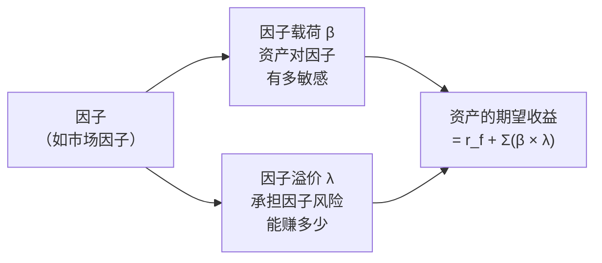
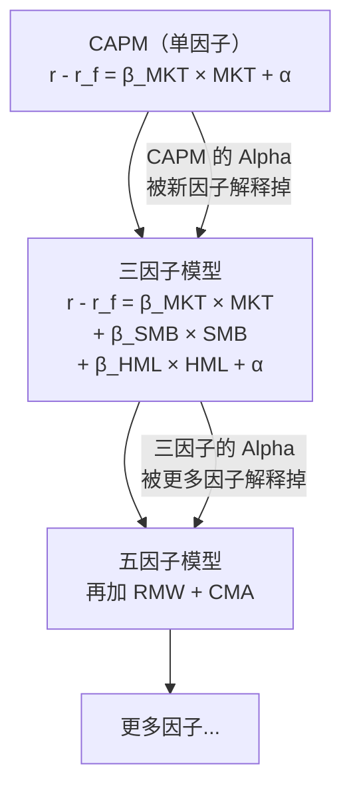
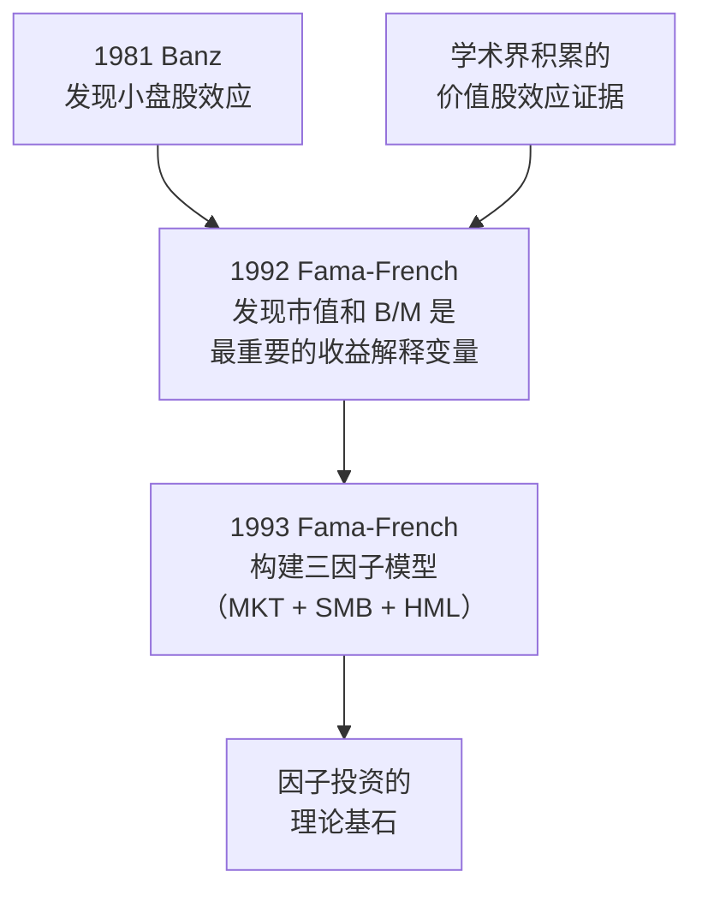
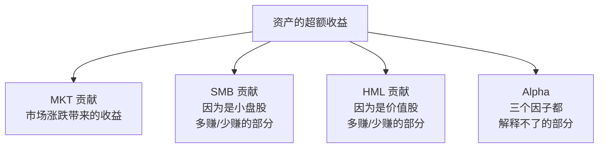

# Day 09：APT 与 Fama-French 三因子模型

> **总时长：** 2 小时
>
> **节奏：** 每 50 分钟休息 10 分钟
>
> **今日目标：** 理解套利定价理论（APT）为什么允许多个因子，掌握 Fama-French 三因子模型的公式和含义，知道市值因子（SMB）和价值因子（HML）是如何构造的——这两个因子是因子投资最经典的起点
>
> **本文是完整讲义，包含所有知识点，不需要翻阅其他资料**

---

## 时间表

```
00:00 - 00:50  [第1节] CAPM 的不足 + APT + 多因子模型的一般形式
00:50 - 01:00  休息
01:00 - 01:50  [第2节] Fama-French 三因子模型：SMB、HML、公式、实证
01:50 - 02:00  [收尾] 自测
```

---

## 第一节：从单因子到多因子（50 分钟）

### 一、从 Day 08 到 Day 09

Day 08 学了 CAPM——资产收益由一个因子（市场因子）决定：

$$E(r_i) = r_f + \beta_i \times [E(r_m) - r_f]$$

但我们也看到了 CAPM 的问题：**有些收益它解释不了。** 小盘股比 CAPM 预测的赚得多，价值股比 CAPM 预测的赚得多，过去的赢家继续赢——这些"异常现象"在 CAPM 框架下都是 $\alpha$。

今天要回答两个问题：

1. **理论上**：一个因子不够，那理论允许多个因子吗？→ APT（套利定价理论）
2. **实证上**：这些"异常"到底是哪些因子在驱动？→ Fama-French 三因子模型

> **今天是整个金融基础部分最核心的一天。** CAPM 是起点，但三因子模型才是因子投资的真正基石。从今天开始，你学的每一个概念都会在编程实战阶段直接用到。

---

### 二、CAPM 的"一个因子"问题

先回顾 Day 08 的关键发现：

| CAPM 预测 | 实际情况 | 差距 |
|-----------|---------|------|
| 收益只由 $\beta$ 决定 | 小盘股收益比 $\beta$ 能解释的更高 | CAPM 的 $\alpha$ |
| 高 $\beta$ = 高收益 | 低 $\beta$ 股票的风险调整收益反而更好 | 和预测方向不一致 |
| 所有 $\alpha$ 应被套利消除 | 价值股的 $\alpha$ 持续了几十年 | $\alpha$ 没有消失 |

这些事实说明：**影响资产收益的系统性因素不止市场这一个。** 一定还有其他因素在起作用。

> **类比：** CAPM 就像用"身高"一个变量预测一个人的体重——有一定关系，但解释力有限。如果再加上"年龄""性别"等变量，预测就会准确得多。多因子模型就是这个思路——用更多变量解释资产收益。

---

### 三、套利定价理论（APT）

#### 3.1 APT 是什么

**套利定价理论（Arbitrage Pricing Theory, APT）：资产的期望收益由多个系统性因子共同决定，每个因子都有自己的风险溢价。**

APT 由 Stephen Ross 在 1976 年提出。它的核心思想是：

1. 资产收益受到多个系统性因素的影响（不只是市场这一个）
2. 每个因素都有对应的风险溢价——承担这个因素的风险就能获得补偿
3. 如果定价偏离了这个关系，**套利者**会迅速纠正

#### 3.2 APT 的公式

$$E(r_i) = r_f + \beta_{i1}\lambda_1 + \beta_{i2}\lambda_2 + \cdots + \beta_{ik}\lambda_k$$

| 符号 | 含义 |
|------|------|
| $E(r_i)$ | 资产 $i$ 的期望收益率 |
| $r_f$ | 无风险利率 |
| $\beta_{i1}, \beta_{i2}, \ldots$ | 资产 $i$ 对第 1、2、... 个因子的**敏感度**（因子载荷） |
| $\lambda_1, \lambda_2, \ldots$ | 第 1、2、... 个因子的**风险溢价**（因子溢价） |
| $k$ | 因子的数量 |

> **和 CAPM 的对比：** CAPM 是 APT 的特例——当 $k = 1$ 且这个唯一的因子是市场因子时，APT 就退化为 CAPM。APT 把"一个因子"推广到了"多个因子"。

#### 3.3 因子载荷与因子溢价

这两个概念是因子投资的核心词汇，今天之后会反复出现：

**因子载荷（Factor Loading / Factor $\beta$）：** 资产对某个因子的敏感度。

> **类比：** 如果因子是"温度"，因子载荷就是"这个东西对温度有多敏感"。冰淇淋的销量对温度的载荷很高（天热卖得多），而矿泉水的载荷较低（不太受温度影响）。

**因子溢价（Factor Premium）：** 承担某个因子的风险所获得的补偿。

> **类比：** 还是温度的例子。如果夏天很热的时候冰淇淋利润特别高——这个"高出来的利润"就是温度因子的溢价。承担了"天气变化"的风险，获得了额外的回报。



#### 3.4 APT 的核心论证：套利

APT 名字中的"套利"是怎么回事？

**如果资产的价格偏离了 APT 模型的预测，就存在套利机会：**

假设 APT 模型预测股票 X 的期望收益应该是 12%，但实际上市场给它定价只有 10%——也就是说它被**高估**了（价格太高导致收益偏低）。

套利者的操作：
1. 卖空股票 X（赚 10%）
2. 用这笔钱买入一组其他资产，构造一个和 X 有相同因子载荷但收益 12% 的组合
3. 净赚 2%，风险为零

这种套利行为会推动 X 的价格下降（因为被卖空），直到它的收益回到 12%——符合 APT 的预测。

> **和 CAPM 的关键区别：** CAPM 需要"所有投资者都用均值-方差分析"这个强假设。APT 只需要"**少数**套利者在行动"——不需要所有人都理性，只要有足够多的聪明人发现并利用定价偏差，价格就会回到合理水平。这个假设弱得多，也更符合现实。

#### 3.5 APT vs CAPM

| 维度 | CAPM | APT |
|------|------|-----|
| 因子数量 | 1 个（市场） | **多个**（未指定） |
| 核心假设 | 所有投资者做均值-方差分析 | **只需少数套利者**行动 |
| 指定了哪些因子 | 是（市场因子） | **否**（只说有多个因子，不说是哪些） |
| 理论来源 | 均衡定价 | **无套利** |
| 实用性 | 可以直接使用 | 需要先确定因子是什么 |
| 提出者 | Sharpe, 1964 | **Ross, 1976** |

> **APT 的优点：** 假设更弱、更现实，允许多个因子。
>
> **APT 的缺点：** 它不告诉你因子是什么！只说"有多个系统性因子"，但具体是哪些因子、有几个，需要靠实证研究去发现。这就是 Fama 和 French 做的事情——今天第二节的主角。

---

### 四、多因子模型的一般形式

在进入 Fama-French 之前，先理解多因子模型的通用框架。

#### 4.1 收益率分解

任何资产的收益率都可以分解为：

$$r_i - r_f = \alpha_i + \beta_{i1} F_1 + \beta_{i2} F_2 + \cdots + \beta_{ik} F_k + \varepsilon_i$$

其中：

- $r_i - r_f$ = 资产 $i$ 的超额收益
- $\alpha_i$ = Alpha（模型解释不了的部分）
- $\beta_{i1} \ldots \beta_{ik}$ = 资产 $i$ 对各因子的载荷
- $F_1 \ldots F_k$ = 各因子的收益率
- $\varepsilon_i$ = 残差（随机噪音，和任何因子都无关）

> **这个公式的意义：** 资产的超额收益 = 各因子贡献之和 + Alpha + 噪音。因子模型越好（选的因子越对），能解释的部分越多，$\alpha$ 和噪音就越小。

#### 4.2 从 CAPM 到多因子



每加一个好的因子，模型就能解释更多的收益来源，$\alpha$ 就变小。最终的目标是：**找到足够多的因子，让 $\alpha$ 尽可能接近零——说明所有收益来源都被理解了。**

> **因子投资者的目标：** 找到还没有被广泛认识的因子（即 $\alpha$），在它变成"公认的 $\beta$"之前，赚取超额收益。

#### 4.3 因子的来源

APT 不指定因子是什么，但实践中因子大致来自两个方向：

| 因子来源 | 思路 | 例子 |
|---------|------|------|
| **宏观经济因子** | 从宏观经济变量出发——什么宏观因素影响所有股票？ | GDP 增长率、通胀率、利率变化、信用利差 |
| **公司特征因子** | 从公司特征出发——什么特征的股票长期跑赢？ | 市值大小、估值高低（PE/PB）、盈利能力、过去涨跌幅 |

> **Fama-French 走的是第二条路——公司特征因子。** 他们不是从宏观理论出发猜"什么因素应该影响收益"，而是从海量数据中发现"什么特征的股票实际上赚得多"。这是实证驱动的方法，也是因子投资的主流方法。

---

### 第一节完成检查

- [ ] 知道 CAPM 用一个因子不够——有些收益解释不了
- [ ] 知道 APT 的核心思想——多个系统性因子共同决定收益
- [ ] 知道 APT 和 CAPM 的关键区别（因子数量、假设强弱、是否指定因子）
- [ ] 理解因子载荷（资产对因子的敏感度）和因子溢价（承担因子风险的补偿）
- [ ] 能写出多因子模型的一般形式
- [ ] 知道 APT 的缺点——不告诉你因子是什么
- [ ] 知道因子来源的两个方向——宏观经济因子 vs 公司特征因子

**休息 10 分钟。**

---

## 第二节：Fama-French 三因子模型（50 分钟）

### 五、从异常现象到因子：实证发现

APT 说"有多个因子"，但没说是哪些。找到具体的因子，靠的是实证研究——从数据中发现规律。

#### 5.1 小盘股效应

**1981 年，Rolf Banz 发现：小市值的股票长期平均收益率高于大市值的股票。**

| 分组 | 年化超额收益（美股，长期平均） | 说明 |
|------|:------------------:|------|
| 最小的 20% 股票 | 约 +2% 到 +3%（相对于大盘股） | 显著高于 CAPM 预测 |
| 最大的 20% 股票 | 基准 | CAPM 大致能解释 |

> **这个发现让学术界震动了。** CAPM 说收益只由 $\beta$ 决定。但小盘股的高收益不能完全用 $\beta$ 解释——即使控制了 $\beta$，小盘股仍然比大盘股赚得多。这说明"市值"本身是一个独立的收益来源。

> **为什么小盘股收益更高？** 两种解释：
> 1. **风险补偿说：** 小盘股流动性差、信息不透明、倒闭风险高——投资者要求更高的收益作为补偿
> 2. **行为偏差说：** 机构投资者不愿买小盘股（流动性差、研究覆盖少），导致它们被低估
>
> 不管哪种解释，小盘股长期跑赢大盘股是一个稳健的实证事实。

#### 5.2 价值股效应

**1992 年，Eugene Fama 和 Kenneth French 发现：低估值（高 B/M，即高账面市值比）的股票长期平均收益率高于高估值的股票。**

先解释一下关键术语：

**账面市值比（Book-to-Market Ratio, B/M）：**

$$\text{B/M} = \frac{\text{账面价值}}{\text{市值}}$$

- **账面价值**：公司在资产负债表上的净资产（Day 03 学过）
- **市值**：股价 × 总股数（Day 01 学过）

| B/M 高低 | 含义 | 俗称 |
|:--------:|------|------|
| B/M 高（如 > 1） | 市场对公司的估值低于账面价值——"便宜" | **价值股（Value Stock）** |
| B/M 低（如 < 0.3） | 市场对公司的估值远高于账面价值——"贵" | **成长股（Growth Stock）** |

> **直觉类比：** B/M 就像房子的"评估价/市场价"比。一栋评估价 100 万的房子卖 80 万（B/M 高），要么是市场打折了，要么是有问题——不管怎样，数据显示长期来看这类"打折资产"的投资回报更高。

| 分组 | 年化超额收益（美股，长期平均） | 说明 |
|------|:------------------:|------|
| 最高 B/M 的 30% 股票（价值股） | 约 +3% 到 +5%（相对于成长股） | 显著高于 CAPM 预测 |
| 最低 B/M 的 30% 股票（成长股） | 基准 | CAPM 大致能解释 |

> **价值股效应比小盘股效应更让人意外。** 直觉上"便宜的股票"应该是因为"质量差"才便宜——可能经营困难、前景不佳。但数据显示，即使考虑了这些风险因素，价值股仍然长期跑赢成长股。这说明市场**系统性地低估了"不受欢迎"的股票**。

#### 5.3 Fama 和 French 的关键贡献

1992 年的论文 "The Cross-Section of Expected Stock Returns" 发现了两个事实：

1. **$\beta$ 对收益的解释力很弱**——控制了市值和 B/M 之后，$\beta$ 几乎不能额外解释收益差异
2. **市值和 B/M 是解释收益差异的最重要变量**

1993 年的论文 "Common Risk Factors in the Returns on Stocks and Bonds" 更进一步——把这两个发现构建成了一个**模型**：Fama-French 三因子模型。



> **Eugene Fama 因为这些贡献获得了 2013 年诺贝尔经济学奖。** 有趣的是，Fama 同时也是"有效市场假说"的提出者——他认为市场是有效的。他把小盘股和价值股的高收益解释为"风险补偿"而非"市场错误"。这个争论到今天仍在继续，Day 11 会详细讨论。

---

### 六、三因子模型的三个因子

#### 6.1 MKT：市场因子

**MKT（Market Factor）：**

$$\text{MKT} = r_m - r_f$$

这就是 CAPM 中的市场风险溢价——三因子模型保留了它。

| 要素 | 说明 |
|------|------|
| 含义 | 整个股票市场相对于无风险资产的超额收益 |
| 历史平均值（美股） | 约 +6% 到 +8%/年 |
| 载荷高的资产 | 高 $\beta$ 股票——对市场涨跌敏感的资产 |
| 载荷低的资产 | 低 $\beta$ 股票——防御型资产 |

#### 6.2 SMB：市值因子

**SMB（Small Minus Big）：**

$$\text{SMB} = \text{小盘股组合收益率} - \text{大盘股组合收益率}$$

| 要素 | 说明 |
|------|------|
| 全称 | Small Minus Big |
| 含义 | 小盘股相对于大盘股的超额收益 |
| 历史平均值（美股） | 约 +2% 到 +3%/年 |
| 载荷高的资产 | 小市值公司——SMB 为正说明该资产"像小盘股" |
| 载荷低/负的资产 | 大市值公司——SMB 载荷为负说明该资产"像大盘股" |

**SMB 的构造方法（概念版）：**

```
第1步：每年 6 月底，把所有股票按市值排序
第2步：分成两组——市值小的一半（Small）和市值大的一半（Big）
第3步：计算接下来一年内两组的平均收益率
第4步：SMB = Small 组的收益 - Big 组的收益
```

> **为什么叫"Small Minus Big"？** 因为因子的收益就是做多小盘股、做空大盘股——小减大。如果 SMB = +3%，说明这一年小盘股比大盘股平均多赚了 3%。

> **"做多-做空"（Long-Short）是因子构造的标准方法。** 几乎所有因子都是这样构造的——做多具有某个特征的股票，做空不具有该特征的股票。这种方法的好处是**对冲了市场风险**——不管市场涨跌，因子收益只取决于两组股票的差异。

#### 6.3 HML：价值因子

**HML（High Minus Low）：**

$$\text{HML} = \text{高 B/M 股票组合收益率} - \text{低 B/M 股票组合收益率}$$

| 要素 | 说明 |
|------|------|
| 全称 | High Minus Low |
| 含义 | 价值股相对于成长股的超额收益 |
| 历史平均值（美股） | 约 +3% 到 +5%/年 |
| 载荷高的资产 | 高 B/M（低估值）公司——HML 为正说明该资产"像价值股" |
| 载荷低/负的资产 | 低 B/M（高估值）公司——HML 载荷为负说明该资产"像成长股" |

**HML 的构造方法（概念版）：**

```
第1步：每年 6 月底，把所有股票按 B/M（账面市值比）排序
第2步：分成三组——B/M 最高的 30%（High）、中间 40%、最低的 30%（Low）
第3步：计算接下来一年内 High 组和 Low 组的平均收益率
第4步：HML = High 组的收益 - Low 组的收益
```

> **为什么叫"High Minus Low"？** 高 B/M 减低 B/M。如果 HML = +4%，说明这一年价值股比成长股平均多赚了 4%。

#### 6.4 三个因子的直觉总结

| 因子 | 做多 | 做空 | 捕获的是 |
|------|------|------|---------|
| MKT | 市场组合 | 无风险资产 | 承担市场风险的补偿 |
| SMB | 小盘股 | 大盘股 | 小盘股的超额收益 |
| HML | 价值股（高 B/M） | 成长股（低 B/M） | 价值股的超额收益 |



---

### 七、三因子模型的公式

#### 7.1 公式

**Fama-French 三因子模型：**

$$r_i - r_f = \alpha_i + \beta_{\text{MKT}} \cdot \text{MKT} + \beta_{\text{SMB}} \cdot \text{SMB} + \beta_{\text{HML}} \cdot \text{HML} + \varepsilon_i$$

| 符号 | 含义 |
|------|------|
| $r_i - r_f$ | 资产 $i$ 的超额收益（减去无风险利率） |
| $\alpha_i$ | Alpha——三个因子都解释不了的部分 |
| $\beta_{\text{MKT}}$ | 资产对市场因子的载荷（和 CAPM 的 $\beta$ 类似） |
| $\beta_{\text{SMB}}$ | 资产对市值因子的载荷——正值 = 偏小盘，负值 = 偏大盘 |
| $\beta_{\text{HML}}$ | 资产对价值因子的载荷——正值 = 偏价值，负值 = 偏成长 |
| $\text{MKT}, \text{SMB}, \text{HML}$ | 三个因子当期的收益率 |
| $\varepsilon_i$ | 残差——随机噪音 |

> **和 CAPM 的对比：** CAPM 只有一个 $\beta_{\text{MKT}}$。三因子模型多了 $\beta_{\text{SMB}}$ 和 $\beta_{\text{HML}}$——它不仅问"你对市场有多敏感"，还问"你像小盘股还是大盘股""你像价值股还是成长股"。

#### 7.2 公式的直觉

用一句话概括三因子模型的含义：

**一个资产的超额收益 = 市场给的 + 因为市值小给的 + 因为估值低给的 + 说不清的（$\alpha$）。**

或者更形象地说：

> **CAPM 给每个资产贴一个标签：** "你是高 $\beta$ 还是低 $\beta$"。
> **三因子模型给每个资产贴三个标签：** "你是高/低 $\beta$""你是大盘还是小盘""你是价值还是成长"。三个标签比一个标签能更精确地描述资产的特征和预期收益。

#### 7.3 数字例子

假设某只小盘价值股的因子载荷和当年的因子收益如下：

**因子载荷（该股票的特征）：**

| 因子 | 载荷 | 含义 |
|------|:----:|------|
| $\beta_{\text{MKT}}$ | 1.1 | 比市场稍微敏感一点 |
| $\beta_{\text{SMB}}$ | 0.8 | 明显偏小盘 |
| $\beta_{\text{HML}}$ | 0.6 | 明显偏价值 |

**因子收益（今年的市场环境）：**

| 因子 | 今年收益 | 含义 |
|------|:------:|------|
| $\text{MKT}$ | +8% | 市场涨了 8%（扣除无风险利率后） |
| $\text{SMB}$ | +3% | 小盘股比大盘股多赚了 3% |
| $\text{HML}$ | +5% | 价值股比成长股多赚了 5% |

**三因子模型的预测：**

```
预测超额收益 = β_MKT × MKT + β_SMB × SMB + β_HML × HML
             = 1.1 × 8% + 0.8 × 3% + 0.6 × 5%
             = 8.8% + 2.4% + 3.0%
             = 14.2%
```

分解来看：

| 来源 | 贡献 | 占比 |
|------|:----:|:----:|
| 市场因子 | +8.8% | 62% |
| 市值因子 | +2.4% | 17% |
| 价值因子 | +3.0% | 21% |
| **合计** | **14.2%** | 100% |

> **如果只用 CAPM：** 预测超额收益 = 1.1 × 8% = 8.8%。实际超额收益假设是 14.2%，则 CAPM 的 $\alpha$ = 14.2% - 8.8% = **5.4%**。
>
> **用三因子模型：** 预测超额收益 = 14.2%。如果实际收益也是 14.2%，则 $\alpha$ = 0——三因子模型完美解释了这只股票的收益。
>
> **关键点：** CAPM 眼中的 5.4% $\alpha$，在三因子模型看来不是 $\alpha$，而是市值因子和价值因子带来的"正常收益"。**CAPM 的 $\alpha$ 变成了三因子模型的 $\beta$。**

#### 7.4 不同类型股票的因子载荷

| 股票类型 | $\beta_{\text{MKT}}$ | $\beta_{\text{SMB}}$ | $\beta_{\text{HML}}$ | 特征描述 |
|---------|:-----:|:-----:|:-----:|---------|
| 大盘成长股（如茅台） | ~0.8 | -0.3 | -0.2 | 低 $\beta$，大盘，偏成长 |
| 大盘价值股（如工商银行） | ~0.7 | -0.4 | +0.5 | 低 $\beta$，大盘，偏价值 |
| 小盘成长股（如某科技新股） | ~1.3 | +0.9 | -0.5 | 高 $\beta$，小盘，偏成长 |
| 小盘价值股（如某传统制造业小公司） | ~1.1 | +0.8 | +0.6 | 中等 $\beta$，小盘，偏价值 |

> **这张表是因子投资的核心工具。** 知道一个股票或组合的因子载荷，就知道它的收益来源——是靠市场涨带动的，还是靠小盘股溢价，还是靠价值股溢价。编程实战阶段，你会用 Python 对每只股票做回归，算出这三个载荷。

---

### 八、三因子模型解释了什么

#### 8.1 解决了 CAPM 的两大异常

| CAPM 的异常 | 三因子模型的解释 |
|------------|--------------|
| 小盘股效应（小盘股 $\alpha$ 为正） | 不是 $\alpha$，是 $\text{SMB}$ 因子的贡献——小盘股的 $\beta_{\text{SMB}}$ 高，所以收益本来就该高 |
| 价值股效应（价值股 $\alpha$ 为正） | 不是 $\alpha$，是 $\text{HML}$ 因子的贡献——价值股的 $\beta_{\text{HML}}$ 高，所以收益本来就该高 |

> **换句话说：** CAPM 看到小盘价值股赚得多，以为是"异常"（$\alpha$）。三因子模型说"不对，这不是异常，这是因为你承担了额外的风险（市值风险和价值风险），获得了应有的补偿"。

#### 8.2 解释力的提升

| 模型 | 能解释的收益差异比例（$R^2$） |
|------|:------------------:|
| CAPM（单因子） | 约 70% |
| Fama-French 三因子 | 约 90% |

> 这意味着三因子模型把"说不清"的部分从 30% 降到了 10%。剩下的 10% 是什么？后续研究发现，其中一部分可以用动量因子（Day 10）、盈利因子和投资因子来解释。

#### 8.3 但三因子模型也有解释不了的

| 异常现象 | 三因子模型能解释吗 | 后续发展 |
|---------|:-----------:|---------|
| 动量效应（过去的赢家继续赢） | **不能** | Carhart（1997）加入动量因子 → 四因子模型 |
| 盈利能力效应（高盈利公司收益更高） | **不能** | Fama-French（2015）加入 RMW → 五因子模型 |
| 投资风格效应（保守投资的公司收益更高） | **不能** | Fama-French（2015）加入 CMA → 五因子模型 |
| 低波动异象（低波动股票风险调整收益更好） | **不能** | 被构造为独立的低波动因子 |

> **三因子模型是里程碑，但不是终点。** Day 10 会学到 Fama-French 五因子模型（在三因子基础上加入盈利因子 RMW 和投资因子 CMA），以及因子投资从学术走向业界的完整历程。

---

### 九、Fama-French 三因子模型在 A 股和加密市场

#### 9.1 A 股的实证

三因子模型在 A 股市场也被广泛验证：

| 因子 | 在 A 股是否有效 | 说明 |
|------|:----------:|------|
| MKT（市场） | 有效 | A 股市场风险溢价长期为正 |
| SMB（市值） | 显著有效 | A 股小盘股效应比美股更明显——中证 500 长期跑赢沪深 300 |
| HML（价值） | 有效但波动大 | 周期不同——有时价值占优，有时成长占优 |

> **A 股小盘股效应为什么更明显？** 几个原因：
> 1. A 股散户比例高，散户偏好小盘股（"炒小炒新"）
> 2. 壳资源价值——小公司可能被借壳上市，有"彩票效应"
> 3. 机构覆盖少——大量小盘股缺乏研究覆盖，定价效率低
>
> 这些因素虽然在逐渐减弱（注册制改革、退市常态化），但市值因子在 A 股仍然是最重要的因子之一。

#### 9.2 加密市场的因子

加密市场的因子研究还在早期，但近年来已有一批学术论文开始系统性地研究。我们按传统因子逐个对照：

**MKT 因子（市场因子）——BTC 就是加密市场的"沪深 300"**

| 资产类型 | 对 BTC 的回归 $R^2$ | 说明 |
|---------|:-----------------:|------|
| 主流币（ETH、BNB、SOL） | 0.6-0.8 | BTC 涨跌解释了大部分波动 |
| DeFi 代币（UNI、AAVE） | 0.3-0.5 | 有自身逻辑，但仍受 BTC 主导 |
| Meme 币（DOGE、SHIB） | 0.2-0.4 | 受社交情绪驱动，BTC 解释力较低 |

就像传统市场中大部分股票和大盘高度相关一样，加密市场中 BTC 是绝对的主导因子。任何加密因子模型的第一步，都是把 BTC 的市场因子剥离出去。

**SMB 因子（市值因子）——小市值代币 vs 大市值代币**

有初步证据表明小市值代币的平均收益高于大市值代币。但这里有一个严重的陷阱：**生存偏差**。成千上万的小市值代币已经归零消亡，如果只看"活下来的"小币，当然表现好——因为死掉的都被忽略了。真实的小市值收益率远没有看起来那么高。

**HML 因子（价值因子）——加密版"估值指标"**

加密资产没有资产负债表，B/M 无从计算。但有几个替代指标：

| 传统指标 | 加密替代指标 | 计算方式 |
|---------|:---------:|---------|
| PE（市盈率） | **NVT**（网络价值/交易量比） | 市值 / 日交易量 |
| PB（市净率） | **MVRV**（市值/已实现价值比） | 市值 / 链上所有币的平均获取成本 |
| PS（市销率） | **费用/市值比** | 协议年化手续费收入 / 市值 |

用这些指标做多"低估"、做空"高估"的策略，在回测中有一定效果——但数据历史太短，还不能下定论。

**动量因子——加密市场的"超级动量"**

动量因子在加密市场**极其强劲**。Liu, Tsyvinski & Wu（2019）的研究发现：

- 按过去 1-4 周收益率排序，买入前 20% 的代币，月度超额回报可达 **15-20%**
- 这远超传统股票市场的动量溢价（通常 1-2%/月）
- 原因：加密市场散户主导、信息传播慢（Twitter/Telegram 群逐层传导）、缺乏基本面锚定，趋势一旦形成就会被正反馈放大

但动量策略在加密市场的**回撤也极端**——2022 年 5 月 LUNA 崩盘期间，动量策略可能在几天内回吐数月收益。

**加密独有因子——传统市场没有的东西**

| 独有因子 | 数据来源 | 逻辑 |
|---------|---------|------|
| **网络增长因子** | 新增活跃地址数（Glassnode） | 用户增长快的网络 → 未来价值可能更高 |
| **开发者活跃度** | GitHub commits 数（Santiment） | 开发活跃 → 项目在持续建设，不是"跑路币" |
| **社交情绪因子** | Twitter/Reddit 提及量和情绪 | 正面情绪飙升 → 短期价格可能上涨（但也可能是泡沫信号） |

这些因子在传统股票市场没有直接对应物——它们利用了区块链数据透明和开源开发的特性。

> **加密市场的因子研究是前沿领域。** 传统因子模型（三因子、五因子）能解释股票收益的 70-90%，但在加密市场中，BTC 市场因子加上动量大约只能解释 40-60%。剩下的大量"未解释的收益"意味着：要么还有重要因子没被发现，要么加密市场的定价效率确实很低——这两者对因子投资者来说都是好消息。

---

### 十、理解因子溢价的两种视角

关于"为什么持有某些特征的股票能赚更多"，学术界有两派观点。这个争论贯穿整个因子投资的历史，你需要了解双方的论点：

#### 10.1 风险补偿说

**代表人物：** Fama（有效市场假说的提出者）

**核心观点：** 因子溢价是承担额外风险的合理补偿。

- 小盘股收益高是因为它们**真的更危险**——流动性差、更容易倒闭、在经济衰退时损失更大
- 价值股收益高是因为它们**真的有问题**——经营困难、财务压力大、在坏时候特别惨
- 投资者要求更高的收益来补偿这些额外风险——这不是免费的午餐

> **类比：** 消防员的工资高不是因为市场"定错价"了，而是因为这个工作确实危险——高工资是风险的合理补偿。

#### 10.2 行为偏差说

**代表人物：** Shiller（行为金融学的代表人物，也获得了 2013 年诺贝尔奖——和 Fama 同年！）

**核心观点：** 因子溢价来自投资者的系统性错误。

- 小盘股被低估是因为机构投资者**忽视**了它们（不在研究覆盖范围内）
- 价值股被低估是因为投资者**过度反应**——把暂时困难的公司当成永远完蛋的公司
- 动量效应来自投资者**反应不足**——好消息出来后，股价没有一步到位

> **类比：** 二手市场上的旧款手机卖得便宜，不一定是因为"真的更差"——可能只是因为大家都追新款，旧款被"情绪性"低估了。

#### 10.3 因子投资者的实用立场

| 问题 | 实用主义的回答 |
|------|------------|
| 因子溢价是风险补偿还是行为偏差？ | **可能两者都有——而且因子不同，原因也不同** |
| 这影响投资决策吗？ | **不太影响——不管原因是什么，只要溢价持续存在且可预测，就值得去捕获** |
| 什么情况下会有影响？ | **如果因子溢价纯粹是风险补偿，那在坏时候（经济衰退）你会亏得更多——你需要有承受力** |

> **Day 11 会用一整天详细讨论行为金融——为什么市场会犯系统性错误，以及这些错误怎么和因子对应。** 今天只需知道这个争论的存在。

---

### 第二节完成检查

- [ ] 知道小盘股效应和价值股效应的实证发现
- [ ] 能说出 SMB 和 HML 分别代表什么——Small Minus Big、High Minus Low
- [ ] 知道 SMB 和 HML 的构造方法（做多-做空）
- [ ] 能写出三因子模型的公式
- [ ] 理解因子载荷的含义——$\beta_{\text{SMB}}$ 正 = 偏小盘，$\beta_{\text{HML}}$ 正 = 偏价值
- [ ] 知道三因子模型把 CAPM 的 $\alpha$ 变成了 $\beta$
- [ ] 知道三因子模型解释不了动量效应
- [ ] 了解因子溢价的两种解释——风险补偿 vs 行为偏差

---

## 收尾：自测（10 分钟）

拿一张白纸，**不看任何资料**，回答以下问题。先自己写，再对答案：

```
自测 1：APT 和 CAPM 最大的区别是什么？
→ 你的答案：_______________
→ 正确：CAPM 只用一个因子（市场），APT 允许多个系统性因子。
  APT 的假设也更弱——只需要少数套利者行动，不需要所有投资者理性。

自测 2：APT 的最大缺点是什么？
→ 你的答案：_______________
→ 正确：APT 不指定因子是什么——只说"有多个因子"，
  但具体是哪些因子、有几个，需要靠实证研究去发现。

自测 3：SMB 代表什么？它是怎么构造的？
→ 你的答案：_______________
→ 正确：SMB = Small Minus Big（小减大）。
  做多小盘股、做空大盘股，收益差就是 SMB。

自测 4：HML 代表什么？高 B/M 的股票为什么叫"价值股"？
→ 你的答案：_______________
→ 正确：HML = High Minus Low（高 B/M 减低 B/M）。
  高 B/M 说明市场给的估值低于账面价值——"便宜"，所以叫价值股。

自测 5：写出 Fama-French 三因子模型的公式。
→ 你的答案：_______________
→ 正确：r_i - r_f = α + β_MKT × MKT + β_SMB × SMB + β_HML × HML + ε

自测 6：一只股票的 β_SMB = 0.7，β_HML = -0.3。它是什么类型的股票？
→ 你的答案：_______________
→ 正确：β_SMB 为正说明偏小盘，β_HML 为负说明偏成长。
  这是一只小盘成长股。

自测 7：CAPM 认为某只小盘价值股的 Alpha = +5%。用三因子模型分析后
      Alpha 变成了 +0.5%。这说明了什么？
→ 你的答案：_______________
→ 正确：说明 CAPM 眼中的 5% Alpha 大部分（4.5%）其实是 SMB 和 HML
  因子的贡献——不是"异常收益"，而是承担市值和价值风险的正常补偿。

自测 8：三因子模型解释不了哪个重要现象？
→ 你的答案：_______________
→ 正确：动量效应——过去 6-12 个月的赢家继续跑赢输家。
  Carhart（1997）加入动量因子形成四因子模型来解决这个问题。

自测 9：因子溢价的"风险补偿"解释和"行为偏差"解释有什么区别？
→ 你的答案：_______________
→ 正确：风险补偿说认为高收益是承担额外风险的合理回报（不是免费午餐）。
  行为偏差说认为高收益来自投资者的系统性错误（是可利用的定价错误）。

自测 10：Fama-French 三因子模型和因子投资有什么关系？
→ 你的答案：_______________
→ 正确：三因子模型是因子投资的理论基石。
  它证明了市值和估值是独立于市场风险的收益来源，
  为系统性地构造因子组合提供了学术依据。
```

**9-10 道对：** 完美，三因子模型已经掌握。
**7-8 道对：** 不错，回看错的部分就好。
**6 道以下：** 建议花 20 分钟重新阅读讲义，重点是三因子公式和 SMB/HML 的含义。

---

## 今天不需要记住的内容

| 概念 | 今天理解到什么程度 | 什么时候深入 |
|------|------------------|------------|
| APT 的数学推导（套利定价的严格证明） | 知道"多因子 + 无套利"的思想就行 | 不涉及 |
| SMB/HML 的精确构造细节（双重排序、加权方法） | 知道"做多-做空"的概念就行 | 编程实战阶段（会用 Python 复现） |
| Fama-French 的原始论文细节 | 知道核心结论就行 | 选读 |
| 因子溢价的精确历史数值 | 知道大致范围就行（SMB 约 2-3%，HML 约 3-5%） | 编程实战阶段 |
| 四因子、五因子的公式 | 知道"在三因子上加因子"就行 | Day 10 |
| 因子模型的统计检验方法（GRS 检验等） | 不需要知道 | 不涉及 |
| 加密市场的因子模型细节 | 知道"是前沿领域"就行 | 编程实战阶段 |

---

## 今日知识点与因子投资的关联

| 今日知识点 | 关联的因子/概念 | 怎么关联 | 深入时间 |
|-----------|---------------|---------|---------|
| APT（套利定价理论） | **多因子投资的理论基础** | APT 为"用多个因子解释收益"提供了理论依据——不只是市场因子 | 已完成（概念层面） |
| 因子载荷与因子溢价 | **因子投资的核心词汇** | 因子载荷 = 资产对因子的敏感度，因子溢价 = 承担因子风险的回报。构造策略就是选高载荷的资产 | 编程实战阶段 |
| SMB（市值因子） | **经典因子之一** | 买入小盘股、卖出大盘股。A 股小盘股效应尤其显著 | 因子投资阶段 + 编程实战阶段 |
| HML（价值因子） | **经典因子之一** | 买入低估值、卖出高估值。构造价值因子需要用到 Day 03-04 学的 PB/PE | 因子投资阶段 + 编程实战阶段 |
| 三因子模型公式 | **因子回归的模板** | 编程实战中对每只股票做三因子回归，得到因子载荷和 $\alpha$ | 编程实战阶段 |
| 做多-做空构造法 | **因子策略的标准方法** | 几乎所有因子都用 Long-Short 方式构造，对冲市场风险 | 编程实战阶段 |
| CAPM 的 $\alpha$ → 三因子的 $\beta$ | **因子研究的核心逻辑** | 找到新因子 = 把别人的 $\alpha$ 变成你的 $\beta$，这是因子投资学术进展的主线 | Day 10 |

> 今天标志着从"理解收益的来源"到"构造因子策略"的转折点。CAPM 告诉你收益由 $\beta$ 决定，三因子模型告诉你 $\beta$ 不止一个——市值和估值也是独立的收益来源。从 Day 10 开始，我们将把这些学术发现整合成一个完整的因子投资框架，为后续阶段做最后的理论准备。

---

## 明天预告

**Day 10** 进入因子投资的完整框架——**从 CAPM 到五因子模型，再到业界实践**。

今天学了三因子模型——CAPM + 市值因子 + 价值因子。明天要回答的问题是：

**还有哪些因子？这些因子怎么整合成一个完整的投资框架？**

你将了解到：
- **Fama-French 五因子模型**——在三因子基础上加入盈利因子（RMW）和投资因子（CMA）
- **动量因子（MOM）**——为什么过去的赢家继续赢？
- **因子投资的完整框架**——从学术发现到实际投资，因子投资是怎么运作的？
- **因子的"动物园"问题**——学术界发现了几百个因子，哪些是真的，哪些是数据挖掘的产物？

> Day 10 是金融基础部分的倒数第二天，会把 Day 01-09 的所有知识串成一条完整的线，为你构建因子投资的全景图。
