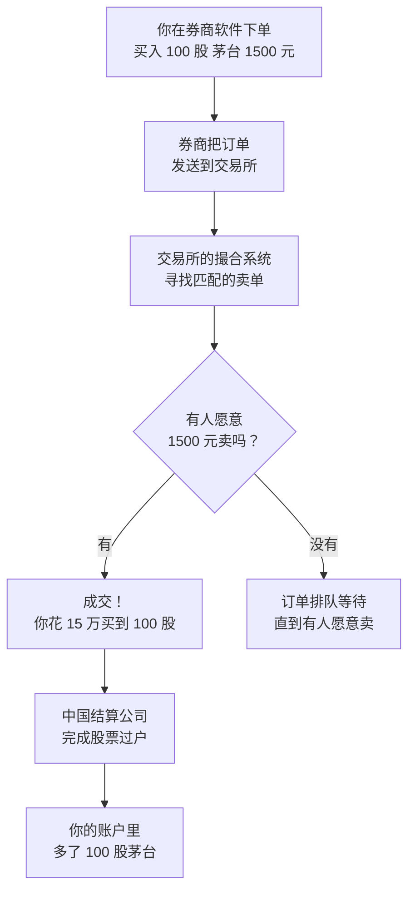
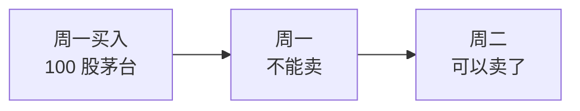
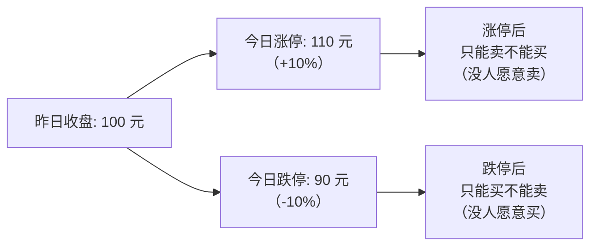
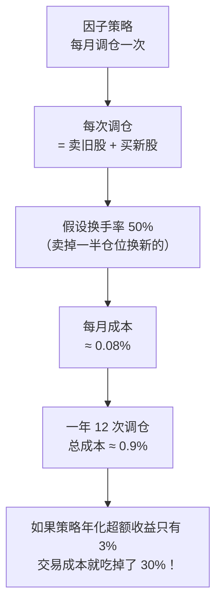
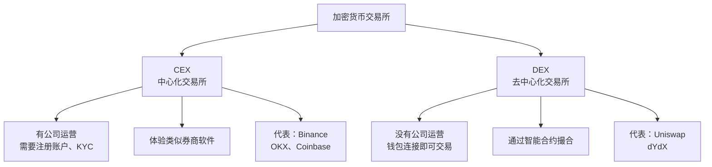
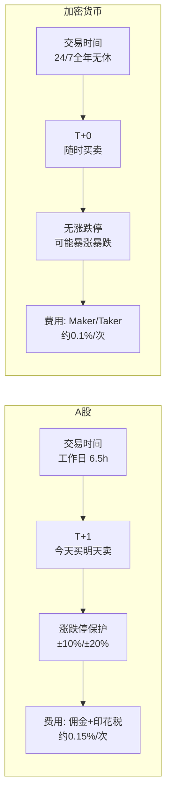

# Day 2：交易规则与交易成本

> **总时长：** 2 小时
> **节奏：** 每 50 分钟休息 10 分钟
> **今日目标：** 搞懂在 A 股和加密市场上，一笔交易从下单到完成经历了什么、花了多少钱
> **本文是完整讲义，包含所有知识点，不需要翻阅其他资料**

---

## 时间表

```
00:00 - 00:50  [第1节] A 股交易规则
00:50 - 01:00  休息
01:00 - 01:50  [第2节] 加密货币交易规则 + 两市场对比
01:50 - 02:00  [收尾] 自测
```

---

## 第一节：A 股交易规则（50 分钟）

### 一、一笔交易是怎么完成的

#### 1.1 你下单后发生了什么

你在券商软件上点了"买入 600519 贵州茅台 100 股，价格 1500 元"，接下来发生的事：



这个过程在几毫秒到几秒内完成。交易所的核心工作就是**撮合**——把买方和卖方配对。

#### 1.2 一级市场 vs 二级市场

你可能听过这两个词，先搞清楚：

| | 一级市场 | 二级市场 |
|--|---------|---------|
| **是什么** | 公司**首次**发行股票 | 投资者之间**互相买卖**已发行的股票 |
| **你的交易对手** | 公司本身 | 其他投资者 |
| **常见场景** | IPO（首次公开发行） | 每天在券商软件里的买卖 |
| **钱流向哪** | 流入公司（公司拿到融资） | 流向卖方（另一个投资者） |

> **日常炒股都在二级市场。** 你买茅台，钱不是给了茅台公司，而是给了另一个卖出茅台的人。
> 因子投资研究的也是二级市场行为。

---

### 二、A 股的交易时间

#### 2.1 每天的交易时段

A 股**不是**全天交易的，每天分为几个时段：

| 时段 | 时间 | 做什么 |
|------|------|--------|
| **早盘集合竞价** | 9:15 - 9:25 | 收集所有买卖订单，9:25 一次性撮合出开盘价 |
| 不可撤单 | 9:20 - 9:25 | 这 5 分钟内提交的订单不能撤回 |
| 开盘前静默 | 9:25 - 9:30 | 不接受任何订单 |
| **上午连续竞价** | 9:30 - 11:30 | 正常交易，订单实时撮合 |
| **午休** | 11:30 - 13:00 | 不交易 |
| **下午连续竞价** | 13:00 - 14:57 | 正常交易 |
| **尾盘集合竞价** | 14:57 - 15:00 | 收集订单，15:00 撮合出收盘价 |

> 每周交易 5 天（周一到周五），法定节假日休市。一年大约 **250 个交易日**。

#### 2.2 集合竞价 vs 连续竞价

这两个词经常出现，区别是：

| | 集合竞价 | 连续竞价 |
|--|---------|---------|
| **时间** | 开盘前（9:15-9:25）和收盘前（14:57-15:00） | 交易时间内（9:30-11:30, 13:00-14:57） |
| **撮合方式** | 攒一堆订单，一次性撮合出**一个价格** | 订单随到随撮合，**每笔可能价格不同** |
| **目的** | 确定开盘价/收盘价 | 持续交易 |

> **和因子投资的关系：** 因子策略的调仓（换股票）通常在**收盘价**附近执行。
> 所以收盘集合竞价产生的价格对回测非常重要。

---

### 三、A 股的核心交易规则

#### 3.1 T+1 制度

**T+1 = 今天买的股票，最早明天才能卖。**

"T"是 Trade（交易）的意思，"+1"表示下一个交易日。



- 你周一买了 100 股，周一不管涨跌你都**卖不掉**
- 最早周二才能卖出
- 但如果你**之前已经持有**茅台，周一可以卖掉旧的，同时买入新的

> **为什么有 T+1？** 监管层认为 T+0 会导致过度投机。这是 A 股独有的规则，
> 美股和加密市场都是 T+0（买了马上可以卖）。

> **和因子投资的关系：** T+1 意味着你不能做日内交易（当天买当天卖），
> 因子策略通常按月或按周调仓，T+1 的影响不大。

#### 3.2 涨跌停板

**涨跌停 = 单日涨跌幅有上限，触及后停止交易。**

| 板块 | 涨跌停幅度 | 说明 |
|------|:--------:|------|
| **主板**（沪深主板） | ±10% | 大部分股票 |
| **创业板**（30 开头） | ±20% | 成长型企业 |
| **科创板**（688 开头） | ±20% | 科技创新企业 |
| **ST 股**（被警示的） | ±5% | 有退市风险的股票 |

**新股上市的特殊规则（全面注册制，2023 年 4 月起）：**

所有板块（主板、科创板、创业板）规则统一：

- **前 5 个交易日不设涨跌停**
- 第 6 个交易日起恢复正常限制（主板 ±10%，科创板/创业板 ±20%）
- 前 5 天内，盘中涨跌幅达 ±30% 或 ±60%（相对当日开盘价）会触发**临时停牌**（暂停交易 10 分钟）

> 首日股票代码前标注 "N"，第 2-5 天标注 "C"。
>
> **历史背景：** 2023 年全面注册制之前，主板 IPO 首日的涨跌幅上限是 +44%、下限是 -36%。
> 这两个数字来自两层 20% 限制的复合：集合竞价阶段开盘价最多偏离发行价 ±20%，
> 连续竞价阶段盘中价再偏离开盘价 ±20%，即 (1+20%)×(1+20%)-1 = 44%。
> 这个规则已废除，现在统一为前 5 天不设涨跌停。

**例子：** 一只主板股票昨天收盘价 100 元，今天最多涨到 110 元（涨停）或跌到 90 元（跌停）。



> "涨停板上买不到"是什么意思？当股票涨到 +10% 时，所有卖方都不愿意卖了（因为还在涨），
> 只有买方在排队。你挂了买单也很难成交。反之，跌停时都想卖但没人买。

> **和因子投资的关系：**
> - 涨跌停会导致**流动性问题**——涨停买不到、跌停卖不掉
> - 回测时要注意：如果你的策略选中了涨停的股票，实际可能买不进去
> - 小盘股（市值小的股票）交易量小，更容易触及涨跌停，回测时需要额外处理

#### 3.3 最小交易单位

- **A 股：1 手 = 100 股**。你不能买 50 股，最少买 100 股。
- 卖出时可以不足 100 股（比如持有 150 股，可以卖出 150 股），但买入必须是 100 的整数倍。
- 这意味着如果茅台股价 1500 元，买 1 手需要 **15 万元**。

> 加密市场没有这个限制——你可以买 0.001 个 BTC。

#### 3.4 订单类型

在券商软件下单时，主要用两种订单：

| 订单类型 | 做法 | 优点 | 缺点 |
|---------|------|------|------|
| **限价单** | 指定一个价格，只在这个价格或更好的价格成交 | 价格可控 | 可能成交不了（没人接你的价） |
| **市价单** | 不指定价格，以当前市场最优价格立即成交 | 保证成交 | 价格不可控（尤其流动性差时） |

> 实际中大部分人用**限价单**。因子投资调仓时通常也用限价单，避免被"滑点"吃掉利润。

> **什么是滑点？** 你想以 100 元买入，但实际成交价是 100.05 元，这 0.05 元的差距就是滑点。
> 流动性差的股票滑点更大。回测时必须考虑滑点，否则回测结果会比实际好看。

---

### 四、A 股的交易成本

这是因子投资中非常重要的部分——**交易成本直接吃掉你的收益**。

#### 4.1 费用构成

每次买卖股票要付三笔钱：

| 费用 | 收取方 | 费率 | 什么时候收 |
|------|--------|------|----------|
| **佣金** | 券商 | 约万 2.5（0.025%），最低 5 元 | 买入和卖出**都收** |
| **印花税** | 国家 | 千分之一（0.1%） | **只在卖出时收** |
| **过户费** | 中国结算 | 十万分之二（0.002%） | 买入和卖出都收 |

> 佣金率可以和券商谈，资金量大或交易频繁的通常能拿到**万 1.5 甚至万 1**。

#### 4.2 完整计算示例

假设你买入 100 股茅台，价格 1500 元，持有一段时间后以 1600 元卖出：

**买入成本：**
```
买入金额 = 100 股 × 1500 元 = 150,000 元

佣金   = 150,000 × 0.025% = 37.5 元
印花税 = 0 元（买入不收）
过户费 = 150,000 × 0.002% = 3 元

买入总费用 = 37.5 + 0 + 3 = 40.5 元
```

**卖出成本：**
```
卖出金额 = 100 股 × 1600 元 = 160,000 元

佣金   = 160,000 × 0.025% = 40 元
印花税 = 160,000 × 0.1%   = 160 元  ← 大头！
过户费 = 160,000 × 0.002% = 3.2 元

卖出总费用 = 40 + 160 + 3.2 = 203.2 元
```

**总结：**
```
总交易成本 = 40.5 + 203.2 = 243.7 元
资本利得   = 160,000 - 150,000 = 10,000 元
实际利润   = 10,000 - 243.7 = 9,756.3 元
交易成本占利润的 2.4%
```

> **关键发现：印花税是大头**（160 元 vs 佣金 77.5 元）。
> 这就是为什么高换手率（频繁买卖）的策略成本很高——每次卖出都要交 0.1% 印花税。

#### 4.3 交易成本对因子投资的影响



> **计算过程：** 换手率 50% 意味着卖出 50% 旧仓位 + 买入 50% 新仓位。
> 卖出成本 = 50% ×（佣金 0.025% + 印花税 0.1% + 过户费 0.002%）= 0.064%
> 买入成本 = 50% ×（佣金 0.025% + 过户费 0.002%）= 0.014%
> 合计 ≈ 0.08%

> **教训：** 做因子投资回测时，**必须扣除交易成本**。很多看起来赚钱的策略，扣完成本后就不赚了。
> 降低换手率（减少调仓频率）是控制成本的关键。

---

### 第一节完成检查

- [x] 知道一笔交易从下单到成交的流程
- [x] 知道 A 股交易时间（9:30-11:30, 13:00-15:00）
- [x] 知道 T+1 是什么意思
- [x] 知道涨跌停幅度（主板 ±10%，创业板/科创板 ±20%）
- [x] 知道 A 股最小交易单位是 100 股
- [x] 知道限价单和市价单的区别
- [x] 能算出一笔交易的总成本（佣金 + 印花税 + 过户费）
- [x] 理解交易成本对因子策略的影响

**休息 10 分钟。**

---

## 第二节：加密货币交易规则 + 两市场对比（50 分钟）

### 五、加密货币交易规则

#### 5.1 交易场所：CEX vs DEX

加密市场有两种交易所：



| 维度 | CEX（中心化） | DEX（去中心化） |
|------|-------------|---------------|
| **注册** | 需要注册、实名认证（KYC） | 连接钱包即可，无需注册 |
| **资产托管** | 交易所帮你保管资产 | 你自己保管（钱包私钥） |
| **流动性** | 高（用户多、订单多） | 相对低 |
| **费用** | 交易手续费（低） | 交易手续费 + Gas 费（可能很高） |
| **风险** | 交易所跑路/被黑客攻击 | 智能合约漏洞 |
| **适合** | 大部分交易 | DeFi 玩家、隐私需求 |

> **做因子投资主要用 CEX**（流动性好、API 完善、费用低）。
> 我们后面用的 CCXT 库就是统一连接各大 CEX 的 API。

> **什么是 KYC？** Know Your Customer（了解你的客户），就是实名认证。
> 大部分正规 CEX 都要求上传身份证/护照才能交易。

#### 5.2 交易对（Trading Pair）

加密市场不是用人民币直接买币的，而是通过**交易对**：

```
BTC/USDT = 用 USDT 买卖 BTC
ETH/USDT = 用 USDT 买卖 ETH
ETH/BTC  = 用 BTC 买卖 ETH
```

> **什么是 USDT？** USDT 是一种**稳定币（Stablecoin）**，1 USDT ≈ 1 美元。
> 稳定币是加密市场里的"现金等价物"，价格几乎不波动。常见的还有 USDC。
> 大部分交易都以 USDT 计价，相当于 A 股里用人民币计价。

#### 5.3 核心交易规则

| 规则 | A 股 | 加密货币 |
|------|------|---------|
| **交易时间** | 工作日 9:30-15:00 | **24/7 全年无休** |
| **交割制度** | T+1 | **T+0**（买了立刻可以卖） |
| **涨跌停** | 有（±10% / ±20%） | **没有**（一天跌 50% 也可能） |
| **最小单位** | 100 股 | **可以买小数**（如 0.001 BTC） |

逐一解释：

**24/7 交易：** 没有开盘、收盘的概念。周六凌晨 3 点也可以交易。这意味着：
- 价格随时在变，你睡觉时也可能大涨或大跌
- 因子投资需要"每日数据"时，通常用 **UTC 0:00（北京时间早上 8:00）** 的价格作为"日收盘价"

**T+0：** 你可以一秒钟前买入，一秒钟后卖出。理论上可以做无限次日内交易。这和 A 股的 T+1 完全不同。

**无涨跌停：** 2022 年 5 月，LUNA 从 80 美元跌到 0.0001 美元，**几天内跌去 99.99%**。A 股有涨跌停保护，加密市场没有。

**最小单位灵活：** 不需要买整个 BTC（当前约 10 万美元），你可以买 0.0001 个 BTC（约 10 美元）。这降低了投资门槛。

---

#### 5.4 加密市场的交易成本

##### 5.4.1 Maker / Taker 费用

这是加密交易所最主要的费用模型：

| 角色 | 你做了什么 | 费率（以 Binance 为例） |
|------|----------|:---------------------:|
| **Maker（挂单方）** | 你下了一个限价单，没有立刻成交，进入了订单簿等待 | **0.1%** |
| **Taker（吃单方）** | 你下的单立刻和已有的订单成交了（市价单或能立即成交的限价单） | **0.1%** |

> Binance 基础费率 0.1%，使用 BNB 抵扣可打 75 折（约 0.075%）。
> 高级 VIP 用户可以更低，Maker 甚至可以是 0 或负数（交易所倒贴）。

**直觉类比：**
- Maker 像是在市场上摆摊的人——你挂了一个价格，等别人来买/卖
- Taker 像是直接去市场买东西的人——你看到有摊位卖，直接成交

> **为什么要区分 Maker 和 Taker？** 交易所鼓励挂单（Maker），因为挂单提供了流动性，
> 让市场更活跃。基础等级下两者费率相同（都是 0.1%），但 VIP 等级越高，Maker 费率会比 Taker 更低。

##### 5.4.2 其他费用

| 费用 | 说明 | 大小 |
|------|------|------|
| **提币手续费** | 把币从交易所转到自己的钱包 | 因币种和网络而异，BTC 约几美元 |
| **Gas 费** | 在区块链上执行交易的"燃料费"（主要是 DEX） | 以太坊主网可能几美元到几十美元 |
| **滑点** | 实际成交价和预期价格的差距 | 小币种/流动性差时可能 0.5%-2% |
| **资金费率** | 做合约/杠杆时的持仓费用 | 每 8 小时收取一次（本计划暂不涉及） |

##### 5.4.3 完整计算示例

假设你在 Binance 上买入价值 10,000 USDT 的 BTC，后以 10,500 USDT 卖出：

**买入成本：**
```
买入金额 = 10,000 USDT

Taker 手续费 = 10,000 × 0.1% = 10 USDT
（假设用市价单立即成交）

买入总费用 = 10 USDT
```

**卖出成本：**
```
卖出金额 = 10,500 USDT

Taker 手续费 = 10,500 × 0.1% = 10.5 USDT

卖出总费用 = 10.5 USDT
```

**总结：**
```
总交易成本  = 10 + 10.5 = 20.5 USDT
资本利得    = 10,500 - 10,000 = 500 USDT
实际利润    = 500 - 20.5 = 479.5 USDT
交易成本占利润的 4.1%
```

> 注意：加密市场**没有印花税**，只有交易手续费。但如果是 DEX 交易，
> 还要加上 Gas 费和可能更大的滑点。

---

#### 5.5 杠杆与合约（了解即可）

加密交易所提供**杠杆交易**和**合约交易**：

- **杠杆**：借钱放大你的仓位。10 倍杠杆 = 用 1000 元控制 10000 元的仓位。涨 10% 你赚 100%，跌 10% 你**亏光**。
- **合约**：类似期货，可以**做多**（赌涨）也可以**做空**（赌跌）。

> **本计划不涉及杠杆和合约。** 因子投资是现货投资（买入实际的股票/加密货币），不用杠杆。
> 提到这个是因为很多加密交易所界面上会看到"合约""杠杆"入口，知道它是什么就行，**不要碰**。

> **什么是做空？** 你觉得某个东西会跌，先借来卖掉，等跌了再买回来还。
> 赚钱逻辑和做多相反——价格跌你赚钱。A 股散户很难做空（需要融券），加密市场通过合约可以轻松做空。

---

### 六、A 股 vs 加密货币：完整对比

这是今天最重要的一张表，把两个市场的规则放在一起对比：

| 维度 | A 股 | 加密货币（CEX） |
|------|------|----------------|
| **交易时间** | 工作日 9:30-15:00（约250天/年） | 24/7/365 |
| **交割制度** | T+1 | T+0 |
| **涨跌停** | 有（±10% / ±20%） | 无 |
| **最小交易单位** | 100 股 | 可买小数（如 0.001 BTC） |
| **交易费用** | 佣金（~0.025%）+ 印花税（0.1%卖出）+ 过户费 | Maker/Taker（~0.1%）|
| **单次买卖总成本** | 约 **0.15%** | 约 **0.2%** |
| **计价货币** | 人民币 | USDT（稳定币） |
| **监管** | 证监会严格监管 | 因国家而异，监管较松 |
| **收盘价** | 15:00 收盘集合竞价 | 无收盘价，通常用 UTC 0:00 快照 |
| **做空** | 很难（需融券） | 容易（合约交易） |
| **波动性** | 日均波动约 1-2% | 日均波动约 3-5%（BTC），小币更高 |
| **退市/归零** | 较少，有退市警示制度 | 频繁，小币种可能直接归零 |



#### 6.1 对因子投资的影响

| 差异点 | 对因子投资的影响 |
|--------|---------------|
| A 股 T+1 | 不能做日内策略；月度/周度调仓不受影响 |
| 加密 24/7 | 因子数据需要选定一个时间点做"日快照"（通常 UTC 0:00） |
| A 股涨跌停 | 回测时需处理涨停买不到、跌停卖不掉的情况 |
| 加密无涨跌停 | 极端行情下可能出现巨大亏损，需要更严格的风控 |
| 两市交易成本 | 回测**必须**扣除交易成本，否则结果失真 |
| 加密退市频繁 | **生存偏差**严重——只看现在还活着的币种会高估收益 |
| A 股 100 股起 | 小资金可能无法精确按目标权重配置 |
| 加密可买小数 | 可以精确配置任意权重 |

**生存偏差（Survivorship Bias）** 是因子投资的大敌。

**一句话定义：只看"活下来"的标的做分析，忽略了已经消失的失败者，从而高估实际收益。**

**直觉类比：** 你调查"创业成功的秘诀"，只采访了现在还活着的公司老板。他们都说"坚持就是胜利"。但你没看到的是：99% 同样"坚持"的公司已经倒闭了，只是没人采访他们。你得出的结论——"坚持就能成功"——是假的，因为你的样本只有幸存者。

**因子投资中的例子：**

| 场景 | 有生存偏差的做法 | 正确做法 |
|------|----------------|---------|
| 回测 2020-2024 年"市值最小的 50 个币" | 用 2024 年还活着的币种列表去回看 2020 年 | 用 2020 年当时存在的所有币种，包括后来归零的 |
| 回测 A 股小盘股策略 | 数据库里只有当前上市的股票 | 数据库必须包含已退市的股票（如乐视、瑞幸） |

如果你只用"幸存者"回测，结果会严重偏好——因为那些本该被你选中但后来归零/退市的标的，从数据中消失了，你的回测不会包含它们带来的巨额亏损。

> A 股和加密市场都有这个问题，但加密市场更严重——A 股退市有严格流程（连续亏损、股价低于面值等），
> 一年退市几十家；加密市场的币种说归零就归零，2020 年排名前 100 的币到 2024 年可能有三分之一已经消失。

---

### 第二节完成检查

- [x] 知道 CEX 和 DEX 的区别，因子投资主要用 CEX
- [x] 知道什么是交易对（如 BTC/USDT）和稳定币
- [x] 知道加密市场 24/7、T+0、无涨跌停
- [x] 知道 Maker / Taker 费用模型
- [x] 能算出一笔加密交易的总成本
- [x] 能说出 A 股和加密市场至少 5 个关键差异
- [x] 理解生存偏差对因子投资的影响

---

## 收尾：自测（10 分钟）

拿一张白纸，**不看任何资料**，回答以下问题：

```
自测 1：A 股的交易时间是？
→ 你的答案：_______________
→ 正确：工作日 9:30-11:30, 13:00-15:00。

自测 2：T+1 是什么意思？
→ 你的答案：_______________
→ 正确：今天买的股票，最早明天才能卖。

自测 3：A 股主板涨跌停幅度是多少？创业板呢？
→ 你的答案：_______________
→ 正确：主板 ±10%，创业板/科创板 ±20%。

自测 4：A 股交易的三笔费用是什么？哪笔是大头？
→ 你的答案：_______________
→ 正确：佣金、印花税、过户费。印花税是大头（0.1%，只在卖出收）。

自测 5：什么是 Maker 和 Taker？
→ 你的答案：_______________
→ 正确：Maker = 挂单等待成交（提供流动性），Taker = 立即成交（消耗流动性）。

自测 6：什么是滑点？
→ 你的答案：_______________
→ 正确：实际成交价和预期价格的差距。流动性差时滑点更大。

自测 7：加密市场用什么代替"收盘价"？
→ 你的答案：_______________
→ 正确：通常用 UTC 0:00（北京时间早上 8:00）的价格快照。

自测 8：CEX 和 DEX 的区别？因子投资主要用哪个？
→ 你的答案：_______________
→ 正确：CEX 有公司运营、需注册；DEX 连钱包即可、无需注册。因子投资主要用 CEX。

自测 9：A 股和加密市场的交易制度有哪些关键差异？（至少 4 个）
→ 你的答案：_______________
→ 正确：T+1 vs T+0；有涨跌停 vs 无涨跌停；工作日交易 vs 24/7；
  100股起 vs 可买小数。

自测 10：什么是生存偏差？为什么在加密市场更严重？
→ 你的答案：_______________
→ 正确：只看"活下来"的标的做回测，高估了实际收益。
  加密市场币种退市/归零频繁，所以偏差更严重。

自测 11：为什么因子投资回测必须扣除交易成本？
→ 你的答案：_______________
→ 正确：交易成本会吃掉利润。如果策略每月调仓，
  年交易成本可能达到 1.8%，可能占掉超额收益的大部分。

自测 12：什么是 USDT？它在加密市场的作用类似于什么？
→ 你的答案：_______________
→ 正确：USDT 是稳定币，1 USDT ≈ 1 美元。类似于 A 股里人民币的角色。
```

**11-12 道对：** 完美！
**8-10 道对：** 回看错的部分，搞懂就行。
**7 道以下：** 建议花 20 分钟回顾讲义。

---

## 今天不需要记住的内容

| 概念 | 今天理解到什么程度 | 什么时候深入 |
|------|------------------|------------|
| 集合竞价的具体规则 | 知道开盘价/收盘价是怎么产生的 | 不涉及 |
| Gas 费的计算方式 | 知道 DEX 交易有这笔额外费用 | 不涉及（我们用 CEX） |
| 杠杆 / 合约 / 做空 | 知道名字和基本含义就行 | 不涉及（因子投资做现货） |
| 资金费率 | 知道是合约的持仓费用 | 第 14 周进阶因子（选学） |
| 融资融券 | 知道 A 股有这个机制 | 不涉及 |
| VIP 费率优惠 | 知道费率可以更低 | 实盘阶段再关注 |

---

## 今日知识点与因子投资的关联

| 今日知识点 | 关联的因子/概念 | 怎么关联 | 深入时间 |
|-----------|---------------|---------|---------|
| 交易成本（印花税+佣金+滑点） | **回测必须扣成本** | 很多策略扣完成本后不赚钱；调仓频率越高成本越大 | 编程实践阶段 |
| T+1 规则 | **调仓频率限制** | A 股无法日内交易，因子策略通常按周/月调仓，影响不大 | 编程实践阶段 |
| 涨跌停板（10%/20%） | **极端行情下的流动性风险** | 跌停时卖不出去，因子策略需要考虑停牌/跌停股的处理 | 编程实践阶段 |
| 收盘价（集合竞价） | **因子信号和执行价格** | 因子策略通常在收盘价附近调仓，集合竞价影响执行质量 | 编程实践阶段 |
| CEX vs DEX | **加密因子数据来源** | 因子投资主要用 CEX（流动性好、API 完善、费用低） | 第 14 周 |
| 加密 24/7 交易 | **日频数据的定义** | 需要选定 UTC 0:00 做"日快照"，与 A 股收盘价对齐 | 编程实践阶段 |
| 退市/归零风险 | **生存偏差（Survivorship Bias）** | 回测数据库必须包含已退市的股票/归零的币，否则高估策略收益 | 编程实践阶段 |

> 今天的知识点不直接构造因子，但它们决定了因子策略在实际执行中能不能赚钱。再好的因子信号，如果交易成本太高、流动性不够、数据有偏差，最终都会打折扣。

---

## 明天预告

**Day 3** 开始学财务报表——三张表分别回答什么问题、怎么看懂一家公司的"体检报告"。这是构造价值因子和质量因子的基础。

> 建议今晚花 5 分钟回忆：买卖一次 A 股和加密货币，各有哪些费用、各花多少钱？
