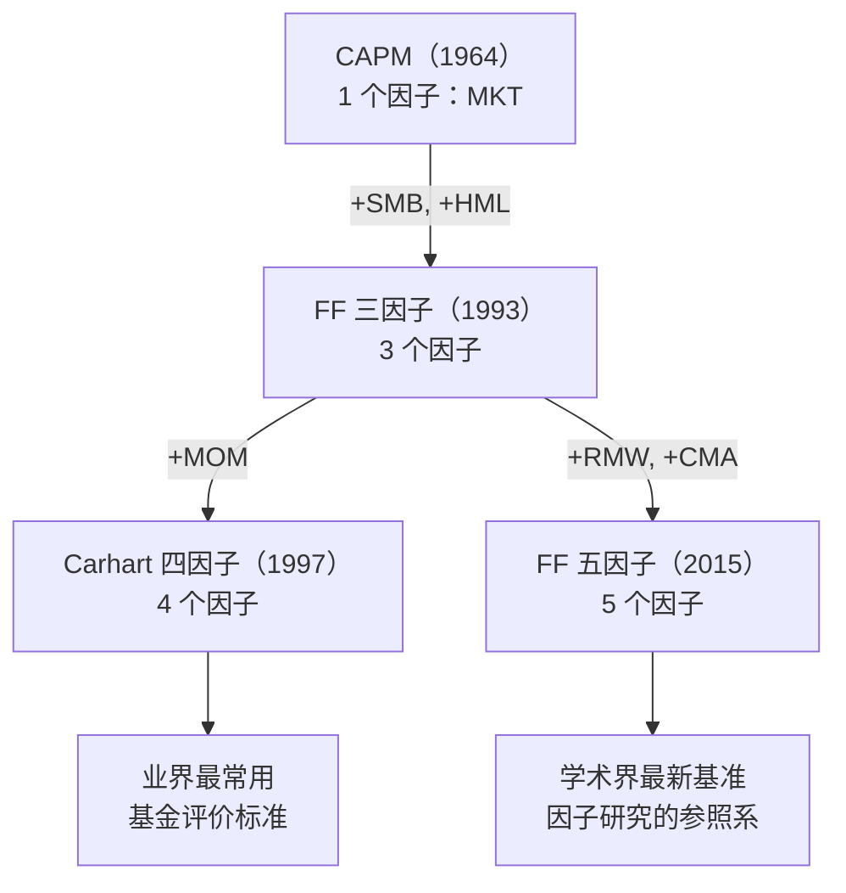
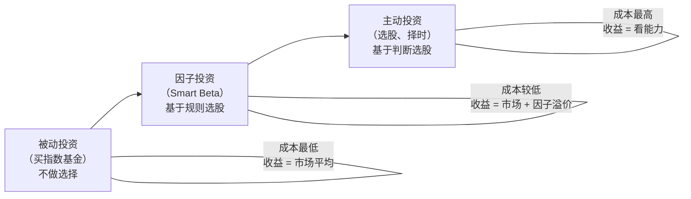
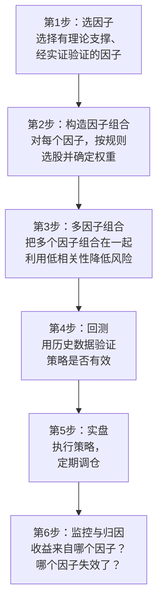
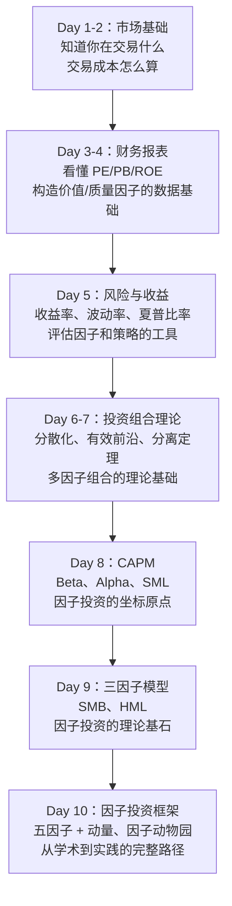

# Day 10：因子投资的起源与框架

> **总时长：** 2 小时
>
> **节奏：** 每 50 分钟休息 10 分钟
>
> **今日目标：** 掌握从三因子到五因子的发展脉络，理解动量因子的特殊地位，了解"因子动物园"问题，建立因子投资从学术到实践的完整框架——今天是金融知识部分的收官整合课
>
> **本文是完整讲义，包含所有知识点，不需要翻阅其他资料**

---

## 时间表

```
00:00 - 00:50  [第1节] 从三因子到五因子 + 动量因子 + 因子动物园
00:50 - 01:00  休息
01:00 - 01:50  [第2节] 因子投资的完整框架 + Day 1-10 知识串联
01:50 - 02:00  [收尾] 自测
```

---

## 第一节：从三因子到因子动物园（50 分钟）

### 一、从 Day 9 到 Day 10

Day 9 学了两件事：

1. **APT**——理论上允许多个因子
2. **Fama-French 三因子模型**——实证上找到了市值因子（SMB）和价值因子（HML），把 CAPM 从一因子扩展到三因子

但 Day 9 末尾留了一个问题：**三因子模型也有解释不了的现象——最突出的是动量效应。**

今天的第一节补齐剩下的因子：动量因子 → 四因子模型 → 盈利和投资因子 → 五因子模型。然后面对一个棘手的问题：学术界发现了几百个因子，到底哪些是真的？

---

### 二、动量因子

#### 2.1 动量效应

**动量效应（Momentum Effect）：过去 6-12 个月涨得好的股票，未来 3-12 个月继续涨得好；过去跌得多的股票，未来继续跌。**

这个现象由 Jegadeesh 和 Titman 在 1993 年系统性地记录（和 Fama-French 三因子论文同年发表）。

| 分组 | 策略 | 年化超额收益（美股，长期平均） |
|------|------|:------------------:|
| 过去 12 个月涨幅最大的 10% | 做多（Winners） | 基准 + 约 6-8% |
| 过去 12 个月跌幅最大的 10% | 做空（Losers） | 基准 - 约 4-6% |
| Winners - Losers | 动量因子收益 | 约 **+8% 到 +12%/年** |

> **动量因子的年化收益可能是所有经典因子中最高的。** 但它也是最危险的——动量因子有极端的"崩溃"风险（下面会讲）。

#### 2.2 动量为什么存在

动量效应对"有效市场假说"的挑战最大——**如果市场是有效的，过去的涨跌不应该预测未来的涨跌。**

两种主流解释（Day 11 会详细讲）：

| 解释 | 核心逻辑 |
|------|---------|
| **反应不足** | 好消息出来后，投资者没有一步到位地调整预期，股价慢慢上涨——形成趋势 |
| **羊群效应** | 一只股票开始涨 → 吸引关注 → 更多人买入 → 继续涨——正反馈循环 |

> **Fama 对动量的态度很有意思。** 作为有效市场假说的坚定支持者，Fama 承认动量效应是"对有效市场假说最大的挑战"。他的五因子模型（2015 年）刻意没有包含动量因子——因为他很难把动量解释为"风险补偿"。

#### 2.3 动量因子的构造

**MOM（Momentum）或 UMD（Up Minus Down）= 过去赢家组合收益 - 过去输家组合收益**

```
第1步：每月末，计算所有股票过去 12 个月的累计收益（跳过最近 1 个月）
第2步：按收益排序，分成赢家组（最高 30%）和输家组（最低 30%）
第3步：MOM = 赢家组收益 - 输家组收益
```

> **为什么跳过最近 1 个月？** 因为最近 1 个月存在"短期反转"效应——刚涨的股票下个月可能小幅回调。跳过这个月，动量信号更纯粹。

> **为什么叫 UMD（Up Minus Down）？** Up = 过去涨的，Down = 过去跌的。做多 Up，做空 Down。和 SMB（Small Minus Big）、HML（High Minus Low）是同样的命名逻辑。

#### 2.4 动量因子的风险：动量崩溃

动量因子有一个致命弱点——**动量崩溃（Momentum Crash）**。

在市场剧烈反转时（比如熊市突然转牛市），过去的输家会猛涨，过去的赢家会停滞甚至下跌。这时动量策略（做多赢家、做空输家）会遭受巨大损失。

| 时间 | 事件 | 动量因子表现 |
|------|------|:----------:|
| 2009 年 3-5 月 | 金融危机后市场反弹 | 单月亏损超过 -30% |
| 2020 年 11 月 | 新冠疫苗消息 → 风格大切换 | 显著负收益 |

> **这是为什么动量因子虽然平均收益最高，却不能只靠它。** 动量策略需要和其他因子（尤其是价值因子）组合——因为动量崩溃往往发生在价值因子大幅跑赢的时候，两者天然对冲。这就是 Day 7 学的"分散化"在因子层面的应用。

---

### 三、Carhart 四因子模型

1997 年，Mark Carhart 在 Fama-French 三因子基础上加入动量因子，形成了**四因子模型**：

```
r_i - r_f = α + β_MKT × MKT + β_SMB × SMB + β_HML × HML + β_MOM × MOM + ε
```

| 因子 | 全称 | 做多 | 做空 | 历史年化溢价（美股） |
|------|------|------|------|:------------------:|
| MKT | Market | 市场组合 | 无风险资产 | +6% 到 +8% |
| SMB | Small Minus Big | 小盘股 | 大盘股 | +2% 到 +3% |
| HML | High Minus Low | 价值股 | 成长股 | +3% 到 +5% |
| MOM | Momentum | 过去赢家 | 过去输家 | +8% 到 +12% |

> **四因子模型在业界使用非常广泛。** 评估一个基金经理的表现时，通常用四因子模型做回归——如果四个因子都控制了之后 Alpha 仍然为正，说明基金经理确实有"选股能力"，而不是简单地暴露在已知因子上。

---

### 四、Fama-French 五因子模型

#### 4.1 为什么还需要更多因子

三因子（加上动量四因子）已经解释了大部分收益差异。但研究者继续发现：

1. **盈利能力高的公司**收益率高于盈利能力低的公司——三因子解释不了
2. **投资风格保守的公司**（扩张慢的）收益率高于激进扩张的公司——三因子解释不了

2015 年，Fama 和 French 发表了五因子模型，加入两个新因子。

#### 4.2 RMW：盈利因子

**RMW（Robust Minus Weak）= 高盈利公司收益 - 低盈利公司收益**

| 要素 | 说明 |
|------|------|
| 全称 | Robust Minus Weak（稳健减脆弱） |
| 衡量标准 | 营业利润率（Operating Profitability）= 营业利润 / 账面权益 |
| 做多 | 盈利能力强的公司（Robust） |
| 做空 | 盈利能力弱的公司（Weak） |
| 历史年化溢价（美股） | 约 +3% 到 +4% |

> **直觉：** 赚钱能力强的公司收益更高——这听起来很自然。但在 CAPM 和三因子模型的框架下，这反而是"异常"——因为它们没有预测盈利能力本身会影响收益率。
>
> **和 Day 4 的联系：** 盈利因子用到的"营业利润率"就是 Day 4 学的利润表中的概念。你在 Day 4 学的财务指标，在这里变成了一个因子的构造基础。

#### 4.3 CMA：投资因子

**CMA（Conservative Minus Aggressive）= 保守投资公司收益 - 激进投资公司收益**

| 要素 | 说明 |
|------|------|
| 全称 | Conservative Minus Aggressive（保守减激进） |
| 衡量标准 | 总资产增长率——增长慢 = 保守，增长快 = 激进 |
| 做多 | 投资保守的公司（资产扩张慢） |
| 做空 | 投资激进的公司（资产扩张快） |
| 历史年化溢价（美股） | 约 +2% 到 +3% |

> **直觉：** 疯狂扩张的公司反而收益低——这有点反直觉。可能的解释是：激进扩张的公司容易过度投资（投了不赚钱的项目），而保守公司把利润留给了股东。
>
> **和 Day 3 的联系：** 投资因子用到的"总资产增长率"来自 Day 3 学的资产负债表。资产负债表上总资产的变化，直接决定了这个因子的构造。

#### 4.4 五因子模型公式

```
r_i - r_f = α + β_MKT × MKT + β_SMB × SMB + β_HML × HML
              + β_RMW × RMW + β_CMA × CMA + ε
```



> **注意：五因子模型没有包含动量。** Fama 和 French 的五因子模型刻意排除了动量因子。他们的理由是：五因子模型的目标是解释**预期收益的截面差异**（不同股票之间的收益差异），而动量是一个**时间序列**现象（和过去的涨跌有关），逻辑上不属于同一类。
>
> 但在实践中，大多数因子投资者会**同时使用五因子 + 动量**——六个因子一起用。

#### 4.5 五因子模型的解释力

| 模型 | 因子数 | 大致解释力（R²） |
|------|:-----:|:-------------:|
| CAPM | 1 | ~70% |
| FF 三因子 | 3 | ~90% |
| Carhart 四因子 | 4 | ~93% |
| FF 五因子 | 5 | ~95% |

> 五因子模型把"说不清"的部分压缩到了约 5%。剩下的 5% 里还有动量、低波动等效应——但主要的收益来源已经被五个因子捕获了。

#### 4.6 六大经典因子总览

把 Day 8-10 学到的所有因子放在一起：

| 因子 | 缩写 | 做多 | 做空 | 年化溢价 | 发现者/年份 |
|------|:----:|------|------|:--------:|-----------|
| 市场 | MKT | 股票市场 | 无风险资产 | +6-8% | Sharpe, 1964 |
| 市值 | SMB | 小盘股 | 大盘股 | +2-3% | Banz 1981 / FF 1993 |
| 价值 | HML | 高 B/M | 低 B/M | +3-5% | FF 1992/1993 |
| 动量 | MOM | 过去赢家 | 过去输家 | +8-12% | Jegadeesh & Titman, 1993 |
| 盈利 | RMW | 高盈利 | 低盈利 | +3-4% | Novy-Marx 2013 / FF 2015 |
| 投资 | CMA | 保守投资 | 激进投资 | +2-3% | FF 2015 |

> **这六个因子是因子投资的"核心武器库"。** 绝大部分因子投资策略，都是从这六个因子的某种组合出发的。编程实战阶段，你会亲手构造这些因子并回测它们的表现。

---

### 五、因子动物园

#### 5.1 问题的规模

随着因子研究的热潮，学术界发现的因子数量暴增：

| 时间 | 已发表的因子数量 |
|------|:----------:|
| 1993 年（FF 三因子） | ~3 个 |
| 2000 年代 | ~50 个 |
| 2010 年代 | ~200 个 |
| 2020 年代 | ~400+ 个 |

Cochrane（2011）把这个现象称为**"因子动物园"（Factor Zoo）**——因子太多了，像动物园一样什么都有。

> **问题是：400 多个因子不可能全是"真的"。** 很多因子可能只是数据挖掘（data mining）的产物——在历史数据中碰巧找到了一个规律，但这个规律没有真正的经济含义，未来也不会重复。

#### 5.2 为什么会有假因子

| 原因 | 说明 |
|------|------|
| **数据挖掘** | 尝试了 1000 种排序方式，总有几种碰巧在历史上"有效"。但这是统计巧合，不是真规律 |
| **发表偏差** | 学术期刊偏好发表"有显著结果"的论文——找到因子的论文能发表，找不到因子的论文发不了 |
| **过度拟合** | 把因子定义调得特别精细（比如"只在 3 月份的小盘价值股"），让它在样本内表现完美，但样本外失效 |
| **样本不够长** | 只用 20 年数据发现的"因子"，可能只是这 20 年的特殊情况 |

> **直觉类比：** 如果你对着一面墙射 1000 支飞镖，然后在飞镖最密集的地方画一个靶心——看起来你是神射手，但其实你什么都没瞄。很多"因子"就是这样——先有了数据结果，再编了一个故事去解释。

#### 5.3 如何判断一个因子是"真的"

研究者和从业者通常用以下标准筛选因子：

| 标准 | 说明 | 例子 |
|------|------|------|
| **经济逻辑** | 这个因子有合理的经济学解释吗？ | 价值因子有（风险补偿 / 行为偏差），但"名字以 A 开头的公司"没有 |
| **统计显著性强** | 仅靠运气出现这个结果的概率有多低？| t 值至少 > 3（Harvey 等，2016 年的新标准） |
| **样本外有效** | 在不同的时间段、不同的市场都有效吗？ | 价值因子在美股、A 股、欧洲、日本都有效 |
| **跨资产有效** | 在股票、债券、商品等不同资产类别都有效吗？ | 动量因子在几乎所有资产类别都有效 |
| **可投资** | 考虑交易成本后还能盈利吗？ | 有些因子理论上有效，但换手率太高，交易成本吃掉了所有利润 |
| **不被其他因子解释** | 它是独立的收益来源，还是其他因子的重新包装？ | 如果一个"新因子"可以被 SMB + HML 完全解释，那它不算新因子 |

> **Harvey, Liu, and Zhu（2016）提出了一个重要建议：** 传统上统计检验的门槛是 t > 2（95% 置信度）。但因为研究者尝试了太多因子（多重检验问题），应该把门槛提高到 **t > 3**。按这个标准，很多"显著"的因子就不再显著了。

#### 5.4 经过筛选后剩下的因子

用上述标准筛选后，学术界和业界基本达成共识的"真因子"包括：

| 因子 | 经济逻辑 | 跨市场有效 | 跨资产有效 | 共识程度 |
|------|:------:|:--------:|:--------:|:------:|
| 市场（MKT） | 强 | 是 | 是 | 公认 |
| 价值（HML） | 强 | 是 | 部分 | 公认 |
| 市值（SMB） | 中等 | 是 | 部分 | 基本公认 |
| 动量（MOM） | 中等 | 是 | 是 | 基本公认 |
| 盈利（RMW） | 强 | 是 | 部分 | 较新但被接受 |
| 投资（CMA） | 中等 | 是 | 部分 | 较新但被接受 |
| 低波动 | 中等 | 是 | 部分 | 争议较多 |

> **这 6-7 个因子就是因子投资的"主菜"。** 400 多个因子经过筛选，真正经得起检验的就这些。编程实战阶段，你会聚焦在这些因子上，而不是去追逐最新发表的"第 401 个因子"。

---

### 第一节完成检查

- [ ] 知道动量效应的含义——过去涨的继续涨，过去跌的继续跌
- [ ] 知道动量因子的特殊风险——动量崩溃
- [ ] 能说出 Carhart 四因子模型 = FF 三因子 + 动量
- [ ] 知道 RMW（盈利因子）和 CMA（投资因子）分别是什么
- [ ] 能说出五因子模型为什么没有包含动量
- [ ] 知道"因子动物园"问题——400+ 因子中很多是数据挖掘的产物
- [ ] 能列出判断因子是否"真实"的主要标准
- [ ] 能说出 6-7 个经过共识检验的经典因子

**休息 10 分钟。**

---

## 第二节：因子投资的完整框架（50 分钟）

### 六、什么是因子投资

学了 10 天金融知识，现在终于可以给"因子投资"一个完整的定义了。

#### 6.1 定义

**因子投资（Factor Investing）：系统性地构造投资组合，使其暴露在已被验证的、能带来长期超额收益的因子上，从而获得因子溢价。**

拆解这句话：

| 关键词 | 含义 | 对应你学过的知识 |
|--------|------|----------------|
| 系统性 | 用规则和数据驱动，而非主观判断 | 和"炒股靠感觉"相反 |
| 构造投资组合 | 不是买单只股票，而是构建一篮子 | Day 6-7 的投资组合理论 |
| 暴露在因子上 | 让组合对目标因子有高载荷 | Day 9 的因子载荷概念 |
| 已被验证 | 经过严格的学术和实证检验 | 上一节的因子筛选标准 |
| 长期超额收益 | 长期来看能跑赢市场 | Day 8 的 Alpha 概念 |
| 因子溢价 | 承担因子风险获得的补偿 | Day 9 的因子溢价概念 |

#### 6.2 因子投资的位置



| 维度 | 被动投资 | 因子投资 | 主动投资 |
|------|---------|---------|---------|
| 选股依据 | 不选——买整个市场 | 规则——按因子特征选 | 判断——基金经理的分析 |
| 目标 | 获得市场收益 | 获得市场收益 + 因子溢价 | 获得市场收益 + Alpha |
| 交易频率 | 很低 | 中等（月度/季度调仓） | 高 |
| 管理费 | 最低（0.1-0.3%） | 较低（0.3-0.8%） | 最高（1-2% + 业绩提成） |
| 透明度 | 最高 | 高（规则公开） | 低（策略保密） |
| 可复制性 | 人人可做 | 会编程即可做 | 依赖个人能力 |

> **因子投资的独特优势：** 它的收益来源有学术理论支撑（因子溢价），成本低于主动管理，而且完全可以用程序自动化。这正是为什么你会在编程实战阶段用 Python 来实现因子策略——它天然适合量化。

#### 6.3 Smart Beta

你可能听过"Smart Beta"这个词——它基本上就是因子投资的市场化名称。

**Smart Beta = 在传统市值加权指数的基础上，按因子特征调整权重的投资策略。**

| 传统指数基金 | Smart Beta 基金 |
|------------|---------------|
| 按市值加权——市值越大权重越高 | 按因子加权——因子得分越高权重越高 |
| 被动跟踪指数 | 基于规则，半主动 |
| 收益 = 市场平均 | 目标：收益 > 市场平均 |

> **全球 Smart Beta 产品的规模已超过 1 万亿美元。** 最常见的 Smart Beta 策略包括：低波动策略、价值策略、质量策略、动量策略、小盘策略。它们本质上都是因子投资。

---

### 七、因子投资的实践流程

从学术理论到实际投资，因子投资的完整流程是：



#### 7.1 第 1 步：选因子

从上一节筛选出的 6-7 个经典因子中选择。不需要全选——选 3-4 个组合就很好。

选因子的实用考虑：

| 考虑因素 | 说明 |
|---------|------|
| 因子之间的相关性 | 选相关性低的因子组合，分散化效果好（Day 7 的原理） |
| 交易成本 | 动量因子换手率高 → 交易成本高；价值因子换手率低 → 成本低 |
| 市场适用性 | 在 A 股，市值因子和价值因子效果好；动量因子需要注意 T+1 限制 |
| 数据可获取性 | 有些因子需要的数据容易获取（市值、PE），有些较难（盈利预期） |

> **经典组合：价值 + 动量。** 这两个因子的相关性为负（价值因子好的时候动量因子往往差，反之亦然）——Day 7 学过，相关性低甚至为负的资产组合，风险降低最多。这是多因子投资中最经典的搭配。

#### 7.2 第 2 步：构造因子组合

对于每个因子，标准流程是：

```
(1) 获取全市场股票的因子指标数据（如 PB、市值、过去12个月收益率）
(2) 按因子指标排序
(3) 选出得分最高的一组（如前 20%）作为做多组
(4) 可选：选出得分最低的一组作为做空组
(5) 确定每只股票的权重（等权 or 市值加权）
```

> **在 A 股实践中：** 个人投资者通常只做"做多"（买入高因子得分的股票），不做"做空"（因为 A 股做空成本高、限制多）。这叫"多头因子策略（Long-Only）"，和学术上的"多空因子策略（Long-Short）"有区别。
>
> **在加密市场中：** 做多做空都比较容易（合约交易），Long-Short 策略更可行。

#### 7.3 第 3 步：多因子组合

把多个因子组合有两种方法：

| 方法 | 做法 | 优缺点 |
|------|------|--------|
| **混合法** | 先给每只股票算综合因子得分（如 0.3×价值分 + 0.3×动量分 + 0.4×质量分），再按综合分选股 | 简单直接，但因子之间可能相互稀释 |
| **组合法** | 分别构建每个因子的组合，再把组合按权重配置 | 因子暴露更纯粹，但需要更多资金 |

> **实践中两种方法都有人用。** 编程实战阶段会先用混合法（更容易实现），再尝试组合法。

#### 7.4 第 4-6 步：回测、实盘、归因

| 步骤 | 关键问题 | 对应知识 |
|------|---------|---------|
| 回测 | 策略在历史上表现如何？夏普比率多高？最大回撤多大？ | Day 5 的收益/风险指标 |
| 实盘 | 多久调仓一次？交易成本怎么控制？ | Day 2 的交易成本 |
| 归因 | 这个月赚的钱来自哪个因子？Alpha 是多少？ | Day 8-9 的因子模型回归 |

> 这三步是编程实战阶段的核心内容，今天只需知道流程。

---

### 八、因子投资在 A 股和加密市场的现状

#### 8.1 A 股因子投资

| 维度 | A 股现状 |
|------|---------|
| 最有效的因子 | 市值因子（小盘股效应显著）、价值因子（但周期性强） |
| 特殊之处 | 散户比例高 → 行为偏差更多 → 因子溢价可能更大 |
| 数据获取 | Wind、Tushare、AkShare 等都能获取因子数据 |
| 产品 | 公募有少量 Smart Beta 基金；量化私募广泛使用因子策略 |
| 限制 | T+1 限制动量策略的执行效率；做空成本高限制了 Long-Short |

#### 8.2 加密市场因子投资

| 维度 | 加密市场现状 |
|------|------------|
| 最有效的因子 | 市场因子（BTC 主导）、动量因子（趋势性强） |
| 特殊之处 | 24/7 交易、无涨跌停、可以轻松做空 |
| 数据获取 | CoinGecko、Binance API 等 |
| 产品 | 极少——几乎是空白市场 |
| 限制 | 数据历史短、生存偏差严重（大量币种已消亡）、缺乏基本面数据 |

> **加密市场的因子投资是一片蓝海。** 传统市场的因子策略已经非常拥挤（很多机构在做），但加密市场还在早期——这既是机会（溢价可能更大），也是风险（数据质量差、规律不稳定）。

---

### 九、Day 1-10 知识串联

十天的金融知识，形成了一条完整的逻辑链：



| Day | 你学到的 | 在因子投资中的作用 |
|:---:|---------|:---------------:|
| 1 | 股票是什么、市值、指数 | 投资标的和基准 |
| 2 | 交易规则、交易成本 | 策略执行的约束条件 |
| 3 | 资产负债表、利润表 | 价值因子和质量因子的数据来源 |
| 4 | 现金流量表、PE/PB/ROE | 因子指标的计算基础 |
| 5 | 收益率、波动率、夏普比率 | 衡量因子和策略表现的工具 |
| 6 | 风险厌恶、效用函数、CAL | 理解为什么不同人选不同风险水平 |
| 7 | 相关系数、有效前沿、分离定理 | 多因子组合的数学基础 |
| 8 | Beta、Alpha、CAPM、SML | 因子投资的理论起点——定义"正常收益"和"异常收益" |
| 9 | APT、SMB、HML、三因子模型 | 因子投资的理论基石——发现独立的收益来源 |
| 10 | 五因子、动量、因子投资框架 | 完整的因子体系和实践路径 |

> **每一天学的东西都不是孤立的。** 财务报表给因子提供数据，风险收益理论提供评估工具，投资组合理论提供组合方法，资产定价模型提供理论框架。十天的知识是一个有机整体，缺了哪一块，因子投资的链条就断了。

---

### 十、接下来的路

金融知识部分（模块五）在今天基本收官。还剩一天——Day 11 的行为金融——解释**为什么因子溢价能长期存在**。

之后你将进入：

| 阶段 | 内容 | 和因子投资的关系 |
|------|------|----------------|
| **数学复习**（10 天） | 线性代数、概率统计、时间序列 | 因子模型回归、组合优化、统计检验的数学基础 |
| **因子投资**（18 天） | 因子构造、回测方法论、多因子策略 | 深入学习每个因子的构造细节和组合方法 |
| **编程实战**（30 天） | Python 数据分析、因子构造、回测 | 把所有理论用代码实现 |

> **金融知识是"知道做什么"，数学是"知道怎么算"，因子投资是"知道怎么用"，编程是"真正去做"。** 四者缺一不可。你现在已经完成了第一个阶段。

---

### 第二节完成检查

- [ ] 能给出因子投资的完整定义
- [ ] 知道因子投资在"被动-因子-主动"投资光谱中的位置
- [ ] 知道 Smart Beta 基本上就是因子投资的市场化名称
- [ ] 了解因子投资的 6 步实践流程
- [ ] 知道多因子组合的两种方法（混合法 vs 组合法）
- [ ] 了解 A 股和加密市场因子投资的现状和特点
- [ ] 能把 Day 1-10 的知识串联成一条完整的逻辑链
- [ ] 知道接下来的学习路径（数学复习 → 因子投资 → 编程实战）

---

## 收尾：自测（10 分钟）

拿一张白纸，**不看任何资料**，回答以下问题。先自己写，再对答案：

```
自测 1：动量因子是什么？MOM 怎么构造？
→ 你的答案：_______________
→ 正确：动量因子 = 过去 6-12 个月的赢家组合收益 - 输家组合收益。
  做多过去涨得好的，做空过去跌得多的。

自测 2：动量因子最大的风险是什么？
→ 你的答案：_______________
→ 正确：动量崩溃——市场剧烈反转时（如熊转牛），
  过去的输家猛涨、赢家停滞，动量策略遭受巨大损失。

自测 3：RMW 和 CMA 分别代表什么？
→ 你的答案：_______________
→ 正确：RMW = Robust Minus Weak（高盈利减低盈利）。
  CMA = Conservative Minus Aggressive（保守投资减激进投资）。

自测 4：Fama-French 五因子模型为什么没有包含动量？
→ 你的答案：_______________
→ 正确：Fama 认为动量是时间序列现象（和过去涨跌有关），
  而五因子模型解释的是截面差异（不同股票之间的收益差异），
  逻辑上不属于同一类。

自测 5："因子动物园"是什么问题？
→ 你的答案：_______________
→ 正确：学术界发现了 400+ 个因子，但很多是数据挖掘的产物——
  在历史数据中碰巧有效，未来不一定能重复。
  需要用经济逻辑、样本外检验等标准筛选。

自测 6：判断一个因子是否"真实"的标准有哪些？（说出至少三个）
→ 你的答案：_______________
→ 正确：(1) 有合理的经济逻辑；(2) 统计显著性强（t > 3）；
  (3) 样本外有效（不同时间段/不同市场）；
  (4) 考虑交易成本后仍有效；(5) 不被其他因子解释。

自测 7：因子投资和被动投资（买指数基金）有什么区别？
→ 你的答案：_______________
→ 正确：被动投资买整个市场，获得市场平均收益。
  因子投资基于规则按因子特征选股，
  目标是获得市场收益 + 因子溢价。

自测 8：为什么价值因子和动量因子是经典的组合搭配？
→ 你的答案：_______________
→ 正确：因为两者的相关性为负——价值因子好的时候动量因子往往差，
  反之亦然。组合后风险大幅降低（Day 7 的分散化原理）。

自测 9：构造一个因子组合的标准流程是什么？
→ 你的答案：_______________
→ 正确：(1) 获取因子指标数据；(2) 按指标排序；
  (3) 选出高分组做多（可选低分组做空）；(4) 确定权重。

自测 10：Day 3-4 学的财务报表知识在因子投资中怎么用？
→ 你的答案：_______________
→ 正确：资产负债表提供账面价值（构造价值因子 HML 的 B/M 指标）；
  利润表提供盈利数据（构造盈利因子 RMW）；
  资产负债表的资产变化提供投资数据（构造投资因子 CMA）。
```

**9-10 道对：** 完美，因子投资的理论框架已经建立。
**7-8 道对：** 不错，回看错的部分就好。
**6 道以下：** 建议花 20 分钟重新阅读讲义，重点是六大因子总览和因子投资的定义。

---

## 今天不需要记住的内容

| 概念 | 今天理解到什么程度 | 什么时候深入 |
|------|------------------|------------|
| 五因子模型的推导细节 | 知道"三因子 + 盈利 + 投资"就行 | 不涉及 |
| 因子溢价的精确历史数值 | 知道大致范围就行 | 编程实战阶段（会自己算） |
| 因子构造的精确代码实现 | 知道概念流程就行 | 编程实战阶段 |
| Smart Beta 产品的具体种类 | 知道概念就行 | 不涉及 |
| 动量崩溃的精确日期和数值 | 知道"市场反转时动量会崩溃"就行 | 编程实战阶段（回测会看到） |
| 因子择时（Factor Timing） | 不需要知道 | 因子投资阶段（高阶话题） |
| 组合优化的数学细节 | 知道"找最优权重"的概念就行 | 数学复习阶段 + 编程实战阶段 |

---

## 今日知识点与因子投资的关联

| 今日知识点 | 关联的因子/概念 | 怎么关联 | 深入时间 |
|-----------|---------------|---------|---------|
| 动量因子（MOM） | **六大经典因子之一** | 做多过去赢家、做空过去输家。年化溢价最高但有崩溃风险 | 编程实战阶段 |
| 动量崩溃 | **因子风险管理** | 动量和价值的负相关性是多因子组合的核心搭配 | 编程实战阶段 |
| 盈利因子（RMW） | **六大经典因子之一** | 高盈利公司跑赢低盈利公司。用利润表数据构造 | 编程实战阶段 |
| 投资因子（CMA） | **六大经典因子之一** | 保守投资公司跑赢激进扩张公司。用资产负债表数据构造 | 编程实战阶段 |
| 因子动物园 | **因子筛选纪律** | 不追逐未经验证的新因子，聚焦经典因子 | 贯穿全程 |
| 因子投资实践流程 | **编程实战的路线图** | 选因子 → 构造组合 → 回测 → 实盘 → 归因 | 编程实战阶段 |
| 混合法 vs 组合法 | **多因子策略的两种实现** | 编程实战中先用混合法（简单），再尝试组合法 | 编程实战阶段 |

> 模块五（资产定价模型）至此完结。Day 8-10 三天建立了因子投资的完整理论框架：CAPM 定义了 Alpha 和 Beta → 三因子模型发现了市值和价值两个独立收益来源 → 五因子模型加上盈利和投资 → 动量因子补齐拼图。现在你已经知道"因子投资是什么、为什么有效、怎么做"——剩下的就是 Day 11 回答"为什么因子溢价能长期存在"，然后进入数学和编程阶段把理论变成现实。

---

## 明天预告

**Day 11** 是金融知识部分的最后一天——**行为金融与因子的关系**。

今天建立了因子投资的完整框架，但有一个根本问题没有回答：

**如果因子溢价真的存在，为什么没有被所有人套利掉？为什么它能持续几十年？**

明天你将了解到：
- **过度反应**——投资者为什么把暂时的坏消息当成永久的灾难？→ 这解释了价值因子
- **反应不足**——好消息出来后股价为什么不一步到位？→ 这解释了动量因子
- **损失厌恶、锚定效应、羊群效应**——人类大脑的系统性偏差如何创造了因子溢价

> Day 11 将为因子投资提供最后一块拼图——行为金融学的解释。它回答的是"为什么"的问题，让你对因子投资的信心建立在理解之上，而不仅仅是历史数据的回测。
