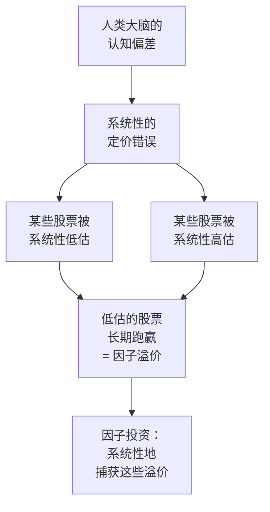
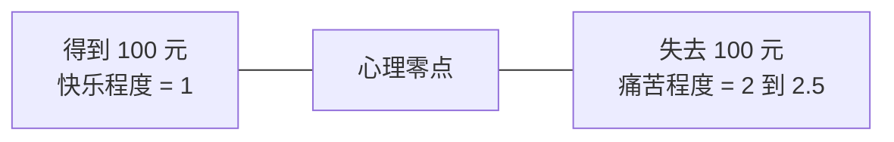
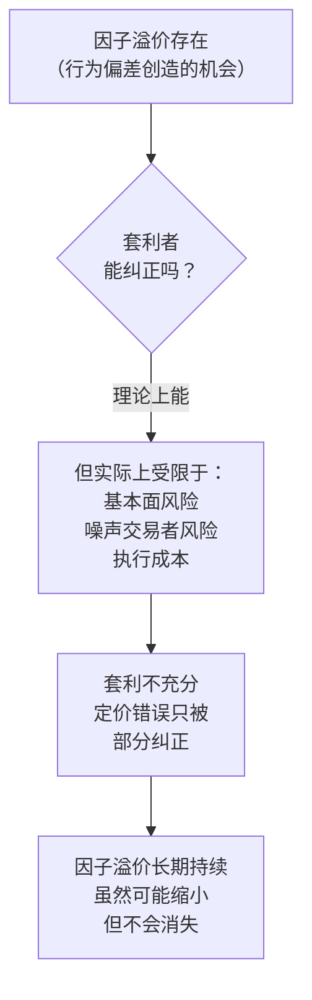
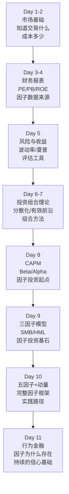

# Day 11：行为金融与因子的关系

> **总时长：** 2 小时
> **节奏：** 每 50 分钟休息 10 分钟
> **今日目标：** 理解人类大脑的系统性偏差如何导致市场定价错误，掌握每个行为偏差和因子的对应关系，回答"因子溢价为什么能长期存在"这个根本问题——这是因子投资信心的最终来源
> **本文是完整讲义，包含所有知识点，不需要翻阅其他资料**

---

## 时间表

```
00:00 - 00:50  [第1节] 有效市场假说的挑战 + 六大行为偏差
00:50 - 01:00  休息
01:00 - 01:50  [第2节] 行为偏差 × 因子 + 因子溢价为什么能持续 + 11 天总结
01:50 - 02:00  [收尾] 自测
```

---

## 第一节：人类大脑的系统性错误（50 分钟）

### 一、从 Day 10 到 Day 11

Day 8-10 建立了因子投资的完整框架：CAPM → 三因子 → 五因子 + 动量。你已经知道"有哪些因子""怎么构造因子组合"。

但有一个根本问题还没回答：

**如果小盘股和价值股长期赚得更多，为什么不是所有人都去买它们？买的人多了，价格涨上去，溢价不就消失了吗？**

换句话说：**因子溢价为什么没有被套利掉？为什么它能持续几十年？**

Day 9 提到了两种解释——"风险补偿"和"行为偏差"。今天深入讲第二种：**行为金融学（Behavioral Finance）**。

> **行为金融学的核心主张：** 投资者不是完全理性的。人类大脑有系统性的认知偏差，这些偏差导致了系统性的定价错误——因子溢价正是这些错误的产物。

---

### 二、有效市场假说：理想与现实

#### 2.1 有效市场假说回顾

**有效市场假说（Efficient Market Hypothesis, EMH）：资产价格已经反映了所有可获得的信息，不可能系统性地"打败市场"。**

EMH 由 Eugene Fama 在 1970 年提出，有三个版本：

| 版本 | 价格反映了什么信息 | 含义 |
|------|:---------------:|------|
| 弱式有效 | 所有历史价格信息 | 技术分析无效（看K线没用） |
| 半强式有效 | 所有公开信息 | 基本面分析无效（看财报也没用） |
| 强式有效 | 所有信息（包括内幕） | 即使有内幕消息也无法获利 |

> **EMH 的逻辑很有力：** 如果价格偏离了合理值，聪明的投资者会立刻买入/卖出，把价格推回合理水平。所以在均衡状态下，价格总是"对的"。

#### 2.2 现实的挑战

但现实中存在大量 EMH 无法解释的现象：

| 现象 | EMH 的预测 | 实际情况 |
|------|-----------|---------|
| 因子溢价 | 不应该长期存在 | 价值、动量等因子溢价持续了几十年 |
| 泡沫与崩盘 | 不应该发生 | 2000 年互联网泡沫、2008 年金融危机、2021 年加密泡沫 |
| 过度波动 | 价格波动应该和基本面变化一致 | 实际价格波动远大于基本面变化能解释的幅度 |
| IPO 长期跑输 | 定价应该合理 | 新股上市后 3-5 年的收益普遍低于市场平均 |

> **Robert Shiller（2013 年诺贝尔经济学奖）指出：** 股票价格的波动远远超过了未来股息变化能够解释的范围。这说明价格中包含了大量"非理性"成分——投资者的情绪、恐慌、狂热。

#### 2.3 行为金融学的立场

**行为金融学不是说"市场完全无效"，而是说"市场大部分时候有效，但在特定情境下会系统性地犯错"。**

这些"系统性的错误"不是随机的——它们有规律可循，而且源于人类大脑的基本运作方式。这正是因子投资的机会所在。



---

### 三、六大行为偏差

以下是和因子投资最相关的六个行为偏差。每一个都有扎实的心理学实验支撑，不是凭空编的。

#### 3.1 过度反应（Overreaction）

**过度反应：投资者对坏消息反应过度——把暂时的困难当成永久的灾难，把短期的利好当成无限的前景。**

> **经典实验（De Bondt & Thaler, 1985）：** 把股票按过去 3-5 年的表现分成"赢家组"和"输家组"。结果发现，过去的输家在接下来 3-5 年**反转跑赢**，过去的赢家**反转跑输**。幅度很大——输家组比赢家组年化多赚约 8%。

> **直觉类比：** 一个学生连续三次考试不及格，所有人都觉得"这孩子没救了"。但也许他只是换了一个不适应的老师，换回来就好了。过度反应就是把"暂时的低谷"误判为"永远的失败"。

| 情境 | 过度反应的表现 |
|------|------------|
| 某公司发布了一个季度的亏损 | 股价暴跌 30%——投资者恐慌性抛售，好像公司要倒闭 |
| 某科技公司发布了一个爆款产品 | 股价暴涨 50%——投资者疯狂追捧，好像利润会永远增长 |
| 整个行业遇到政策利空 | 行业全线暴跌——投资者不分好坏全部抛售 |

**和因子的关系：** 过度反应直接创造了价值因子的机会——后面第二节详细讲。

#### 3.2 反应不足（Underreaction）

**反应不足：投资者对新信息的反应不够充分——好消息出来后股价没有一步到位地涨到合理水平，而是慢慢涨；坏消息出来后股价也没有一步跌到位。**

> **经典研究（Bernard & Thomas, 1989）：** 公司发布超预期的好业绩后，股价在发布当天上涨，但在接下来的 60 个交易日继续慢慢上涨——这叫"盈余公告后漂移"（Post-Earnings Announcement Drift, PEAD）。如果市场是有效的，价格应该在信息公布的瞬间一步到位。

> **直觉类比：** 你的朋友告诉你一家新开的餐厅特别好吃。你半信半疑，想"等等看别人怎么评价"。过了一个月，越来越多人说好，你才去试。股票市场也一样——新信息出来后，很多投资者观望、犹豫，价格调整是渐进的而非瞬间的。

**和因子的关系：** 反应不足直接创造了动量因子的机会。

#### 3.3 损失厌恶（Loss Aversion）

**损失厌恶：失去 100 块钱的痛苦远大于得到 100 块钱的快乐。**

这是 Daniel Kahneman 和 Amos Tversky 在"前景理论"（Prospect Theory, 1979）中发现的核心偏差。Kahneman 因此获得 2002 年诺贝尔经济学奖。

> **经典实验：** 给你两个选择——
> - A：确定得到 900 元
> - B：90% 概率得到 1000 元，10% 概率得到 0 元
>
> 大多数人选 A（虽然 B 的期望值 = 900 元，相同）。
>
> 再给你两个选择——
> - C：确定失去 900 元
> - D：90% 概率失去 1000 元，10% 概率不失去
>
> 大多数人选 D（虽然 D 的期望损失 = 900 元，相同）。
>
> **结论：** 面对收益时，人倾向于保守（确定性偏好）；面对损失时，人倾向于冒险（赌一把）。**人对损失的敏感度大约是收益的 2-2.5 倍。**



损失厌恶导致了一系列投资行为：

| 行为 | 表现 | 结果 |
|------|------|------|
| **处置效应** | 赚钱的股票急着卖（锁定收益），亏钱的死拿不放（不愿确认损失） | 卖掉赢家、留着输家——和动量策略完全相反 |
| **过度保守** | 害怕亏损 → 不敢买"看起来危险"的股票（如小盘股、价值股） | 这些股票被低估 → 产生因子溢价 |
| **恐慌抛售** | 市场下跌时恐惧放大 → 不计成本地抛售 | 价格跌到远低于合理值 → 之后反弹 |

#### 3.4 锚定效应（Anchoring）

**锚定效应：人们在做判断时会过度依赖最先接触到的信息（"锚"），即使这个信息和判断无关。**

> **经典实验（Tversky & Kahneman, 1974）：** 先转一个随机数字的轮盘（比如转到 65），然后问参与者"联合国中非洲国家的比例是高于还是低于 65%？"再问"你估计实际比例是多少？"。
>
> 结果：轮盘转到高数字的那组给出的估计值显著更高——即使他们知道轮盘是随机的！大脑自动把看到的第一个数字当成了参考点。

在投资中的表现：

| 锚定的对象 | 表现 | 结果 |
|-----------|------|------|
| **历史最高价** | "这只股票从 100 元跌到 50 元，太便宜了！" | 但也许 50 元还是太贵——100 元才是泡沫价格 |
| **买入价** | "我 80 元买的，现在 60 元，等回到 80 我就卖" | 锚定在买入价上，忽略了公司基本面已经变了 |
| **整数关口** | "沪深 300 到了 3000 点，这是大底！" | 3000 本身没有经济含义，但大量投资者把它当成"锚" |
| **分析师预测** | 分析师预测的目标价成为投资者的参照系 | 即使分析师调整预测，投资者还是锚定在旧预测上 |

**和因子的关系：** 锚定效应让投资者对新信息反应不充分（"价格应该回到锚附近"），贡献了反应不足 → 动量效应。

#### 3.5 羊群效应（Herding）

**羊群效应：投资者倾向于跟随大众的行为——别人买我也买，别人卖我也卖——而不是独立思考。**

> **直觉类比：** 你走在街上，看到一群人排队。你不知道在排什么，但潜意识告诉你"这么多人排队，肯定不错"——于是你也加入了队伍。股票市场的羊群效应一模一样。

| 阶段 | 羊群行为 | 结果 |
|------|---------|------|
| 上涨初期 | 少数人买入，价格小幅上涨 | 正常 |
| 上涨中期 | 更多人看到上涨 → 跟风买入 → 价格继续涨 | 正反馈开始 |
| 泡沫阶段 | 所有人都在买 → "不买就亏了" → 价格脱离基本面 | 泡沫形成 |
| 崩盘 | 有人开始卖 → 恐慌蔓延 → 所有人抢着卖 | 踩踏，价格远低于合理值 |

> **2021 年加密市场的例子：** 比特币从 1 万美元涨到 6 万多美元的过程中，大量散户在 4-6 万美元区间涌入——不是因为他们分析了比特币的价值，而是因为"所有人都在赚钱"。之后价格暴跌回 2 万以下，这些人大部分亏损离场。

**和因子的关系：** 羊群效应在短期内**强化趋势**（贡献动量），在中长期**创造泡沫和崩盘**（贡献价值因子的反转机会）。

#### 3.6 代表性偏差（Representativeness Bias）

**代表性偏差：人们倾向于根据表面特征做判断，忽略了统计概率。**

> **经典例子：** 一家公司连续 5 年利润高速增长。投资者会认为"这是一家伟大的公司，未来也会继续高增长"——然后给它极高的估值。但统计上，高增长很难持续——大部分高增长公司的增速会回归平均值（均值回归）。

| 代表性偏差的表现 | 投资后果 |
|:-------------:|---------|
| "过去 5 年业绩好 = 未来也会好" | 对成长股估值过高 |
| "过去 3 年业绩差 = 这公司不行" | 对价值股估值过低 |
| "这个行业最近很热 = 这个行业会一直好" | 追涨热门行业 |
| "最近市场一直涨 = 永远会涨" | 在高位加仓 |

> **均值回归（Mean Reversion）是代表性偏差的天然解药。** 统计规律告诉我们：极端表现往往会回到平均水平。但人类大脑天然不擅长理解均值回归——我们倾向于把趋势无限外推。

**和因子的关系：** 代表性偏差让投资者高估成长股（"增长会持续"）、低估价值股（"困难会持续"）→ 直接创造价值因子的溢价。

---

### 第一节完成检查

- [ ] 知道有效市场假说（EMH）的核心主张和三个版本
- [ ] 理解行为金融学的立场——不是"市场完全无效"，而是"系统性地犯特定错误"
- [ ] 能说出过度反应和反应不足的含义与区别
- [ ] 理解损失厌恶——损失的痛苦约为收益快乐的 2-2.5 倍
- [ ] 知道处置效应是损失厌恶的投资表现——卖赢家、留输家
- [ ] 理解锚定效应——大脑会把无关信息当成判断的参照系
- [ ] 理解羊群效应——跟随大众而非独立思考
- [ ] 理解代表性偏差——根据表面特征外推，忽略均值回归

**休息 10 分钟。**

---

## 第二节：行为偏差如何创造因子溢价（50 分钟）

### 四、每个因子的行为金融解释

这是今天最重要的内容——把第一节学的行为偏差和 Day 8-10 学的因子一一对应。

#### 4.1 价值因子 = 过度反应 + 代表性偏差

**行为解释：投资者对坏消息过度反应，对好公司过度乐观，导致价值股被系统性低估、成长股被系统性高估。**

完整的因果链：

```
(1) 某公司遭遇了暂时的困难（如一个季度业绩下滑）
(2) 投资者过度反应：
    - "这公司要完了！" → 恐慌抛售
    - 代表性偏差："最近业绩差 = 以后也会差"
(3) 股价跌到远低于内在价值 → B/M 变得很高 → 被归入"价值股"
(4) 一段时间后，公司恢复正常 / 市场认识到反应过度
(5) 股价回升 → 价值股跑赢市场
```

同时，成长股的方向相反：

```
(1) 某公司连续几年高速增长
(2) 投资者代表性偏差："增长会永远持续！" → 疯狂追捧
(3) 股价涨到远高于内在价值 → B/M 很低 → 被归入"成长股"
(4) 增长速度回归平均值（均值回归）
(5) 股价下跌或停滞 → 成长股跑输市场
```

> **Lakonishok, Shleifer, and Vishny（1994）的经典研究**直接验证了这个解释。他们发现：价值股在形成期（变成价值股之前）经历了糟糕的业绩表现，但在持有期（被买入之后）的基本面改善幅度**超出了市场预期**——说明市场对这些公司过度悲观了。

#### 4.2 动量因子 = 反应不足 + 羊群效应

**行为解释：好消息出来后投资者反应不充分（价格慢慢涨），再加上羊群效应的正反馈，形成了持续的价格趋势。**

完整的因果链：

```
(1) 某公司发布超预期的好业绩
(2) 反应不足：
    - 保守主义："等等看，也许只是偶然"
    - 锚定效应：锚定在旧的估值上，缓慢调整
(3) 股价上涨，但幅度不够——没有一步到位
(4) 羊群效应放大：
    - 趋势形成 → 引起更多关注 → 更多人买入 → 价格继续涨
(5) 过去 6-12 个月的赢家在未来 3-12 个月继续跑赢
```

> **为什么动量最终会反转？** 反应不足驱动的价格调整不会永远持续。当价格最终"追上"甚至"超过"基本面时，过度反应开始——价格被推到不合理的高位，之后均值回归导致反转。这就是动量策略在 12 个月后逐渐失效、甚至反转的原因。


> **注意这张图揭示了一个深刻的关系：** 动量和价值实际上是**同一个行为偏差循环的不同阶段**。反应不足创造动量 → 过度反应创造价值 → 均值回归让价值兑现 → 新一轮循环开始。这也解释了为什么动量和价值因子是天然的负相关——它们捕获的是同一个循环的不同阶段。

#### 4.3 市值因子 = 关注度偏差 + 机构限制

**行为解释：小盘股缺乏关注和研究覆盖，导致定价效率低，存在更多被低估的机会。**

| 原因 | 说明 |
|------|------|
| **分析师覆盖少** | 大市值公司有 20-30 个分析师跟踪，小盘股可能只有 1-2 个甚至没有 |
| **机构资金进不去** | 大型基金的单笔投资规模太大，买不了小盘股（流动性不够） |
| **散户偏好大公司** | "我知道的品牌才放心买"——熟悉性偏差让散户集中在大公司上 |
| **信息不对称** | 小盘股信息少 → 分析难度大 → 很多人直接放弃 |

> **这意味着：** 小盘股市场是"信息荒漠"——没什么人研究它们，定价错误更容易存在。因子投资在小盘股中的效果往往比大盘股更好，正是因为错误定价更多。

#### 4.4 低波动因子 = 彩票偏好 + 过度自信

Day 10 提到过低波动异象——低波动股票的风险调整收益反而更好。行为解释是：

**投资者偏好"像彩票一样"的高波动股票，愿意为"暴涨的可能性"多付钱——导致高波动股票被高估、低波动股票被低估。**

| 偏差 | 表现 |
|------|------|
| **彩票偏好** | "这只股票可能涨 10 倍！"——投资者为小概率大收益多付溢价 |
| **过度自信** | "我能驾驭高波动"——高估自己的择时能力 |
| **机构的基准压力** | 基金经理追求跑赢基准 → 不敢买"无聊"的低波动股票（怕跑不赢指数被解雇） |

> **结果：** 高波动的"刺激型"股票被追捧 → 价格偏高 → 长期收益偏低。低波动的"无聊型"股票被忽视 → 价格偏低 → 长期收益偏高（风险调整后）。

#### 4.5 盈利因子和投资因子

这两个因子的行为解释相对简单：

| 因子 | 行为解释 |
|------|---------|
| **盈利因子（RMW）** | 投资者不够重视盈利质量——被"增长故事"吸引，忽略了"谁在真正赚钱"。稳定赚钱的公司不如高增长公司性感，被低估 |
| **投资因子（CMA）** | 管理层过度自信 → 过度投资 → 资本效率下降。"保守"的公司反而更自律，长期回报更好 |

#### 4.6 行为偏差 × 因子总对应表

| 行为偏差 | 导致的定价错误 | 对应的因子 |
|---------|:----------:|:---------:|
| 过度反应 | 坏消息下跌过多 → 价值股被低估 | **价值因子（HML）** |
| 代表性偏差 | 过去好 ≠ 未来好，但投资者外推 | **价值因子（HML）** |
| 反应不足 | 好消息后价格慢慢涨 → 趋势形成 | **动量因子（MOM）** |
| 锚定效应 | 新信息出来，仍锚定旧价格 | **动量因子（MOM）** |
| 羊群效应 | 趋势形成后正反馈放大 | **动量因子（MOM）** |
| 关注度偏差 | 小盘股无人研究 → 错误定价多 | **市值因子（SMB）** |
| 彩票偏好 | 高波动被追捧 → 低波动被低估 | **低波动因子** |
| 损失厌恶 | 不敢买"看起来危险"的股票 | **价值因子、市值因子** |
| 处置效应 | 卖赢家留输家 → 和动量相反 | **动量因子（MOM）** |

> **这张表是今天的核心。** 它说明每一个因子溢价背后都有明确的心理学机制——不是随机的统计巧合，而是人类大脑固有偏差的必然结果。

---

### 五、因子溢价为什么能长期持续

理解了行为偏差之后，还需要回答一个问题：**既然知道这些偏差存在，为什么聪明的投资者不去纠正它们，让溢价消失？**

答案是：**套利有限制（Limits to Arbitrage）。**

#### 5.1 套利的三大限制

| 限制 | 说明 | 例子 |
|------|------|------|
| **基本面风险** | 你认为股票被低估了，但它可能继续跌——因为基本面可能真的恶化 | 你买了一只"便宜"的股票，结果公司真的倒闭了 |
| **噪声交易者风险** | 即使你是对的，非理性投资者可能把价格推得更离谱，在你的止损线之前就把你淘汰出局 | "市场保持非理性的时间可以超过你保持不破产的时间"（Keynes） |
| **执行成本** | 做空成本高、流动性差、交易费用——实际操作中套利的利润可能被成本吃掉 | A 股做空成本极高，很多套利机会无法执行 |

> **Keynes 的名言：** "市场保持非理性的时间，可以超过你保持不破产的时间。" 这句话完美概括了为什么套利不能完全消除定价错误——因为套利者的资金和耐心是有限的。

#### 5.2 套利限制如何保护因子溢价



> **因子溢价可能在缩小——但不会消失。** 随着量化投资的普及，越来越多人在做因子策略，竞争加剧，因子溢价确实有所下降。但只要人类的心理偏差不变（过度反应、损失厌恶、羊群效应是大脑的基本特征，不是靠"学习"就能克服的），因子溢价就会一直存在——只是大小会波动。

#### 5.3 风险补偿 vs 行为偏差：最终立场

Day 9 提过因子溢价有两种解释。学完行为金融后，可以给出更完整的判断：

| 因子 | 更可能的解释 | 理由 |
|------|:---------:|------|
| 价值（HML） | **两者兼有** | 价值股确实更危险（经济衰退时跌得更多），但过度反应也是重要原因 |
| 市值（SMB） | **两者兼有** | 小盘股确实风险更大，但关注度不足也是重要原因 |
| 动量（MOM） | **偏行为偏差** | 很难用风险补偿解释"过去涨的继续涨"——风险补偿说认为高收益 = 高风险，但动量策略的风险并不稳定地高 |
| 盈利（RMW） | **偏行为偏差** | 盈利好的公司风险更低，收益也更高——和"高风险高收益"的逻辑矛盾 |
| 低波动 | **行为偏差** | 低风险反而高收益——直接和风险补偿说矛盾 |

> **对因子投资者的实践意义：**
> - 如果溢价主要来自**风险补偿**：在经济衰退等"坏时候"你会亏更多，你需要有足够的承受力
> - 如果溢价主要来自**行为偏差**：只要保持纪律、不被自己的情绪带偏，你就能长期获利
> - **不管是哪种来源，纪律和耐心都是必须的。** 因子溢价不是每个月都有，有时需要等几年才能兑现

---

### 六、对因子投资者的行为警告

了解了这些偏差之后，最重要的一件事是：**你自己也不能免疫这些偏差。**

| 偏差 | 你可能犯的错误 |
|------|------------|
| 过度反应 | 因子策略连续 6 个月跑输 → "这个因子不行了！" → 放弃策略 → 刚好错过随后的反弹 |
| 损失厌恶 | 策略回撤 15% → 恐慌 → 清仓 → 卖在最低点 |
| 代表性偏差 | "最近 2 年价值因子不行 = 以后也不行" → 放弃价值因子 → 错过长期溢价 |
| 羊群效应 | "大家都在做动量策略" → 跟风 → 拥挤导致溢价消失 |
| 锚定效应 | "我的回测年化 20%" → 实盘只有 12% → 觉得策略失败 → 其实 12% 已经很好了 |

> **因子投资最大的敌人不是市场，而是你自己的心理。** 有了系统性的策略，技术层面的问题不大（编程实战阶段会解决）。真正的挑战是在因子表现不好的时候**坚持执行**——不过度反应，不恐慌抛售，不追涨杀跌。

| 应对方法 | 说明 |
|---------|------|
| **规则化执行** | 用程序自动调仓，减少人为干预的机会 |
| **设定预期** | 提前知道"因子策略有时候会连续 1-2 年跑输市场"——这是正常的 |
| **分散因子** | 不只押一个因子——多因子组合降低单一因子失效的风险 |
| **长期视角** | 因子溢价是长期平均值，短期波动很大。至少以 3-5 年为评估周期 |

---

### 七、11 天金融知识的完整图景



11 天学完了三个层次的问题：

| 层次 | 问题 | 回答 | 对应天数 |
|:----:|------|------|:-------:|
| **是什么** | 因子投资是什么？有哪些因子？ | 系统性地构造因子组合获取溢价。六大经典因子 | Day 8-10 |
| **怎么做** | 因子怎么构造？怎么组合？怎么评估？ | 做多-做空构造法、多因子组合、夏普/回撤评估 | Day 5-7, 10 |
| **为什么** | 因子溢价为什么存在？为什么能持续？ | 行为偏差 + 风险补偿 + 套利有限 | **Day 11** |

> 第三个层次是最容易被忽视但最重要的。**如果你不理解"为什么"，在因子策略表现不好的时候就没有坚持的信心。** 理解了行为金融的逻辑，你就知道——只要人还是人，过度反应、损失厌恶、羊群效应就不会消失，因子溢价就有存在的基础。

---

### 第二节完成检查

- [ ] 能说出价值因子的行为金融解释——过度反应 + 代表性偏差
- [ ] 能说出动量因子的行为金融解释——反应不足 + 锚定效应 + 羊群效应
- [ ] 理解动量和价值是同一个行为偏差循环的不同阶段
- [ ] 知道套利有限制——基本面风险、噪声交易者风险、执行成本
- [ ] 理解因子溢价为什么能长期持续
- [ ] 知道自己也会犯同样的行为偏差，需要规则化执行来应对
- [ ] 能把 Day 1-11 的知识串联成完整的三层结构

---

## 收尾：自测（10 分钟）

拿一张白纸，**不看任何资料**，回答以下问题。先自己写，再对答案：

```
自测 1：有效市场假说的核心主张是什么？
→ 你的答案：_______________
→ 正确：资产价格已经反映了所有可获得的信息，
  不可能系统性地打败市场。

自测 2：行为金融学的核心主张和 EMH 有什么不同？
→ 你的答案：_______________
→ 正确：行为金融学认为投资者不完全理性，大脑有系统性的认知偏差，
  导致系统性的定价错误。这些错误是可预测、可利用的。

自测 3：过度反应怎么创造了价值因子的机会？
→ 你的答案：_______________
→ 正确：投资者对坏消息过度反应，把暂时困难的公司当成永远失败的公司，
  股价跌到远低于内在价值 → 这些股票成为价值股 →
  之后市场修正过度反应 → 价值股跑赢。

自测 4：反应不足怎么创造了动量因子的机会？
→ 你的答案：_______________
→ 正确：好消息出来后，投资者没有一步到位地调整预期，
  股价慢慢上涨形成趋势 → 过去的赢家继续跑赢 → 动量因子有效。

自测 5：损失厌恶是什么？它导致了什么投资行为？
→ 你的答案：_______________
→ 正确：失去 100 元的痛苦约为得到 100 元快乐的 2-2.5 倍。
  导致处置效应——赚钱的急着卖（锁定收益），亏钱的死拿不放（不愿确认损失）。

自测 6：动量因子和价值因子在行为金融层面有什么联系？
→ 你的答案：_______________
→ 正确：它们是同一个行为偏差循环的不同阶段。
  反应不足 → 趋势形成（动量） → 过度反应 → 均值回归（价值）。
  这也解释了两者为什么是负相关。

自测 7：因子溢价为什么不会被套利掉？（说出至少两个原因）
→ 你的答案：_______________
→ 正确：(1) 基本面风险——被低估的股票可能真的更差；
  (2) 噪声交易者风险——非理性投资者可能把价格推得更离谱；
  (3) 执行成本——做空成本高、流动性差。

自测 8：哪个因子最难用"风险补偿"来解释？为什么？
→ 你的答案：_______________
→ 正确：低波动因子——低风险反而高收益（风险调整后），
  直接和"高风险高收益"的逻辑矛盾。行为解释更合理：
  投资者偏好高波动的"彩票型"股票，导致低波动股票被低估。

自测 9：作为因子投资者，你最需要警惕自己犯什么错误？
→ 你的答案：_______________
→ 正确：在因子表现不好时过度反应——因子连续跑输几个月就放弃策略，
  恰好错过随后的反弹。应对方法：规则化执行、分散因子、长期视角。

自测 10：11 天金融知识回答了关于因子投资的哪三个层次的问题？
→ 你的答案：_______________
→ 正确：(1) 是什么——因子投资的定义和六大因子（Day 8-10）；
  (2) 怎么做——因子构造、组合、评估方法（Day 5-7, 10）；
  (3) 为什么——因子溢价为什么存在和持续（Day 11）。
```

**9-10 道对：** 完美，金融知识部分圆满完成。
**7-8 道对：** 不错，回看错的部分就好。
**6 道以下：** 建议花 20 分钟重新阅读讲义，重点是行为偏差与因子的对应关系。

---

## 今天不需要记住的内容

| 概念 | 今天理解到什么程度 | 什么时候深入 |
|------|------------------|------------|
| 前景理论的数学公式 | 知道"损失厌恶 ≈ 2 倍"就行 | 不涉及 |
| 各行为偏差的原始心理学实验细节 | 知道结论就行 | 不涉及 |
| 有效市场假说的各种学术争论 | 知道"大部分时候有效，特定情境犯错"就行 | 不涉及 |
| 套利限制的数学建模 | 知道"套利有成本和风险"就行 | 不涉及 |
| 行为金融和传统金融的哲学分歧 | 知道两个立场就行 | 不涉及 |
| Shiller 的超额波动率检验细节 | 知道"价格波动超过基本面能解释的"就行 | 不涉及 |

---

## 今日知识点与因子投资的关联

| 今日知识点 | 关联的因子/概念 | 怎么关联 | 深入时间 |
|-----------|---------------|---------|---------|
| 过度反应 | **价值因子（HML）** | 投资者对坏消息反应过度 → 价值股被系统性低估 → 长期跑赢 | 编程实战阶段（回测验证） |
| 反应不足 | **动量因子（MOM）** | 好消息后价格慢慢调整 → 趋势形成 → 过去的赢家继续赢 | 编程实战阶段（回测验证） |
| 损失厌恶与处置效应 | **策略执行纪律** | 因子投资者也会犯处置效应——跑输时放弃策略。需要规则化执行 | 贯穿全程 |
| 羊群效应 | **因子拥挤风险** | 太多人做同一个因子 → 因子拥挤 → 溢价下降甚至反转 | 编程实战阶段 |
| 代表性偏差 | **价值因子 + 均值回归** | 投资者外推过去的趋势 → 高估成长股、低估价值股 | 编程实战阶段 |
| 套利限制 | **因子溢价的持续性** | 套利有成本和风险 → 定价错误不会被完全纠正 → 因子溢价长期存在 | 贯穿全程 |

> 金融知识 11 天至此全部完成。你已经建立了因子投资的完整认知框架：知道"是什么"（六大因子）、"怎么做"（构造、组合、评估）、"为什么"（行为偏差 + 风险补偿 + 套利限制）。接下来进入数学复习、因子投资和编程实战阶段——把这些理论变成可以运行的代码、可以赚钱的策略。

---

## 金融知识部分完结寄语

11 天前你可能不知道 PE 是什么、Beta 是什么、Alpha 是什么。

现在你知道了：
- 资产的收益来自承担风险（Day 5-8）
- 风险不止市场一种——还有市值、价值、动量、盈利、投资（Day 9-10）
- 系统性地构造因子组合，可以获取这些风险溢价（Day 10）
- 因子溢价之所以存在且持续，是因为人类大脑的固有偏差（Day 11）

接下来的路：
- **数学复习（Day 12-21，10 天）**：线性代数、概率统计、时间序列——让你能"算"
- **因子投资（Day 22-39，18 天）**：因子构造、回测方法论、多因子策略——让你能"用"
- **编程实战（Day 40-69，30 天）**：Python 数据分析、因子构造、回测——让你能"做"

> 理论已经就位。是时候把它变成代码了。
