# Day 1：股票与市场结构

> **总时长：** 2 小时
>
> **节奏：** 每 50 分钟休息 10 分钟
>
> **今日目标：** 搞懂股票是什么、价格怎么定、金融市场有哪些投资品
>
> **本文是完整讲义，包含所有知识点，不需要翻阅其他资料**

---

## 时间表

```
00:00 - 00:50  [第1节] 股票是什么 + 两种定价理论
00:50 - 01:00  休息
01:00 - 01:50  [第2节] 金融市场全景 + 资产类别
01:50 - 02:00  [收尾] 自测
```

---

## 第一节：股票是什么 + 两种定价理论（50 分钟）

### 一、股票是什么

#### 1.1 最简单的定义

**股票 = 公司所有权的一小份。**

一家公司需要钱来发展业务，它可以选择：
- 找银行借钱（贷款）→ 产生**债务**
- 把公司切成很多份卖给公众（发行股票）→ 出让**所有权**

当一家公司发行了 1 亿股股票，你买了 100 股，你就拥有了这家公司**一百万分之一**的所有权。

#### 1.2 买股票怎么赚钱

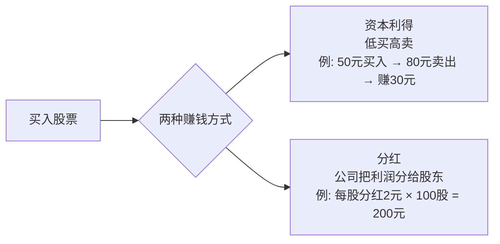

- **资本利得**：你 50 元买入一只股票，80 元卖出，赚了 30 元。这 30 元就是资本利得。
- **分红**：公司赚了钱，决定把一部分利润分给股东。比如茅台每年每股分红大约 20 多元。分红金额不固定，取决于公司盈利情况和董事会决定。

> 注：严格来说，"股息"多指优先股的固定收益，"分红"指普通股的利润分配（金额不确定）。
> 因子投资研究普通股，本讲义统一使用"分红"。

**买了普通股怎么拿分红？** 在券商软件（同花顺、东方财富等）买入股票后，只要你在**股权登记日**收盘时持有，分红会自动打到你的账户，不需要任何操作：

```
公司公告：每股分红 2 元
→ 股权登记日（比如 6月15日）：这天收盘你持有 1000 股 → 你有资格
→ 除权除息日（6月16日）：股价自动下调 2 元（50元 → 48元）
→ 几天后：2000 元现金自动到账
```

> 股价为什么要下调？因为公司把 2 元/股的利润掏出来给你了，公司价值相应减少，
> 股价自动调整以反映这一点。这叫"除息"。

**注意红利税**——和持股时间有关：

| 持股时间 | 红利税率 |
|---------|---------|
| ≤ 1 个月 | 20% |
| 1 个月 - 1 年 | 10% |
| > 1 年 | **免税** |

> **和因子投资的关系：** "股息率"（每股分红 ÷ 股价）是构造**价值因子**的指标之一。
> 高股息率通常意味着股票相对便宜。

当然，股价也可能跌。你 50 元买入，跌到 30 元，你就亏了 20 元。**股票投资有风险。**

#### 1.3 A股市场概览

中国的股票市场叫 **A 股市场**。为什么叫"A 股"？因为中国股市有不同的股票类别，用字母区分：

| 类别 | 上市地点 | 计价货币 | 面向投资者 |
|------|---------|---------|-----------|
| **A 股** | 上海/深圳 | 人民币 | 最初仅限境内投资者 |
| **B 股** | 上海/深圳 | 美元/港币 | 最初仅限境外投资者 |
| **H 股** | 香港 | 港币 | 境内外都可以 |

1990 年上交所成立时只有一种股票。1992 年为吸引外资推出了 B 股（外币计价），才把原来的人民币股票追溯命名为"A 股"。"A"就是字母表第一个，代表"第一类/主要类别"，没有更深含义。现在 B 股已边缘化，说"A 股"基本等同于"中国股票市场"。

A 股主要有两个交易所：

| 交易所 | 全称 | 股票代码特征 |
|--------|------|------------|
| **上交所** | 上海证券交易所 | 以 60 开头（如 600519 贵州茅台） |
| **深交所** | 深圳证券交易所 | 以 00/30 开头（如 000858 五粮液） |

目前 A 股大约有 **5000+ 只**股票。因子投资就是要从这 5000 多只里，用系统化的方法选出好的。

#### 1.4 什么是指数

一只股票的涨跌只代表一家公司。怎么知道"整个市场"今天涨了还是跌了？

**指数 = 一篮子股票价格的加权平均**，用一个数字代表整体涨跌。

A 股最重要的三个指数：

| 指数 | 含义 | 覆盖范围 |
|------|------|---------|
| **上证指数** | 上交所所有股票的加权平均 | 最广，但不够精准 |
| **沪深300** | 沪深两市规模最大的 300 只股票 | 代表大盘蓝筹股 |
| **中证500** | 排除沪深300后，接下来的 500 只 | 代表中盘股 |

> "蓝筹"一词来自西方赌场——筹码按颜色分面值，白色最小、红色居中、**蓝色最大**。
> 所以"蓝筹股"指市值大、经营稳定的行业龙头，如茅台、工商银行。

> 指数在因子投资中的作用：作为**基准（Benchmark）**。你的策略赚了 15%，但沪深300 也涨了 12%，那你真正创造的超额收益只有 3%。

---

### 二、股票价格是怎么定的 — 两大理论

这是《漫步华尔街》第 1 章的核心内容。一只股票到底值多少钱？自从有了股票市场，就有两种截然不同的回答。

#### 2.1 坚实基础理论（Firm Foundation Theory）

**核心观点：每只股票都有一个"内在价值"（Intrinsic Value），可以通过分析基本面来计算。**

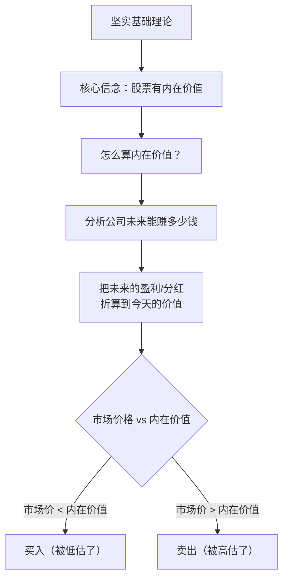

**直觉类比：** 你去菜市场买苹果。苹果的"内在价值"取决于它的品种、新鲜度、口感。如果摊主标价 2 元但你判断值 5 元，那就是便宜货，应该买；如果标价 10 元但你觉得只值 5 元，那就太贵了，别买。

**代表人物：**
- **本杰明·格雷厄姆（Benjamin Graham）** — "价值投资之父"。他发明了一个著名的比喻：

  > 想象市场是一个叫"市场先生（Mr. Market）"的人，每天都来敲你的门，
  > 给你报一个价格，问你要不要买他手里的股票或者把你的卖给他。
  > 市场先生情绪不稳定——有时候兴高采烈报个高价，有时候悲观沮丧报个低价。
  > 你的任务不是跟着他的情绪走，而是在他报低价时买入，报高价时卖出。

- **沃伦·巴菲特（Warren Buffett）** — 格雷厄姆的学生，世界上最著名的价值投资者。

**怎么计算内在价值？** 最经典的方法是**折现现金流模型（DCF）**：

> 一只股票的内在价值 = 它未来所有年份分红的"现值"之和
>
> 打个比方：如果一只股票明年分红 1 元，后年分红 1 元，大后年分红 1 元……
> 但明年的 1 元不等于今天的 1 元（因为今天的 1 元可以存银行赚利息），
> 所以需要"折现"——把未来的钱按一定利率折算成今天的价值。

**"那股票本身的价值不算吗？"** 你可能会想：我买了股票，不光拿分红，还能卖掉赚钱啊。卖出的那笔钱不算吗？

算的，但它最终还是等于未来分红。原因：你 50 元买入，拿了几年分红，80 元卖给了张三。张三为什么出 80 元？因为他预期未来能拿到更多分红，然后再卖给李四。李四又是同样的逻辑……一路追下去，**所有人赚到的钱全部来自公司的利润分配**。所以把链条拉到无穷远，股票的全部价值就等于未来所有分红的现值之和。

**如果一家公司从来不分红呢？**（比如很多科技公司）
- 不分红是因为公司把利润**再投资**了，期望未来赚更多，最终还是要回馈股东的（分红、回购股票、或被收购）
- 实操中可以用**自由现金流**代替分红做折现——不看公司实际分了多少，而是看公司**有能力分多少**

所以 DCF 的本质不是"只算分红"，而是：**一家公司的价值 = 它未来能为股东创造的所有现金的现值。**

你现在不需要会算 DCF，只需要理解这个思路：**价格围绕价值波动，偏离了终会回归。**

---

#### 2.2 空中楼阁理论（Castle-in-the-Air Theory）

**核心观点：不需要关心股票的"真实价值"，重要的是判断别人愿意出多少钱买。**

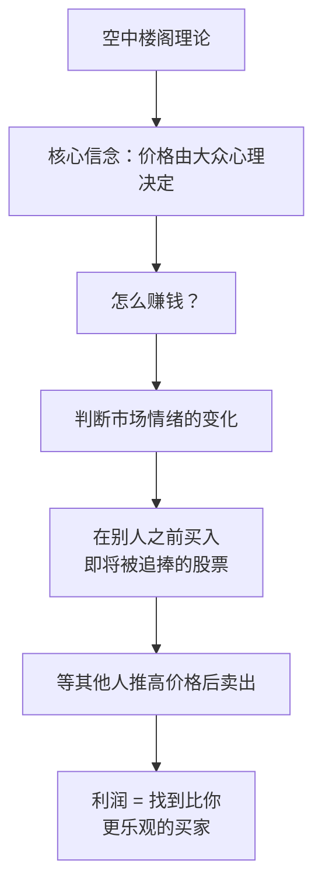

**直觉类比：** 凯恩斯用了一个著名的"**选美比赛**"类比：

> 报纸举办选美比赛，从 100 张照片中选出最美的 6 张。
> 你的奖金取决于你选的人是否和大多数人选的一样。
> 这时候，聪明的做法**不是**选你自己觉得最美的，
> 而是选你认为**大多数人觉得最美的**。
> 更聪明的做法是：选你认为大多数人认为大多数人觉得最美的……

**代表人物：**
- **约翰·梅纳德·凯恩斯（John Maynard Keynes）** — 20 世纪最重要的经济学家之一。

这个理论推到极端就是**"博傻理论"（Greater Fool Theory）**：
> 不管一个东西的价格有多离谱，只要你相信有一个"更大的傻瓜"愿意出更高的价格接盘，你就可以买入。

历史上很多泡沫（荷兰郁金香、2000年互联网泡沫、2017年加密货币）都可以用这个理论解释。

---

#### 2.3 两种理论的对比

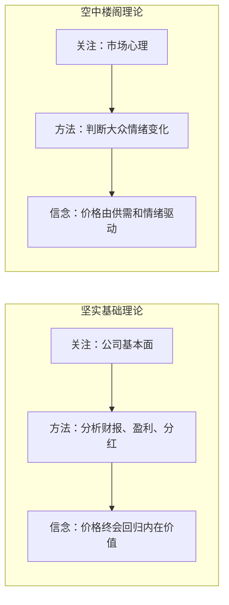

| 维度 | 坚实基础理论 | 空中楼阁理论 |
|------|------------|------------|
| 核心问题 | 这只股票**值**多少钱？ | 别人**愿意出**多少钱？ |
| 分析对象 | 公司基本面（财报、盈利、分红） | 市场情绪（资金流向、人气、趋势） |
| 赚钱逻辑 | 买被低估的，等价格回归 | 比别人早一步判断趋势 |
| 代表人物 | 格雷厄姆、巴菲特 | 凯恩斯 |
| 时间视角 | 长期（价值终会兑现） | 短中期（趋势可以持续一段时间） |
| 风险 | 可能"价值陷阱"——看起来便宜，其实公司在变差 | 可能接最后一棒——泡沫破裂时你是那个"更大的傻瓜" |

---

#### 2.4 《漫步华尔街》作者 Malkiel 的立场：随机漫步

Malkiel 认为这两种理论都有道理，但都不完美。他自己的核心观点是：

> **股价的短期变动基本上是随机的（Random Walk），不可预测。**

这就是书名"漫步华尔街"的含义——股价像一个醉汉在街上漫步，你无法预测他下一步往哪走。

他的建议：**对大多数普通投资者来说，买指数基金（被动投资）是最好的选择。**

Malkiel 的这个结论建立在一个重要的理论基础上——**有效市场假说**。

#### 2.4.1 "市场有效"到底什么意思

你会经常看到"市场是有效的"这句话。这里的"有效"不是日常说的"有用""有效果"，而是一个专门的金融术语：

**市场有效 = 价格已经反映了所有可用信息，你找不到被错误定价的股票。**

> 打个比方：你在路上看到地上有一张 100 块钱。在"有效市场"里，这张钱不可能存在——因为如果真有，早就被别人捡走了。同理，如果一只股票真的被严重低估，大量聪明投资者会抢着买入，把价格迅速推回合理水平。

有效市场假说（EMH，Efficient Market Hypothesis）分三个层次：

| 层次 | 价格反映了什么信息 | 含义 | 什么方法会失效 |
|------|----------------|------|-------------|
| 弱式有效 | 所有**历史价格**信息 | 看 K 线、找规律没用 | 技术分析 |
| 半强式有效 | 所有**公开**信息（财报、新闻等） | 研究财报也没用，别人也看到了 | 技术分析 + 基本面分析 |
| 强式有效 | **所有**信息（包括内幕） | 连内幕消息都没用 | 一切方法 |

**为什么弱式有效市场中技术分析没用？**

技术分析的全部输入就是历史价格和成交量（K 线、均线、MACD 等）。弱式有效不是说"没人用技术分析"，而是说**用了也赚不到钱**——因为所有人争相利用的行为本身会把机会消灭：

1. 最初，某个技术形态（比如"双底"）确实能预测上涨，少数人发现了，靠它赚了钱
2. 越来越多人学会了，大家都盯着双底形态
3. 有人想提前行动：双底还没完全形成，价格刚开始第二次下跌就买入
4. 所有人不断抢先 → 价格在双底还没形成时就被买上去了 → 双底形态消失了

最终结果：任何可被系统性利用的历史价格规律，都会因为套利竞争而自我消解。你看到规律的那一刻，价格已经反映了这个信息，没有利润空间了。

**为什么半强式有效市场中基本面分析也没用？**

半强式有效包含弱式有效（技术分析已失效），并进一步覆盖所有公开信息——财报、新闻、研报、行业数据等。逻辑和上面一样：

1. 一家公司发布了超预期的财报，净利润增长 50%
2. 在半强式有效市场中，这个好消息在公告后**几秒内**就被大量投资者（基金经理、算法交易）消化
3. 股价瞬间跳涨到合理水平——等你看到新闻再去买，已经买在了涨完之后的价格
4. 结论：研究公开财务数据无法获得超额收益，因为你看到的信息别人也看到了，价格已经调整完毕

> 但注意：半强式有效并不否认**内幕信息**的价值。如果你提前知道财报数据（未公开），理论上可以赚钱——只是这违法。

**为什么强式有效市场中一切方法都没用？**

强式有效是最极端的假设：价格反映了**所有信息**，包括内幕信息。这意味着即使你是公司 CEO，掌握未公开的核心机密，也无法靠这些信息赚钱——因为价格已经神奇地反映了这些信息。

> 几乎没有学者认为市场是强式有效的。大量证据表明内幕交易确实能获利（虽然违法），说明内幕信息**没有**被充分反映在价格中。

学术界的主流观点：市场大致处于**半强式有效**——公开信息很快被消化到价格中，但不是完美有效。

> **这和两种定价理论的关系：**
> - 坚实基础理论（格雷厄姆、巴菲特）认为市场**不总是有效的**——价格会偏离内在价值，耐心等待就能找到便宜货
> - 空中楼阁理论（凯恩斯）认为市场**不是由理性定价的**——情绪驱动价格，可以利用情绪赚钱
> - Malkiel 的立场更接近"市场大部分时候是有效的"——所以他建议买指数基金

---

#### 2.5 和因子投资的关系（最重要的一段） ⭐

**那因子投资站哪边？** 因子投资的信念是：**市场不是完美有效的，但错误定价也不是随便就能抓住的。** 市场存在系统性的偏差（行为偏差、制度约束），这些偏差是因子溢价的来源。

| 市场有效程度 | 错误定价 | 因子投资的处境 |
|------------|---------|--------------|
| 完全有效 | 不存在 | 因子不可能存在，任何方法都无法获得超额收益 |
| 完全无效 | 到处都是，又大又明显 | 简单的分析就够用，不需要因子模型这么精细的工具 |
| **现实（中间状态）** | **存在但不大，且有系统性规律** | **因子投资的用武之地——用系统化方法捕捉不容易被套利掉的小偏差** |

理解这两种理论之后，因子投资的思路就很清晰了：

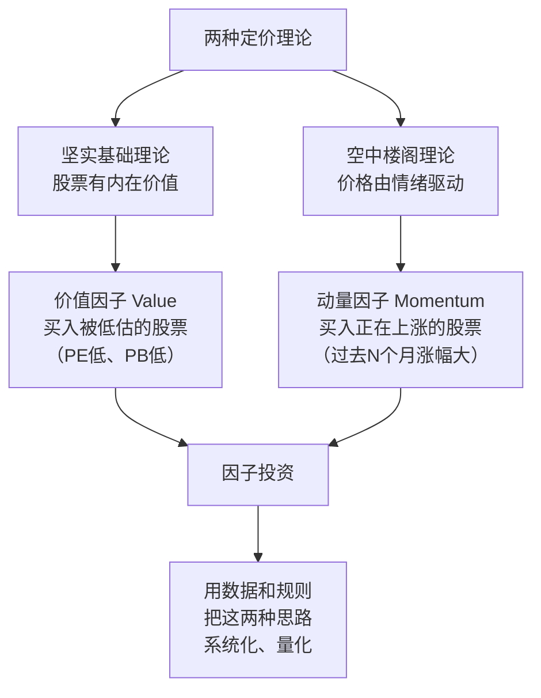

| 定价理论 | 对应因子 | 做法 |
|---------|---------|------|
| 坚实基础理论 | **价值因子（Value）** | 用 PE、PB 等指标找被低估的股票（见下方） |
| 空中楼阁理论 | **动量因子（Momentum）** | 买入过去 N 个月涨幅最大的股票 |

> **PE 和 PB 是什么？** Day 3-4 会详细讲，这里先有个直觉：
> - **PE（市盈率）= 股价 ÷ 每股盈利**。PE = 10 意味着按当前盈利，10 年能赚回你的投入。PE 低 → 可能便宜。
> - **PB（市净率）= 股价 ÷ 每股净资产**。PB = 0.8 意味着你用 8 折就能"买下"这家公司的账面资产。PB 低 → 可能便宜。
> - 一句话：**PE 看"赚钱能力贵不贵"，PB 看"家底贵不贵"。**

因子投资不是选边站，而是**把两种思路都量化了**：
- 价值因子说：便宜的股票未来倾向于跑赢贵的股票
- 动量因子说：最近涨得好的股票短期内倾向于继续涨

这两个因子在学术上都有大量证据支持，我们在因子投资阶段会深入研究。

#### 2.6 两种理论在加密货币市场的适用性

你可能会想：加密货币没有财报、没有盈利、没有分红，坚实基础理论还能用吗？

**加密市场里空中楼阁的成分确实更大**——价格受叙事和情绪驱动极重（一条 Elon Musk 推文就能让币价涨跌 20%），Meme 币（如 DOGE、PEPE）几乎纯粹是博傻。

**但坚实基础理论并非完全不适用，只是"基本面"长得完全不同：**

| 股票的基本面指标 | 加密货币的"基本面"指标 | 衡量什么 |
|----------------|---------------------|---------|
| PE（市盈率） | **NVT**（网络价值 / 链上交易量） | 市值相对于实际使用量是否偏高 |
| PB（市净率） | **MVRV**（市值 / 已实现价值） | 当前价格相对于持有者平均成本是否偏高 |
| 营收 / 利润 | **协议收入**（如 ETH 的 Gas 费） | 协议是否真的被使用并产生收入 |
| 用户数 | **活跃地址数** | 有多少人真的在用这个网络 |
| — | **TVL**（总锁仓价值） | DeFi 协议里锁了多少真金白银 |

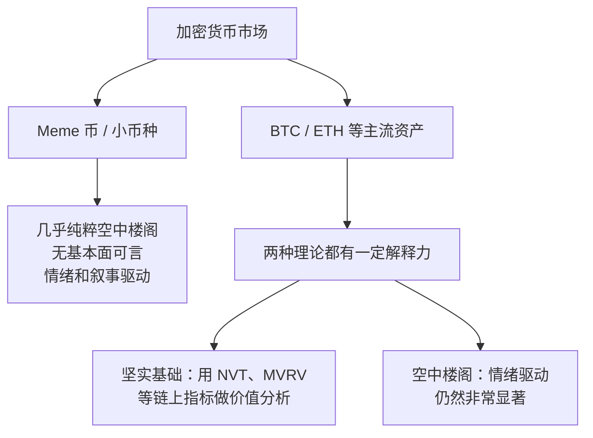

**关键结论：** 底层逻辑一样（找被低估的资产），但原料完全不同——股票用 PE/PB，加密用 NVT/MVRV。这就是为什么学习计划中，加密货币的价值因子用链上指标而非财务指标。

> 你现在不需要记住 NVT、MVRV 这些名词，因子投资阶段学价值因子时会详细讲解。

---

### 第一节完成检查

读到这里，你应该能回答：

- [x] 股票是什么？→ 公司所有权的一份
- [x] 买股票的两种赚钱方式？→ 资本利得 + 分红
- [x] A 股大约有多少只股票？→ 5000+
- [x] 沪深300 是什么？→ 沪深两市最大 300 只股票组成的指数
- [x] 坚实基础理论的核心？→ 股票有内在价值，通过基本面分析判断
- [x] 空中楼阁理论的核心？→ 价格由大众心理驱动，关键是判断别人怎么想
- [x] 格雷厄姆的"市场先生"比喻？→ 市场先生情绪不稳定，在他悲观报低价时买入
- [x] 凯恩斯的"选美比赛"类比？→ 选大多数人觉得美的，而不是你自己觉得美的
- [x] "市场有效"是什么意思？→ 价格已反映所有可用信息，找不到被错误定价的股票
- [x] 两种理论对应的因子？→ 坚实基础→价值因子，空中楼阁→动量因子

**休息 10 分钟。**

---

## 第二节：金融市场全景 + 资产类别（50 分钟）

### 三、金融市场的基本框架

#### 3.1 实物资产 vs 金融资产

世界上的资产分为两大类：

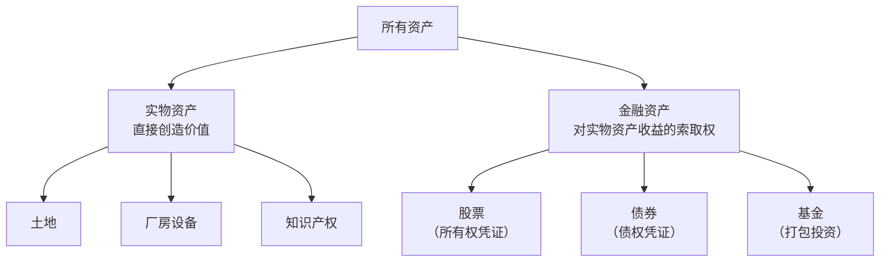

- **实物资产**：能直接产生价值的东西——土地、工厂、设备、技术专利
- **金融资产**：对实物资产产生的收益的"索取权"——股票、债券

**关键理解：** 金融资产本身不创造财富。一家工厂的价值来自它生产的产品，不是来自代表它所有权的股票。股票只是决定"谁有权分到这些财富"。

这就是为什么巴菲特（坚实基础理论）关心的是公司本身的经营能力，而不是股票价格的短期波动。

#### 3.2 金融市场的三大功能

金融市场为什么存在？它解决三个问题：

| 功能 | 说明 | 例子 |
|------|------|------|
| **融资** | 企业获得发展所需的资金 | 公司通过 IPO 发行股票筹集 100 亿元建新工厂 |
| **配置** | 把资金引导到最有效率的地方 | 好公司股价涨→更容易融资；差公司股价跌→融资困难 |
| **风险分担** | 投资者可以分散风险 | 你不需要把全部身家投入一家公司，可以买 100 只股票分散 |

#### 3.3 投资决策的两步

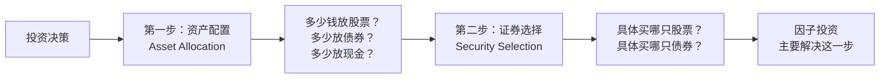

学术研究表明：投资收益的差异，大约 **90% 来自资产配置**（第一步），只有约 **10% 来自选股**（第二步）。

> **为什么资产配置的影响这么大？** 因为不同资产类别之间的收益差距，远大于同一类别内选股的差距。举个例子，假设过去一年股票整体涨了 20%，债券整体涨了 3%：
>
> | | 投资者 A | 投资者 B |
> |--|---------|---------|
> | 资产配置 | 80% 股票 + 20% 债券 | 20% 股票 + 80% 债券 |
> | 选股能力 | 一般（跟着大盘走，20%） | 很强（选的股票涨了 25%） |
> | 实际收益 | 80%×20% + 20%×3% = **16.6%** | 20%×25% + 80%×3% = **7.4%** |
>
> 投资者 B 选股更厉害（25% > 20%），但总收益被 A 甩开一大截。原因很简单：股票和债券之间的收益差距（20% vs 3%）远大于好选股和一般选股的差距（25% vs 20%）。**你把钱放在哪个桶里，比你在桶里怎么挑重要得多。**
>
> 这个结论来自 Brinson 等人 1986 年的经典研究，他们分析了大量养老基金后发现：不同基金之间收益差异的约 90% 可以用资产配置来解释。

但这不意味着选股不重要——因子投资就是在第二步上做文章，试图获得**超额收益（Alpha）**。

> **什么是 Alpha？** Alpha = 你的策略收益 - 基准收益。基准通常是一个市场指数（比如沪深 300）。
> 假设今年沪深 300 涨了 10%，你的策略涨了 15%，那么你的 Alpha = 15% - 10% = 5%。
> 这 5% 是你通过选股"多赚"出来的部分，和市场整体涨跌无关。
>
> - Alpha > 0：你跑赢了市场，选股创造了价值
> - Alpha = 0：你和市场一样，不如直接买指数基金（更省事、成本更低）
> - Alpha < 0：你跑输了市场，还不如不选股
>
> **因子投资的目标就是获得正的 Alpha**——通过系统化的选股规则，持续跑赢市场基准。
> Alpha 的精确定义会在 Day 8（CAPM）中给出，今天理解"策略收益减去基准收益"就够了。

---

### 四、资产类别详解

金融市场上的产品种类繁多，但可以分成几大类：

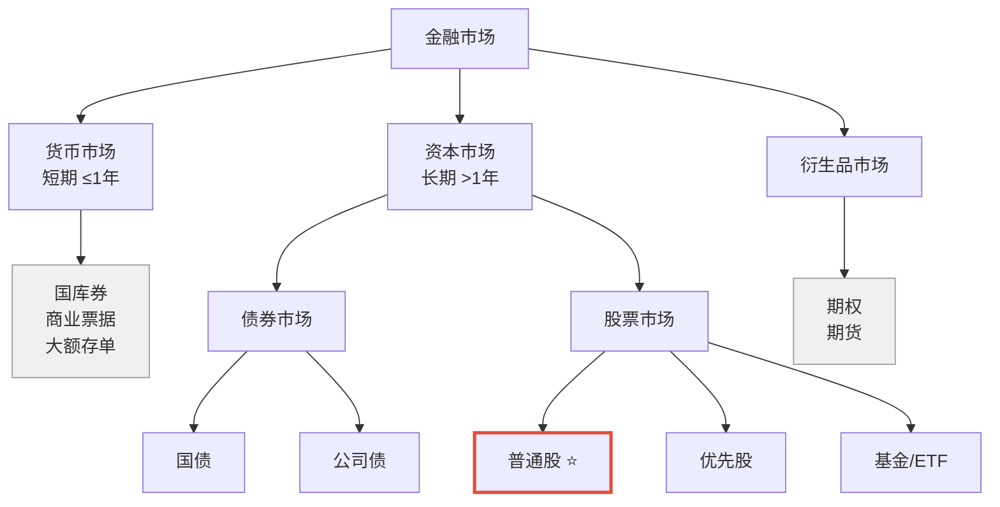

> 红色边框的"普通股"是因子投资的主战场。灰色的货币市场和衍生品，本计划不涉及。

下面逐一介绍。

---

#### 4.1 货币市场（了解即可）

**货币市场 = 短期（一年以内）、低风险的借贷市场。**

常见工具：
- **国库券（T-Bill）**：政府发的短期债务，几乎零风险
- **商业票据**：大企业发的短期借条
- **大额存单（CD）**：银行发的存款凭证

> **和因子投资的关系：** 几乎没有。但有一个概念会反复出现——**无风险利率**，通常用国库券利率代表。
> 后面学 CAPM 的时候会用到。现在知道"有一种几乎零风险的投资，收益很低"就够了。

---

#### 4.2 债券

**债券 = 你借钱给别人（政府或公司），对方承诺按时还本付息。**

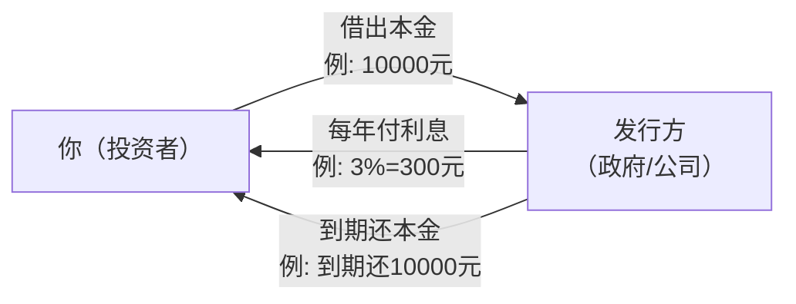

**债券 vs 股票——最本质的区别：**

| 维度 | 债券 | 股票 |
|------|------|------|
| 你的身份 | **债主**（债权人） | **股东**（所有者） |
| 收益 | 固定利息（确定） | 分红 + 资本利得（不确定） |
| 风险 | 较低（除非对方违约） | 较高（股价可能大幅波动） |
| 公司破产时 | 优先偿还债主 | 债主还完才轮到股东 |
| 上限 | 收益有上限（利率固定） | 理论上无上限 |

**国债 vs 公司债：**

| 类型 | 发行方 | 风险 | 收益率 |
|------|--------|------|--------|
| **国债** | 政府 | 极低（政府可以印钱还债） | 低（约 2-3%） |
| **公司债** | 企业 | 有违约风险 | 高于国债 |

两者的利差叫**信用利差**——公司债收益率比国债高的那部分，就是市场对违约风险的补偿。

> **和因子投资的关系：** 本计划聚焦股票因子投资，不涉及债券。但理解债券有助于理解"风险溢价"的概念——
> 承担更多风险，应该获得更高的回报。这个逻辑同样适用于股票因子。

---

#### 4.3 股票（重点）

##### 4.3.1 普通股 vs 优先股

| 类型 | 投票权 | 分红 | 价格波动 | 说明 |
|------|:------:|------|---------|------|
| **普通股** | 有 | 不确定，取决于公司决定 | 大 | **因子投资的研究对象** |
| **优先股** | 无 | 固定，优先于普通股发放 | 小 | 介于股票和债券之间，本计划不涉及 |

> **你在券商软件买到的都是普通股。** A 股市场上优先股极少，且只面向机构投资者，
> 在单独的板块交易。散户在券商软件里看到的、能买卖的全部是普通股，不需要担心买错。

##### 4.3.2 市值（Market Capitalization）⭐

市值是衡量一家公司"值多少钱"的指标，但它有两种算法：

| | 总市值 | 流通市值 |
|---|------|---------|
| **公式** | 股价 × **总股数** | 股价 × **流通股数** |
| **含义** | 整家公司值多少钱 | 市场上实际能交易的部分值多少钱 |
| **用途** | 衡量公司整体规模 | 编制指数、因子投资中更常用 |

**为什么会有两个版本？** 因为不是所有股票都能自由买卖。A 股中大股东、国有股东持有的股份通常有锁定期或减持限制，这些股份虽然存在，但不在市场上流通。

**例子——贵州茅台：**
- 总股本约 12.6 亿股，其中贵州省国资委（通过茅台集团）持有约 54%，这部分基本不会卖
- 流通股约 5.8 亿股（剩余 46% 可以在市场上自由交易）
- 股价约 1500 元时：
  - **总市值** ≈ 1500 × 12.6 亿 ≈ **1.9 万亿元**
  - **流通市值** ≈ 1500 × 5.8 亿 ≈ **8700 亿元**

**某小公司：**
- 股价 10 元 × 总股本 1 亿股 = **总市值 10 亿元**

> **哪个更常用？** 日常说"茅台市值 1.9 万亿"通常指总市值。但在指数编制（如沪深 300）和因子投资中，
> 更多使用**流通市值**——因为只有流通的部分才能真正买卖，才反映市场的真实供需。

市值把公司分成不同"体量"：

| 分类 | A 股市值参考 | 举例 |
|------|-----------|------|
| **大盘股** | > 1000 亿元 | 茅台、工商银行、宁德时代 |
| **中盘股** | 100-1000 亿元 | 大部分行业龙头 |
| **小盘股** | < 100 亿元 | 数量最多，占 A 股大多数 |

> **因子投资中的"市值因子"（Size Factor）**：学术研究发现，长期来看小盘股的平均收益高于大盘股
> （但风险也更大）。这是最经典的因子之一，我们在因子投资计划中会详细研究。

##### 4.3.3 股票指数

指数是一篮子股票的加权平均价格，代表市场整体表现。

**编制方法有三种：**

| 加权方式 | 原理 | 代表指数 | 特点 |
|---------|------|---------|------|
| **市值加权** | 市值大的公司权重大 | 沪深300、标普500 | 最常用，反映大公司表现 |
| **价格加权** | 股价高的公司权重大 | 道琼斯工业指数 | 不太合理但历史悠久 |
| **等权重** | 每只股票权重相同 | 中证500等权 | 更关注中小公司 |

**市值加权的例子：** 假设一个指数只有两只股票：

| 股票 | 市值 | 权重 | 今日涨跌 | 对指数的影响 |
|------|------|------|---------|------------|
| A 公司 | 900 亿 | 90% | +1% | +0.9% |
| B 公司 | 100 亿 | 10% | +5% | +0.5% |
| **指数** | | **100%** | | **+1.4%** |

可以看到：A 公司只涨了 1% 但对指数影响更大（因为市值大、权重高）。这就是市值加权指数的特点——**被大公司主导**。

**A 股主要指数：**

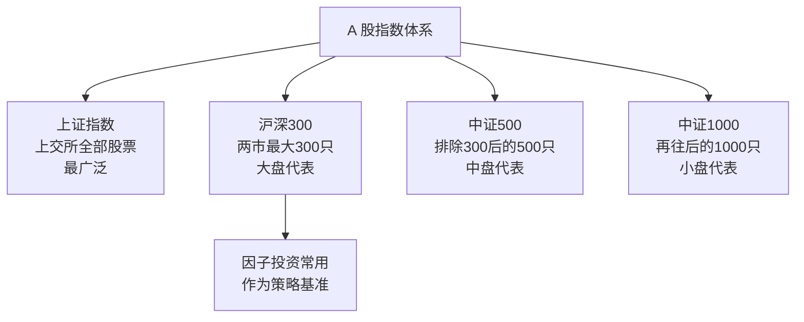

---

#### 4.4 基金

**基金 = 把很多人的钱凑在一起，交给专业机构去投资。**

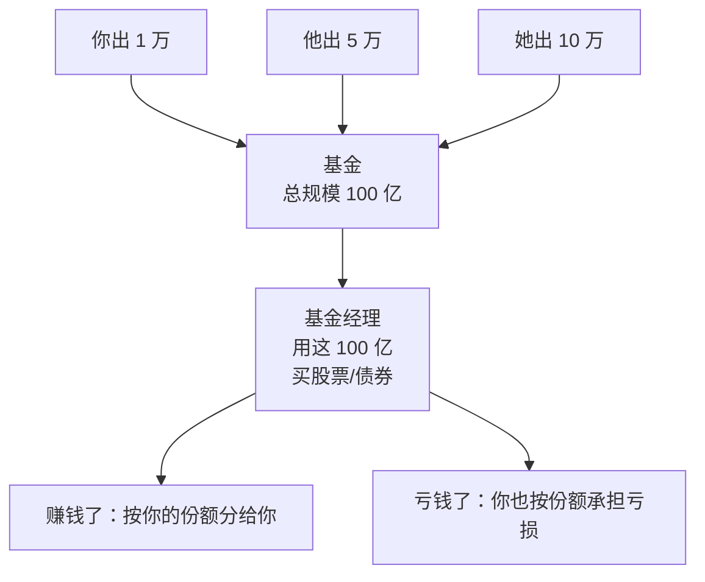

**好处：**
- 分散投资（基金买几十上百只股票，你一个人买不了那么多）
- 有专人管理（不需要你自己研究每只股票）

**坏处：**
- 管理费（每年约 0.5%-1.5%）
- 你无法控制具体买哪只股票

##### 4.4.1 基金分类

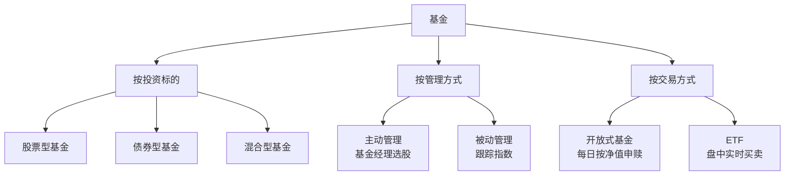

##### 4.4.2 开放式基金 vs ETF

| 维度 | 开放式基金 | ETF |
|------|----------|-----|
| 交易方式 | 每天收盘后按**净值**申购/赎回 | 像股票一样在**盘中**买卖 |
| 价格 | 每天只有一个价格（当日净值） | 每秒都有价格（实时交易） |
| 费用 | 通常较高（申购费、赎回费、管理费） | 通常较低（免申购费，管理费低） |
| 例子 | 某某主题混合基金 | 沪深300 ETF、中证500 ETF |

**开放式基金的"未知价"原则：**

在支付宝/天天基金等平台买开放式基金时，成交价格取决于你下单的时间：

| 下单时间 | 成交净值 |
|---------|---------|
| 当天 **15:00 前** | 当天收盘后算出的净值 |
| 当天 **15:00 后** | 下一个交易日收盘后算出的净值 |

**例子：** 周一 14:50 你买了 1 万元某基金，周一收盘后基金净值算出来是 1.5000 元，你买到的份额 = 10000 ÷ 1.5000 ≈ 6666.67 份。如果你 15:05 才下单，就要等周二收盘后的净值——可能涨可能跌，你无法提前知道。

> **为什么叫"未知价"？** 你下单时并不知道最终成交价格，因为净值要等收盘后基金公司才能算出来。
> 这样设计是为了防止投资者利用已知信息"抢跑"——如果能按已知净值买入，
> 看到利好消息后立刻锁定价格，对其他持有人不公平。
>
> 这正是 ETF 的核心优势：ETF 在盘中实时交易，价格随时变动，你看到什么价就能以什么价成交。

##### 4.4.3 被动投资 vs 主动投资

| | 被动投资 | 主动投资 |
|--|---------|---------|
| **做法** | 买指数基金，复制市场表现 | 选股/择时，试图战胜市场 |
| **信念** | 市场是有效的（见 2.4.1 节），不可能持续战胜市场 | 市场有错误定价，可以利用 |
| **费用** | 低（不需要研究员） | 高（需要研究团队） |
| **代表** | Malkiel（漫步华尔街作者）、Bogle（指数基金发明人） | 巴菲特、各种对冲基金 |

> **因子投资的定位：** 因子投资是一种**"系统化的主动投资"**——
> 它不像传统主动投资那样依赖基金经理的主观判断，
> 而是用明确的规则和数据来选股。它介于被动和主动之间。

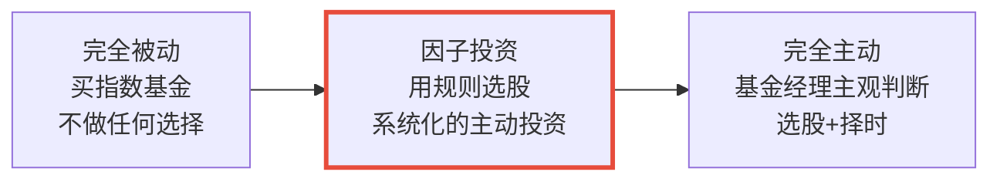

---

#### 4.5 衍生品（知道名字就行）

**衍生品 = 价值"衍生"自其他资产的金融工具。**

| 衍生品 | 一句话解释 |
|--------|----------|
| **期权（Option）** | 花一笔小钱，买一个"权利"——在未来以某个价格买入/卖出某只股票 |
| **期货（Futures）** | 提前约定在未来某个时间、以某个价格买卖某种东西 |

> **本计划不涉及衍生品。** 知道有这个分类就够了。

---

### 五、全景总结

#### 5.1 一张图看全

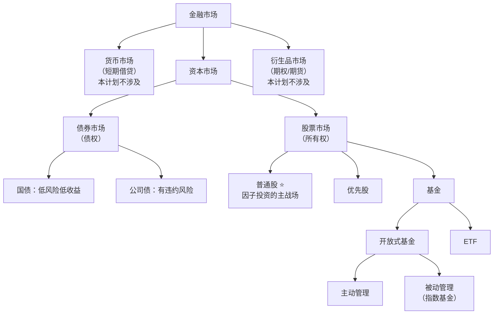

#### 5.2 核心概念关系图

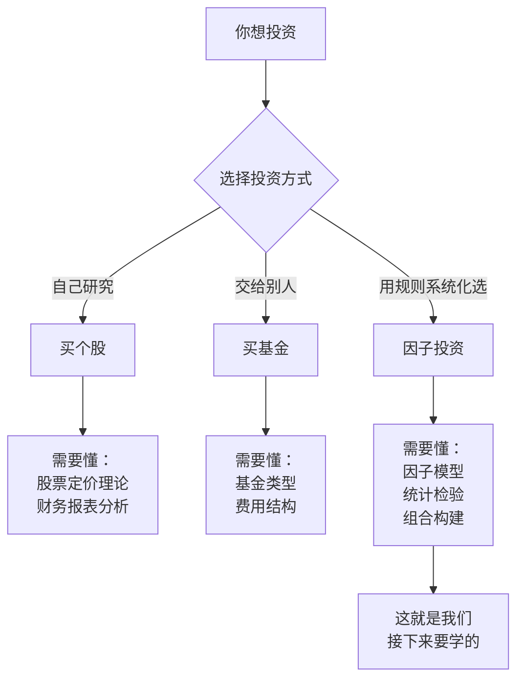

#### 5.3 今天学的概念，后面怎么用

| 今天的概念 | 后面怎么用 | 什么时候用 |
|-----------|----------|----------|
| 市值 = 股价 × 总股数 | 构造**市值因子**（Size） | 因子投资阶段 |
| 坚实基础理论 → 内在价值 | 构造**价值因子**（Value）用 PE/PB | 因子投资阶段 |
| 空中楼阁理论 → 市场情绪 | 构造**动量因子**（Momentum） | 因子投资阶段 |
| 指数（沪深300）| 作为策略**基准** | 因子投资阶段 |
| 被动 vs 主动投资 | 理解 **Alpha**（超额收益）的含义 | 因子投资阶段 |
| 无风险利率（国库券） | 计算**夏普比率**、**风险溢价** | Day 5 |
| 分散投资 | **投资组合理论** | Day 6-7 |

---

### 第二节完成检查

- [x] 知道实物资产 vs 金融资产的区别
- [x] 知道金融市场的三大功能（融资、配置、风险分担）
- [x] 知道投资决策两步：资产配置 → 证券选择
- [x] 能说出债券 vs 股票的本质区别（债权 vs 所有权）
- [x] 知道市值 = 股价 × 总股数，以及大/中/小盘股的区分
- [x] 知道指数的三种编制方式（市值加权、价格加权、等权）
- [x] 知道 ETF 和开放式基金的区别
- [x] 知道被动投资 vs 主动投资，因子投资是系统化的主动投资

---

## 收尾：自测（10 分钟）

拿一张白纸，**不看任何资料**，回答以下问题。先自己写，再对答案：

```
自测 1：股票是什么？买股票的两种赚钱方式？
→ 你的答案：_______________
→ 正确：股票 = 公司所有权的一份。赚钱方式：资本利得（低买高卖）+ 分红。

自测 2："坚实基础理论"的核心观点？代表人物？
→ 你的答案：_______________
→ 正确：股票有内在价值，通过基本面分析判断。格雷厄姆、巴菲特。

自测 3："空中楼阁理论"的核心观点？代表人物？
→ 你的答案：_______________
→ 正确：价格由大众心理驱动，关键是判断别人怎么想。凯恩斯。

自测 4：格雷厄姆的"市场先生"比喻讲的是什么？
→ 你的答案：_______________
→ 正确：市场先生情绪不稳定，每天给你报不同的价格。
  在他悲观时（报低价）买入，乐观时（报高价）卖出。

自测 5：凯恩斯的"选美比赛"类比讲的是什么？
→ 你的答案：_______________
→ 正确：不要选你觉得最美的，要选大多数人觉得最美的。
  投资同理：重要的不是你觉得值多少，而是别人愿意出多少。

自测 6：这两种理论分别对应因子投资中的什么因子？
→ 你的答案：_______________
→ 正确：坚实基础 → 价值因子（买低估的），空中楼阁 → 动量因子（跟趋势）。

自测 7：债券和股票的本质区别？公司破产时谁先获得偿还？
→ 你的答案：_______________
→ 正确：债券 = 债权（借钱），股票 = 所有权。破产时先还债主，再轮到股东。

自测 8：什么是市值？茅台市值大约多少？
→ 你的答案：_______________
→ 正确：市值 = 股价 × 总股数。茅台约 1.9 万亿元。

自测 9：ETF 和普通开放式基金的核心区别？
→ 你的答案：_______________
→ 正确：ETF 可以像股票一样盘中实时买卖，开放式基金只能每天按净值申赎。

自测 10：因子投资属于被动投资还是主动投资？
→ 你的答案：_______________
→ 正确：系统化的主动投资——用规则和数据选股，而非主观判断。

自测 11：为什么中国股市叫"A 股"？
→ 你的答案：_______________
→ 正确：1992年推出面向外资的 B 股后，把原来的人民币股票追溯命名为 A 股。
  A 就是"第一类"的意思。

自测 12：你在券商软件买到的是普通股还是优先股？
→ 你的答案：_______________
→ 正确：普通股。优先股只面向机构投资者，在单独板块交易，散户接触不到。

自测 13：买了普通股，分红怎么拿到？需要自己操作吗？
→ 你的答案：_______________
→ 正确：不需要操作。只要在股权登记日收盘时持有，分红自动打到券商账户。

自测 14："市场是有效的"中的"有效"是什么意思？如果市场完全有效，因子投资还能存在吗？
→ 你的答案：_______________
→ 正确：有效 = 价格已反映所有可用信息。如果市场完全有效，因子不可能存在——
  所有定价偏差会被瞬间修正。因子投资的前提是市场"不完美有效"。

自测 15：DCF 模型只算分红，那卖股票赚的钱算不算在内？
→ 你的答案：_______________
→ 正确：算。你卖给下一个人的价格，本质上是下一个人对"未来剩余分红"的估价。
  链条拉到无穷远，全部价值 = 未来所有现金流的现值。
```

**14-15 道对：** 完美！
**11-13 道对：** 回看错的部分，搞懂就行。
**10 道以下：** 建议花 20 分钟回顾讲义中对应部分。

---

## 今天不需要记住的内容

| 概念 | 今天理解到什么程度 | 什么时候深入 |
|------|------------------|------------|
| 有效市场假说的三个层次 | 知道"弱式/半强式/强式"的区分，记住"半强式"是主流观点 | Day 8（CAPM 中会再提） |
| DCF 折现现金流 | 知道"把未来的钱折算到今天"这个思路 | 本计划不涉及深入计算 |
| 货币市场工具 | 知道有这个分类 | 不涉及 |
| 无风险利率 | 知道是国库券利率、风险最低的收益 | Day 5（夏普比率） |
| 信用利差 | 知道概念 | 不涉及 |
| 优先股 | 知道和普通股不同 | 不涉及 |
| 衍生品 | 知道名字 | 不涉及 |
| 指数编制方法 | 知道有市值加权和等权 | Day 5（收益与风险） |

---

## 今日知识点与因子投资的关联

| 今日知识点 | 关联的因子/概念 | 怎么关联 | 深入时间 |
|-----------|---------------|---------|---------|
| 坚实基础理论（内在价值） | **价值因子（Value）** | 用 PE、PB 等指标找被低估的股票 | 因子投资阶段 |
| 空中楼阁理论（市场情绪） | **动量因子（Momentum）** | 买入过去 N 个月涨幅最大的股票 | 因子投资阶段 |
| 市值 = 股价 × 总股数 | **市值因子（Size）** | 小盘股长期平均收益高于大盘股 | 因子投资阶段 |
| 股息率 = 每股分红 / 股价 | **红利因子（Dividend）** | 高股息率的股票组长期跑赢低股息率的 | 因子投资阶段 |
| 指数（沪深300等） | **基准（Benchmark）** | 策略收益减去基准收益 = 超额收益（Alpha） | Day 5 起 |
| 无风险利率（国库券） | **夏普比率、风险溢价** | 衡量策略每承担一单位风险赚多少 | Day 5 |
| 被动 vs 主动投资 | **因子投资的定位** | 因子投资 = 系统化的主动投资，用规则而非主观判断选股 | 因子投资阶段 |
| 市场有效性 | **因子存在的前提** | 市场不完美有效，系统性偏差是因子溢价的来源 | Day 8（CAPM） |

> 今天学的每个概念都不是孤立的——它们构成了因子投资的"原材料"。后续课程会逐步把这些原材料组装成完整的因子策略。

---

## 明天预告

**Day 2** 会学习：
- A 股交易规则：T+1、涨跌停板、印花税、佣金
- 加密市场规则：T+0、24/7 交易、CEX vs DEX、maker/taker 费用
- 两个市场的关键差异对比

> 建议今晚睡前花 5 分钟回忆今天学了什么，不翻笔记，能想起多少算多少。
