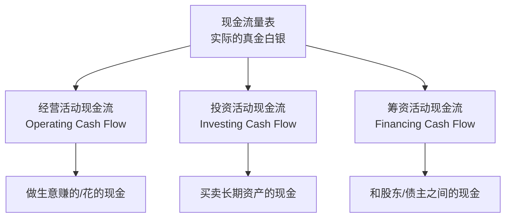
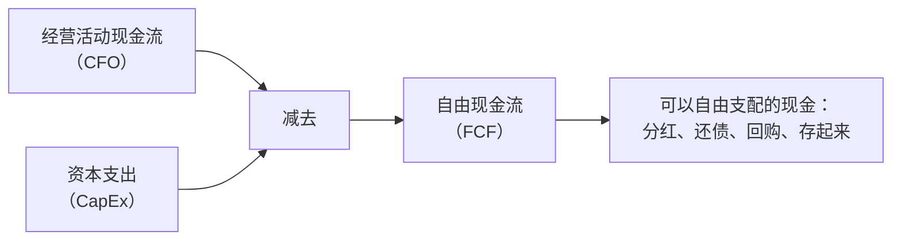
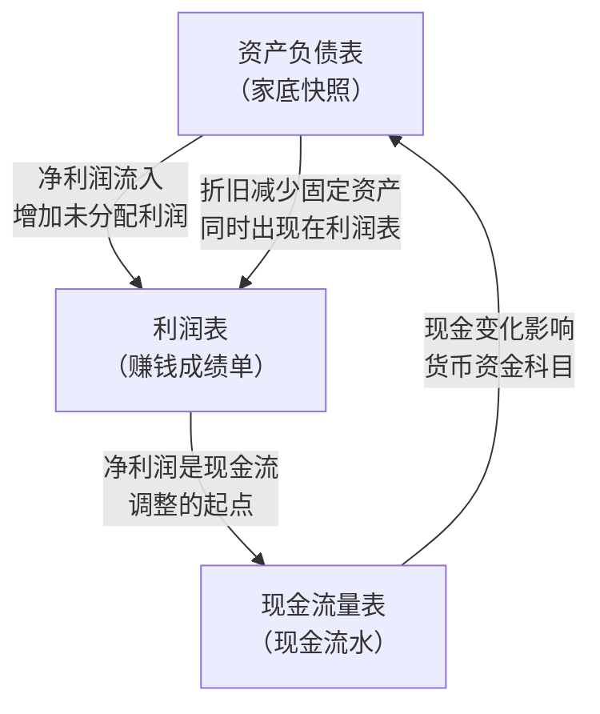
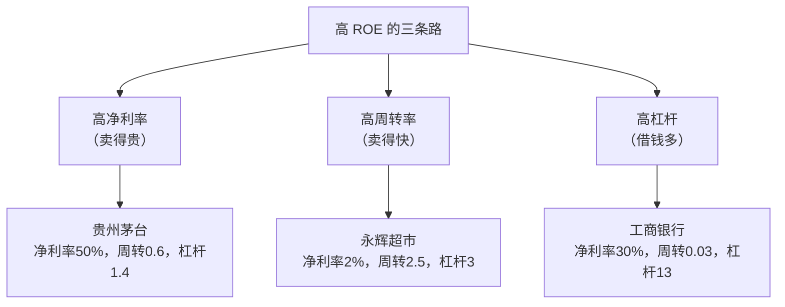
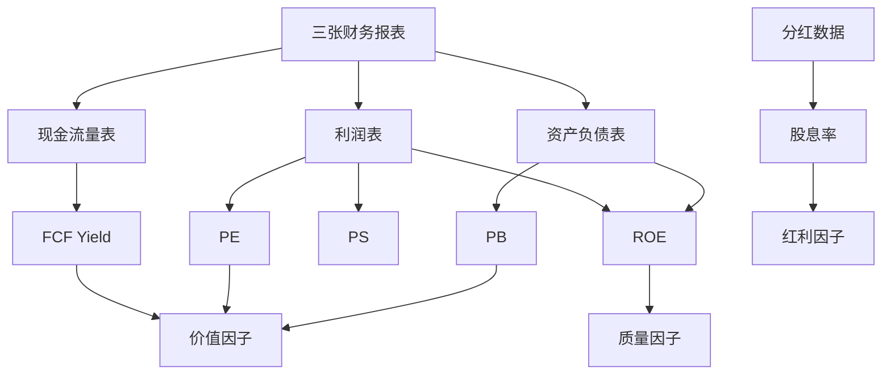

# Day 4：现金流量表与财务指标

> **总时长：** 2 小时
>
> **节奏：** 每 50 分钟休息 10 分钟
>
> **今日目标：** 理解"真金白银"和"账面利润"的区别，掌握用三张表联合判断一家公司的方法，完整理解因子投资中所有核心财务指标
>
> **本文是完整讲义，包含所有知识点，不需要翻阅其他资料**

---

## 时间表

```
00:00 - 00:50  [第1节] 现金流量表
00:50 - 01:00  休息
01:00 - 01:50  [第2节] 三表综合分析 + 完整财务指标
01:50 - 02:00  [收尾] 自测
```

---

## 第一节：现金流量表（50 分钟）

### 一、为什么需要现金流量表

#### 1.1 Day 3 的遗留问题

Day 3 讲到一个关键结论：**利润高不等于现金多。** 当时举了三个例子：

| 情况 | 利润表 | 实际现金 |
|------|--------|---------|
| 卖了 100 万货，客户还没付钱 | 记了 100 万收入 | 0 元到账 |
| 买了一台 500 万的设备 | 今年只扣 50 万折旧 | 花了 500 万现金 |
| 预收了客户 200 万定金 | 不算收入（货还没交） | 收到了 200 万现金 |

利润表和现金之间的差距，就是现金流量表存在的理由。

#### 1.2 两种记账方式

利润表和现金流量表的差异，归根到底是两种不同的记账规则：

**权责发生制（Accrual Basis）：只要交易发生了，就记账，不管钱到没到手。**

利润表用这个规则。你卖了 100 万货，合同签了、货发了，利润表就记 100 万收入——哪怕客户 3 个月后才付钱。

**收付实现制（Cash Basis）：钱实际进出银行账户时才记账。**

现金流量表用这个规则。客户 3 个月后付钱，到那时才记 100 万现金流入。

**直觉类比：** 你是一个自由职业者。1 月份接了一个 5 万块的项目，约定 3 月交付后付款。

- **权责发生制**（利润表思维）：1 月份你就可以说"我这个月赚了 5 万"——因为合同已经签了，你在"干活赚钱"
- **收付实现制**（现金流思维）：你银行卡余额在 3 月之前一分没多。5 万块要到 3 月才算"赚到"

> 两种说法都对，只是角度不同。但如果你 2 月份房租到期、银行卡空空如也——利润表上再好看也没用，你得用现金交房租。
>
> **公司也一样：利润再高，发不出工资就得倒闭。现金流才是企业的生命线。**

#### 1.3 现金流量表回答什么问题

**现金流量表记录一段时间内，公司实际收到和花出了多少现金，以及这些现金从哪来、花到哪去。**

Day 3 的比喻：现金流量表 = 你银行卡的流水账单。利润表告诉你"理论上赚了多少"，现金流量表告诉你"银行卡里实际多了/少了多少钱"。

---

### 二、现金流量表的三大部分

现金流量表把所有的现金进出按**活动类型**分成三大块：



#### 2.1 经营活动现金流（CFO）

**经营活动现金流 = 公司做主营业务实际收到和花出的现金。**

这是最重要的一项——它反映公司靠"做生意"到底能不能赚到真钱。

| 现金流入 | 现金流出 |
|---------|---------|
| 卖产品/服务收到的钱 | 买原材料付的钱 |
| 收到以前的应收账款 | 发工资 |
| 收到预付款 | 交税 |

**为什么最重要？** 经营现金流是公司的"造血能力"。一家公司可以靠借钱活几年（筹资），也可以靠卖资产撑一阵子（投资），但最终必须靠经营赚现金。就像人可以靠输血维持，但最终要靠自己的骨髓造血。

> **经营现金流和净利润的关系：**
> - CFO > 净利润：说明利润含金量高——赚的钱不仅到手了，可能还多收了一些（比如大量预收款）
> - CFO ≈ 净利润：正常
> - CFO 远小于净利润：危险信号——账面赚了钱但没收到，可能是大量应收账款、存货积压等
>
> 因子投资中，**CFO / 净利润** 这个比值叫做**盈利质量指标**，用于构造质量因子。比值越高，盈利质量越好。

#### 2.2 投资活动现金流（CFI）

**投资活动现金流 = 公司买卖长期资产的现金进出。**

| 现金流出（花钱） | 现金流入（收钱） |
|----------------|----------------|
| 买设备、建厂房（资本支出） | 卖掉旧设备、旧厂房 |
| 买其他公司的股权（并购） | 出售持有的股权 |
| 购买理财产品 | 赎回理财产品 |

投资活动现金流通常是**负数**（花钱多于收钱），因为正常经营的公司需要持续投入——买新设备、扩建产能。

> **投资现金流为负不一定是坏事。** 如果公司在大举扩张（建新工厂、收购竞争对手），投资现金流会很负——但这可能是在为未来增长铺路。
>
> 但如果投资现金流**持续为正**，可能意味着公司在**变卖家当**——这通常不是好兆头。

#### 2.3 筹资活动现金流（CFF）

**筹资活动现金流 = 公司和资金提供者（股东 + 债主）之间的现金往来。**

| 现金流入（收钱） | 现金流出（花钱） |
|----------------|----------------|
| 发行股票（IPO 或增发） | 分红给股东 |
| 借银行贷款、发债 | 偿还贷款本金 |
| | 回购自己的股票 |

> **筹资现金流为负说明什么？** 可能是：
> 1. 分红多（好事——有钱分给股东）
> 2. 还债多（可能是去杠杆，也可能是被逼还钱）
> 3. 回购股票（公司认为自己被低估）
>
> 需要具体看是哪一项导致的。

#### 2.4 三种活动对比

| 维度 | 经营活动 | 投资活动 | 筹资活动 |
|------|---------|---------|---------|
| **核心问题** | 做生意赚了多少真钱？ | 长期投资花了多少？ | 和股东/债主之间来往多少？ |
| **正数含义** | 经营赚到现金 | 在卖资产 | 在融资（借钱/发股） |
| **负数含义** | 经营在烧钱 | 在买资产/扩张 | 在分红/还债 |
| **最理想** | 正数，且大于净利润 | 适度负数（在投资未来） | 负数（有余力分红还债） |
| **因子投资关注** | 最关注 | 其次 | 一般 |

---

### 三、现金流组合：公司的"体质类型"

三种活动各有正负，组合起来能看出公司处于什么阶段：

| 经营 | 投资 | 筹资 | 类型 | 例子 |
|:---:|:---:|:---:|------|------|
| + | - | - | **现金奶牛型** | 贵州茅台——赚的钱多到花不完，既在投资又在分红 |
| + | - | + | **扩张型** | 快速成长的公司——赚到现金不够投资用，还要借钱/融资扩张 |
| - | - | + | **烧钱型** | 初创公司——经营还没赚钱，在烧投资人的钱 |
| - | + | - | **衰退型** | 困境企业——经营亏损，靠卖资产还债维持 |

> 这四种是最常见的。其中**"现金奶牛型"（+/-/-）是因子投资最青睐的类型**——经营现金流充裕，有余力投资和分红，不需要额外融资。
>
> 你不需要死记所有组合，只需要记住一个原则：**看经营现金流是正是负，这是最关键的判断。**

---

### 四、用茅台的真实数据看现金流量表

茅台 2023 年现金流量表（简化近似值）：

```
经营活动现金流净额        ~800 亿    ← 做生意赚到的真金白银
投资活动现金流净额        ~-150 亿   ← 买设备 + 购买理财产品
筹资活动现金流净额        ~-450 亿   ← 主要是分红给股东
━━━━━━━━━━━━━━━━━━━━━━━━━━━━━━━━━
现金净增加额              ~200 亿    ← 800 - 150 - 450 = 200
```

**解读：**

| 观察 | 含义 |
|------|------|
| 经营现金流 ~800 亿 > 净利润 ~750 亿 | 盈利质量高——赚的钱全到手了，还多收了一些（预收款等） |
| 投资现金流 -150 亿（不大） | 酿酒业不需要大量资本支出，投资主要是买理财产品 |
| 筹资现金流 -450 亿 | 巨额分红——赚的钱大方分给股东 |
| 现金净增加 +200 亿 | 分完红、投完资，手里还多了 200 亿现金 |

> **茅台的体质：典型的"现金奶牛"。** 经营猛赚现金，分红非常大方，不需要借钱，账上现金越来越多。
> 这就是为什么茅台长期被视为 A 股最优质的公司之一。

对比一个不同类型的公司——**某快速扩张的新能源公司（以比亚迪为参考）：**

```
经营活动现金流净额        ~900 亿    ← 经营赚现金不少
投资活动现金流净额        ~-1200 亿  ← 大量建厂、扩产能
筹资活动现金流净额        ~+300 亿   ← 借钱 + 发债支持扩张
```

这是典型的"扩张型"（+/-/+）：经营赚的钱不够投资用，还要靠融资补充。不一定是坏事——如果扩张能带来未来更多利润，就是"花钱买增长"。

---

### 五、自由现金流

#### 5.1 定义

**自由现金流（FCF，Free Cash Flow）= 经营活动现金流 - 资本支出**

其中**资本支出（CapEx，Capital Expenditure）** = 购买固定资产、无形资产等长期资产的花费，是投资活动现金流中的一项。



**直觉类比：** 你月薪 2 万（经营现金流），每月房贷 5000（资本支出——维持生活必需的固定开支）。自由现金流 = 2 万 - 5000 = 1.5 万。这 1.5 万你可以自由支配：存银行、投资、旅游。

#### 5.2 为什么自由现金流重要

净利润可以通过会计手段"调节"（比如少计折旧、多计收入），但现金流很难造假——钱进没进银行账户，银行对账单上一清二楚。

**自由现金流是衡量公司"真实赚钱能力"最可靠的指标。**

| 指标 | 来源 | 可操纵程度 | 含义 |
|------|------|:--------:|------|
| 净利润 | 利润表 | 中等 | 账面上赚了多少 |
| 经营现金流 | 现金流量表 | 低 | 做生意实际收到多少 |
| **自由现金流** | 现金流量表（计算得出） | **最低** | 扣除必要投资后真正"自由"的钱 |

```
茅台 FCF ≈ 800 亿（CFO）- 100 亿（CapEx）≈ 700 亿
```

> 茅台每年产生约 700 亿的自由现金流——这些钱可以全部分给股东，而不影响公司正常运转。

#### 5.3 和因子投资的关系

自由现金流在因子投资中有两个重要用途：

**1. FCF 收益率（FCF Yield）——替代 PE 的估值指标**

```
FCF 收益率 = 自由现金流 / 市值
```

这本质上是 PE 的"现金版"——PE 看利润，FCF Yield 看现金。由于现金比利润更难造假，有些因子策略偏好用 FCF Yield 替代 PE 来构造价值因子。

```
茅台 FCF Yield ≈ 700 亿 / 19000 亿市值 ≈ 3.7%
```

**2. 盈利质量——用于质量因子**

如前所述，经营现金流和净利润的比值（CFO / Net Income）是衡量盈利质量的重要指标。

| 公司 | CFO / 净利润 | 含义 |
|------|:-----------:|------|
| 贵州茅台 | ~1.07 | 赚的钱全到手了，盈利质量极高 |
| 某些应收账款多的公司 | ~0.5 | 一半利润还没变成现金，质量存疑 |

---

### 六、现金流量表的警告信号

学了现金流量表，你就获得了一个识别"问题公司"的利器：

| 警告信号 | 含义 | 举例 |
|---------|------|------|
| 净利润持续增长，但经营现金流持续下降或为负 | "纸面富贵"——利润可能是虚的 | 大量应收账款收不回来 |
| 经营现金流为负，投资现金流也为负，全靠筹资续命 | 经营不赚钱，还在烧钱扩张，完全靠借钱或融资活着 | 部分"概念股" |
| 投资现金流持续为正 | 在持续变卖资产，可能是"卖家底"过日子 | 某些衰落的老国企 |

> **一个经典的财务造假信号：** 如果一家公司连续几年净利润很高，但经营现金流远低于净利润（比如只有利润的 30% 以下），就需要高度警惕——它的利润可能是通过虚增收入、推迟确认费用等手段"做"出来的。
>
> **因子投资的好处：** 你不需要逐个分析每家公司是否造假。质量因子通过系统性地筛选"经营现金流 / 净利润"比值高的公司，自动规避了大部分"纸面利润"的陷阱。

---

### 第一节完成检查

- [x] 知道现金流量表和利润表的区别（权责发生制 vs 收付实现制）
- [x] 能说出三种现金流活动各是什么（经营/投资/筹资）
- [x] 知道经营活动现金流为什么最重要
- [x] 理解"现金奶牛型"（+/-/-）的含义
- [x] 知道自由现金流的公式（FCF = CFO - CapEx）
- [x] 理解 FCF Yield 和盈利质量指标在因子投资中的作用
- [x] 能识别现金流量表的几个主要警告信号
- [x] 能用茅台的数据说明"现金奶牛型"公司的特征

**休息 10 分钟。**

---

## 第二节：三表综合分析 + 完整财务指标（50 分钟）

### 七、三张表怎么串起来

#### 7.1 三表关系图

Day 3 + Day 4 学完三张表后，来看它们之间的关系：



三张表的关系可以用一句话概括：

**利润表解释了"净资产为什么变了"（赚了钱，净资产就增加）；现金流量表解释了"银行存款为什么变了"（现金实际进出多少）。**

更具体地说：

| 联系 | 说明 |
|------|------|
| 利润表的**净利润** → 资产负债表的**未分配利润**增加 | 赚了钱，净资产变多 |
| 利润表的**净利润** → 现金流量表的起点 | 从利润出发，调整为现金 |
| 现金流量表的**现金净变化** → 资产负债表的**货币资金**变化 | 现金增减直接反映在家底上 |
| 资产负债表的**固定资产减少**（折旧） → 利润表的**折旧费用** | 资产在"消耗"，计入成本 |

#### 7.2 一句话总结三张表

| 表 | 一句话 | 角色 |
|---|--------|------|
| 资产负债表 | **公司的家底有多厚** | 体检报告 |
| 利润表 | **公司赚钱能力有多强** | 成绩单 |
| 现金流量表 | **公司赚到的钱有多真** | 银行流水 |

> 看一家公司，最好的方式是**三张表一起看**：
> - 利润表说"我赚了 10 亿" → 真的吗？看经营现金流是不是也有 10 亿
> - 资产负债表说"我有 100 亿净资产" → 质量怎么样？是真金白银还是一堆应收账款？
> - 现金流量表说"我今年现金多了 5 亿" → 是经营赚的还是借来的？

---

### 八、ROE 深入：杜邦分解

Day 3 介绍了 ROE 的公式：ROE = 净利润 / 净资产。今天要回答一个更深的问题：**ROE 高就一定好吗？**

答案是：**不一定。** 关键要看 ROE 是怎么来的。

#### 8.1 杜邦公式

**杜邦分析把 ROE 拆解成三个部分，揭示公司"靠什么赚钱"：**

```
ROE = 净利率 × 资产周转率 × 权益乘数
```

展开来看：

```
ROE = 净利润 / 净资产
    = (净利润/营收) × (营收/总资产) × (总资产/净资产)
    =   净利率    ×   资产周转率   ×   权益乘数
```

> **数学验证：** 分子分母约掉中间项后，净利润/营收 × 营收/总资产 × 总资产/净资产 = 净利润/净资产 = ROE。没有变戏法，只是把一个比率拆成了三个。

三个组成部分各代表什么：

| 组成部分 | 公式 | 衡量什么 | 类比 |
|---------|------|---------|------|
| **净利率** | 净利润 / 营收 | 每赚 100 块有多少变成利润 | 卖东西的利润有多"厚" |
| **资产周转率** | 营收 / 总资产 | 资产一年能创造多少收入 | 资产"转"得有多"快" |
| **权益乘数** | 总资产 / 净资产 | 用了多大的杠杆 | 借了多少倍的钱 |

> **权益乘数怎么理解？** 权益乘数 = 总资产 / 净资产 = 总资产 / (总资产 - 负债)。
> - 如果公司完全没有负债：权益乘数 = 1（没用杠杆）
> - 负债占资产的 50%：权益乘数 = 2（用了 1 倍杠杆）
> - 负债占资产的 90%：权益乘数 = 10（用了 9 倍杠杆）
>
> 权益乘数越大 = 杠杆越高 = 借的钱越多。

#### 8.2 三种赚钱模式

不同行业的公司靠不同方式获得高 ROE：



用真实数据验证（近似值）：

**贵州茅台（靠"卖得贵"）：**
```
净利率     = 750/1500 = 50%
资产周转率 = 1500/2400 ≈ 0.63
权益乘数   = 2400/1700 ≈ 1.41
ROE        = 50% × 0.63 × 1.41 ≈ 44%
```

**永辉超市（靠"卖得快"）：**
```
净利率     ≈ 2%        ← 超市薄利
资产周转率 ≈ 2.5       ← 货物周转极快
权益乘数   ≈ 3         ← 适度杠杆
ROE        ≈ 2% × 2.5 × 3 = 15%
```

**工商银行（靠"借钱多"）：**
```
净利率     ≈ 30%       ← 利差收入利润率不低
资产周转率 ≈ 0.03      ← 银行资产巨大，周转极慢
权益乘数   ≈ 13        ← 杠杆极高（银行天然高杠杆）
ROE        ≈ 30% × 0.03 × 13 ≈ 11.7%
```

| 公司 | ROE | 靠什么 | 净利率 | 周转率 | 权益乘数 |
|------|:---:|--------|:-----:|:-----:|:-------:|
| 贵州茅台 | ~44% | 高利润率 | 50% | 0.63 | 1.41 |
| 永辉超市 | ~15% | 高周转率 | 2% | 2.5 | 3 |
| 工商银行 | ~11.7% | 高杠杆 | 30% | 0.03 | 13 |

#### 8.3 ROE 高一定好吗？

**回答：不一定。要看 ROE 是怎么来的。**

假设有两家公司，ROE 都是 20%：

| | 公司 A | 公司 B |
|--|--------|--------|
| 净利率 | 20% | 5% |
| 资产周转率 | 1.0 | 0.5 |
| 权益乘数 | 1.0 | 8.0 |
| **ROE** | **20%** | **20%** |
| 靠什么 | 高利润率，零杠杆 | 低利润率，超高杠杆 |
| 风险 | 低 | 极高——杠杆一旦出问题就暴雷 |

> 公司 B 的 20% ROE 完全靠借钱撑起来的。如果借贷成本上升或者收入下降，它的 ROE 会急剧恶化，甚至资不抵债。

**因子投资的处理方式：**

质量因子不只看 ROE 的数值，还会结合其他指标来过滤"虚高"的 ROE：
- 用**经营现金流 / 净利润**过滤盈利质量差的公司
- 用**负债率**过滤高杠杆公司
- 用**毛利率稳定性**过滤竞争优势不持久的公司

> 这就是为什么 Fama-French 五因子模型在 ROE 之外还有其他因子——单一指标无法全面反映公司质量。

---

### 九、完整的财务指标体系

Day 3 已经学了 PE、PB、EPS、ROE 的公式和含义。今天补充两个新指标，然后做一个完整总结。

#### 9.1 股息率（Dividend Yield）

**股息率 = 每股股息 / 股价**

> **"股息"和"分红"有什么区别？** 没有区别。"股息"是正式的财务术语，"分红"是日常口语。"每股股息"和"每股分红"是同一个意思。

茅台的例子：
```
茅台每股分红    ≈ 36 元（2023 年度）
茅台股价        ≈ 1500 元
茅台股息率      = 36 / 1500 ≈ 2.4%
```

工商银行的例子：
```
工行每股分红    ≈ 0.35 元
工行股价        ≈ 5 元
工行股息率      = 0.35 / 5 = 7%
```

| 公司 | 每股分红 | 股价 | 股息率 | 说明 |
|------|:------:|:----:|:-----:|------|
| 贵州茅台 | ~36 元 | ~1500 元 | ~2.4% | 分红金额大，但股价更高，摊薄了股息率 |
| 工商银行 | ~0.35 元 | ~5 元 | ~7% | 银行股息率高，因为股价低 |

> **股息率高一定好吗？** 和 PE、PB 一样——不一定。
> - 高股息率可能是因为公司利润稳定、愿意分钱给股东（好事）
> - 也可能是因为股价暴跌了（股价是分母，跌了股息率自然就高了）
>
> 所以高股息率要配合其他指标一起看。

**另一个容易混淆的概念——分红率（Payout Ratio）：**

| 指标 | 公式 | 含义 |
|------|------|------|
| **股息率** | 每股股息 / **股价** | 投资者角度：我投入的钱每年能拿多少分红 |
| **分红率** | 股息总额 / **净利润** | 公司角度：赚的钱分出去了多少 |

```
茅台分红率 ≈ (36 × 12.6亿) / 750亿 ≈ 450亿 / 750亿 ≈ 60%
```

茅台把 60% 的利润分给了股东，留下 40% 用于自身发展。

> **因子投资中的股息率：**
> - **红利因子（Dividend Factor）** 策略：买入股息率最高的一组股票，卖出最低的一组
> - A 股中有专门的"红利指数"（如中证红利、上证红利），就是按股息率选股构造的
> - 红利策略在低利率环境下尤其受欢迎——当银行存款利息只有 2% 时，7% 股息率的银行股很有吸引力

#### 9.2 PS（市销率）

**PS（Price-to-Sales）= 股价 / 每股营收 = 市值 / 营收**

Day 3 末尾提到"PS 用于还没盈利的公司"。今天展开说明：

**为什么需要 PS？** 因为有些公司暂时没有利润（净利润为负），PE 算出来是负数，没有意义。但公司有收入——说明产品卖得出去，只是还没赚到钱（比如成本太高、还在投入期）。

```
茅台 PS = 19000 亿市值 / 1500 亿营收 ≈ 12.7
```

| 指标 | 分母 | 适用场景 |
|------|------|---------|
| PE | 净利润 | 盈利稳定的公司 |
| PB | 净资产 | 资产密集型（银行、地产） |
| **PS** | **营收** | **没盈利但有收入的公司（互联网/科技/初创期）** |

> PS 的局限性：它不考虑成本。一家公司营收 100 亿但成本 120 亿（净亏 20 亿），PS 看不出来亏损。
> 所以 PS 一般只在其他指标无法使用时才用。

> **因子投资中用 PS 不多，但在 A 股部分行业（如科技、医药）筛选时偶尔用到。**
> 主要用于过滤极端值——当一只股票 PE 和 PB 都无法正常计算时，PS 可以作为兜底指标。

#### 9.3 完整的指标总结

把 Day 3 和 Day 4 学的所有指标整合到一张表里：

| 指标 | 全称 | 公式 | 数据来源 | 衡量什么 | 因子投资用途 |
|------|------|------|---------|---------|------------|
| **PE** | Price-to-Earnings | 股价 / EPS | 利润表 | 赚钱能力贵不贵 | 价值因子 |
| **PB** | Price-to-Book | 股价 / 每股净资产 | 资产负债表 | 家底贵不贵 | 价值因子 |
| **PS** | Price-to-Sales | 市值 / 营收 | 利润表（营收行） | 收入贵不贵 | 辅助指标 |
| **EPS** | Earnings Per Share | 净利润 / 总股数 | 利润表 | 每股赚多少 | PE 的分母 |
| **ROE** | Return On Equity | 净利润 / 净资产 | 利润表 + 资产负债表 | 赚钱效率 | 质量因子（核心） |
| **毛利率** | Gross Margin | 毛利润 / 营收 | 利润表 | 产品赚钱能力 | 质量因子 |
| **股息率** | Dividend Yield | 每股股息 / 股价 | 分红数据 + 股价 | 分红回报率 | 红利因子 |
| **FCF Yield** | FCF Yield | FCF / 市值 | 现金流量表 | 现金回报率 | 价值因子（替代） |



---

### 十、综合案例：用三张表联合看一家公司

用茅台的完整数据做一次"财务体检"：

| 维度 | 数据 | 判断 |
|------|------|------|
| **家底** | 资产 2400 亿，净资产 1700 亿，有息负债几乎为零 | 家底厚实，不缺钱 |
| **赚钱** | 营收 1500 亿，净利润 750 亿，净利率 50% | 赚钱能力极强 |
| **现金** | 经营现金流 800 亿 > 净利润 750 亿 | 赚到的钱全是真金白银 |
| **效率** | ROE ≈ 44%（靠高利润率，非靠杠杆） | 赚钱效率极高，且健康 |
| **估值** | PE ≈ 25，PB ≈ 11 | 不便宜——市场给了高溢价 |
| **回报** | 股息率 ≈ 2.4%，分红率 ≈ 60% | 分红大方 |

> 三张表综合来看，茅台在"质量"维度上几乎满分，但在"价值"维度上不算便宜。
>
> 这恰好体现了因子投资的一个核心洞见：**质量因子和价值因子往往是矛盾的。**
> 高质量的公司（茅台）通常很贵（PE/PB 高），低估值的公司（银行）通常质量一般。
> 多因子策略通过同时使用价值因子和质量因子，试图在两者之间找到平衡——
> 找到"质量不错但价格还算合理"的那一批股票。

---

### 第二节完成检查

- [ ] 能画出三张表之间的联系
- [ ] 知道杜邦公式：ROE = 净利率 × 资产周转率 × 权益乘数
- [ ] 能说出高 ROE 的三种来源（高利润率、高周转、高杠杆）
- [ ] 理解 ROE 高不一定好——关键看杠杆是否过高
- [ ] 知道股息率和分红率的区别
- [ ] 知道 PS 的含义和适用场景
- [ ] 能用完整指标体系对一家公司做"财务体检"
- [ ] 理解质量因子和价值因子为什么往往矛盾

---

## 收尾：自测（10 分钟）

拿一张白纸，**不看任何资料**，回答以下问题。先自己写，再对答案：

```
自测 1：利润表用什么记账规则？现金流量表用什么？
→ 你的答案：_______________
→ 正确：利润表用权责发生制（交易发生就记账），
  现金流量表用收付实现制（钱实际进出才记账）。

自测 2：现金流量表的三大部分是什么？
→ 你的答案：_______________
→ 正确：经营活动现金流（做生意）、投资活动现金流（买卖长期资产）、
  筹资活动现金流（和股东/债主往来）。

自测 3：经营活动现金流为什么最重要？
→ 你的答案：_______________
→ 正确：经营现金流反映公司靠主业赚真钱的能力，是公司的"造血能力"。
  投资和筹资可以临时补血，但长期必须靠经营赚现金。

自测 4：自由现金流的公式是什么？
→ 你的答案：_______________
→ 正确：自由现金流（FCF）= 经营活动现金流 - 资本支出（CapEx）。

自测 5：一家公司净利润很高但经营现金流很低，可能说明什么？
→ 你的答案：_______________
→ 正确：可能说明利润是"纸面富贵"——大量应收账款没收回来，
  或者存货积压。盈利质量存疑，甚至可能有财务造假嫌疑。

自测 6：杜邦公式把 ROE 拆成哪三个部分？
→ 你的答案：_______________
→ 正确：ROE = 净利率 × 资产周转率 × 权益乘数。
  分别代表"卖得贵"、"卖得快"、"借得多"。

自测 7：茅台、超市、银行各靠什么获得高 ROE？
→ 你的答案：_______________
→ 正确：茅台靠高净利率（50%），超市靠高资产周转率，
  银行靠高权益乘数（高杠杆）。

自测 8：ROE = 20% 一定是好公司吗？为什么？
→ 你的答案：_______________
→ 正确：不一定。如果 20% 的 ROE 是靠高杠杆撑起来的（权益乘数很高），
  风险极大。要看杜邦分解的三个组成部分。

自测 9：股息率和分红率有什么区别？
→ 你的答案：_______________
→ 正确：股息率 = 每股股息 / 股价（投资者视角：投入的钱回报多少）。
  分红率 = 股息总额 / 净利润（公司视角：赚的钱分出去多少）。

自测 10：PS 什么时候用？它有什么局限？
→ 你的答案：_______________
→ 正确：PS 用于还没盈利的公司（PE 无法计算时）。
  局限是不考虑成本——营收高但亏损严重的公司 PS 也可以很低。
```

**9-10 道对：** 完美，模块二的财务知识已经扎实了。
**7-8 道对：** 不错，回看错的部分就好。
**6 道以下：** 建议花 20 分钟回顾 Day 3 + Day 4 讲义。

---

## 今天不需要记住的内容

| 概念 | 今天理解到什么程度 | 什么时候深入 |
|------|------------------|------------|
| 间接法编制现金流量表 | 知道"从净利润调整到现金流"的概念就行 | 不涉及具体编制 |
| 现金等价物的定义 | 知道"类现金的短期投资"就行 | 不涉及 |
| 杜邦分解的五因素版本 | 知道三因素版本就够 | 不涉及 |
| 分红的具体流程（股权登记日、除息日） | 知道"公司会定期分红"就行 | 编程实战阶段会涉及 |
| 各行业详细的财务指标参考值 | 知道不同行业差异大就行 | 编程实战阶段用数据探索 |
| EV/EBITDA 等其他估值指标 | 今天不需要 | 不涉及 |

---

## 今日知识点与因子投资的关联

| 今日知识点 | 关联的因子/概念 | 怎么关联 | 深入时间 |
|-----------|---------------|---------|---------|
| 经营现金流（CFO） | **盈利质量 → 质量因子（Quality）** | CFO / 净利润比值衡量利润含金量，比值越高盈利质量越好 | 因子投资阶段 |
| 自由现金流（FCF） | **FCF Yield → 价值因子（Value）替代指标** | FCF Yield = FCF / 市值，比 PE 更难被会计操纵 | 因子投资阶段 |
| 杜邦分解（净利率 × 周转率 × 杠杆） | **拆解 ROE → 质量因子精细化** | 区分高利润率驱动 vs 高杠杆驱动的 ROE，过滤"虚高"质量 | 因子投资阶段 |
| 股息率 | **红利因子（Dividend）** | 买入高股息率组、卖出低股息率组；中证红利指数即此逻辑 | 因子投资阶段 |
| PS（市销率） | **辅助估值指标** | PE/PB 失效时（亏损或轻资产公司）用 PS 兜底 | 编程实战阶段 |
| 现金流组合（+/-/-等） | **选股过滤条件** | "现金奶牛型"公司是因子投资青睐的标的池 | 编程实战阶段 |
| 质量因子 vs 价值因子的矛盾 | **多因子策略的核心权衡** | 高质量公司通常估值贵，多因子策略在两者间寻找平衡 | 因子投资阶段 |

> 至此，模块二（财务报表与估值指标）全部完成。你已经掌握了因子投资中价值因子、质量因子、红利因子所需的全部财务知识"原材料"。从 Day 5 开始，进入收益与风险度量——学习评估因子策略表现的工具。

---

## 明天预告

**Day 5** 进入新模块——**收益与风险度量**。

到今天为止，你已经知道怎么看一家公司赚不赚钱、赚的钱真不真。但还有一个关键问题没回答：**投资这家公司，我能赚多少，又可能亏多少？**

明天将学习：
- 收益率怎么算（简单收益率 vs 对数收益率——为什么量化投资偏好对数收益率？）
- 波动率（标准差）——衡量"这只股票有多颠簸"
- 夏普比率——衡量"承担一单位风险能赚多少"
- 这些工具是评估因子策略表现的基础

> 从 Day 5 开始，数学会逐渐增多。不用害怕——都是高中水平的数学，而且每个公式都会用具体例子讲透。
